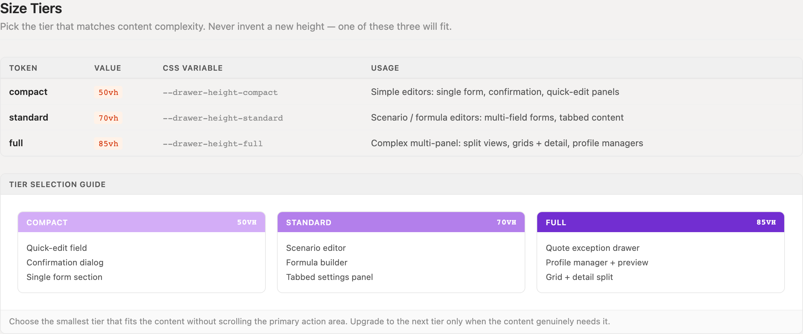
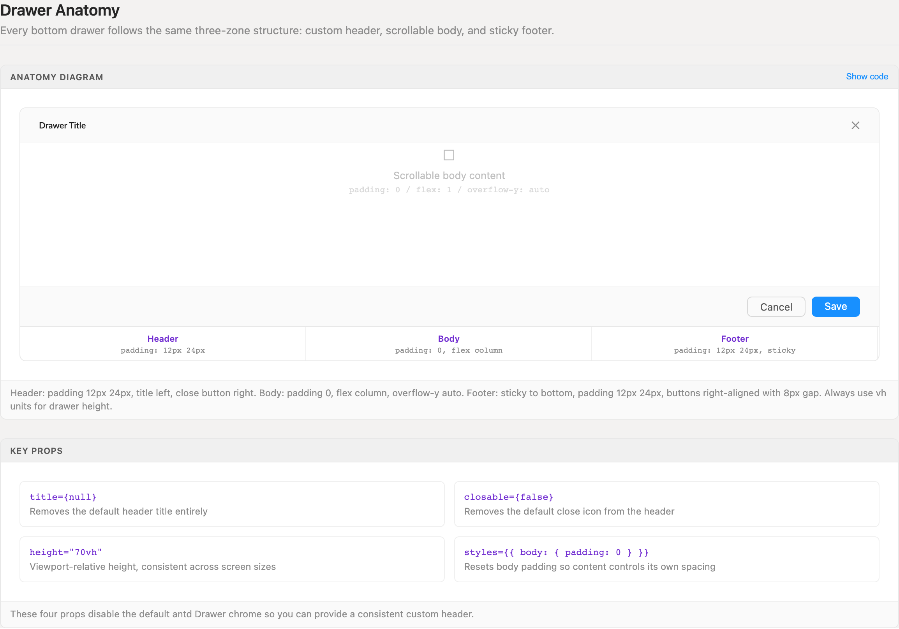
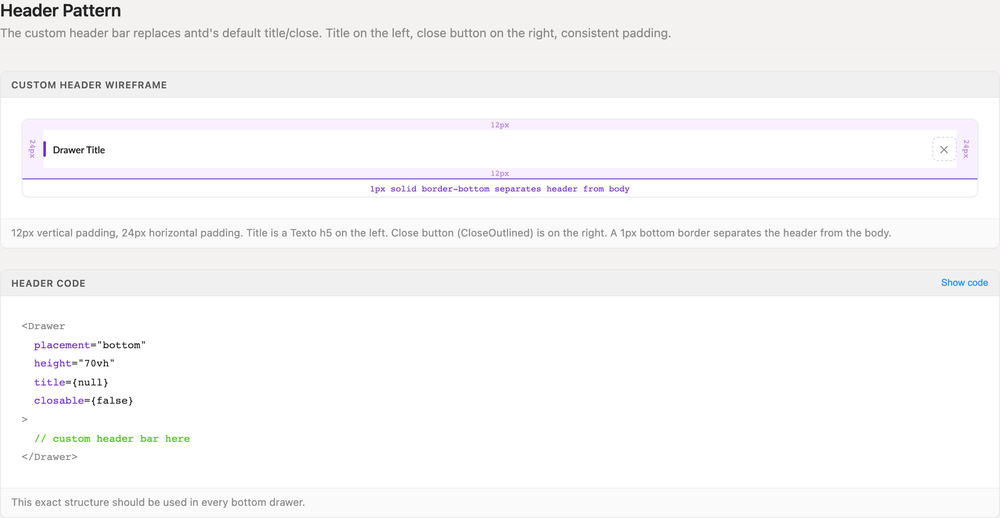
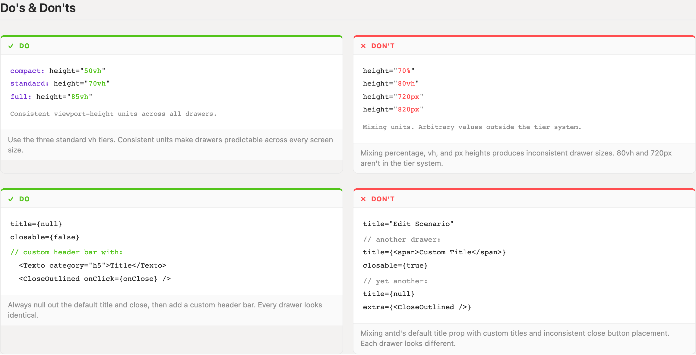

# Bottom Drawers

Bottom drawers slide up from the page footer and run the full viewport width — the editing surface for grid-anchored workflows. Three viewport-height tiers, one header recipe, and a sticky footer make every drawer identical.

> Part of the Excalibrr Design Patterns — layout rulebook. Index: `../CLAUDE.md`. Live page in the Excalibrr demo: `/DesignSystem/BottomDrawers` (demo runs at http://localhost:3000).

### The Laws of Bottom Drawers

Eight rules govern every bottom drawer. Follow all of them and any two drawers in the product are interchangeable.

1. **Heights come from the tier system — compact 50vh, standard 70vh, full 85vh. Never invent a fourth value.** — Viewport-height units keep drawers proportional on every screen; arbitrary px or % heights make sibling drawers visibly inconsistent.
2. **Pick the smallest tier that fits the content without scrolling the primary action area.** — Every extra vh hides the grid context the user is editing against. Upgrade a tier only when the content genuinely needs it.
3. **Every drawer is three zones: custom header, scrollable body (`flex: 1`, `overflow-y: auto`), sticky footer.** — Only the body scrolls — the title and commit actions stay visible no matter how long the content gets.
4. **Disable antd's default chrome — `title={null}`, `closable={false}`, body padding 0 — and build the header yourself.** — antd's built-in header renders differently from the house pattern; nulling it is the only way every drawer ships the same header.
5. **Header: padding `12px 24px`, `Texto` h5 title on the left, `CloseOutlined` on the right, 1px bottom border.** — One header recipe means users find the title and the close affordance in the same place in every drawer.
6. **Footer: sticky, padding `12px 24px`, 1px top border, actions right-aligned with an 8px gap — Cancel before the primary.** — Sticky placement keeps commit actions reachable while the body scrolls; fixed ordering means muscle memory transfers between drawers.
7. **An open drawer must never push the grid below usability — cumulative non-grid chrome stays at or under 320px.** — A drawer that shoves the grid offscreen forces users to close it just to see the result of their edit. Budget the chrome or use overlay placement.
8. **Use the antd v5 API: `open`, `afterOpenChange`, `destroyOnHidden` — never `visible`, `afterVisibleChange`, or `destroyOnClose`. Drawer's close handler is `onClose` in both versions.** — The old names survive only as deprecated shims — they warn in console today and disappear on a future antd upgrade.

### Size tiers



*The three height tiers — compact 50vh, standard 70vh, full 85vh — with the workloads each is sized for. Choose the smallest tier that fits without scrolling the primary action area.*

### Drawer anatomy



*Three-zone anatomy — custom header, scrollable body, sticky footer — plus the four props that disable antd's default chrome so the custom header can take over.*

### Header pattern



*The custom header spec: 12px vertical and 24px horizontal padding, Texto h5 title left, CloseOutlined right, 1px bottom border separating header from body.*

### Tier and chrome discipline



*Tier discipline (three vh values, nothing else) and chrome nulling (one header recipe) shown side by side with the violations they replace.*

### When to reach for a bottom drawer

Bottom drawers are the grid's editing surface. They run the full viewport width, so they fit wide forms, tab sets, and embedded grids that a 400-520px side drawer cannot. Use one when the user edits something anchored to a row while the column context stays visible above — scenario editors, exception drawers, profile managers.

Use a side drawer for narrow inspection and detail panes, and a modal for blocking confirmations. If the editor needs the entire screen, it is a page, not a drawer.

### Sizing and spacing tokens

Three height tokens plus the fixed chrome constants. These are the only dimensional decisions a bottom drawer is allowed to make.

| Token | Value | Use for |
| --- | --- | --- |
| `--drawer-height-compact` | `50vh` | Compact tier — single form, confirmation, quick-edit panels |
| `--drawer-height-standard` | `70vh` | Standard tier — scenario and formula editors, multi-field forms, tabbed content |
| `--drawer-height-full` | `85vh` | Full tier — split views, grid + detail layouts, profile managers |
| `header / footer padding` | `12px 24px` | Vertical and horizontal padding on the header bar and sticky footer |
| `footer action gap` | `8px` | Gap between right-aligned footer buttons; Cancel sits left of the primary |
| `zone divider` | `1px solid #f0f0f0` | border-bottom under the header, border-top above the footer |
| `non-grid chrome budget` | `≤ 320px` | Hard ceiling on cumulative non-grid chrome while a drawer is open against a grid |

### Canonical bottom drawer

```tsx
<Drawer
  placement='bottom'
  height='70vh' // standard tier — always one of 50vh / 70vh / 85vh
  open={isOpen}
  onClose={onClose}
  title={null}
  closable={false}
  destroyOnHidden
  styles={{ body: { padding: 0, display: 'flex', flexDirection: 'column' } }}
>
  {/* Header — custom bar replaces antd chrome */}
  <Horizontal
    justifyContent='space-between'
    alignItems='center'
    style={{ padding: '12px 24px', borderBottom: '1px solid #f0f0f0' }}
  >
    <Texto category='h5'>Edit Scenario</Texto>
    <CloseOutlined onClick={onClose} style={{ cursor: 'pointer', fontSize: 14 }} />
  </Horizontal>

  {/* Body — the only zone that scrolls */}
  <div style={{ flex: 1, overflowY: 'auto' }}>{children}</div>

  {/* Footer — sticky, actions right-aligned */}
  <Horizontal
    justifyContent='flex-end'
    gap={8}
    style={{ padding: '12px 24px', borderTop: '1px solid #f0f0f0' }}
  >
    <GraviButton buttonText='Cancel' onClick={onClose} />
    <GraviButton theme1 buttonText='Save' onClick={onSave} />
  </Horizontal>
</Drawer>
```

This exact skeleton is the starting point for every bottom drawer. Note the v5 props (open, destroyOnHidden), GraviButton's buttonText prop, and theme1 for the primary action — not type='primary'.

### Do's & Don'ts

- **Do:** Pull heights from the three tiers: height="50vh", "70vh", or "85vh".
  **Don't:** Mix units or invent values — height="70%", "80vh", "720px".
  **Why:** The tier system is what makes sibling drawers feel like one product; arbitrary heights drift immediately.
- **Do:** Null the default chrome (title={null}, closable={false}) and render the standard custom header bar.
  **Don't:** Pass a string or node to antd's title prop, or leave closable={true} alongside a custom close icon.
  **Why:** Mixing antd chrome with custom headers produces three different-looking drawers on one screen — and sometimes two close buttons.
- **Do:** Keep Cancel and the primary action in the sticky footer, right-aligned, 8px apart.
  **Don't:** Put commit actions in the header or let them scroll away inside the body.
  **Why:** Users commit from the same corner in every drawer; scrolling to find Save is a defect, not a style choice.

### Gotchas

- **Drawer chrome can bury the grid** — When a drawer stays open while the user works against a grid, every pixel of non-grid chrome counts. Keep the cumulative total — page header, control bar, drawer header and footer, notices — at or under 320px. If even the compact tier buries the grid, switch to overlay placement or rethink the surface; never ship a drawer the user must close to see the result of their own edit.
- **Deprecated antd prop names still compile** — visible, destroyOnClose, and afterVisibleChange are deprecated names. Use open, destroyOnHidden, and afterOpenChange — the deprecated names still compile and emit console warnings today, and disappear on a future antd upgrade. Drawer has no onOpenChange; wire close through onClose.
- **GraviButton takes buttonText, not children** — GraviButton's contract is the buttonText prop. Excalibrr 4.x drops React children silently — <GraviButton>Save</GraviButton> renders an empty button; 5.x falls back to children, but buttonText always wins when both are set. Self-close the element and pass buttonText='Save' in every version.
- **Skipping the body padding reset** — antd gives the drawer body 24px padding by default. Without styles={{ body: { padding: 0, display: 'flex', flexDirection: 'column' } }}, content double-pads, the footer floats mid-drawer instead of pinning to the bottom, and edge-to-edge content like tabs and grids shows a white gutter.
