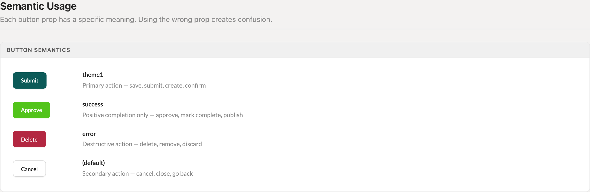
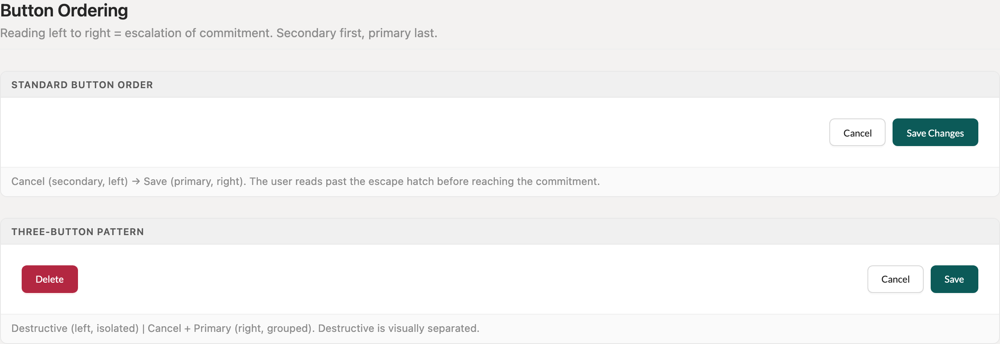
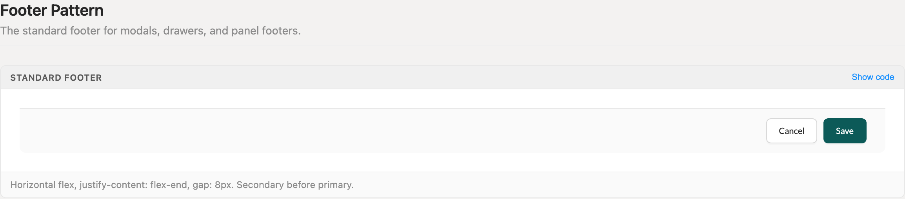
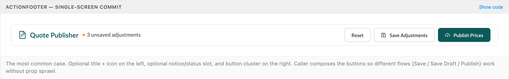
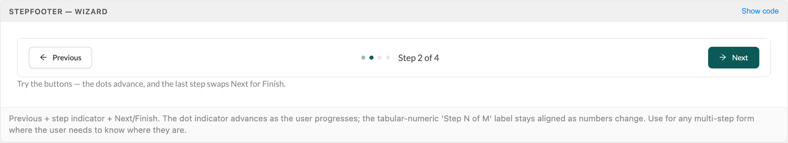
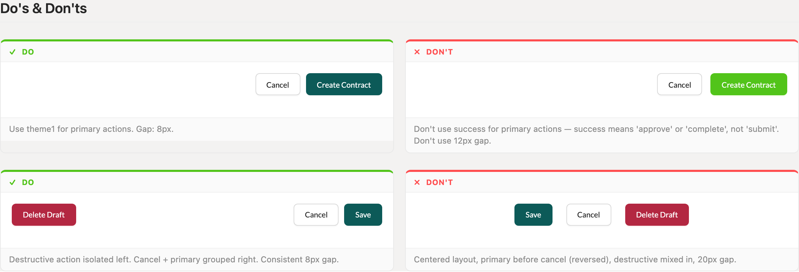

# Button Groups

Button groups are the commitment points of every screen — modal footers, drawer footers, toolbars, page-level commit bars. One gap (8px), one primary per group, one ordering rule. This entry consolidates the four spacing values (8/10/12/20px) that had drifted across the codebase into a single standard.

> Part of the Excalibrr Design Patterns — layout rulebook. Index: `../CLAUDE.md`. Live page in the Excalibrr demo: `/DesignSystem/ButtonGroups` (demo runs at http://localhost:3000).

### The laws of button groups

1. **All adjacent buttons sit 8px apart (`--space-2`) — footers, toolbars, action bars, no exceptions.** — The codebase had drifted to 8/10/12/20px gaps across cousin screens. One value makes clusters read as a unit and removes per-screen judgment calls.
2. **Exactly one `theme1` button per group — every other action takes the default appearance.** — Two filled-primary buttons split the commitment; the user can no longer tell which action the screen is for.
3. **Order is escalation of commitment: secondary first, primary last (rightmost).** — Reading left to right, the user passes the escape hatch (Cancel) before reaching the commitment (Save). Primary-first reverses muscle memory from every other Gravitate screen.
4. **Destructive actions are isolated on the far left with `justifyContent='space-between'`; Cancel + primary stay grouped right.** — Physical distance prevents misclicks on irreversible actions. A Delete button nestled beside Save is one slip away from data loss.
5. **Theme semantics are fixed: `theme1` = primary commit (save, submit, create), `success` = positive completion only (approve, publish, mark complete), `error` = destructive (delete, remove, discard), default = secondary (cancel, close, back).** — A green Submit button reads as "already done." When every screen honors the same mapping, color alone communicates consequence.
6. **Commit clusters right-align (`justifyContent='flex-end'`) in modal, drawer, and panel footers.** — Terminal actions live at the end of the reading path. Centered button clusters read as marketing pages, not workflow.
7. **Page-level commit bars use the shared `ActionFooter` / `StepFooter` primitives — never a hand-rolled flex strip.** — Four cousin implementations (ContractManagement, quick-entry FooterBar, ManageOffers wizard, QuoteBook publisher) each invented their own padding, height, and ordering. The primitives encode the rules above so they cannot drift.

### Theme semantics



*The four button meanings: theme1 (primary commit), success (positive completion only), error (destructive), and default (secondary). Each prop is a boolean — there is no type or theme string prop.*

### Button ordering



*Standard order (Cancel left, primary right) and the three-button pattern (destructive isolated far-left via space-between, Cancel + primary grouped right at 8px).*

### Standard footer



*The canonical modal/drawer/panel footer: horizontal flex, flex-end, 8px gap, secondary before primary.*

### Spacing tokens

Three values cover every spacing decision inside a button group.

| Token | Value | Use for |
| --- | --- | --- |
| `--space-2` | `8px` | Gap between all adjacent buttons — footers, toolbars, action bars |
| `--space-2` | `8px` | Gap between a button and adjacent text or a status badge |
| `--space-1` | `4px` | Icon-to-text inside a button — Ant Design applies this automatically; never add manual margins |

### Canonical skeletons

```tsx
import { Horizontal, GraviButton } from '@gravitate-js/excalibrr'

// Standard footer — modals, drawers, panels
<Horizontal gap={8} justifyContent='flex-end'>
  <GraviButton buttonText='Cancel' onClick={onClose} />
  <GraviButton buttonText='Save Changes' theme1 onClick={() => form.submit()} />
</Horizontal>

// Three-button — destructive isolated left
<Horizontal justifyContent='space-between'>
  <GraviButton buttonText='Delete Draft' error onClick={onDelete} />
  <Horizontal gap={8}>
    <GraviButton buttonText='Cancel' onClick={onClose} />
    <GraviButton buttonText='Save' theme1 onClick={onSave} />
  </Horizontal>
</Horizontal>
```

Gap and justification are Horizontal props, never style objects. Form submission goes through onClick={() => form.submit()} — htmlType='submit' is not used with GraviButton.

### GraviButton essentials

The props that matter for grouping. Theme props are booleans; set exactly one — when several are truthy the component resolves them by fixed internal precedence, not your JSX order.

| Prop | Type | Default | Notes |
| --- | --- | --- | --- |
| `buttonText` | `ReactNode` | — | The button label. Pass buttonText, never children — Excalibrr 4.x drops JSX children silently (empty button, no error); 5.x falls back to children only when buttonText is absent. |
| `theme1` | `boolean` | — | Primary commit action. The one filled-brand button per group. |
| `success` | `boolean` | — | Positive completion only — approve, publish, mark complete. Never for submit/save. |
| `error` | `boolean` | — | Destructive action — delete, remove, discard. This is the prop name; there is no danger boolean in the Excalibrr theme set. |
| `warning` | `boolean` | — | Typed in ThemeVariants but not wired in the installed 5.x lib — it renders as a default button. Prefer a confirm dialog over a yellow button. |
| `appearance` | `'filled' \| 'outlined' \| 'solid' \| 'dashed' \| 'text' \| 'link'` | `solid when a theme prop is set; outlined otherwise` | Use 'outlined' for the lower-emphasis variant — the value is 'outlined', not 'outline' ('outline' silently coerces to filled). |
| `icon` | `ReactNode` | — | Leading icon. Ant Design handles the 4px icon-to-text gap; add no manual margin. |

### Page footer primitives

Page-level commit bars — the strip at the bottom of a page's main content area — come from @components/shared/PageFooter. The caller composes the button cluster, so different flows (Save / Save Draft / Publish) work without prop sprawl.

| Variant | When to use | Code |
| --- | --- | --- |
| `ActionFooter` | Single-screen commit. Optional icon + title left, optional notice/status slot, button cluster right. | `<ActionFooter title='Quote Publisher' notice={<StatusBadge tone='warning' variant='quiet' label='3 unsaved adjustments' />} actions={<>…</>} />` |
| `ActionFooter emphasis='title'` | The footer title labels the entire page (Contract Management pattern). Adds a 2px brand rule under the title block — use sparingly or emphasis becomes noise. | `<ActionFooter emphasis='title' title='New Contract' actions={<>…</>} />` |
| `ActionFooter compact` | Dense grid pages where the standard 48px bar steals canvas. 40px height, tighter padding. | `<ActionFooter compact notice={…} actions={<>…</>} />` |
| `StepFooter` | Multi-step wizards. Previous + dot indicator + tabular-numeric 'Step N of M' + Next/Finish. The last step swaps Next for Finish automatically. | `<StepFooter currentStep={step} totalSteps={4} onBack={…} onNext={…} />` |

### ActionFooter — single-screen commit



*ActionFooter with icon + title left, quiet status notice, and a three-button cluster right — Reset and Save Adjustments default, Publish Prices as the lone theme1.*

### StepFooter — wizard



*StepFooter mid-wizard: Previous left, advancing dot indicator with 'Step 2 of 4' center, Next as the primary right.*

### Do's & don'ts

- **Do:** Use theme1 for the primary action with an 8px gap: <GraviButton buttonText='Cancel' /> then <GraviButton buttonText='Create Contract' theme1 />.
  **Don't:** Use success for a submit/create button, or pad the cluster to 12px.
  **Why:** success means approve or complete — a green Create button claims the work is already done, and off-grid gaps make sibling screens look unrelated.
- **Do:** Isolate the destructive button far-left with space-between; keep Cancel + primary grouped right at 8px.
  **Don't:** Center the cluster, put primary before Cancel, or mix Delete into the right-hand group.
  **Why:** Reversed order breaks the escalation pattern, and a Delete button adjacent to Save is one misclick from data loss.
- **Do:** Self-close and pass the label: <GraviButton buttonText='Save' theme1 />.
  **Don't:** Pass the label as children: <GraviButton theme1>Save</GraviButton>.
  **Why:** buttonText renders on every Excalibrr version; 4.x drops JSX children silently, producing an empty button with no error or warning.

### Do's & don'ts, rendered



*Side-by-side: correct theme1 primary at 8px vs. green success primary at 12px; isolated destructive vs. centered reversed cluster at 20px.*

### Gotchas

- **GraviButton renders buttonText, not children** — Always self-close and pass buttonText. Excalibrr 4.x drops JSX children silently — the button renders empty with no error; 5.x falls back to children only when buttonText is absent. This has bitten multiple sessions; it is the number-one GraviButton bug.
- **Themes are boolean props, and destructive is `error`** — Write <GraviButton theme1 />, <GraviButton success />, <GraviButton error />. There is no type='primary', no theme='success' string, and no danger boolean in the Excalibrr theme set — antd's danger prop bypasses Gravitate theming.
- **appearance='outlined', not 'outline'** — The lower-emphasis appearance value is 'outlined'. 'outline' is silently coerced to 'filled' — you get a filled button instead of the outlined one you asked for.
- **No htmlType='submit'** — GraviButton does not participate in native form submission. Wire the primary to onClick={() => form.submit()} so Ant Design's Form validation pipeline runs.
- **Layout props, not style objects** — Gap and justification belong on the layout primitive: <Horizontal gap={8} justifyContent='flex-end'>. style={{ gap: '8px' }} on Horizontal is the lint-flagged anti-pattern.

### Where this applies

Every multi-button cluster: modal footers, drawer footers, inline panel footers, toolbars above grids, and page-level commit bars. For modals and drawers, build the footer by hand with the canonical skeleton. For page-level bars, reach for `ActionFooter` or `StepFooter` and compose the buttons into the `actions` slot — the primitive owns padding, height, and alignment so the only decisions left are which buttons and which one gets `theme1`.

A single button next to text (an empty-state CTA, a card action) follows the same semantics: `theme1` if it is the screen's commitment, default otherwise, 8px from the adjacent text.
