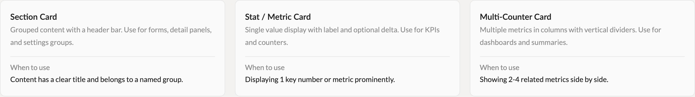
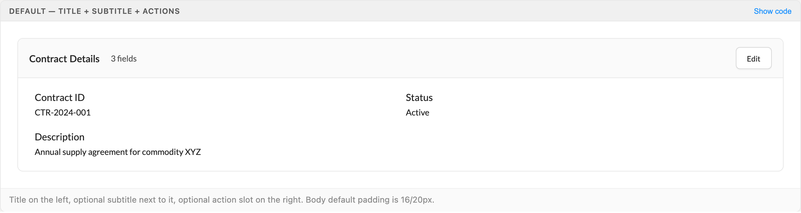
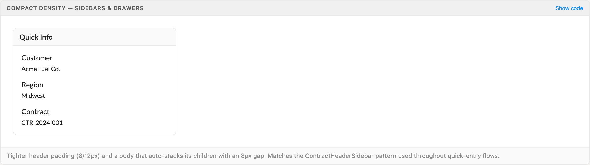
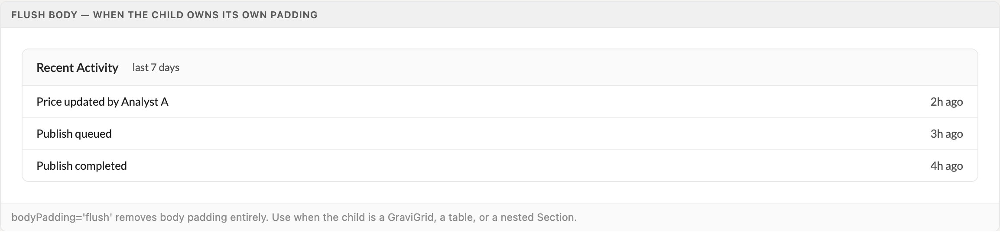
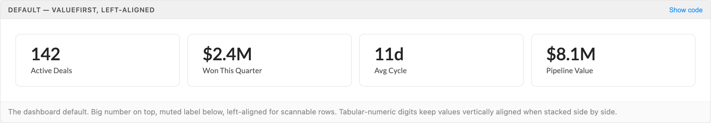
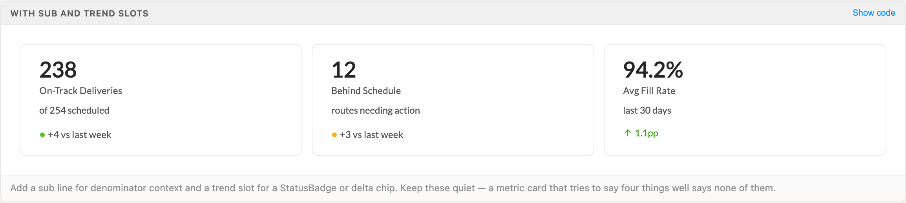
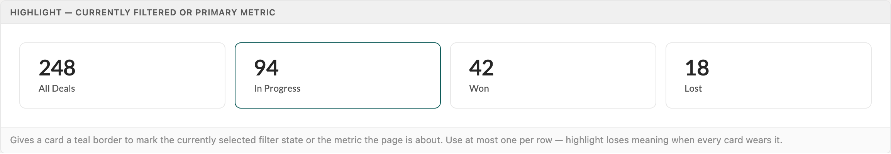
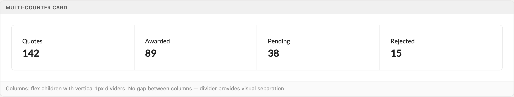

# Cards

Three card types cover every container need: Section for titled groups, MetricCard for single KPIs, and the multi-counter recipe for 2-4 related metrics. One shared shell — 1px border, 8px radius, token padding — replaces the ad-hoc Ant Cards, styled divs, and custom wrappers that used to coexist on every screen.

> Part of the Excalibrr Design Patterns — layout rulebook. Index: `../CLAUDE.md`. Live page in the Excalibrr demo: `/DesignSystem/Cards` (demo runs at http://localhost:3000).

### The rules

1. **Pick the card type by content purpose, not visual preference — Section for titled groups, MetricCard for one number, multi-counter for 2-4 facets of one whole.** — When type follows purpose a dashboard explains itself; decorative card choices force readers to re-learn every screen.
2. **Build cards from the shared components — `Section` and `MetricCard` — never hand-rolled border+header+body divs.** — ContractHeaderSidebar, ExampleDashboard, and SellerRFP each shipped near-identical card CSS before these components existed; hand-rolled copies drift apart immediately.
3. **Every card wears the same shell: `--bg-1` background, 1px `--border-default` border, 8px radius.** — One shell makes cards read as one system — any deviation reads as a bug, not a choice.
4. **Cards are bordered, never shadowed — elevation is reserved for overlays (modals, popovers, drawers).** — A shadow says the surface floats above the page; a card is part of the page.
5. **Card padding comes off the spacing scale — header `--space-3`/`--space-4` (12/16px), body `--space-4`/`--space-5` (16/24px) — never arbitrary values.** — Token padding is what keeps side-by-side cards and their content aligned to the page grid.
6. **Stat cards in a row are structurally identical: same padding, same 12px/500 label, same value size and weight.** — One inconsistent card makes the whole row read as four unrelated components.
7. **Apply `highlight` to at most one card per metric row.** — Highlight marks the active filter or the page's primary metric; worn by every card it marks nothing.
8. **Give `bodyPadding='flush'` to any Section whose child owns its own padding — grids, tables, nested Sections.** — Default body padding double-insets a GraviGrid and knocks its columns out of alignment with the page.

### Card types

Three types, chosen by what the content is — not by how you want the page to look.

| Variant | When to use | Code |
| --- | --- | --- |
| `Section Card` | Content has a clear title and belongs to a named group — forms, detail panels, settings groups. | `<Section title='Contract Details'>…</Section>` |
| `Stat / Metric Card` | One key number needs to read at a glance — KPIs, counters, summary headers. | `<MetricCard label='Active Deals' value='142' />` |
| `Multi-Counter Card` | 2-4 related metrics that are facets of one whole — pipeline totals, status breakdowns. One shell, flex columns, 1px dividers. | `see multi-counter recipe below` |

### Three card types



*Section Card, Stat/Metric Card, and Multi-Counter Card — each with its when-to-use. The choice is driven by content purpose.*

### Section Card — default



*Title on the left, muted subtitle next to it, action slot on the right. Header bar on --surface-muted with a bottom border; body padding 16/24px.*

### Section Card — compact density



*density='compact' + bodyPadding='compact' for sidebars and drawers: 8/12px header, 12/16px body that auto-stacks children with an 8px gap.*

### Section Card — flush body



*bodyPadding='flush' removes body padding entirely so a list, table, or GraviGrid runs edge-to-edge inside the card shell.*

### Section props

Import from `@components/shared/Section`. Omit `title` to get a plain bordered container with no header bar.

| Prop | Type | Default | Notes |
| --- | --- | --- | --- |
| `title` | `ReactNode` | — | Header bar title. Omit it and the component is just a bordered, rounded container — useful around a grid or chart that needs no redundant title. |
| `icon` | `ReactNode` | — | Rendered before the title in --theme-color-1 (brand teal), matching the ActionFooter accent. |
| `subtitle` | `ReactNode` | — | Short muted text next to the title — "3 fields", "updated 2m ago", a row count. |
| `actions` | `ReactNode` | — | Right-side header slot: Edit/Expand buttons, filter toggles, or a StatusBadge describing section state. |
| `density` | `'standard' \| 'compact'` | `'standard'` | Header padding 12/16px vs 8/12px. Compact for sidebars, drawers, and stacked dashboard sections. |
| `bodyPadding` | `'standard' \| 'compact' \| 'flush'` | `'standard'` | standard = 16/24px. compact = 12/16px plus a flex column with 8px gap between children. flush = 0 — for grids, tables, nested Sections. |
| `scrollBody` | `boolean` | — | Body scrolls independently when it overflows. Use inside fixed-height flex columns. |
| `flush` | `boolean` | — | Strips the outer border and radius. Use when the Section is embedded inside another bordered container and only the header bar is wanted. |

### MetricCard — default row



*valueFirst, left-aligned — the dashboard default. Tabular-numeric digits keep stacked values vertically aligned across the row.*

### MetricCard — sub and trend slots



*sub carries denominator context ("of 254 scheduled"); trend carries a quiet StatusBadge or delta chip. A metric card that tries to say four things says none of them.*

### MetricCard — highlight



*highlight adds a --theme-color-1 border to mark the active filter or the page's primary metric — exactly one per row.*

### MetricCard props

Import from `@components/shared/MetricCard`. Value sizes: sm 20px, md 28px, lg 36px — label and sub stay constant so the number is the focal point.

| Prop | Type | Default | Notes |
| --- | --- | --- | --- |
| `label` | `ReactNode` | — | Required. Keep to a phrase — "Active Deals", not "Number of active deals in the pipeline". |
| `value` | `ReactNode` | — | Required. The headline number; rendered with tabular-nums at 600 weight. |
| `sub` | `ReactNode` | — | Supporting line below the value/label pair — denominators ("of 240"), recency ("last 30 days"). |
| `trend` | `ReactNode` | — | Slot for a quiet StatusBadge, delta chip, or sparkline. Keep it quiet. |
| `align` | `'left' \| 'center'` | `'left'` | Left scans better in rows. Center only when a single metric is the hero of a section. |
| `order` | `'valueFirst' \| 'labelFirst'` | `'valueFirst'` | valueFirst = big number on top (dashboard style). labelFirst = denser, better for many stats in a row. |
| `size` | `'sm' \| 'md' \| 'lg'` | `'md'` | sm for inline summary strips, md for page dashboards, lg when one metric headlines the view. |
| `highlight` | `boolean` | — | Brand-colored border marking the selected or primary metric. At most one per row. |
| `onClick` | `() => void` | — | Makes the card a real <button> with hover accent and focus-visible ring — use for drill-through. |
| `ariaLabel` | `string` | — | Pass when the visible label alone is ambiguous, especially on clickable cards. |

### Multi-Counter Card



*One bordered shell, equal flex columns, 1px vertical dividers, no gap — the divider provides the separation.*

### Canonical skeleton

```tsx
import { useMemo } from 'react'
import { Vertical, GraviButton, GraviGrid } from '@gravitate-js/excalibrr'
import { Section } from '@components/shared/Section'
import { MetricCard } from '@components/shared/MetricCard'
import { StatusBadge } from '@components/shared/StatusBadge'

const columnDefs = useMemo(() => getColumnDefs(), [])

<Vertical gap={24}>
  {/* Metric row — identical cards, one token gap */}
  <div style={{ display: 'grid', gridTemplateColumns: 'repeat(auto-fit, minmax(160px, 1fr))', gap: 'var(--space-3)' }}>
    <MetricCard label='Active Quotes' value='142' />
    <MetricCard
      label='Awarded'
      value='89'
      highlight
      trend={<StatusBadge tone='success' variant='quiet' label='+4 vs last week' />}
    />
    <MetricCard label='Avg Margin' value='$0.0425/gal' sub='last 30 days' />
  </div>

  {/* Section card — header bar + token-padded body */}
  <Section
    title='Contract Details'
    subtitle='3 fields'
    actions={<GraviButton buttonText='Edit' appearance='outlined' />}
  >
    <Vertical gap={12}>{/* fields */}</Vertical>
  </Section>

  {/* Grid wrapper — flush body so the grid owns its own chrome */}
  <Section title='Recent Activity' bodyPadding='flush'>
    <GraviGrid columnDefs={columnDefs} rowData={rows} agPropOverrides={{}} />
  </Section>
</Vertical>
```

GraviButton takes buttonText, never children. GraviGrid always takes agPropOverrides (even empty) and memoized columnDefs. Money copy is decimal dollars — $0.0425/gal, never cents symbols.

### Multi-counter recipe

```tsx
import { Fragment } from 'react'
import { Texto } from '@gravitate-js/excalibrr'

<div style={{ display: 'flex', overflow: 'hidden', border: '1px solid var(--border-default)', borderRadius: 8 }}>
  {counters.map((c, i) => (
    <Fragment key={c.label}>
      {i > 0 && <div style={{ width: 1, background: 'var(--border-default)' }} />}
      <div style={{ flex: 1, padding: 'var(--space-5)', textAlign: 'center' }}>
        <Texto category='p2' weight='500'>{c.label}</Texto>
        <Texto category='h2' weight='700' style={{ marginTop: 'var(--space-1)' }}>{c.value}</Texto>
      </div>
    </Fragment>
  ))}
</div>
```

No gap between columns — the 1px divider is the separation. overflow: hidden clips the dividers to the 8px radius. Cap at 4 counters; past that, switch to a MetricCard grid.

### Card tokens

The shell and spacing values every card type shares. No raw hex, no off-scale padding.

| Token | Value | Use for |
| --- | --- | --- |
| `--bg-1` | `#fff (theme surface)` | Card background — all types |
| `--border-default` | `#e8e8e8` | 1px card border and internal dividers |
| `--surface-muted` | `#fafafa` | Section header bar background |
| `border-radius` | `8px` | Corner radius on every card type (literal — no token yet) |
| `--space-3` | `12px` | Section header vertical padding; compact body padding; gap between metric cards in a row |
| `--space-4` | `16px` | Section header horizontal padding; standard body vertical padding; MetricCard md vertical padding |
| `--space-5` | `24px` | Standard body horizontal padding; MetricCard md horizontal padding; stacking gap between cards on a page |
| `--theme-color-1` | `brand teal (#0C5A58 default theme)` | highlight border, interactive hover accent, Section header icon |
| `--status-*-text` | `per tone (success/warning/danger)` | Trend deltas composed at the call site — never raw hex |

### Do / Don't

- **Do:** Build cards from Section and MetricCard with token-based spacing.
  **Don't:** Hand-roll a card div with an arbitrary shadow, hard-coded font sizes, and off-scale padding.
  **Why:** Hand-rolled cards break theming and drift from the system the moment they're copied.
- **Do:** Keep every stat card in a row identical — 16/24px padding, 12px/500 label, one value size.
  **Don't:** Tweak padding, border weight, or value weight per card.
  **Why:** The row only reads as one summary when the cards are interchangeable.
- **Do:** Highlight exactly one card — the active filter or the headline metric.
  **Don't:** Spread highlight across the row for decoration.
  **Why:** Highlight is a pointer, not a paint job.
- **Do:** Write money values in decimal dollars — $0.0425/gal.
  **Don't:** Use cents symbols or mixed units (4.25¢/gal).
  **Why:** Gravitate copy standard: decimal dollars everywhere — values, axes, inputs.

### Gotchas

- **Muted card labels use appearance='medium', not 'secondary'** — Texto appearance='secondary' is BLUE in Excalibrr, not gray. For the muted gray of card labels and sublines, use appearance='medium'.
- **Clickable MetricCard is a real <button>** — Passing onClick renders the card as a button element. Never put another interactive control (button, link) inside its trend slot — nested interactive elements are invalid HTML and break keyboard navigation. Pair drill-through cards with ariaLabel.
- **Accent comes from --theme-color-1 only** — highlight, hover, and header icons all use --theme-color-1. Do not reach for --theme-color-2 — it swings green↔blue across themes and will desync the card accent from the rest of the page.
- **There is no built-in negative style** — MetricCard ships no 'danger' variant. Compose negative or alert states at the call site with --status-danger-text or a quiet StatusBadge in the trend slot, so the severity decision stays with the page.
- **Body horizontal padding is 24px, not 20px** — The demo caption visible in the Section default specimen reads "Body default padding is 16/20px", and the Section.tsx doc comment repeats it. Both are stale. The shipped CSS is padding: var(--space-4) var(--space-5), and tokens.css sets --space-5 to 24px — so the rendered body is 16/24px. Trust the CSS, not the demo caption.

### Composing cards on a page

Lay metric rows out with CSS grid — `repeat(auto-fit, minmax(160px, 1fr))` and a `--space-3` gap — so cards stay equal-width and wrap cleanly at narrow widths. Stack cards and sections down the page with `--space-5` (24px).

Reach for the multi-counter when the numbers are facets of one whole (a pipeline's quoted/awarded/pending/rejected); reach for a MetricCard grid when each number stands alone or needs sub, trend, or drill-through. The multi-counter is deliberately minimal — no per-column highlight or click behavior.

Omit the Section title to wrap a chart or embedded widget in a plain bordered container without a redundant title bar. When Sections nest, only the outermost carries the border — give inner ones `flush` so borders never stack.
