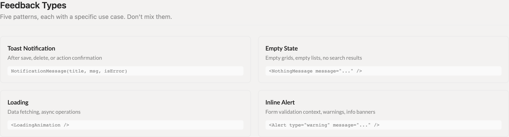
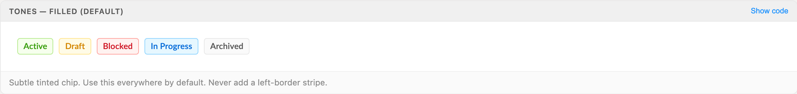
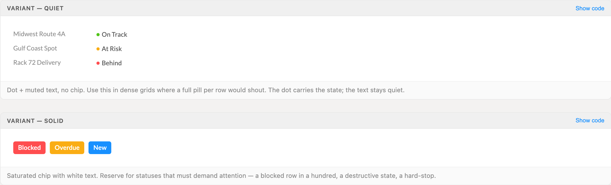
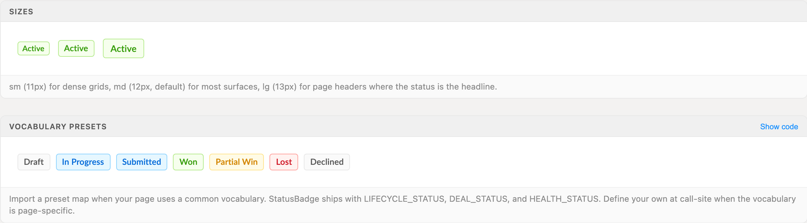
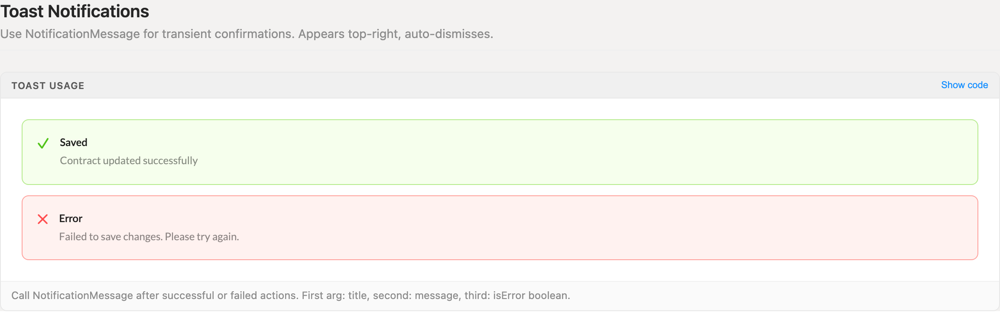
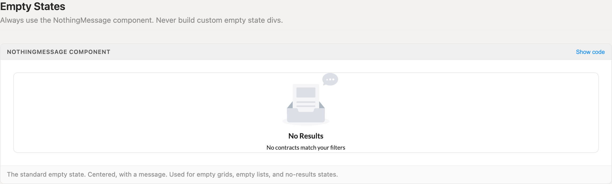
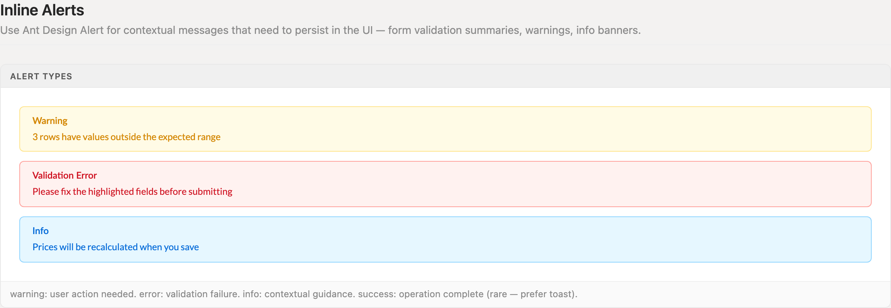
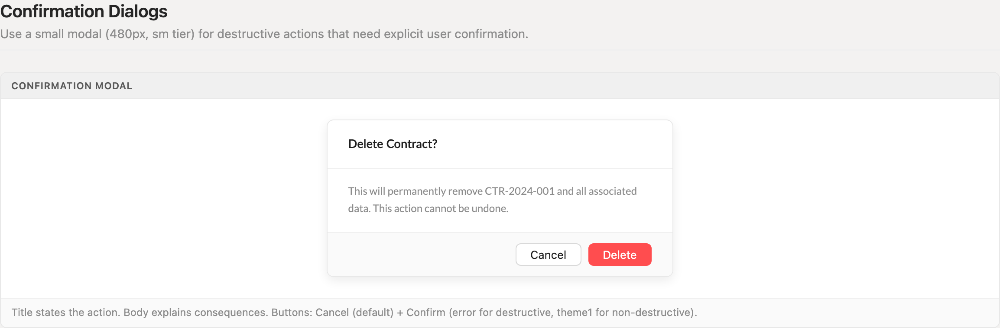

# Feedback & Messaging

Six channels cover every message the app sends: toasts confirm actions, StatusBadge carries persistent state, `NothingMessage` fills empty surfaces, `LoadingAnimation` covers fetches, inline Alerts hold context that must stay on screen, and a 480px confirmation modal gates destructive work. Each channel means one thing — pick by moment, never by taste.

> Part of the Excalibrr Design Patterns — layout rulebook. Index: `../CLAUDE.md`. Live page in the Excalibrr demo: `/DesignSystem/PGFeedback` (demo runs at http://localhost:3000).

### Laws of feedback

These hold on every surface. Violations are bugs, not stylistic choices.

1. **Match the channel to the moment: toasts confirm actions, `NothingMessage` fills empty surfaces, `LoadingAnimation` covers fetches, inline Alerts persist in context, confirmation modals gate destructive actions.** — Each channel carries one meaning. The moment a success shows up as a persistent Alert or an empty state arrives as a toast, users lose the ability to read feedback at a glance.
2. **Every mutating action ends in a toast — `NotificationMessage(title, description, isError)` on both the success and the failure path.** — Silence after a click reads as a broken app; users re-click and double-submit. The failure path is not optional.
3. **Status lives in StatusBadge, nowhere else: filled by default, quiet in dense grids, solid only for the handful of states that must shout.** — Five cousin implementations once shipped five different color maps for the same states. One component consuming the --status-* tokens keeps every status in the app legible.
4. **Tone is semantic, not decorative — success, warning, danger, info, and neutral map to state meaning through a StatusMap, never to taste.** — When green sometimes means active and sometimes just looks nice, scanning breaks. The vocabulary presets (LIFECYCLE_STATUS, DEAL_STATUS, HEALTH_STATUS) exist so the same state never wears two colors.
5. **Empty surfaces render `<NothingMessage title message />` — never a hand-rolled centered div.** — Custom empty states drift: different fonts, different grays, different centering. One component gives every empty grid, list, and no-results pane the same look for free.
6. **Inline Alerts persist, toasts dismiss. Reserve Alert for warning, error, and info context that must stay on screen; success Alerts are rare — prefer a toast.** — A confirmation that lingers becomes noise; a warning that auto-dismisses gets missed. Persistence is the signal, so spend it only where it pays.
7. **Destructive actions gate behind a 480px sm-tier modal: the title names the action ("Delete Contract?"), the body states the consequence, Cancel sits beside a danger Confirm.** — Irreversible operations deserve one deliberate click. A fixed anatomy means everything destructive looks exactly like this — and nothing else does.
8. **Feedback copy names the outcome and the next step — "Failed to save changes. Please try again." — never raw codes or vague apologies.** — Feedback exists to tell users what happened and what to do about it. Copy that does neither is decoration.

### The decision grid



*Four feedback channels and the moment each owns: toast for action outcomes, NothingMessage for empty surfaces, LoadingAnimation for fetches, Alert for persistent context. Don't mix them.*

### StatusBadge — tones, filled (default)



*All five tones in the default filled variant — subtle tinted chips driven by the --status-* token trio (bg, border, text). Never add a left-border stripe.*

### StatusBadge — quiet and solid variants



*Quiet: a 6px dot plus gray text for dense grids — the dot signals, the text stays out of the way. Solid: saturated chip with white text, reserved for states that must demand attention.*

### StatusBadge — sizes and vocabulary presets



*sm (11px) for dense grids, md (12px, default) for most surfaces, lg (13px) for page headers — and the DEAL_STATUS preset, where the same state always wears the same tone.*

### Toast notifications



*Toast anatomy: bold one- or two-word title, single-sentence description, success check or error cross. Appears top-right and auto-dismisses.*

### Empty state



*The standard empty state — NothingMessage centers an icon, a title naming the situation, and a message explaining why the surface is empty.*

### Inline alerts



*The three persistent Alert types: warning for action needed, error for validation failure, info for contextual guidance. Success Alerts are rare — prefer a toast.*

### Confirmation dialog



*Confirmation anatomy: title names the action, body spells out the consequence and that it cannot be undone, Cancel default beside a danger Confirm.*

### Choosing the channel

One channel per moment. If two seem to apply, the moment is the tiebreaker — transient outcomes toast, persistent conditions Alert.

| Variant | When to use | Code |
| --- | --- | --- |
| `Toast` | After save, delete, publish — any action outcome, success or failure | `NotificationMessage('Saved', 'Contract updated successfully', false)` |
| `Status badge` | Persistent state inside a row, card, or header — lifecycle, deal flow, operational health | `<StatusBadge tone='success' label='Active' />` |
| `Empty state` | Empty grids, empty lists, no search results | `<NothingMessage title='No Results' message='No contracts match your filters' />` |
| `Loading` | Data fetching and async operations that replace a whole surface | `<LoadingAnimation animationData={loadingLottie} title='Loading' message='Fetching contracts…' />` |
| `Inline alert` | Validation summaries, warnings, and info banners that must persist in context | `<Alert type='warning' message='3 rows have values outside the expected range' showIcon />` |
| `Confirmation dialog` | Destructive or irreversible actions needing explicit consent | `<Modal open={confirmOpen} width={480} title='Delete Contract?' … />` |

### StatusBadge props

The one status component. Import from `@components/shared/StatusBadge`; presets LIFECYCLE_STATUS, DEAL_STATUS, and HEALTH_STATUS ship alongside it.

| Prop | Type | Default | Notes |
| --- | --- | --- | --- |
| `tone` | `'success' \| 'warning' \| 'danger' \| 'info' \| 'neutral'` | — | Required. Drives background, border, text, and dot color through the --status-* tokens. |
| `label` | `ReactNode` | — | Required. Short copy — 1–2 words. |
| `variant` | `'filled' \| 'quiet' \| 'solid'` | `'filled'` | filled = subtle tinted chip, the default everywhere. quiet = dot + muted text for dense grids. solid = saturated chip with white text, reserved for must-see states. |
| `size` | `'sm' \| 'md' \| 'lg'` | `'md'` | sm (11px) for tight grids, md (12px) for most surfaces, lg (13px) for page headers where the status is the headline. |
| `dot` | `boolean` | `true for quiet, false otherwise` | Renders the 6px tone-colored dot before the label. Leave the default; override only when a filled chip needs the extra signal. |
| `className` | `string` | — | Escape hatch for positioning only — never restyle tones through it. |

### Feedback geometry and color

The full vocabulary this pattern is allowed to use. Anything outside this table needs a reason in review.

| Token | Value | Use for |
| --- | --- | --- |
| `--status-{tone}-bg / -border / -text` | `per tone × theme` | Filled-variant chip surface — background, 1px border, and label color for success, warning, danger, info, neutral |
| `--status-{tone}-solid` | `per tone × theme` | Quiet-variant dot color and solid-variant fill |
| `Badge md (default)` | `2px 8px · 12px/18px` | Most surfaces — rows, cards, drawer headers |
| `Badge sm` | `1px 6px · 11px/16px` | Dense grids |
| `Badge lg` | `3px 10px · 13px/20px` | Page headers where the status is the headline |
| `Badge chrome` | `4px radius · 600 weight` | Every badge, all variants — quiet drops to 500 weight |
| `Status dot` | `6px circle` | Quiet variant signal; colored by --status-{tone}-solid |
| `Confirmation modal width` | `480px (sm tier)` | All confirmation dialogs — never wider |
| `Toast placement` | `top-right, auto-dismiss` | All NotificationMessage toasts; never reposition per page |

### Canonical skeleton — every channel in one page

```tsx
import { NotificationMessage, NothingMessage, LoadingAnimation, GraviButton } from '@gravitate-js/excalibrr'
import { Alert, Modal } from 'antd'
import { StatusBadge, LIFECYCLE_STATUS } from '@components/shared/StatusBadge'

// 1 · Toast — every mutating action ends here, success or failure
const handleSave = async () => {
  try {
    await saveRows()
    NotificationMessage('Saved', 'Contract updated successfully', false)
  } catch {
    NotificationMessage('Error', 'Failed to save changes. Please try again.', true)
  }
}

// 2 · The three render states of any data surface
if (isLoading) return <LoadingAnimation animationData={loadingLottie} title='Loading' message='Fetching contracts…' />
if (rows.length === 0) return <NothingMessage title='No Results' message='No contracts match your filters' />
return <ContractGrid rows={rows} />

// 3 · Persistent context — inline Alert pinned above the form
<Alert type='warning' message='3 rows have values outside the expected range' showIcon />

// 4 · Status inside a row — tone from a vocabulary map, never ad hoc
const status = LIFECYCLE_STATUS[row.status]
<StatusBadge tone={status.tone} label={status.label} />

// 5 · Destructive confirmation — 480px sm modal, danger confirm
<Modal
  open={confirmOpen}
  width={480}
  title='Delete Contract?'
  onCancel={() => setConfirmOpen(false)}
  footer={
    <>
      <GraviButton buttonText='Cancel' onClick={() => setConfirmOpen(false)} />
      <GraviButton error buttonText='Delete' onClick={handleDelete} />
    </>
  }
>
  This will permanently remove CTR-2024-001 and all associated data. This action cannot be undone.
</Modal>
```

antd v5 names throughout — `open` (never `visible`), `destroyOnHidden` (never `destroyOnClose`). GraviButton takes `buttonText` plus boolean theme props — it does not render children. Destructive confirms are `error`; non-destructive confirms are `theme1`.

### Do's & Don'ts

- **Do:** Render every empty surface with `<NothingMessage title='No Results' message='No contracts match your filters' />`.
  **Don't:** Hand-roll centered divs with inline styles for empty grids and lists.
  **Why:** Every custom empty state looks different and none match; the component gives one centered, iconed look for free.
- **Do:** Confirm action outcomes with a toast that auto-dismisses — and always wire the failure path.
  **Don't:** Render success as a persistent inline Alert, or skip the error toast because the happy path works.
  **Why:** Lingering confirmations become noise; a missing failure toast makes errors read as success.
- **Do:** Use the quiet variant in dense grids — the 6px dot carries the state.
  **Don't:** Stack filled or solid pills on every row of a hundred-row grid.
  **Why:** A pill per row shouts, and solid everywhere means nothing can demand attention when it must.
- **Do:** Write copy that names the outcome and the next step: "Failed to save changes. Please try again."
  **Don't:** Surface raw error codes, stack traces, or a bare "Something went wrong".
  **Why:** Users act on feedback only when it tells them what happened and what to do; everything else trains them to ignore it.

### Writing feedback copy

Toast titles are one- or two-word outcomes — Saved, Published, Error — and the description is a single sentence carrying the detail. Empty-state titles name the situation (No Results); the message explains why the surface is empty or what action fills it. Alert copy states the condition and the required action. Confirmation bodies name exactly what is removed and say plainly that it cannot be undone.

Error copy names what failed and what to do next, in the user's vocabulary, not the system's. When a message quotes money, write decimal dollars — $0.0100/gal — never cents symbols.

### Gotchas

- **NotificationMessage's error flag defaults to true** — The signature is `NotificationMessage(message, description, showErrorMessage = true)` — call it with two arguments and your success toast renders the error icon. Always pass the third argument explicitly: `false` for success, `true` for failure.
- **NotificationMessage wears a stale @deprecated flag** — The library source marks it deprecated as 'unused', but it is the standard toast across the app and this guide. Do not route around it with raw antd `notification.open` — you lose the standard check/warning icons and theme colors.
- **NothingMessage requires both title and message** — Both props are required strings. The title names the situation ('No Results', 'Nothing Here Yet'); the message explains it. A message-only call is a type error, not a slimmer variant.
- **LoadingAnimation is not a bare spinner** — It requires a Lottie `animationData` payload plus `title` and `message`, and defaults to 355×245 — it announces a whole surface loading, not an inline fetch. Center it in the pane it replaces and keep the copy in toast voice ('Loading', 'Fetching contracts…').
- **Quiet StatusBadge text is always gray** — In the quiet variant only the 6px dot carries tone color; the label locks to gray-600 at weight 500 for every tone. That is the design intent — the dot signals while the text stays out of the way. Don't expect red text on danger, and don't restyle it to get some.
