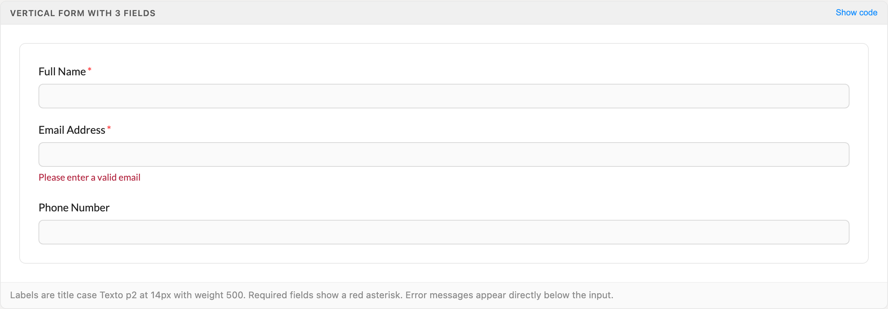
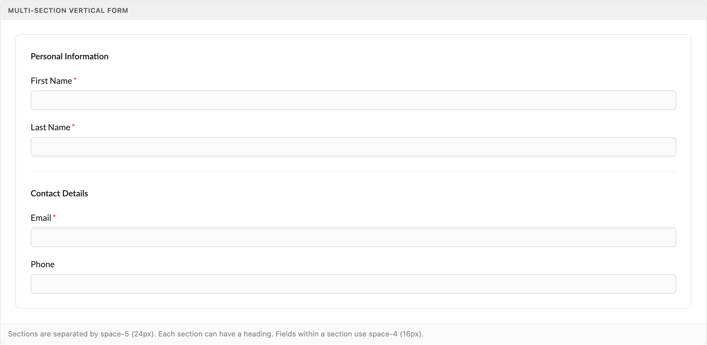
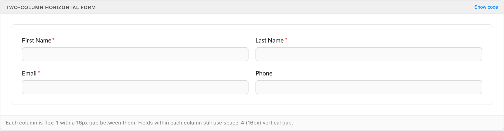
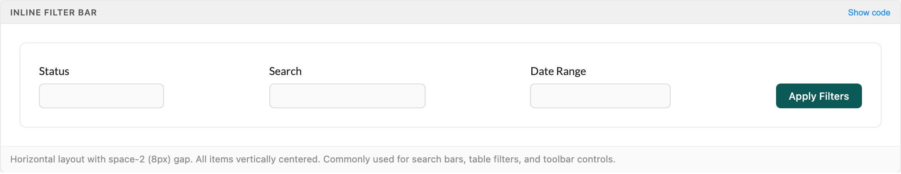
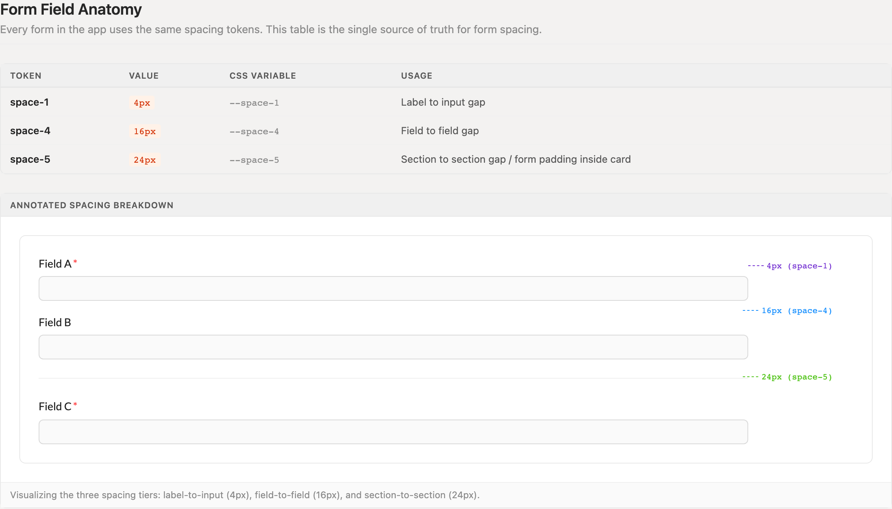
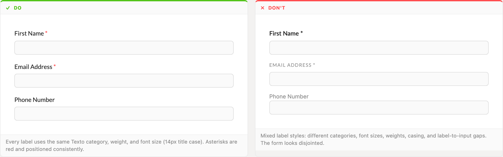
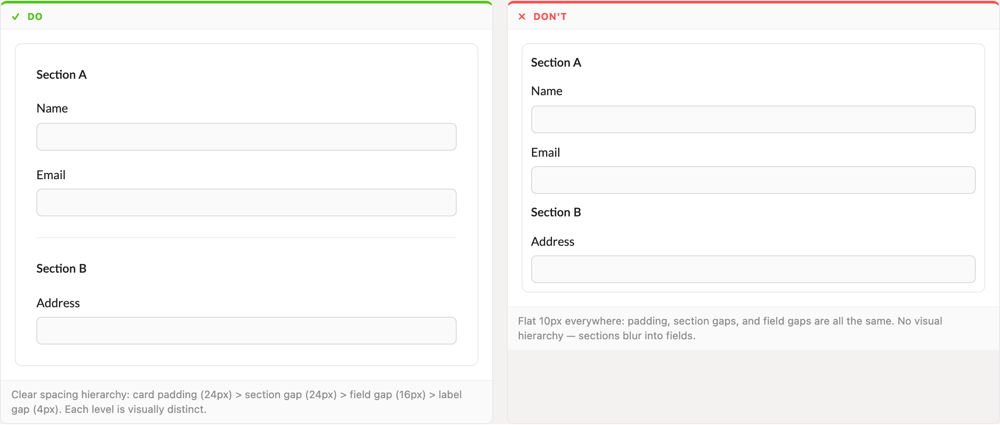

# Forms

Three layouts cover every form in the app: vertical by default, two-column for wide surfaces, inline for filter bars. One label recipe and three spacing tiers do the rest.

> Part of the Excalibrr Design Patterns — layout rulebook. Index: `../CLAUDE.md`. Live page in the Excalibrr demo: `/DesignSystem/Forms` (demo runs at http://localhost:3000).

### Form laws

Every form in the app follows these. Layout, spacing, and submit wiring are not per-screen decisions.

1. **Labels sit above inputs in every layout — vertical, two-column, and inline alike.** — Horizontal label layouts break at narrow widths and force ragged label-to-input alignment as label lengths vary.
2. **Use exactly three spacing tiers: 4px label-to-input (space-1), 16px field-to-field (space-4), 24px section-to-section and card padding (space-5).** — A strict hierarchy is what lets the eye separate sections from fields. Flatten it and the form reads as one undifferentiated stack.
3. **Labels are title case Texto p2 at 14px, weight 500. Required fields append a red asterisk colored var(--status-danger-solid).** — One label voice across the app. Mixed casing, weights, or categories inside a single form makes it look assembled from parts.
4. **Validation errors render directly below the offending input as Texto p2 with appearance="error".** — Proximity binds the message to the field. Errors collected at the top of a form force the user to map messages back to inputs.
5. **Submit via GraviButton onClick={() => form.submit()} — never htmlType="submit".** — htmlType only submits when the button renders inside the form element — drawer and modal footers do not, so onFinish never fires and the bug surfaces as a dead Save button. form.submit() runs validation then onFinish from anywhere.
6. **Reactive dependencies between fields use Form.useWatch, never form.getFieldValue in render.** — getFieldValue does not trigger re-renders, so dependent fields and conditional sections go stale until something else repaints.
7. **Money inputs and copy are decimal dollars — $0.0100/gal — never cents symbols.** — Gravitate's pricing domain operates in decimal dollars end to end. A cents symbol anywhere corrupts copy, axis labels, and seed data.
8. **Pick layout by purpose: vertical for create/edit surfaces, two-column when the surface is wide and fields are short, inline only for filter bars and toolbars.** — Layout signals intent. A two-column drawer form or a vertical filter bar both fight their container.

### Vertical form (default)



*The default layout: labels above inputs, 4px label gap, 16px between fields. Required fields carry a red asterisk; the error sits directly under the email input.*

### Multi-section vertical form



*Sections get an h5 heading and a hairline divider, separated by 24px (space-5). Fields inside each section keep the 16px rhythm.*

### Two-column horizontal form



*Two flex:1 columns with a 16px gap. Labels stay above inputs; every other spacing rule is unchanged from the vertical layout.*

### Inline filter bar



*Filter-bar form: fixed-width fields, labels above, items bottom-aligned so the action button lines up with the input row.*

### Field anatomy and spacing tiers



*The single source of truth for form spacing: 4px (space-1) label-to-input, 16px (space-4) field-to-field, 24px (space-5) section-to-section, annotated on a live form.*

### Do / Don't: one label recipe



*Do: every label uses the same category, weight, size, and casing. Don't: mixed label styles in one form — it reads as disjointed even when the fields are identical.*

### Do / Don't: spacing hierarchy



*Do: 24px padding and section gaps over 16px field gaps over 4px label gaps. Don't: flat 10px everywhere — sections blur into fields.*

### Form spacing tokens

Forms use four tokens. Nothing in a form is spaced with an arbitrary value.

| Token | Value | Use for |
| --- | --- | --- |
| `--space-1` | `4px` | Label to input gap |
| `--space-2` | `8px` | Gap between controls in an inline filter bar; gap between footer buttons |
| `--space-4` | `16px` | Field to field gap; gap between columns in a two-column layout |
| `--space-5` | `24px` | Section to section gap; form padding inside a card or drawer |

### Structure

Forms live inside a card, drawer, or panel with `var(--space-5)` padding. Group related fields into sections: an h5 heading (`<Texto category="h5" weight="600">`), fields at 16px rhythm, and a hairline divider (`borderTop: 1px solid`) between sections at 24px.

Use antd `Form` with `layout="vertical"` so labels render above inputs, and `Form.Item` for every field — it owns the label, the required asterisk, and the inline error for free. Footer actions sit in a right-aligned `Horizontal gap={8}`: secondary action first, primary (`theme1`) last.

### Canonical form skeleton

```tsx
const [form] = Form.useForm()
// Reactive dependency — Form.useWatch, never form.getFieldValue in render
const priceType = Form.useWatch('priceType', form)

return (
  <Form form={form} layout="vertical" onFinish={handleSave}>
    <Vertical gap={24}>
      {/* Section */}
      <Vertical gap={16}>
        <Texto category="h5" weight="600">Pricing</Texto>
        <Form.Item name="priceType" label="Price Type" rules={[{ required: true }]}>
          <Select options={priceTypeOptions} />
        </Form.Item>
        {priceType === 'fixed' && (
          <Form.Item name="markup" label="Markup ($/gal)" rules={[{ required: true }]}>
            <InputNumber step={0.0025} precision={4} prefix="$" placeholder="0.0100" />
          </Form.Item>
        )}
      </Vertical>

      {/* Footer actions */}
      <Horizontal gap={8} justifyContent="flex-end">
        <GraviButton buttonText="Cancel" onClick={onClose} />
        <GraviButton theme1 buttonText="Save" onClick={() => form.submit()} />
      </Horizontal>
    </Vertical>
  </Form>
)
```

GraviButton takes buttonText — never children — and submits via onClick={() => form.submit()}, never htmlType="submit". Money fields are decimal dollars: $0.0100/gal.

### Choosing a layout

| Variant | When to use | Code |
| --- | --- | --- |
| `Vertical` | Default. Drawers, modals, and any create/edit surface. | `<Form layout="vertical"> with one <Vertical gap={16}> per section` |
| `Two-column` | Wide panels with many short fields. Never in a drawer. | `<Horizontal gap={16}> wrapping two <Vertical flex="1" gap={16}> columns` |
| `Inline filter bar` | Table toolbars, search rows, compact control strips. | `Flex row, alignItems: flex-end, gap var(--space-2), fixed-width fields` |

### Do's & Don'ts

- **Do:** Use one label recipe everywhere: title case, Texto p2, 14px, weight 500, red asterisk on required fields.
  **Don't:** Mix casing, categories, weights, or label-to-input gaps across fields in one form.
  **Why:** Labels are the loudest repeated element in a form — any inconsistency multiplies.
- **Do:** Keep the spacing hierarchy: 24px sections > 16px fields > 4px labels.
  **Don't:** Flatten everything to one gap value.
  **Why:** Without distinct tiers there is no visual grouping; sections and fields read as one list.
- **Do:** Write money as decimal dollars: $0.0100/gal, InputNumber with precision={4} and a $ prefix.
  **Don't:** Use cents symbols or cents-denominated inputs anywhere.
  **Why:** Gravitate prices in decimal dollars; a single cents symbol in copy or seed data breaks consistency with every other surface.
- **Do:** Submit with <GraviButton theme1 buttonText="Save" onClick={() => form.submit()} />.
  **Don't:** Reach for htmlType="submit" or type="primary".
  **Why:** Both are on the repo's Common Mistakes list: htmlType only submits when the button sits inside the form element (drawer and modal footers do not), and type="primary" bypasses the GraviButton theme system — use theme1.

### Gotchas

- **GraviButton takes buttonText, not children** — Self-close and pass buttonText="Save". Excalibrr 4.x renders only buttonText — <GraviButton>Save</GraviButton> comes out as an empty button; 5.x falls back to children, but buttonText is the API everywhere. Primary styling is the boolean theme1 prop, success is the boolean success prop — there is no theme string prop, and antd's type="primary" is on the repo's Common Mistakes list.
- **Never submit via htmlType** — htmlType="submit" passes through to the underlying antd Button but only submits when that button renders inside the form element — drawer and modal footers do not, so the Save button goes dead. Wire onClick={() => form.submit()}; it runs validation and then onFinish from anywhere.
- **form.getFieldValue in render is stale** — It reads the store without subscribing, so conditional fields and derived labels do not update when the value changes. Use const x = Form.useWatch('x', form) for anything render-reactive.
- **Texto has no p3 or h6, and 'secondary' is blue** — Valid categories: p1, p2, label, heading, heading-small, h1–h5. Error copy is appearance="error"; gray helper text is appearance="medium" — appearance="secondary" renders blue, not gray.
