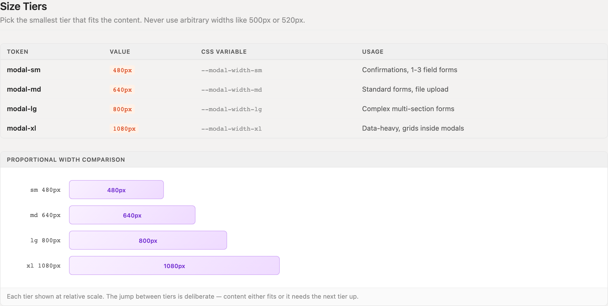
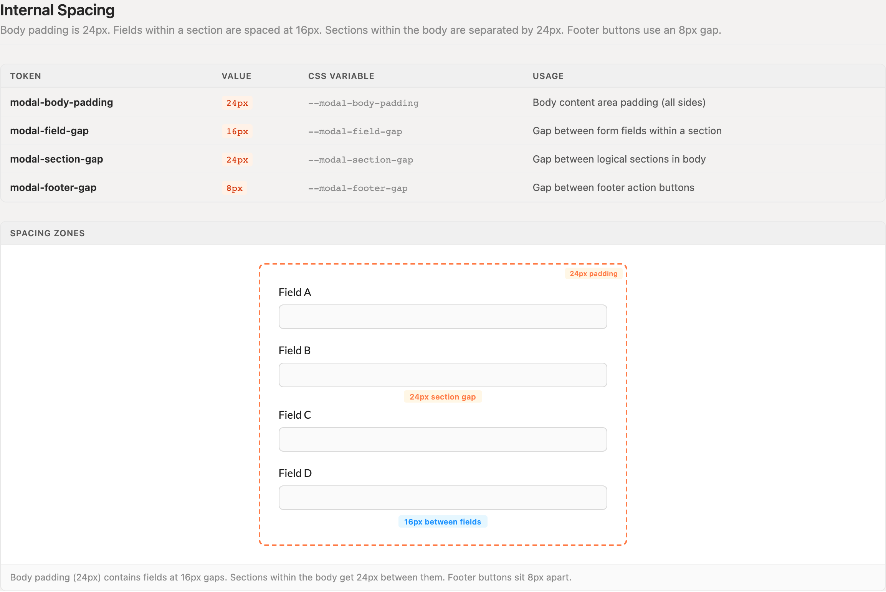
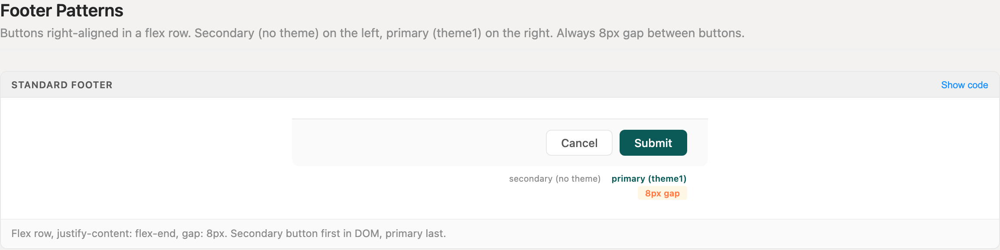
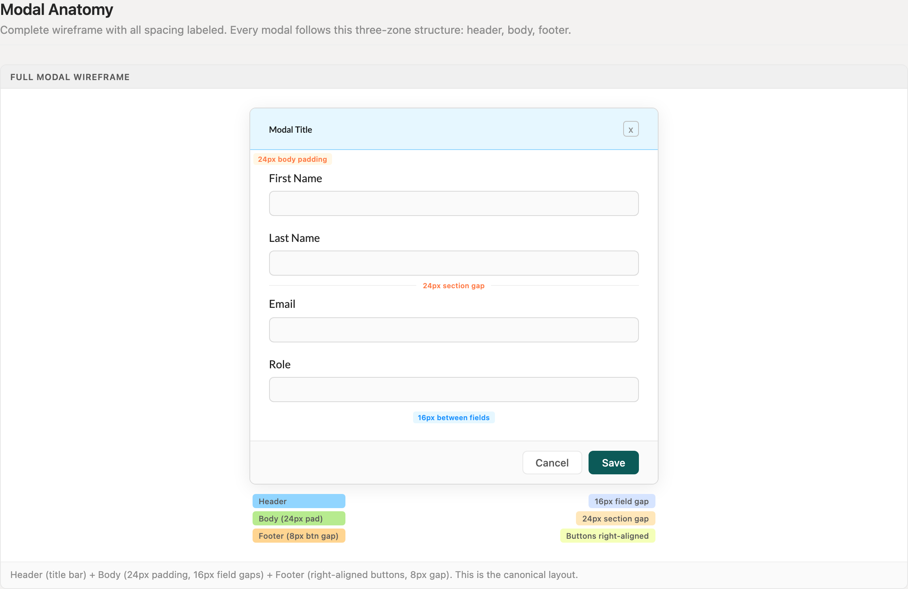
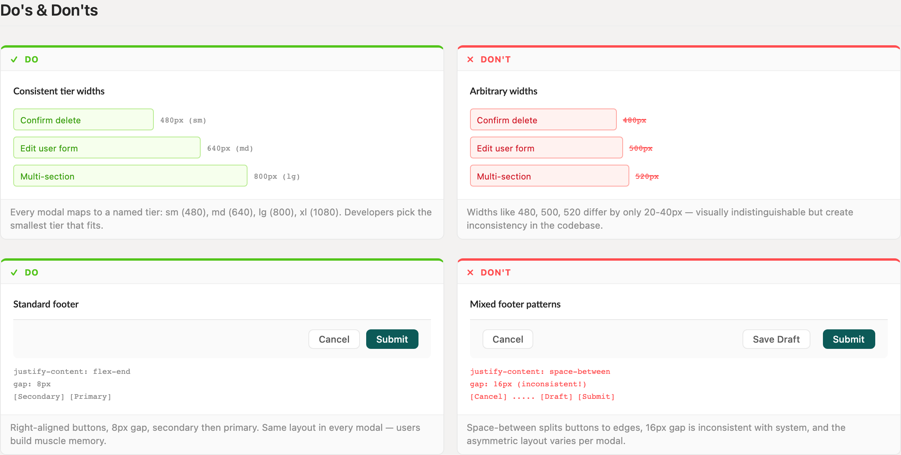

# Modals

Every modal maps to one of four width tiers, one internal spacing rhythm, and one footer layout. The content varies; the frame never does.

> Part of the Excalibrr Design Patterns — layout rulebook. Index: `../CLAUDE.md`. Live page in the Excalibrr demo: `/DesignSystem/Modals` (demo runs at http://localhost:3000).

### The Laws of Modals

1. **Pick the smallest named tier that fits: sm 480px, md 640px, lg 800px, xl 1080px — never an arbitrary width.** — Widths 20-40px apart are visually indistinguishable, but every one-off (500px, 520px) becomes another variant to maintain. Content either fits a tier or it needs the next one up.
2. **Every modal is three zones — header, body, footer — in that order.** — A fixed anatomy lets users parse any modal instantly: the title says where they are, the footer says how they leave.
3. **Body padding is 24px on all sides; fields sit 16px apart; logical sections sit 24px apart.** — This matches the page-level form rhythm, so content moved into a modal keeps its proportions.
4. **Footer buttons right-align in a flex row with an 8px gap — secondary first, primary (theme1) last.** — Bottom-right is where users expect the affirmative action; an identical footer in every modal builds muscle memory.
5. **One theme1 button per modal.** — Two themed buttons split attention and stall the exact decision the modal exists to force.
6. **Drive visibility with `open`, reset state with `destroyOnHidden`, listen with `afterOpenChange` — never the antd v4 names (`visible`, `destroyOnClose`, `afterVisibleChange`).** — antd v5 keeps `visible` and `destroyOnClose` only as deprecated fallbacks (`open ?? visible`, `destroyOnHidden ?? destroyOnClose`) that log dev-console warnings and lose whenever the v5 prop is also set; `afterVisibleChange` is removed from Modal entirely. The repo CLAUDE.md mistakes table bans the v4 names outright.
7. **Submit forms from the footer with `onClick={() => form.submit()}`, never `htmlType='submit'`.** — The footer renders outside the <Form> element in the DOM, so native submit never fires.
8. **Modals are for blocking decisions; reach for a Drawer or inline panel when users need the page behind.** — The mask removes all context. If the task requires referencing background content or scrolling past a viewport, the modal is fighting the user.

### Size tiers



*The four named width tiers at relative scale — sm 480, md 640, lg 800, xl 1080 — with the use case each tier exists for. The jumps between tiers are deliberate: content fits or it moves up a tier.*

### Internal spacing zones



*The body rhythm: 24px padding on all sides, 16px between fields within a section, 24px between sections. One annotated wireframe covers every spacing decision inside a modal body.*

### Standard footer



*The only footer layout: flex row, justify-content flex-end, 8px gap, secondary (no theme) then primary (theme1). Secondary first in DOM, primary last.*

### Full modal anatomy



*The canonical three-zone structure assembled: header title bar, 24px-padded body with 16px field gaps and a 24px section gap, right-aligned footer with 8px button gap.*

### Do's and don'ts



*Named tiers vs arbitrary widths, and the standard footer vs mixed space-between footers — the two ways modals most often drift off pattern.*

### Modal Tokens

Four width tiers plus four internal spacing tokens. Every dimension in a modal comes from this table.

| Token | Value | Use for |
| --- | --- | --- |
| `--modal-width-sm` | `480px` | Confirmations, 1-3 field forms |
| `--modal-width-md` | `640px` | Standard forms, file upload |
| `--modal-width-lg` | `800px` | Complex multi-section forms |
| `--modal-width-xl` | `1080px` | Data-heavy modals, grids inside modals |
| `--modal-body-padding` | `24px` | Body content area padding, all sides |
| `--modal-field-gap` | `16px` | Gap between form fields within a section |
| `--modal-section-gap` | `24px` | Gap between logical sections in the body |
| `--modal-footer-gap` | `8px` | Gap between footer action buttons |

### Canonical Modal Skeleton

```tsx
import { useState } from 'react'
import { Modal, Form } from 'antd'
import { GraviButton, Horizontal, Vertical } from '@gravitate-js/excalibrr'

export function EditCounterpartyModal() {
  const [open, setOpen] = useState(false)
  const [form] = Form.useForm()

  const handleSave = (values) => {
    // persist values, then close
    setOpen(false)
  }

  return (
    <Modal
      title='Edit Counterparty'
      open={open}                  // antd v5: `open` — `visible` is deprecated
      width={640}                  // md tier: smallest that fits
      destroyOnHidden              // antd v5: not `destroyOnClose`
      onCancel={() => setOpen(false)}
      footer={
        <Horizontal justifyContent='flex-end' gap={8}>
          <GraviButton buttonText='Cancel' onClick={() => setOpen(false)} />
          <GraviButton theme1 buttonText='Save' onClick={() => form.submit()} />
        </Horizontal>
      }
    >
      <Form form={form} layout='vertical' onFinish={handleSave}>
        <Vertical gap={16}>
          {/* fields — 16px apart; separate sections by 24px */}
        </Vertical>
      </Form>
    </Modal>
  )
}
```

Width is a tier value, never a guess. The explicit footer override locks in secondary-then-primary order and the 8px gap; `form.submit()` from onClick is required because the footer renders outside the <Form> DOM.

### Do's & Don'ts

- **Do:** Map every modal to a named tier — sm 480, md 640, lg 800, xl 1080 — and pick the smallest that fits.
  **Don't:** Invent widths like 500px or 520px because the content almost fits.
  **Why:** Tiers 20-40px apart look identical on screen but multiply variants in code. If content doesn't fit, jump a full tier.
- **Do:** Right-align footer buttons at an 8px gap: Cancel, then the single theme1 primary.
  **Don't:** Use space-between footers, 16px button gaps, or per-modal button arrangements.
  **Why:** One footer layout across the app means users never hunt for the confirm button.
- **Do:** Lay out body content with Vertical gap={16} inside sections and 24px between sections.
  **Don't:** Eyeball margins on individual fields.
  **Why:** Tokenized gaps survive refactors; ad-hoc margins drift modal by modal.

### Gotchas

- **antd v5: `open`, not `visible`** — antd v5 keeps `visible` only as a deprecated fallback — Modal resolves `open ?? visible`, logs a dev-console deprecation warning, and ignores `visible` entirely once `open` is present. Write open={isOpen}; the repo CLAUDE.md mistakes table bans `visible`.
- **antd v5: `destroyOnHidden`, not `destroyOnClose`** — antd v5 resolves `destroyOnHidden ?? destroyOnClose`, so the v4 name still works but logs a deprecation warning and is banned by the repo CLAUDE.md mistakes table. Without destroyOnHidden, form state survives close and the next open shows stale values.
- **antd v5: `onOpenChange`, not `onVisibleChange`** — Applies to the open-state surfaces around a modal (Dropdown, Popover, Tooltip) — Modal itself listens with `afterOpenChange`. In antd v5 the v4 callback still fires as a deprecated alias with a console warning; write all handlers against onOpenChange.
- **GraviButton renders `buttonText`, not children** — A footer written as <GraviButton>Cancel</GraviButton> renders an empty button. Self-close and pass buttonText='Cancel'.

### Choosing the Surface and the Tier

Reach for a modal when the user must make a focused, blocking decision — confirm a delete, fill a short form, resolve a conflict — and the page behind is irrelevant until they do. When the user needs to reference the page behind, or the content scrolls past a viewport, use a Drawer or an inline panel instead (see Panels).

Tier choice is a content question, not a taste question: count fields and sections. One to three fields is `sm`; a standard single-section form is `md`; a multi-section form is `lg`; anything embedding a grid is `xl` — and a grid inside a modal is itself a signal to consider a dedicated page.

`Modal.confirm` and its siblings are fine for one-line confirmations with no inputs. The moment a modal collects data, it gets the full three-zone layout: titled header, 24px-padded body, standard footer.
