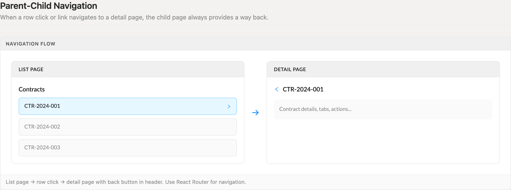
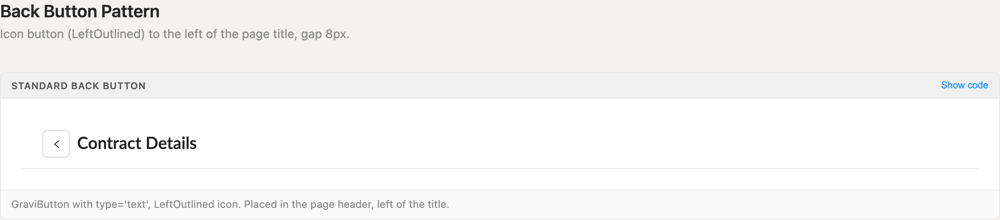
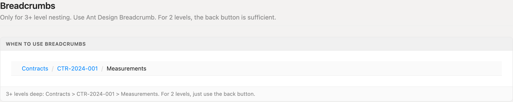
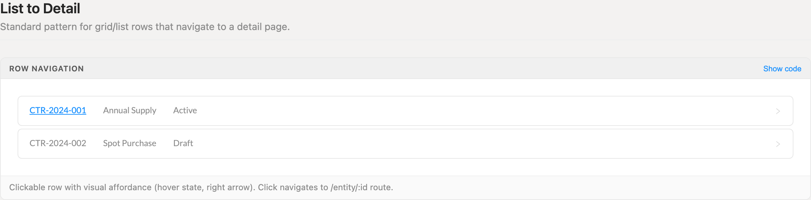
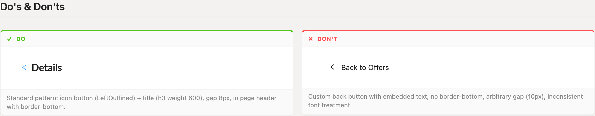

# Navigation

Wayfinding between list and detail views — and the two-file ritual that puts a page in the left rail. One back-button anatomy on every detail page, breadcrumbs only past two levels, rows that look navigable, and every nav section registered in both `pageConfig.tsx` and `AuthenticatedRoute.jsx`.

> Part of the Excalibrr Design Patterns — layout rulebook. Index: `../CLAUDE.md`. Live page in the Excalibrr demo: `/DesignSystem/PGNavigation` (demo runs at http://localhost:3000).

### Laws of navigation

Two domains, one rulebook: in-page wayfinding (back buttons, breadcrumbs, row links) and nav registration (the left rail). Violations are bugs, not stylistic choices.

1. **Every detail page provides a way back — an icon-only `GraviButton type="text"` with `LeftOutlined`, 8px left of the page title.** — Row clicks and links create one-way doors otherwise. One fixed anatomy means the way back is in the same place on every screen.
2. **The back button is icon-only — never embed "Back to X" text in it.** — Text variants drift in width, casing, and tone per page. The icon plus the h3 title beside it already says where you are; the parent's name belongs in breadcrumbs when depth demands it.
3. **Navigate with React Router (`useNavigate`) — never `window.location` or a raw `href`.** — A full page reload tears down the SPA shell: nav context, grid filters, and unsaved work are gone.
4. **Breadcrumbs appear only at three or more levels of nesting; at two levels the back button is the whole story.** — At two levels a breadcrumb duplicates the back button and spends a header row saying nothing new.
5. **Rows that navigate look navigable — link-styled key cell, hover state, right chevron.** — Invisible click targets fail discovery. Users never find detail pages they can't see an entrance to.
6. **Registering a nav section touches TWO files: define it in `pageConfig.tsx` AND enable its scope in `AuthenticatedRoute.jsx`.** — Scopes gate the menu. Miss the scope and the section silently never renders — no error, no console warning, nothing.
7. **A nav section holds at most 13 routes; past that, split into nested sub-groups.** — Routes beyond the 13th silently drop out of the rail. The cap is a hard rendering limit, not a style preference.
8. **Detail and edit pages register as `hidden: true` routes — routable, never listed in the rail.** — The rail lists destinations users start from. Detail pages are reached through rows and links; listing them doubles the rail and strands users on parameterless routes.

### Parent-child flow — list to detail and back



*Row click on the list page opens the detail page; the detail header leads with the back affordance. Every child page provides a way back — no one-way doors.*

### Standard back button



*Icon-only GraviButton type="text" with LeftOutlined, 8px left of the Texto h3 weight-600 title, inside the standard page header with border-bottom.*

### Breadcrumbs — three levels or deeper only



*Contracts / CTR-2024-001 / Measurements: ancestor crumbs are links, the current page is plain text. At two levels, skip the breadcrumb — the back button covers it.*

### Row navigation affordance



*The key cell renders as a link and the row carries a hover state plus right chevron. Click navigates to the /entity/:id route via React Router.*

### Back button do and don't



*Do: icon button + h3 title, 8px gap, header border-bottom. Don't: a custom "Back to Offers" text button with arbitrary gap and no header treatment.*

### Navigation spacing and limits

| Token | Value | Use for |
| --- | --- | --- |
| `Back button → title gap` | `8px` | Between the icon-only back button and the page title in the detail header |
| `Detail page title` | `Texto h3, weight 600` | The page identity the back button anchors to — same treatment on every detail page |
| `Breadcrumb bar padding` | `8px 24px` | Breadcrumbs live in their own slim strip below the page header, with a 1px border-bottom |
| `Breadcrumb separator spacing` | `8px each side` | Around the / between crumbs; ancestor crumbs are links, the current page is plain text |
| `Section route cap` | `13 routes` | Hard per-section rendering limit in the left rail — split into nested sub-groups before hitting it |

### Choosing the wayfinding device

Devices compound as depth grows — the back button is always present on detail pages; breadcrumbs join it at three levels.

| Variant | When to use | Code |
| --- | --- | --- |
| `Back button` | Every detail page. At two levels of nesting it is the only wayfinding device. | `<GraviButton type="text" icon={<LeftOutlined />} onClick={() => navigate('/contracts')} />` |
| `Breadcrumbs` | Three or more levels deep — Contracts / CTR-2024-001 / Measurements. Joins the back button; never replaces it. | `<Breadcrumb items={[{ title: <Link to="/contracts">Contracts</Link> }, { title: <Link to="/contracts/CTR-2024-001">CTR-2024-001</Link> }, { title: 'Measurements' }]} />` |
| `Row navigation` | Grid or list rows that open a detail page. Link-styled key cell + hover state; cellRenderer is correct here because the cell is interactive. | `cellRenderer: (params) => <a onClick={() => navigate(`/contracts/${params.data.id}`)}>{params.value}</a>` |
| `Hidden route` | Detail and edit pages reached only by navigating — routable but never listed in the rail. | `{ hasPermission: () => true, key: 'ContractDetails', title: 'Contract Details', element: <ContractDetails />, path: '/Contracts/ContractDetails', hidden: true }` |

### Canonical skeleton — detail header and row link

```tsx
import { useNavigate } from 'react-router-dom'
import { LeftOutlined } from '@ant-design/icons'
import { Horizontal, Texto, GraviButton } from '@gravitate-js/excalibrr'

const navigate = useNavigate()

// Detail page header — the way back, always the same anatomy
<Horizontal alignItems="center" gap={8}>
  <GraviButton type="text" icon={<LeftOutlined />} onClick={() => navigate('/contracts')} />
  <Texto category="h3" weight="600">Contract Details</Texto>
</Horizontal>

// List row → detail: link renderer in columnDefs
// (interactive cell, so cellRenderer — not valueFormatter — is correct)
cellRenderer: (params) => (
  <a onClick={() => navigate(`/contracts/${params.data.id}`)}>
    {params.value}
  </a>
)
```

Layout geometry travels through props (`alignItems`, `gap={8}`), never `style`. The back target is the explicit parent route here because detail pages are deep-linkable — see Usage for when `navigate(-1)` is acceptable.

### Registering a nav section — both files, always

```tsx
// 1 · demo/src/pageConfig.tsx — define the section
config.Contracts = {
  hasPermission: () => true,
  key: 'Contracts',
  icon: <FileTextOutlined />,
  title: 'Contracts',
  routes: [
    { hasPermission: () => true, key: 'ContractsList', title: 'Contracts',
      element: <ContractsList />, path: '/Contracts/ContractsList' },
    // Detail page: routable, hidden from the rail
    { hasPermission: () => true, key: 'ContractDetails', title: 'Contract Details',
      element: <ContractDetails />, path: '/Contracts/ContractDetails', hidden: true },
  ],
}

// 2 · demo/src/_Main/AuthenticatedRoute.jsx — enable the scope
const DEFAULT_SCOPES = {
  DesignSystem: true,
  Contracts: true,  // must match the config key exactly (case-sensitive)
}
```

Skip step 2 and the section silently never appears — no error anywhere. `DEFAULT_SCOPES` is the static fallback; once Project Hub state exists in localStorage, scopes derive from it instead, so also toggle the section on in Project Hub. Keys are globally unique across the whole config, and each section renders at most 13 routes.

### Do's & Don'ts

- **Do:** Use the icon-only back button: GraviButton type="text" + LeftOutlined, 8px left of the h3 title.
  **Don't:** Build custom "Back to Offers" text buttons with per-page gaps and font treatments.
  **Why:** Text back buttons drift into a dozen local dialects; the fixed anatomy is recognizable on every screen.
- **Do:** Register new sections in both pageConfig.tsx and the AuthenticatedRoute.jsx scopes.
  **Don't:** Add the section to pageConfig.tsx alone and assume the menu will pick it up.
  **Why:** Scopes gate the rail. A missing scope hides the section silently — the most common 'my page disappeared' bug in the demo.
- **Do:** Add breadcrumbs only when nesting reaches three levels, alongside the back button.
  **Don't:** Put a breadcrumb on every detail page 'for consistency'.
  **Why:** At two levels the breadcrumb restates the back button and burns a header row.
- **Do:** Navigate with useNavigate() and route paths.
  **Don't:** Use window.location.href or anchor hrefs that reload the page.
  **Why:** Reloads destroy the SPA shell — nav state, filters, and unsaved edits all reset.

### Back targets and what belongs in the rail

Prefer the explicit parent route — `navigate('/contracts')` — on any page a user can reach by deep link or shared URL. `navigate(-1)` on a deep-linked page steps out of the app entirely. Reserve `navigate(-1)` for flows that can only be entered from the parent, like a multi-step editor launched from a single button.

The left rail lists starting points: list pages, dashboards, manage screens. Detail and edit pages register as `hidden: true` routes — they stay routable and deep-linkable but never clutter the rail, and the rail never offers a parameterless route with nothing to show. When a section's visible route count approaches the 13-route cap, split it into nested sub-groups: the rail renders them as folders while URLs stay flat (`/Section/<leafKey>`), so links never break in the split.

Wayfinding compounds rather than substitutes. The back button appears on every detail page. Breadcrumbs join it at three levels of nesting. Row affordances — link-styled key cell, hover state, chevron — mark every entrance to a detail page from a list.

### Gotchas

- **Nav config lives in two files** — Defining a section in `pageConfig.tsx` is half the job: the section key must also be enabled in the scopes in `_Main/AuthenticatedRoute.jsx`, with an exact case-sensitive match. The static fallback object is `DEFAULT_SCOPES`; when Project Hub state exists in localStorage, scopes derive from hub state instead — toggle the section on there too. Miss the scope and the section silently never renders — no error, no warning. Check the scope first whenever a page 'disappears' from the rail.
- **The 13-route ceiling is silent** — A nav section renders at most 13 routes; anything past the 13th simply doesn't appear. Split oversized sections into nested sub-groups — the rail shows them as folders while URLs flatten to `/Section/<leafKey>`, so existing links survive the restructure.
- **Route keys are global, not per-section** — Keys collide across the entire config. The demo's Pattern Guide feedback page had to be renamed `PGFeedback` because a showcase already owned the `Feedback` key — the collision hijacks nav highlighting between the two. Prefix keys when titles repeat across groups.
- **antd Breadcrumb and Menu take items, not JSX children** — Write `<Breadcrumb items={[...]} />` and `<Menu items={[...]} />`. The `<Breadcrumb.Item>` / `<Menu.Item>` children APIs are deprecated in antd v5 (console warning, slated for removal) and `<Menu><Menu.Item>` is on the repo CLAUDE.md mistakes table — use the items API from the start.
