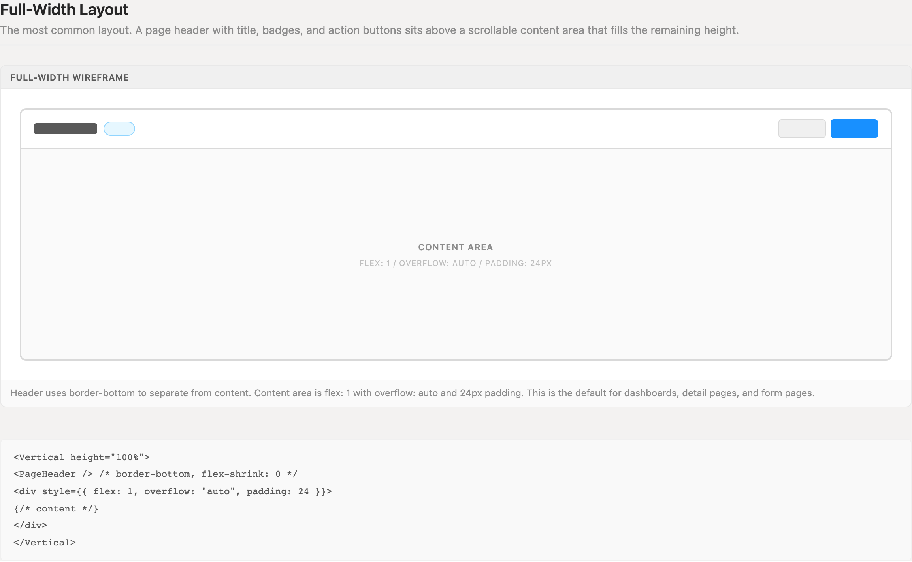
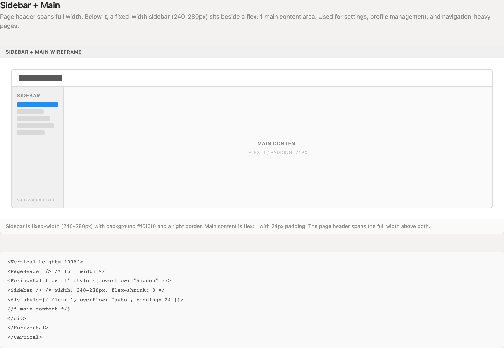
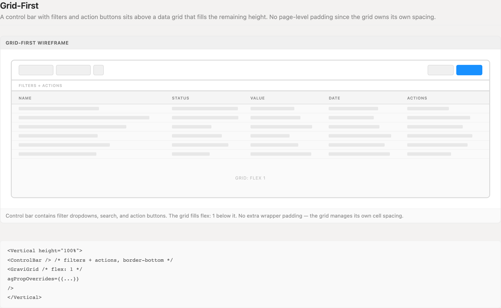
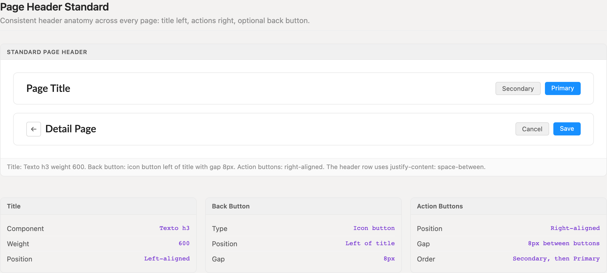
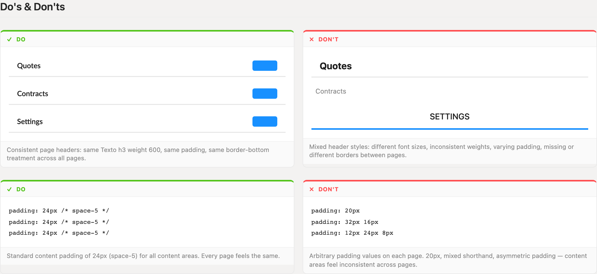

# Page Layouts

Three archetypes — full-width, sidebar + main, and grid-first — cover every page in the application. Each starts from the same page header anatomy, fills the viewport with `<Vertical height="100%">`, and gives exactly one pane the scroll. Pick an archetype; never invent a custom shape.

> Part of the Excalibrr Design Patterns — layout rulebook. Index: `../CLAUDE.md`. Live page in the Excalibrr demo: `/DesignSystem/PageLayouts` (demo runs at http://localhost:3000).

### Laws of page layout

These hold on every page. Violations are bugs, not stylistic choices.

1. **Every page is one of three archetypes: full-width, sidebar + main, or grid-first.** — Three shapes keep the whole app predictable. A page that fits none of them is a design problem to resolve, not a fourth archetype to invent.
2. **The page root is `<Vertical height="100%">`; chrome rows never flex, and exactly one pane owns scrolling via `flex="1"` + `scroll`.** — Competing scroll regions produce double scrollbars and headers that drift off-screen. One explicit scroll owner keeps chrome pinned to the viewport.
3. **On grid-centric pages, cumulative non-grid chrome — page header, control bars, tab strips, filter rows, footers — stays under 320px.** — The grid is the page. Past ~320px of chrome the grid no longer fits the viewport, and users end up scrolling the shell instead of the data.
4. **Page header anatomy never varies: `Texto` h3 weight 600 title on the left, actions on the right (secondary before primary, 8px gap), optional back icon button 8px left of the title.** — Users orient by the header. One anatomy makes every page legible at a glance; per-page variants read as a different product.
5. **Content areas take 24px padding (space-5) on all four sides; grid-first pages take none.** — One padding value makes screens compose seamlessly. Grids manage their own cell spacing — wrapper padding only shrinks visible rows.
6. **Sidebars are fixed-width, 240–280px, with `flex-shrink: 0`; the main pane takes `flex="1"`.** — Proportional sidebars reflow navigation on every resize. A fixed width keeps nav targets stationary while content absorbs the change.
7. **Layout geometry travels through props — `flex="1"`, `height="100%"`, `gap={12}` — never `style`.** — `<Vertical style={{ flex: 1 }}>` is the most reviewed-out mistake in generated code. Props keep layout declarative and auditable; `style` is reserved for properties with no prop equivalent, like `padding`.

### Full-width — the default archetype



*Page header (flex-shrink: 0, border-bottom) above a flex: 1 scrollable content area with 24px padding. The default for dashboards, detail pages, and forms.*

### Sidebar + main



*Header spans the full width; below it a fixed 240–280px sidebar sits beside a flex: 1 main pane. The sidebar never flexes — flex-shrink: 0.*

### Grid-first



*One control bar of filters and actions, then the grid takes everything else at flex: 1. No page-level padding — the grid owns its own spacing.*

### Page header anatomy



*Texto h3 weight 600 title left; actions right with secondary before primary and 8px gap. Detail pages add a back icon button 8px left of the title. The row uses justify-content: space-between.*

### Consistency dos and don'ts



*From the live guide: identical header treatment on every page, and one 24px (space-5) content padding standard versus arbitrary per-page values.*

### Layout spacing and sizing

The full vocabulary a page layout is allowed to use. Anything outside this table needs a reason in review.

| Token | Value | Use for |
| --- | --- | --- |
| `Content padding` | `24px (space-5)` | All scrollable content areas, uniform on all four sides — full-width and sidebar + main archetypes |
| `Page header padding` | `16px 24px (space-4 space-5)` | Standard header row on every archetype, with a 1px border-bottom separating it from content |
| `Control bar padding` | `12px 24px (space-3 space-5)` | Filter and action bar above the grid on grid-first pages |
| `Sidebar width` | `240–280px` | Fixed sidebar in sidebar + main; flex-shrink: 0 so it never collapses |
| `Action gap` | `8px` | Between header action buttons, and between the back button and the title |
| `Chrome budget` | `≤ 320px` | Maximum cumulative non-grid chrome height (headers + bars + footers) on grid-first pages |

### Canonical skeletons — all three archetypes

```tsx
// 1 · Full-width — the default
<Vertical height="100%">
  <PageHeader />                              {/* flex-shrink: 0, border-bottom */}
  <Vertical flex="1" scroll style={{ padding: 24 }}>
    {/* content */}
  </Vertical>
</Vertical>

// 2 · Sidebar + main — settings, profile, nav-heavy pages
<Vertical height="100%">
  <PageHeader />                              {/* spans full width */}
  <Horizontal flex="1">
    <Sidebar />                               {/* 240–280px, flex-shrink: 0 */}
    <Vertical flex="1" scroll style={{ padding: 24 }}>
      {/* main content */}
    </Vertical>
  </Horizontal>
</Vertical>

// 3 · Grid-first — the grid is the page
<Vertical height="100%">
  <ControlBar />                              {/* filters + actions, border-bottom */}
  <GraviGrid agPropOverrides={{}} />          {/* fills the rest — no wrapper padding */}
</Vertical>
```

Geometry goes through props only; `style` appears solely for `padding`, which has no prop equivalent. `GraviGrid` always receives `agPropOverrides`, even when empty. The `scroll` prop marks the one pane allowed to scroll — both primitives clip overflow otherwise.

### Do's & Don'ts

- **Do:** Reuse the exact header anatomy on every page — Texto h3 weight 600, 16px 24px padding, border-bottom.
  **Don't:** Restyle headers per page: bigger fonts, centered titles, uppercase labels, missing borders.
  **Why:** Headers are how users tell where they are; variance between pages reads as a different product.
- **Do:** Pad content areas 24px (space-5), uniform on all four sides.
  **Don't:** Invent per-page padding — 20px, 32px 16px, 12px 24px 8px shorthand.
  **Why:** One value keeps screens composable and removes a whole class of review churn.
- **Do:** Budget grid-page chrome: one control bar, then the grid at flex: 1.
  **Don't:** Stack header + tab bar + filter strip + summary cards + footer around the grid.
  **Why:** Every chrome row steals data rows; past ~320px total the grid no longer fits the viewport.
- **Do:** Mark exactly one pane as the scroll owner with `flex="1"` + `scroll`.
  **Don't:** Let the document body scroll, or nest multiple `overflow: auto` panes.
  **Why:** Multiple scroll regions create double scrollbars and let chrome scroll away with the content.

### Choosing an archetype

Default to full-width. It serves dashboards, detail pages, and form pages: a page header, then one scrollable content area. Reach for sidebar + main only when the page carries its own internal navigation — settings, profile management, multi-section configuration — and the sidebar holds that navigation, nothing else.

Go grid-first the moment a data grid is the point of the page: quote books, pricing screens, any manage-X table. The grid replaces the content area entirely; the only chrome above it is a single control bar of filters and actions, and the page contributes zero padding because `GraviGrid` manages its own cell spacing.

Drawers, split panels, and footers added later count against the same viewport the layout was budgeted for. Decide the archetype first, then make every subsequent surface justify the pixels it takes from it.

### Gotchas

- **The 320px chrome budget is cumulative** — Count every non-grid row: page header (~56px), control bar (~48px), tab strip, filter row, analytics cards, publish footer. Each looks cheap alone; together they push the grid below the fold at 1080p. This exact failure has shipped more than once — audit the running total before adding any new chrome row to a grid page, and design drawers and footers tight from the first pass.
- **Vertical and Horizontal defaults are asymmetric** — Vertical is greedy — flex: '1 1 auto' and height: '100%' by default — while Horizontal hugs content with flex: '0 1 auto' and no height. The split-pane row in sidebar + main collapses to its content height unless you pass flex="1" explicitly.
- **Both primitives clip by default** — Vertical and Horizontal set overflow: hidden unless you pass `scroll`. Forget it on the content pane and long content silently truncates instead of scrolling. Mark the one scroll owner explicitly; everything else stays clipped on purpose.
