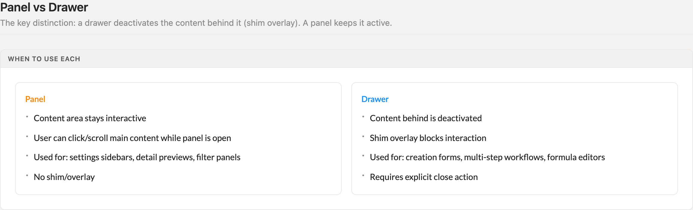
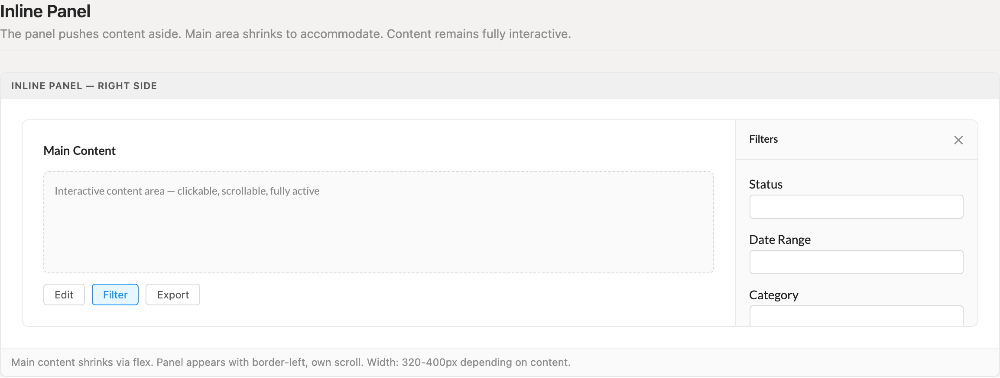
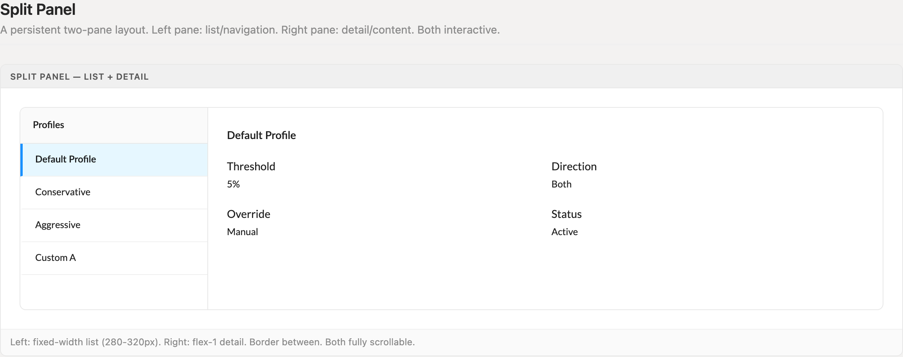
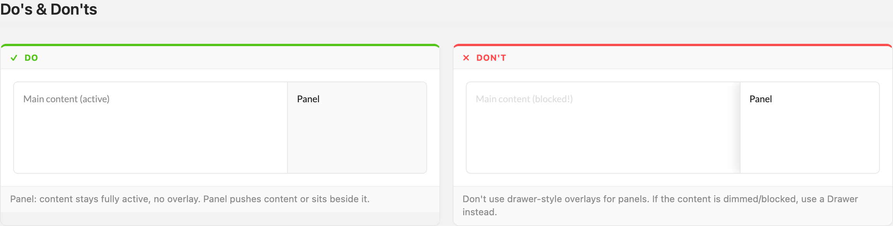

# Panels

A panel is collaborative chrome: it slides in beside the content without blocking it. No shim, no overlay — the page stays live while the panel is open. If the user must finish the panel before touching the page, the surface is a Drawer, not a panel.

> Part of the Excalibrr Design Patterns — layout rulebook. Index: `../CLAUDE.md`. Live page in the Excalibrr demo: `/DesignSystem/Panels` (demo runs at http://localhost:3000).

### The laws of panels

1. **A panel never blocks the page — no shim, no overlay, no dimming.** — The point of a panel is side-by-side work. If the page must freeze while the surface is open, the surface is a Drawer.
2. **Panels push content aside via flex; they never float above it.** — A floating overlay hides the very data the panel exists to support. Pushing keeps both surfaces fully visible and interactive.
3. **Budget chrome before you build — cumulative non-grid chrome on a grid page stays at or under 320px.** — Panels ship tight from the first pass; chrome is budgeted, not accumulated. Headers, toolbars, and panel padding all spend from the same budget, and the grid must keep the viewport.
4. **Inline panels are 320–400px fixed-width; the main pane takes flex 1 with min-width 0.** — Fixed width keeps panel content stable while the main pane absorbs the resize. min-width 0 lets the flex pane actually shrink instead of overflowing under the panel.
5. **Every panel owns its scroll — pinned header, independently scrolling body.** — Tying panel scroll to the page scrolls the user's working context away mid-task.
6. **An inline panel's header is title left, close (✕) right, 1px border below — nothing else. Split-panel list headers drop the close: there is no open/close state to dismiss.** — A constant header anatomy makes every panel instantly identifiable — and dismissible when dismissal exists.
7. **Split-panel lists are 280–320px fixed on the left; detail takes flex 1 on the right.** — List labels truncate predictably at a fixed width; detail content is what benefits from every extra pixel.
8. **Panels close from their own header or their launch control — never from a click on the main content.** — Click-outside-to-close belongs to overlays. Panels exist precisely so users can click the content while they work.

### Panel vs Drawer



*The dividing line: a panel keeps the content area interactive with no shim; a drawer deactivates it behind an overlay. Panels serve filters, settings, and detail previews — drawers serve creation forms and multi-step workflows.*

### Inline panel — right side



*The canonical inline panel: main content shrinks via flex and stays fully active; the panel sits at fixed width with a border-left, pinned title + close header, and its own scrolling body.*

### Split panel — list + detail



*Persistent two-pane anatomy: fixed-width list pane on the left with selection state (tinted row + 3px accent bar), flex-1 detail pane on the right, 1px border between. Both panes scroll independently.*

### Do / Don't — push, never overlay



*Do: panel shares the flex row and the content stays active. Don't: a drawer-style overlay that dims or blocks the page — if the content is blocked, the surface should be a Drawer.*

### Panel types — and the drawer boundary

Two panel shapes cover every legitimate use. Anything past them is a Drawer.

| Variant | When to use | Code |
| --- | --- | --- |
| `Inline panel` | Transient tool surface the user opens and closes — filters, settings, detail preview that follows selection. 320–400px fixed, border-left, mounted inside the page's flex row. | `{panelOpen && <Vertical width={360} style={{ borderLeft: '1px solid var(--border-default)' }}>…</Vertical>}` |
| `Split panel` | Persistent two-pane list + detail anatomy — profile managers, manage tabs. Left list 280–320px fixed, right detail flex 1; both always present, no open/close state. | — |
| `Drawer — not a panel` | The task must block the page: creation forms, multi-step workflows, formula editors. Shim overlay, explicit close, commit/cancel contract. See the Right Drawers entry. | — |

### Panel sizing & spacing

Fixed dimensions are decided once per surface and never accumulated. The chrome budget is the binding constraint.

| Token | Value | Use for |
| --- | --- | --- |
| `inline panel width` | `320–400px` | Fixed width of an inline push panel — pick once based on densest content, then hold it |
| `split list pane width` | `280–320px` | Fixed left pane of a split panel; detail pane takes flex 1 |
| `chrome budget` | `≤ 320px` | Cumulative non-grid chrome on grid pages: page header + toolbars + footers + panel padding stack, all-in |
| `--space-3` | `12px` | Panel header vertical padding; gap between fields in the panel body |
| `--space-4` | `16px` | Panel header horizontal padding; panel body padding |
| `--border-default` | `#e8e8e8` | Panel edge: border-left on inline panels, divider between split panes, header border-bottom |
| `--surface-muted` | `#fafafa` | Panel background when it should read as secondary to the main content; list-pane headers |

### Canonical inline panel

```tsx
import { useState } from 'react'
import { Horizontal, Vertical, Texto, GraviButton } from '@gravitate-js/excalibrr'
import { CloseOutlined } from '@ant-design/icons'

function PageWithPanel() {
  const [panelOpen, setPanelOpen] = useState(false)

  return (
    <Horizontal height="100%" alignItems="stretch">
      {/* Main pane: flex 1 + minWidth 0 so it can actually shrink */}
      <Vertical flex="1" scroll style={{ minWidth: 0 }}>
        {/* page content — stays fully interactive while the panel is open */}
      </Vertical>

      {panelOpen && (
        <Vertical width={360} style={{ borderLeft: '1px solid var(--border-default)' }}>
          {/* Pinned header: title left, close right */}
          <Horizontal
            justifyContent="space-between"
            alignItems="center"
            style={{
              padding: 'var(--space-3) var(--space-4)',
              borderBottom: '1px solid var(--border-default)',
            }}
          >
            <Texto category="p2" weight="600">Filters</Texto>
            <GraviButton icon={<CloseOutlined />} onClick={() => setPanelOpen(false)} />
          </Horizontal>

          {/* Body: owns its own scroll */}
          <Vertical flex="1" gap={12} scroll style={{ padding: 'var(--space-4)' }}>
            {/* panel fields */}
          </Vertical>
        </Vertical>
      )}
    </Horizontal>
  )
}
```

Visibility is a plain conditional render — no shim component, no portal. Layout props go through the Horizontal/Vertical shorthands (`flex="1"`, `width={360}`, `height="100%"`, `gap={12}`, `scroll`, `justifyContent`), never through `style`; `style` carries only borders, padding, and the `minWidth: 0` shrink fix.

### Do's & Don'ts

- **Do:** Push the content aside — panel and page share one flex row.
  **Don't:** Float the panel over the page with a shadow or dimmed backdrop.
  **Why:** Dimmed or blocked content means the surface is a Drawer. Mislabeled panels train users that the page is frozen when it is not.
- **Do:** Ship the panel at its final, tight dimensions in the first pass.
  **Don't:** Stack header, toolbar, padding, and panel chrome incrementally until the grid loses the viewport.
  **Why:** Chrome is budgeted, not accumulated — cumulative non-grid chrome stays at or under 320px on grid pages.
- **Do:** Give the panel a pinned header and an independently scrolling body.
  **Don't:** Let one scrollbar move the panel and the main content together.
  **Why:** Side-by-side work breaks the moment scrolling one surface scrolls the other away.
- **Do:** Close from the ✕ in the panel header or by toggling the launch control.
  **Don't:** Dismiss the panel when the user clicks the main content.
  **Why:** Clicking the content is the panel's core use case, not a dismissal gesture.

### Gotchas

- **Chrome budget: 320px, all-in** — Panels ship tight from the first pass — chrome is budgeted, not accumulated. On grid pages, cumulative non-grid chrome (page header + toolbars + footers + the panel's own padding stack) must stay at or under 320px or the grid no longer fits the viewport. Audit the running total before adding a panel; if the panel pushes past the budget, trim other chrome — do not ship and tighten later.
- **min-width: 0 on the flex pane** — Flex children refuse to shrink below their content's intrinsic width. Without `minWidth: 0` on the main pane, opening the panel makes a grid overflow underneath it instead of resizing. Pair with a grid that re-measures on container resize.
- **Graduating to a Drawer? Use the v5 prop names** — When a surface outgrows panel rules and becomes a Drawer, use the antd v5 names: `open` (not `visible`), `destroyOnHidden` (not `destroyOnClose`), and `afterOpenChange` (not `afterVisibleChange`). Drawer has no `onOpenChange` — wire dismissal through `onClose`.

### Choosing panel vs drawer

The decision is interaction, not size. Ask one question: does the user need to see and touch the main content while the surface is open? Yes — panel: filters that live-update a grid, detail previews that follow row selection, settings that apply immediately. No — drawer: creation forms, multi-step workflows, formula editors, anything with a commit/cancel contract.

Inline panels are for transient tools with open/close state; split panels are for permanent list + detail anatomy and carry no open/close state at all. When a "panel" starts wanting a footer with Save and Cancel, it has already become a drawer — move it to the Right Drawers pattern rather than bolting a commit contract onto a non-blocking surface.
