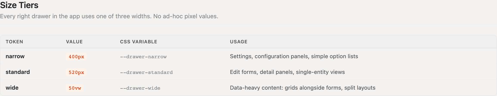
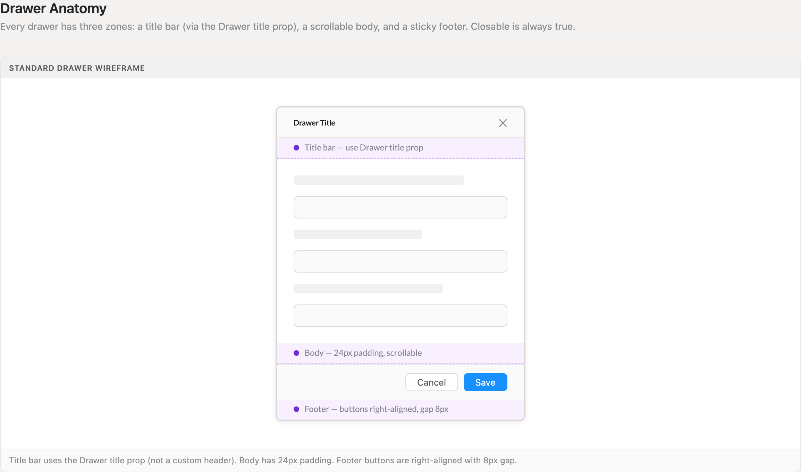
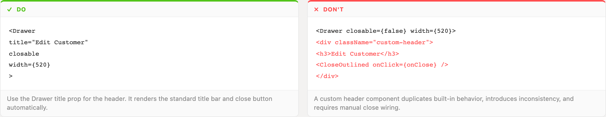
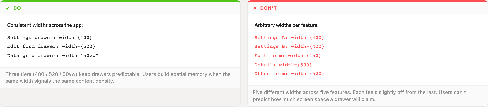

# Right Drawers

The workhorse edit/detail surface: three width tiers, one anatomy. Pick the tier by content density — everything else is prescribed.

> Part of the Excalibrr Design Patterns — layout rulebook. Index: `../CLAUDE.md`. Live page in the Excalibrr demo: `/DesignSystem/RightDrawers` (demo runs at http://localhost:3000).

### The Laws of Right Drawers

Every right drawer in the app follows these. A drawer that breaks one is a bug, not a variant.

1. **Width is one of three tiers — narrow 400px, standard 520px, wide 50vw. No ad-hoc pixel values.** — Users build spatial memory when the same width signals the same content density. Five near-identical widths across five features each feel slightly off and make screen-space unpredictable.
2. **The header is the Drawer `title` prop, with `closable` left on. Never a custom header div.** — The title prop renders the standard title bar and wires the close button for free. A hand-rolled header duplicates built-in behavior, drifts visually, and needs manual close wiring.
3. **Three zones, always: title bar, scrollable body, sticky footer. The body is the only thing that scrolls.** — If the footer scrolls away, the commit action disappears exactly when a long form needs it; if the whole drawer scrolls, the title loses its anchoring.
4. **The body pads 24px exactly once — the drawer provides it; content does not re-pad.** — Stacked padding (drawer body + Section + Card) eats 50-100px of usable width before any content renders. Drawers ship tight from the first pass.
5. **Footer actions sit right-aligned with an 8px gap, primary action rightmost.** — One consistent commit corner: the eye lands on Save in the same place in every drawer.
6. **Control visibility with `open`, not `visible`.** — antd v5 renamed the prop. `visible` is dead API — the drawer simply never opens, with no error to point at.
7. **Use `destroyOnHidden` when the body must reset between opens — `destroyOnClose` is the v4 name.** — Same v5 rename family as `visible`/`open`. The stale prop is silently ignored and form state leaks between records.
8. **Wide (50vw) drawers carrying a grid budget chrome up front: title bar + toolbars + footer stay within roughly 320px of vertical chrome.** — The grid gets the remainder of the viewport. Chrome added piecemeal after the fact always overshoots, and the grid ends up with three visible rows.

### Size tiers



*The three sanctioned widths — narrow 400px, standard 520px, wide 50vw — with the content density each one serves.*

### Drawer anatomy



*The three zones annotated: title bar from the Drawer title prop, scrollable body with 24px padding, sticky footer with right-aligned actions at 8px gap.*

### Header: title prop, not custom markup



*Do/don't pair: the title prop renders the standard header and close button; a custom header div duplicates both and wires close by hand.*

### Widths: tiers, not per-feature values



*Do/don't pair: three tiers app-wide versus five arbitrary widths across five features.*

### Width Tiers

Pass the value straight to the Drawer `width` prop — `width={400}`, `width={520}`, `width="50vw"`. The custom properties below are defined in `demo/src/tokens.css`. The pattern guide page (and the size-tiers specimen above) display shortened `--drawer-narrow`-style labels; those shortened names do not exist in CSS — only the `--drawer-right-*` names resolve in `var()`.

| Token | Value | Use for |
| --- | --- | --- |
| `--drawer-right-narrow` | `400px` | Settings, configuration panels, simple option lists |
| `--drawer-right-standard` | `520px` | Edit forms, detail panels, single-entity views |
| `--drawer-right-wide` | `50vw` | Data-heavy content: grids alongside forms, split layouts |

### Canonical skeleton

```tsx
<Drawer
  title="Edit Customer"
  open={isOpen}
  onClose={() => setIsOpen(false)}
  closable
  width={520}
  destroyOnHidden
  footer={
    <Horizontal justifyContent="flex-end" gap={8}>
      <GraviButton buttonText="Cancel" onClick={() => setIsOpen(false)} />
      <GraviButton theme1 buttonText="Save" onClick={() => form.submit()} />
    </Horizontal>
  }
>
  {/* Drawer body already pads 24px — do not re-pad */}
  <Vertical gap={16}>
    {/* form fields / detail content */}
  </Vertical>
</Drawer>
```

`open` not `visible`; `destroyOnHidden` not `destroyOnClose`; GraviButton takes `buttonText` (it ignores children) and `theme1` (never `type="primary"`); submit via `form.submit()` (never `htmlType`); layout props on Horizontal/Vertical, not `style`.

### Do / Don't

- **Do:** Use the Drawer `title` prop for the header: `<Drawer title="Edit Customer" closable width={520}>`.
  **Don't:** Build a custom header div with your own `<h3>` and `<CloseOutlined onClick={onClose} />`.
  **Why:** The built-in header is consistent everywhere and closes itself; the custom one is bespoke chrome you now maintain.
- **Do:** Pick a tier: settings at `width={400}`, edit forms at `width={520}`, grid-bearing drawers at `width="50vw"`.
  **Don't:** Invent per-feature widths — 420 here, 450 there, 500 somewhere else.
  **Why:** Three tiers keep drawers predictable; arbitrary values destroy the spatial memory the tiers exist to build.
- **Do:** Pass the body straight into the drawer and let its 24px padding do the work.
  **Don't:** Nest the body in padded Sections or Cards that stack a second and third gutter inside the drawer.
  **Why:** A 400px drawer with doubled padding leaves about 300px for content — inputs truncate and labels wrap. Tight from the first pass.

### When a right drawer is the right surface

Reach for a right drawer when the user edits or inspects one entity while keeping the page behind it visible and meaningful — edit a quote row, configure a profile, review a record's detail. The page context is the point; if the user needs none of it, that is a full page, not a drawer.

Use a modal instead for short blocking decisions (confirm, small create) where the background is irrelevant. Use an inline panel when the surface should participate in the page layout and stay open while the user keeps working in the grid — drawers overlay; panels share space.

Drawer state is a state machine, not a boolean pile: one `open` flag plus a payload describing what the drawer is showing. Opening a second record swaps the payload; it never stacks a second drawer.

### Gotchas

- **antd v5: `visible` is dead, use `open`** — A drawer driven by `visible={isOpen}` never opens and throws nothing useful. Same family: `onVisibleChange` is now `onOpenChange`, and `destroyOnClose` is now `destroyOnHidden`. Grep for all three when porting v4 code.
- **Stacked padding is the default failure mode** — The drawer body pads 24px. Every padded wrapper inside it (Section, Card, ad-hoc divs) silently stacks on top. Budget chrome up front — body padding once, footer once — and the drawer ships tight on the first pass instead of after a spacing audit.
- **GraviButton ignores children** — Footer buttons written as `<GraviButton>Save</GraviButton>` render empty. Self-close and pass `buttonText="Save"`; primary styling is the `theme1` boolean, not `type="primary"`.
- **Grids inside wide drawers need a flex column, not a height guess** — Make the drawer body a flex column (`<Vertical height="100%">`) and give the grid wrapper `flex="1"` — as props, never `style`. Hard-coded grid heights either clip the footer or leave dead space at every viewport size.
