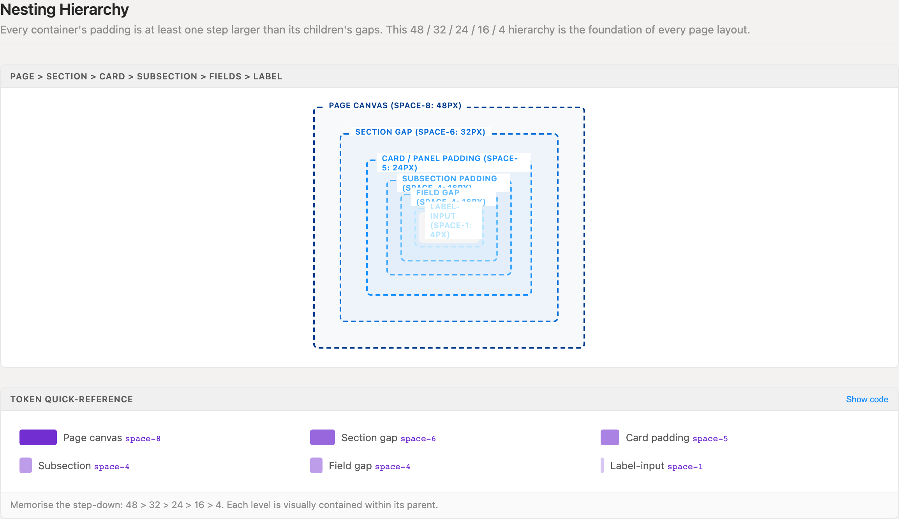
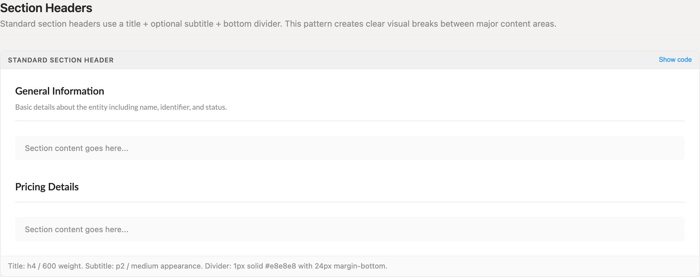
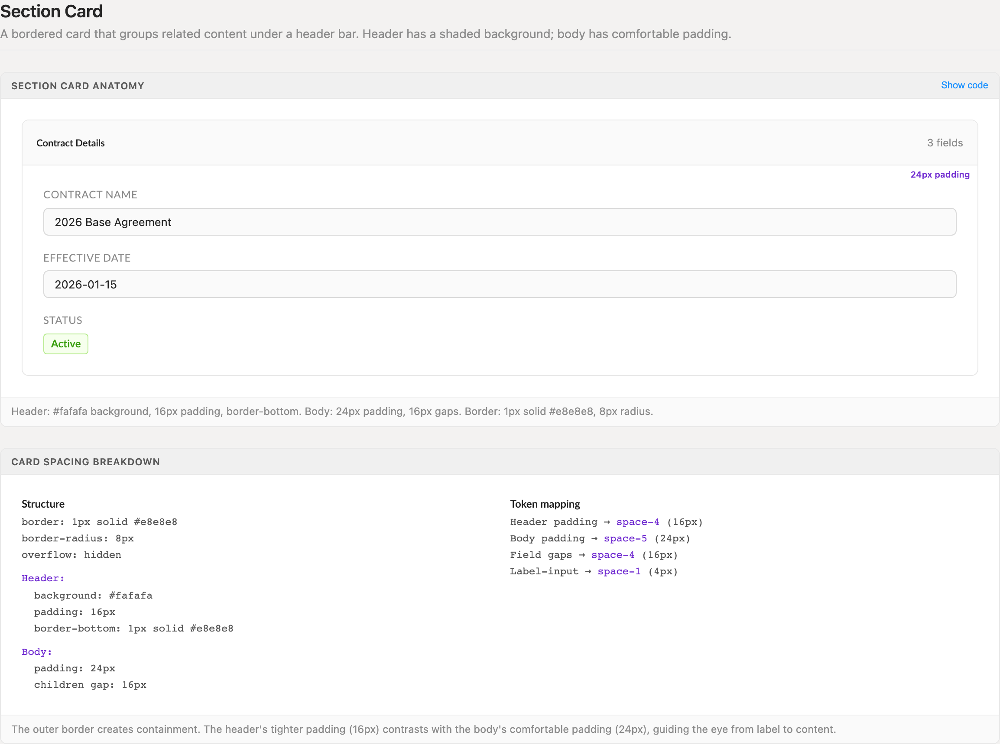
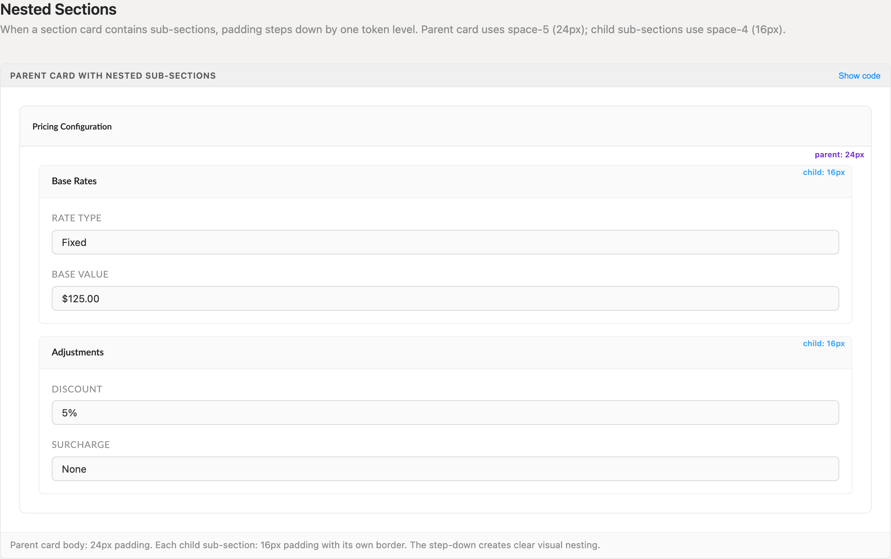
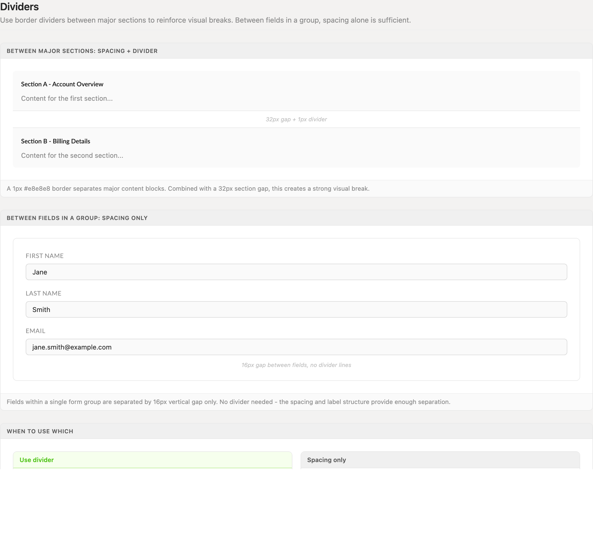
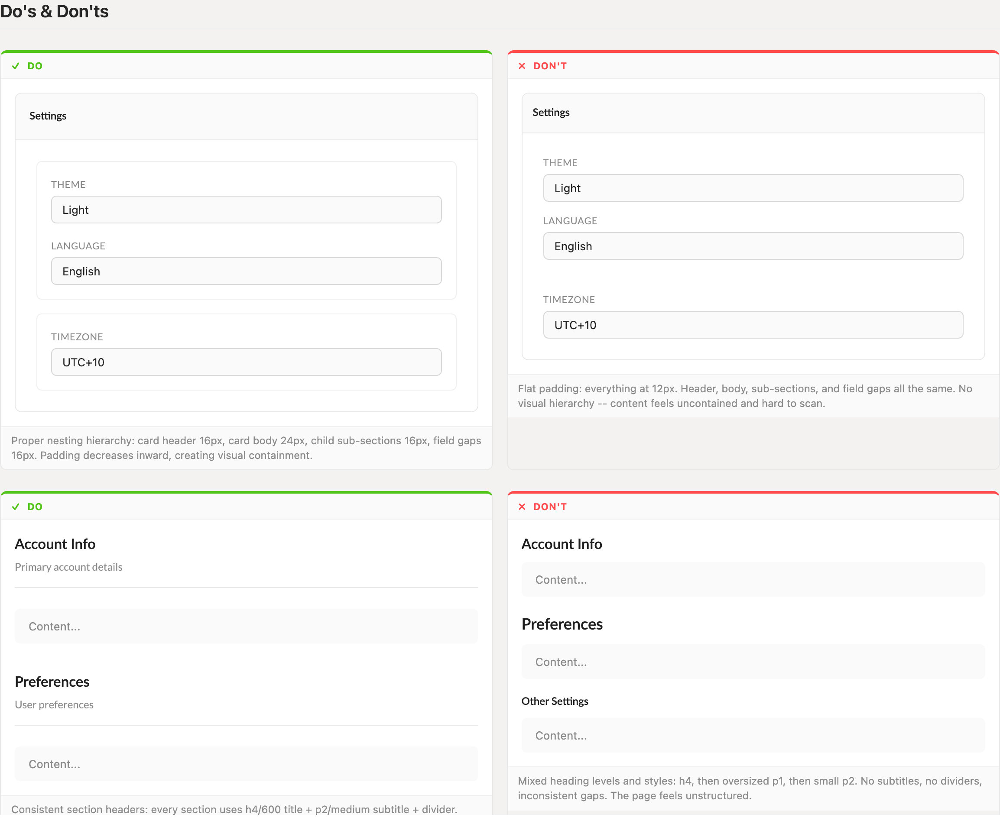

# Sections & Content

How page content organises into sections, cards, and nested groups. One spacing hierarchy — 48 / 32 / 24 / 16 / 4 — governs every container, and every section header follows the same recipe.

> Part of the Excalibrr Design Patterns — layout rulebook. Index: `../CLAUDE.md`. Live page in the Excalibrr demo: `/DesignSystem/Sections` (demo runs at http://localhost:3000).

### The laws of sections

These rules are non-negotiable. Every page, drawer, and panel in the product follows the same containment model.

1. **Padding steps down one level per nesting depth — 48 / 32 / 24 / 16 / 4, never flat.** — Uniform padding at every depth erases containment; the step-down is what makes parent/child structure legible at a glance.
2. **A container's padding is never smaller than the gap between its children.** — When padding undercuts the child gap, content sits closer to the frame than to its siblings and the grouping collapses.
3. **Section headers are one fixed recipe: `h4`/600 title, optional `p2`/medium subtitle, then a 1px #e8e8e8 divider 12px below the text and 24px above the content.** — Heading drift — different sizes, weights, or missing dividers per section — destroys the scan rhythm of the page.
4. **Major sections stack on a 32px (`--space-6`) rhythm.** — A section gap larger than any intra-section spacing is the signal that separates topics from items.
5. **Card anatomy is fixed: 1px #e8e8e8 border, 8px radius, `overflow: hidden`, #fafafa header at 16px padding, body at 24px.** — The tighter header against the roomier body guides the eye from label to content; ad-hoc paddings break that contrast.
6. **Nested sub-sections step down: 16px padding, 6px radius, lighter #f0f0f0 border.** — Same-weight borders at two depths read as siblings, not parent and child.
7. **Dividers separate sections; spacing alone separates items within a section.** — A ruled line signals a topic change — between fields it only adds noise.
8. **Layout flows through `Vertical`/`Horizontal` props (`gap`, `flex`, `height`, `justifyContent`), never inline flex styles.** — Style overrides bypass the layout API, so spacing can no longer be audited against the token scale.

### Nesting hierarchy



*The 48 / 32 / 24 / 16 / 4 step-down visualised as nested containers — page canvas, section gap, card padding, subsection padding, field gap, label-input — with the token quick-reference below.*

### Section headers



*The fixed header recipe with and without a subtitle: h4/600 title, p2/medium subtitle, 1px divider 12px below the text and 24px above the content.*

### Section card anatomy



*Bordered card with shaded 16px header and 24px body, plus the structure-to-token mapping breakdown (header → space-4, body → space-5, field gaps → space-4, label-input → space-1).*

### Nested sub-sections



*Parent card at 24px body padding containing 16px children with the lighter #f0f0f0 border — the one-step padding drop that makes nesting read as containment.*

### Dividers vs spacing



*Divider + 32px gap between major sections, and spacing-only 16px gaps between fields in a group — no divider lines. The full when-to-use-which lists live in the decision table below.*

### Do / don't pairs



*Stepped padding vs flat 12px everywhere; consistent header recipe vs mixed heading levels with no dividers.*

### Spacing scale

Memorise the step-down: 48 > 32 > 24 > 16 > 4. Each level is visually contained within its parent.

| Token | Value | Use for |
| --- | --- | --- |
| `--space-8` | `48px` | Page canvas padding — the outermost frame |
| `--space-6` | `32px` | Vertical gap between major sections |
| `--space-5` | `24px` | Card / panel body padding |
| `--space-4` | `16px` | Card header padding, sub-section padding, field gaps |
| `--space-1` | `4px` | Label-to-input gap — the innermost step |

### Surface values

| Token | Value | Use for |
| --- | --- | --- |
| `#e8e8e8` | `1px solid` | Card borders, section dividers, card header border-bottom |
| `#f0f0f0` | `1px solid` | Nested sub-section borders — one shade lighter than the parent card |
| `#fafafa` | `fill` | Card and sub-section header background |
| `8px` | `border-radius` | Parent card corners |
| `6px` | `border-radius` | Nested sub-section corners |

### Canonical section skeleton

```tsx
// One page = stacked sections on a 32px rhythm
<Vertical gap={32}>
  <section>
    {/* Section header — fixed recipe */}
    <Vertical gap={4}>
      <Texto category='h4' weight='600'>Pricing Configuration</Texto>
      <Texto category='p2' appearance='medium'>Base rates and adjustments for this contract.</Texto>
    </Vertical>
    <div style={{ borderBottom: '1px solid #e8e8e8', marginTop: 12, marginBottom: 24 }} />

    {/* Section card */}
    <div style={{ border: '1px solid #e8e8e8', borderRadius: 8, overflow: 'hidden' }}>
      <div style={{ padding: 16, background: '#fafafa', borderBottom: '1px solid #e8e8e8' }}>
        <Texto category='p1' weight='600'>Contract Details</Texto>
      </div>
      <div style={{ padding: 24 }}>
        <Vertical gap={16}>
          {/* Nested sub-section: one step down */}
          <div style={{ border: '1px solid #f0f0f0', borderRadius: 6, overflow: 'hidden' }}>
            <div style={{ padding: '10px 16px', background: '#fafafa', borderBottom: '1px solid #f0f0f0' }}>
              <Texto category='p2' weight='600'>Base Rates</Texto>
            </div>
            <div style={{ padding: 16 }}>
              <Vertical gap={16}>{/* fields — label sits 4px above its input */}</Vertical>
            </div>
          </div>
        </Vertical>
      </div>
    </div>
  </section>
</Vertical>
```

Gaps and flex go through Vertical/Horizontal props, never style. Texto categories used here (h4, p1, p2) are all valid; there is no p3 or h6.

### Section formats

Three containment levels, one decision: how much framing does the content need?

| Variant | When to use | Code |
| --- | --- | --- |
| `Bare section header` | Default for page-level structure. Title + divider, content sits directly on the canvas — the canvas itself is the container. | — |
| `Section card` | Related fields or mixed content that needs explicit containment: 1px border, 8px radius, shaded 16px header, 24px body. | `<div style={{ border: '1px solid #e8e8e8', borderRadius: 8, overflow: 'hidden' }}>` |
| `Nested sub-section` | Sub-grouping inside a card body. One step down: 16px padding, 6px radius, #f0f0f0 border, p2/600 title in a 10px 16px header bar. | `<div style={{ border: '1px solid #f0f0f0', borderRadius: 6, overflow: 'hidden' }}>` |

### Do's & Don'ts

- **Do:** Step padding down inward: card header 16px, body 24px, sub-sections 16px, field gaps 16px.
  **Don't:** Flatten everything to one value — 12px on header, body, sub-sections, and gaps alike.
  **Why:** Stepped padding creates visual containment; flat padding makes content feel uncontained and hard to scan.
- **Do:** Give every section the identical header recipe and a uniform 32px gap between sections.
  **Don't:** Mix heading levels per section — h4 here, an oversized p1 there, a small p2 next, some with dividers and some without.
  **Why:** A predictable rhythm lets readers locate sections without reading them.
- **Do:** Rule a divider below section headers and between major content blocks, card groups, and tab content areas.
  **Don't:** Draw dividers between form fields, list items, or paragraphs — 16px spacing already separates them.
  **Why:** Lines accumulate into clutter; spacing is invisible structure.

### Divider decision table

Use a divider: between page sections, between card groups, below section headers, between tab content areas.

Use spacing only: between form fields, between list items, between paragraphs, between inline elements.

### Gotchas

- **Texto has no p3 or h6** — Valid categories are p1, p2, label, heading, heading-small, and h1-h5 only. Sub-section titles use `category='p2' weight='600'`, not a smaller heading category.
- **appearance='secondary' is blue, not gray** — The muted subtitle under a section title uses `appearance='medium'`. `secondary` maps to the brand blue and reads as a link.
- **overflow: hidden is load-bearing on cards** — The card wrapper clips its #fafafa header fill to the 8px radius. Drop `overflow: 'hidden'` and the header paints square corners over the rounded border.
- **Don't stack borders at container seams** — A card's border-top must not sit flush against a wrapper that also draws border-top — the doubled 2px line reads as a rendering bug. One element owns each seam.
