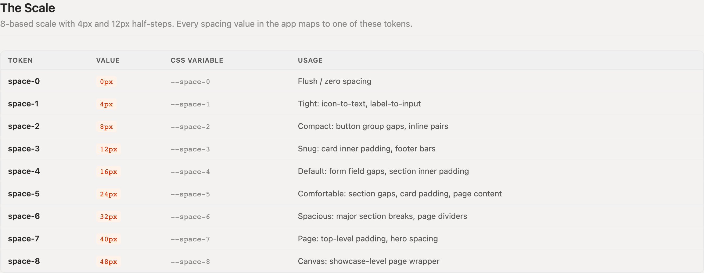
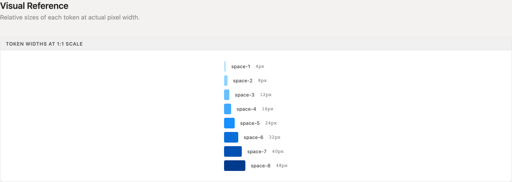
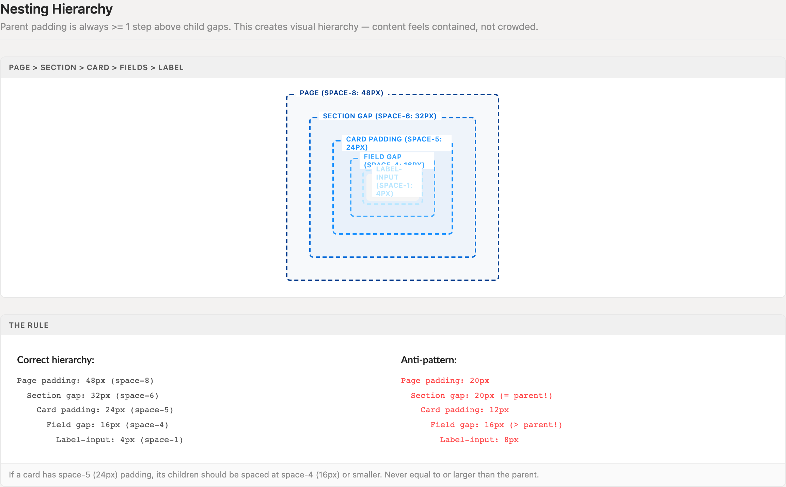
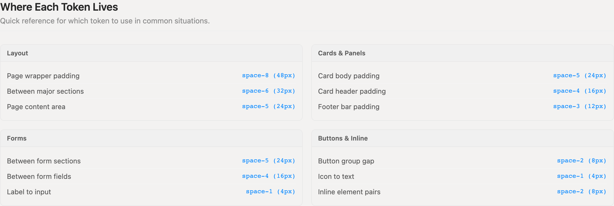
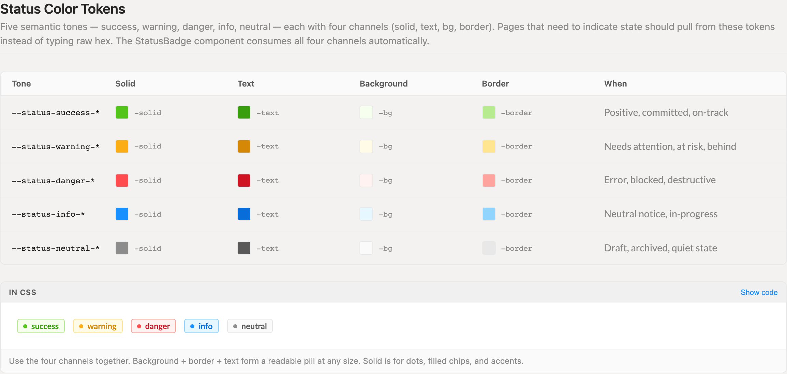
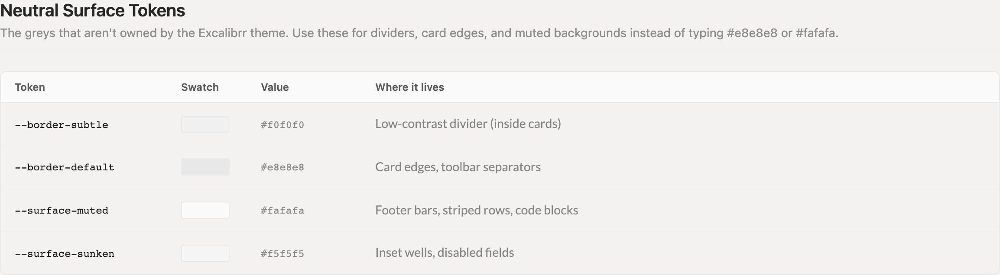
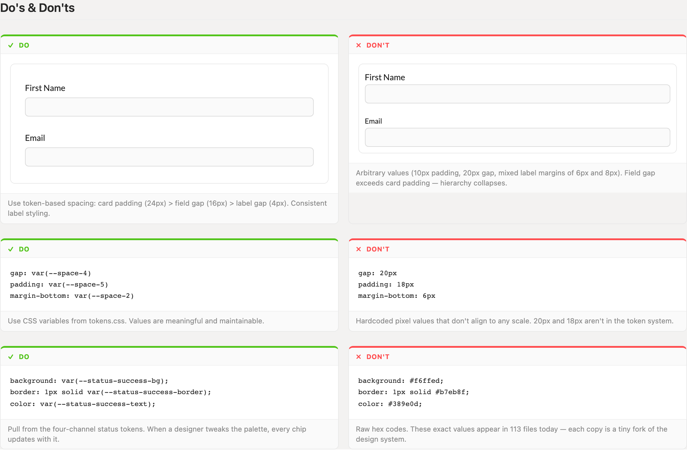

# Spacing & Tokens

The 8-based spacing scale, four-channel status colors, and layout-layer neutrals that replace the hundred-plus arbitrary values scattered across legacy screens. If you are typing a raw hex code or a stray pixel value, the right token already exists — use it.

> Part of the Excalibrr Design Patterns — layout rulebook. Index: `../CLAUDE.md`. Live page in the Excalibrr demo: `/DesignSystem/SpacingTokens` (demo runs at http://localhost:3000).

### The Laws of Spacing & Tokens

These rules govern every hi-fi screen. The tokens live in `demo/src/tokens.css` and are available globally — no import needed in CSS modules.

1. **Every spacing value maps to a token on the 8-based scale: 0, 4, 8, 12, 16, 24, 32, 40, 48.** — Values like 18px or 20px sit between steps — each one forks the rhythm and can never be retuned centrally.
2. **Parent padding is always at least one step above child gaps.** — Equal or inverted spacing collapses hierarchy; content reads as crowded siblings instead of contained children.
3. **Label-to-input is `space-1` (4px); field-to-field is `space-4` (16px).** — The 4x contrast binds a label to its input — loosen the pair and the form dissolves into floating text.
4. **Spacing on layout primitives goes through props — `<Horizontal gap={12}>`, `<Vertical flex='1'>` — never style objects.** — Style-object spacing bypasses the primitives' layout contract and fails review per the repo mistakes table.
5. **Status color comes from the four-channel tokens `--status-{tone}-{solid|text|bg|border}`, never raw hex.** — Raw hex copies are tiny forks of the palette — a designer retune reaches tokens, not the 113 files holding pasted values.
6. **Channels travel as a set: bg + border + text compose pills; solid drives dots and filled accents. Never mix channels across tones.** — Each tone's channels are contrast-tested together — a success bg under warning text has no guaranteed legibility.
7. **Neutral greys come from `--border-subtle`/`--border-default` and `--surface-muted`/`--surface-sunken`, not hex and not Excalibrr `--gray-*`.** — `--gray-*` belongs to the theme layer and inverts across themes (`--gray-100` is near-white). The layout neutrals are theme-stable.
8. **When no token fits, take the nearest step — never invent a value.** — A near-miss token keeps the page on the shared rhythm; a custom pixel value starts a second scale.

### The Scale



*Nine steps, 8-based with 4px and 12px half-steps. Every spacing value in the app resolves to one of these tokens.*

### Token Widths at 1:1



*Relative size of each step at actual pixel width. The jump from space-4 to space-5 (16px to 24px) is where 'inside a card' becomes 'between cards'.*

### Nesting Hierarchy



*Each container's padding sits at least one step above its children's gaps — 48px page padding stepping down to the 4px label-input gap. The right column shows the anti-pattern: gaps equal to or larger than their parent's padding.*

### Token-by-Situation Map



*Layout, cards, forms, and inline clusters each claim a fixed slice of the scale — no situation requires an off-scale value.*

### Status Color Tokens



*Five tones, four channels each. Background + border + text compose a readable pill at any size; solid drives dots and filled accents. StatusBadge consumes all four channels automatically.*

### Neutral Surfaces & Borders



*Layout-layer neutrals: two border weights and two muted surfaces replace hand-typed #e8e8e8 and #fafafa greys.*

### Token Discipline, Side by Side



*Scale-based spacing and channel tokens on the left; arbitrary pixels and forked hex on the right. The don't column's field gap exceeds its card padding — the container stops containing.*

### Spacing Scale

Defined in `tokens.css` as `--space-0` through `--space-8`. In CSS use `var(--space-N)`; in JSX `gap`/`padding` props use the raw number.

| Token | Value | Use for |
| --- | --- | --- |
| `--space-0` | `0px` | Flush / zero spacing |
| `--space-1` | `4px` | Tight: icon-to-text, label-to-input |
| `--space-2` | `8px` | Compact: button group gaps, inline pairs |
| `--space-3` | `12px` | Snug: card inner padding, footer bars |
| `--space-4` | `16px` | Default: form field gaps, section inner padding |
| `--space-5` | `24px` | Comfortable: section gaps, card padding, page content |
| `--space-6` | `32px` | Spacious: major section breaks, page dividers |
| `--space-7` | `40px` | Page: top-level padding, hero spacing |
| `--space-8` | `48px` | Canvas: showcase-level page wrapper |

### Neutral Surfaces & Borders

Theme-stable greys for layout chrome. Use these instead of hex and instead of Excalibrr's theme-owned `--gray-*` ramp.

| Token | Value | Use for |
| --- | --- | --- |
| `--border-subtle` | `#f0f0f0` | Low-contrast divider (inside cards) |
| `--border-default` | `#e8e8e8` | Card edges, toolbar separators |
| `--surface-muted` | `#fafafa` | Footer bars, striped rows, code blocks |
| `--surface-sunken` | `#f5f5f5` | Inset wells, disabled fields |

### Status Color Channels

Each tone exposes four channels: `-solid` (dots, filled chips, accents), `-text` (AA on its own `-bg`), `-bg` (tinted background), `-border` (pairs with `-bg`). Values listed solid · text · bg · border.

| Token | Value | Use for |
| --- | --- | --- |
| `--status-success-*` | `#52c41a · #389e0d · #f6ffed · #b7eb8f` | Positive, committed, on-track |
| `--status-warning-*` | `#faad14 · #d48806 · #fffbe6 · #ffe58f` | Needs attention, at risk, behind |
| `--status-danger-*` | `#ff4d4f · #cf1322 · #fff2f0 · #ffa39e` | Error, blocked, destructive |
| `--status-info-*` | `#1890ff · #096dd9 · #e6f7ff · #91d5ff` | Neutral notice, in-progress |
| `--status-neutral-*` | `#8c8c8c · #595959 · #fafafa · #e8e8e8` | Draft, archived, quiet state |

### Canonical CSS Module

```tsx
/* Panel.module.css — every value resolves to a token */
.panel {
  padding: var(--space-5);                  /* card padding: 24px */
  border: 1px solid var(--border-default);
  border-radius: 8px;
}

.panelFooter {
  padding: var(--space-3) var(--space-4);   /* 12px vertical, 16px horizontal */
  background: var(--surface-muted);
  border-top: 1px solid var(--border-subtle);
}

.publishedChip {
  background: var(--status-success-bg);
  border: 1px solid var(--status-success-border);
  color: var(--status-success-text);
}

.publishedDot {
  background: var(--status-success-solid);
}
```

Tokens are globally available in any CSS module — no import. The chip pulls bg + border + text as a set; the dot is the only place solid appears.

### Canonical JSX Spacing

```tsx
// Layout primitives take scale numbers as props — never style objects
<Vertical gap={16}>                               {/* field gap: space-4 */}
  <FormFields />
  <Horizontal gap={8} justifyContent='flex-end'>  {/* button group: space-2 */}
    <GraviButton buttonText='Cancel' />
    <GraviButton theme1 buttonText='Save' />
  </Horizontal>
</Vertical>
```

gap={16} not style={{ gap: '16px' }}; flex='1' not style={{ flex: 1 }}. GraviButton renders buttonText, not children, and takes theme booleans (theme1, success) — never type='primary'.

### Do's & Don'ts

- **Do:** Step the hierarchy down: card padding space-5 (24px), field gap space-4 (16px), label gap space-1 (4px).
  **Don't:** 10px card padding around a 20px field gap — the gap exceeds its container.
  **Why:** Containment is communicated by padding outweighing internal gaps; invert that and the card stops reading as a container.
- **Do:** gap: var(--space-4); padding: var(--space-5) — pull spacing from tokens.css.
  **Don't:** gap: 20px; padding: 18px — values that exist on no scale.
  **Why:** Token values retune in one file; stray pixels can't be found, let alone changed.
- **Do:** background: var(--status-success-bg) with its matching border and text channels.
  **Don't:** background: #f6ffed pasted from another component.
  **Why:** Identical pixels today, but the hex copy is invisible to every future palette change.

### Where Each Token Lives

Layout: page wrapper padding `space-8` (48px); between major sections `space-6` (32px); page content area `space-5` (24px).

Cards & panels: card body padding `space-5` (24px); card header padding `space-4` (16px); footer bar padding `space-3` (12px).

Forms: between form sections `space-5` (24px); between fields `space-4` (16px); label to input `space-1` (4px).

Buttons & inline: button group gap `space-2` (8px); icon to text `space-1` (4px); inline element pairs `space-2` (8px).

### Gotchas

- **--gray-100 is near-white, not near-black** — Excalibrr's theme greys run opposite to the usual convention and swap across themes. For layout chrome, use the theme-stable neutrals: --border-subtle, --border-default, --surface-muted, --surface-sunken.
- **--theme-color-2 changes hue across themes** — It swings between green and blue depending on the active theme. Pin brand accents to --theme-color-1.
- **Texto appearance='secondary' is blue, not gray** — For muted gray text use appearance='medium'. 'secondary' maps to the secondary brand color and will read as a link.
- **Size-tier tokens exist for overlays too** — tokens.css also defines --modal-sm/md/lg/xl (480-1080px), --drawer-right-narrow/standard/wide, and --drawer-bottom-compact/standard/full. Pull a tier instead of typing a width; the Modals and Drawers entries prescribe which tier fits which job.
