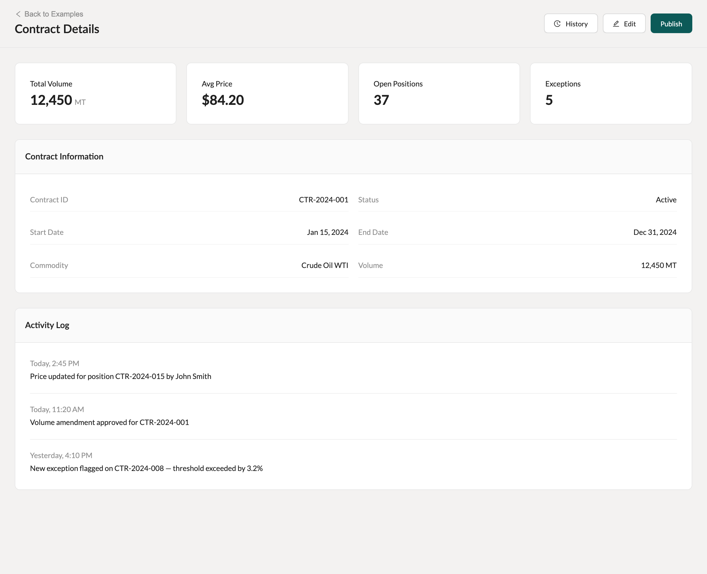
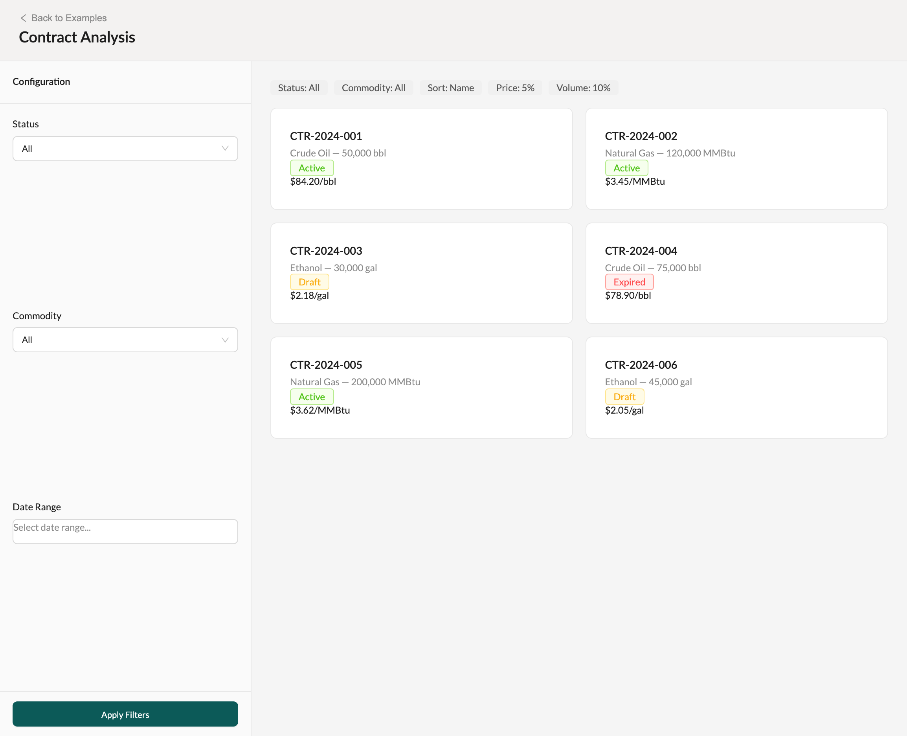
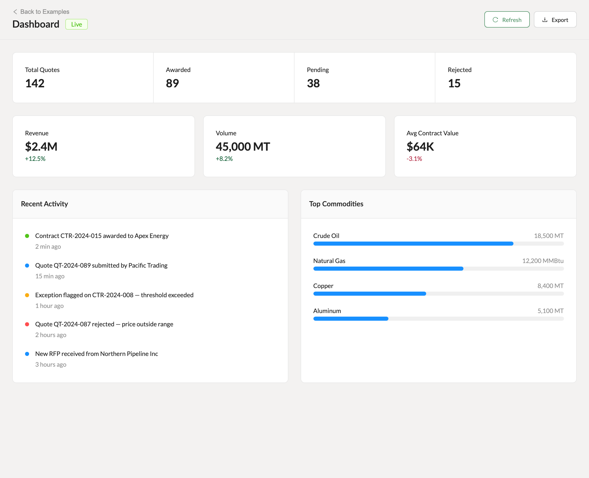
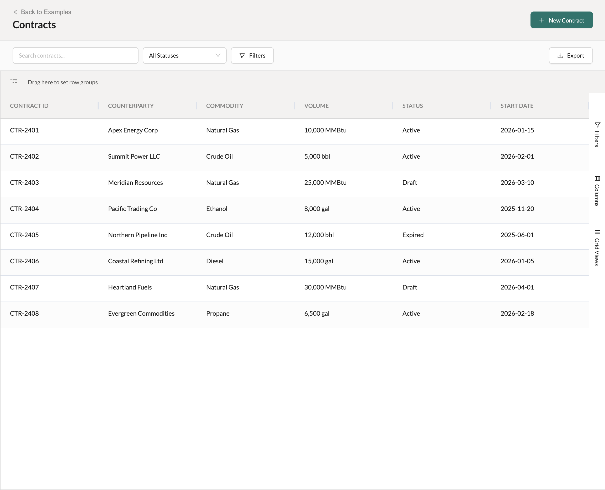
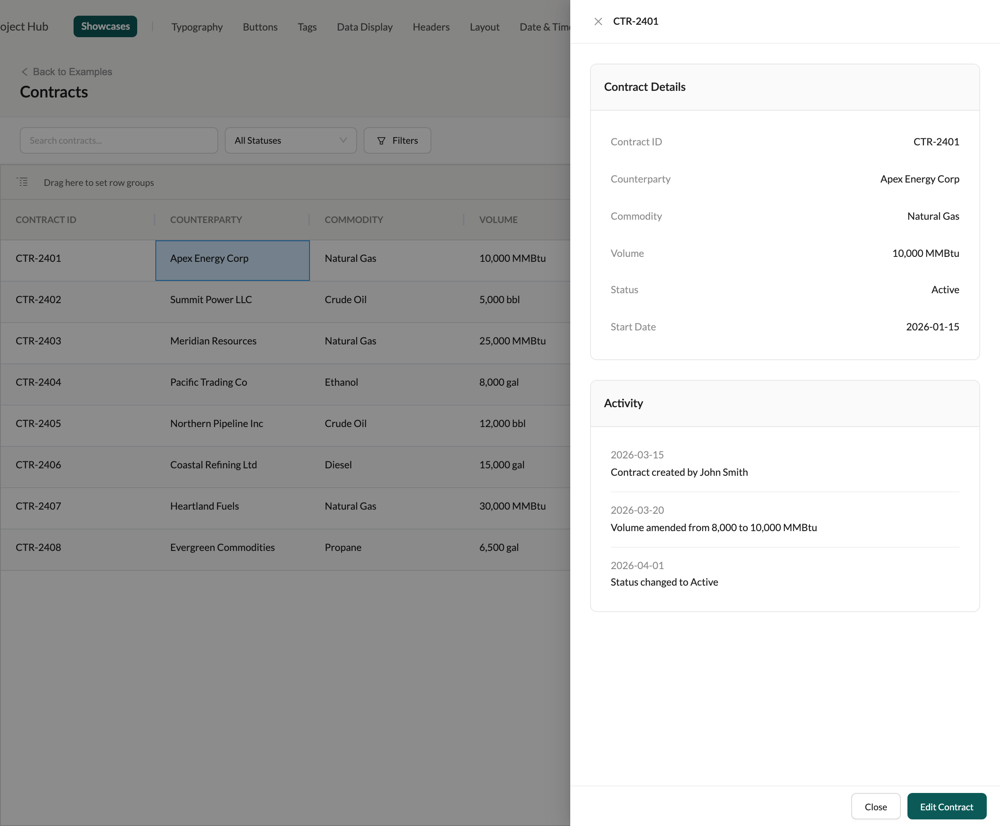

# Worked Examples

Four assembled pages — full-width, sidebar + main, dashboard, and grid — showing every prior entry composed into shippable screens. Start from the nearest one: the skeletons already carry the header anatomy, scroll ownership, and chrome budget, so a new page is a content swap, not a layout decision.

> Part of the Excalibrr Design Patterns — layout rulebook. Index: `../CLAUDE.md`. Live page in the Excalibrr demo: `/DesignSystem/ExFullWidth` (demo runs at http://localhost:3000).

### Laws of assembling a page

Every rule below is demonstrated live by the four example routes. A hi-fi screen that breaks one is diverging from the system, not interpreting it.

1. **Build every hi-fi page by copying the nearest worked example and swapping the content — never assemble a new shape from raw containers.** — The skeletons already encode scroll ownership, header anatomy, and the chrome budget. A from-scratch shape re-litigates all three and usually loses.
2. **Page header anatomy never varies: quiet back link above a `Texto` h3 weight-600 title on the left; actions on the right, secondary before primary, 8px gap.** — Users orient by the header. All four archetypes share it exactly, so every page reads as the same product at a glance.
3. **The page root is `<Vertical height="100%">`; chrome rows never flex, and exactly one pane scrolls via `flex="1"` + `scroll`.** — Competing scroll regions create double scrollbars and let headers drift off-screen. One explicit scroll owner keeps chrome pinned.
4. **Content areas take 24px padding and 24px gaps between top-level zones; sibling cards inside a zone sit at 16px.** — Two steps of the scale separate 'between zones' from 'within a zone'. A third value blurs the boundary and forks the rhythm.
5. **Cards are the only content container: flat stat cards (24px padding) and headed section cards (16px header strip on `--surface-muted`, 24px body). No bespoke boxes.** — Two known shapes mean every box on screen is instantly parseable. Each invented container costs the reader a re-orientation.
6. **Secondary surfaces are drawers, not pages: edit forms and row detail open in a 520px right drawer; export and history workflows open in a 50–70vh bottom drawer. Drawer footers right-align Cancel before the primary at 8px.** — Drawers preserve the page underneath — grid scroll position, applied filters, selection. Navigating away to edit one record throws all of that out.
7. **Grid pages get exactly one control bar between header and grid, and zero wrapper padding around `GraviGrid`.** — The grid is the page. Every extra chrome row steals data rows from the ~320px budget, and wrapper padding only shrinks the viewport the grid was given.
8. **Money is decimal dollars — $0.0100/gal, $84.20/bbl — never cents symbols.** — Gravitate pricing copy is standardized on decimal dollars; a stray ¢ breaks scanning across every pricing screen that follows the standard.

### Full-width page — the default archetype



*Contract detail page (/DesignSystem/ExFullWidth). Zones top to bottom: header (16px 24px, border-bottom) with back link, h3 title, and History / Edit / Publish actions; then the flex: 1 scroll pane at 24px padding stacking a 4-up stat-card row (16px gaps) and two section cards — a two-column field grid and an activity log — at 24px zone gaps.*

### Sidebar + main — config rail driving a results pane



*Contract analysis (/DesignSystem/ExSidebarMain). Header spans the full width; below it a 320px fixed config rail — titled header strip, scrollable filter sections at 16px padding split by 1px dividers, pinned footer with a full-width Apply Filters primary — beside a flex: 1 results pane on --surface-sunken holding a filter-tag echo bar and a two-column card grid at 16px gaps.*

### Dashboard — read-heavy full-width



*Dashboard (/DesignSystem/ExDashboard). One counter card split into four equal columns by 1px dividers, a stat row whose cards carry green/red delta lines and click through to detail drawers, then two section cards side by side at a 24px gap: an activity feed keyed by status-solid dots and a labeled bar-chart list.*

### Grid page — the grid is the page



*Contracts (/DesignSystem/ExGridPage). Header with the New Contract primary; one control bar (12px 24px on --surface-muted, border-bottom) holding search, a status select, and a Filters toggle on the left with Export on the right; then GraviGrid at flex: 1 with zero wrapper padding.*

### Grid row drill-in — 520px right detail drawer



*Row click on the grid page opens the standard detail drawer over the page: title is the row id, body stacks section cards at 24px gaps, footer right-aligns Close before the Edit Contract primary at an 8px gap. The grid — scroll, filters, selection — waits untouched underneath.*

### Zone spacing the archetypes prescribe

The complete spacing vocabulary used across all four examples. Anything outside this table needs a reason in review.

| Token | Value | Use for |
| --- | --- | --- |
| `Content padding` | `24px (space-5)` | Scroll pane on full-width, dashboard, and the sidebar + main results pane; grid pages take none |
| `Zone gap` | `24px (space-5)` | Between top-level zones in a content area — stat row to section card, card to card down the page |
| `Inter-card gap` | `16px (space-4)` | Between sibling cards inside one zone — stat rows, the results card grid |
| `Page header padding` | `16px 24px` | Header row on all four archetypes, with a 1px --border-default bottom edge |
| `Control bar padding` | `12px 24px` | Grid-page filter/action bar on --surface-muted; 24px horizontal keeps its contents aligned with the header |
| `Config rail width` | `320px fixed` | Sidebar + main left rail; pin with `flex="0 0 320px"` on a Vertical or width + min-width 320px in CSS so it never grows or collapses |
| `Rail section padding` | `16px (space-4)` | Each rail section, separated by 1px dividers; rail footer takes 12px 16px |
| `Right drawer width` | `520px` | Edit forms and row-detail drill-ins on any archetype |
| `Bottom drawer height` | `50–70vh` | Export, bulk, and history workflows — wide content that would cramp a right drawer |

### Full-width skeleton

```tsx
<Vertical height="100%">
  <header className={s.header}>                        {/* 16px 24px, border-bottom */}
    <Horizontal justifyContent="space-between" alignItems="center">
      <Vertical gap={4}>
        <BackLink />                                     {/* quiet 12px link above the title */}
        <Texto category="h3" weight="600">Contract Details</Texto>
      </Vertical>
      <Horizontal gap={8}>
        <GraviButton buttonText="History" icon={<HistoryOutlined />} />
        <GraviButton buttonText="Edit" icon={<EditOutlined />} />
        <GraviButton buttonText="Publish" theme1 />      {/* primary last */}
      </Horizontal>
    </Horizontal>
  </header>

  <Vertical flex="1" scroll gap={24} style={{ padding: 24 }}>
    <Horizontal gap={16}>{/* stat cards — flex: 1 each, one line */}</Horizontal>
    <SectionCard title="Contract Information">{/* two-column field grid, 16px gap */}</SectionCard>
    <SectionCard title="Activity Log">{/* entries at 16px, --border-subtle dividers */}</SectionCard>
  </Vertical>
</Vertical>
```

Geometry goes through props — `flex="1"`, `height="100%"`, `gap={24}` — never style objects; `style` appears only for `padding`, which has no prop equivalent. Edit opens a 520px right `<Drawer open destroyOnHidden>`, never a separate page.

### Sidebar + main skeleton

```tsx
<Vertical height="100%">
  <PageHeader />                                         {/* spans the full width */}
  <Horizontal flex="1">
    <Vertical flex="0 0 320px" className={s.rail}>      {/* fixed 320px — Vertical defaults to flex: 1 1 auto, so pin it */}
      <RailHeader />                                     {/* 16px padding, border-bottom */}
      <Vertical flex="1" scroll>                         {/* sections: 16px padding, 1px dividers */}
        <FilterSection />
        <ToggleSection />
        <ThresholdSection />
      </Vertical>
      <div className={s.railFooter}>                     {/* pinned: 12px 16px, border-top */}
        <GraviButton buttonText="Apply Filters" theme1 /> {/* full width */}
      </div>
    </Vertical>
    <Vertical flex="1" scroll style={{ padding: 24 }}>   {/* results pane, --surface-sunken */}
      <FilterTagBar />                                   {/* echoes applied state, 8px gaps */}
      <CardGrid />                                       {/* two columns, 16px gap */}
    </Vertical>
  </Horizontal>
</Vertical>
```

The rail is a three-row column: fixed header, the one scrollable middle, pinned footer. Horizontal hugs content by default — the split row collapses unless it gets `flex="1"` explicitly.

### Dashboard skeleton

```tsx
<Vertical height="100%">
  <PageHeader />                                         {/* title + Live badge; Refresh, Export */}
  <Vertical flex="1" scroll gap={24} style={{ padding: 24 }}>
    <CounterCard />                                      {/* one card, four equal columns, 1px dividers */}
    <Horizontal gap={16}>
      {/* stat cards with delta lines — clickable, each opens a 520px detail drawer */}
    </Horizontal>
    <Horizontal gap={24}>
      <SectionCard title="Recent Activity" />            {/* dot feed — --status-*-solid dots */}
      <SectionCard title="Top Commodities" />            {/* labeled bar rows */}
    </Horizontal>
  </Vertical>
</Vertical>
```

The dashboard is the full-width archetype with read-heavy zones, not a separate layout. Deltas use `Texto` appearance success/error; feed dots take the status `-solid` channel, never raw hex.

### Grid page skeleton

```tsx
const columnDefs = useMemo(() => COLUMN_DEFS, [])      // always memoized
const rowData = useMemo(() => ROW_DATA, [])

<Vertical height="100%">
  <PageHeader />                                         {/* New Contract (theme1) on the right */}
  <Horizontal justifyContent="space-between" alignItems="center" className={s.controlBar}>
    <Horizontal gap={8} alignItems="center">
      <Input placeholder="Search contracts..." style={{ width: 240 }} />
      <Select options={statusOptions} style={{ width: 160 }} />
      <GraviButton buttonText="Filters" icon={<FilterOutlined />} />
    </Horizontal>
    <GraviButton buttonText="Export" icon={<DownloadOutlined />} />
  </Horizontal>
  <Vertical flex="1">                                    {/* the grid owns the rest — no padding */}
    <GraviGrid
      storageKey="contracts-grid"
      rowData={rowData}
      columnDefs={columnDefs}
      agPropOverrides={{ onRowClicked: (e) => setDetailRow(e.data) }}
    />
  </Vertical>
</Vertical>

<Drawer
  open={!!detailRow}
  onClose={() => setDetailRow(null)}
  title={detailRow?.id}
  width={520}
  destroyOnHidden
  footer={/* Close, then primary — right-aligned, 8px gap */}
>
  {/* section cards at 24px gaps */}
</Drawer>
```

`GraviGrid` always receives `agPropOverrides`, even when empty. Unmemoized `columnDefs`/`rowData` change identity every render — GraviGrid re-runs `setColumnDefs` and re-applies the stored grid config each time, churning column state. An expanding inline filter panel is the one extra chrome row allowed — it must be dismissible and count against the 320px budget while open.

### Do's & Don'ts

- **Do:** Copy the nearest worked example and swap the data, labels, and columns.
  **Don't:** Compose a new page from raw divs because the content feels unique.
  **Why:** Content is what varies; the shell — scroll owner, header, chrome budget — is already solved and verified on the four routes.
- **Do:** Open edit forms and row detail in a 520px right drawer over the page.
  **Don't:** Route to a separate edit page for one record.
  **Why:** The drawer keeps grid scroll, filters, and selection alive underneath; a navigation throws away the user's working state.
- **Do:** Keep stat rows to one line of equal flex: 1 cards — three or four.
  **Don't:** Wrap stat cards to a second row or mix card widths in one row.
  **Why:** A single equal-width line reads as one scannable summary; wrapping turns the page header zone into a content zone and eats the viewport.
- **Do:** Echo applied filters as a tag bar at the top of the results pane.
  **Don't:** Leave filter state visible only inside the rail.
  **Why:** Results are interpreted where they render — without the echo, a filtered list is indistinguishable from a short one.

### Working from an example

Match the page you are building to its archetype before writing code. Record detail, forms, and overview pages start from Full-Width (`/DesignSystem/ExFullWidth`). Pages where a persistent configuration rail drives a results pane — analysis, profile management, settings — start from Sidebar + Main (`/DesignSystem/ExSidebarMain`). Read-heavy KPI overviews start from Dashboard (`/DesignSystem/ExDashboard`). Any manage-X table, quote book, or pricing screen starts from Grid Page (`/DesignSystem/ExGridPage`).

Each example also carries its secondary surfaces: the full-width page has a right edit drawer and a bottom history drawer, the dashboard has stat-card detail drawers and a bottom export drawer, and the grid page has a row-click detail drawer. Take the drawer with the page — the pairing is part of the recipe, and the size tiers (520px right, 50–70vh bottom) come from `tokens.css`, not ad-hoc widths.

The examples are live routes in the demo, not mockups. When a spacing or anatomy question comes up mid-build, open the route and measure the running page rather than guessing from memory.

### Gotchas

- **Vertical stretches its children inside fixed-height drawers** — Vertical children default to height: '100%', so a stack of nested `<Vertical gap={4}>` label-input pairs inside a Drawer body distributes the drawer's full height across the pairs — labels drift hundreds of pixels from their inputs. Wrap each pair in a plain div or a non-stretching row component inside any fixed-height surface; never lean on Vertical defaults there.
- **GraviGrid silently replaces some agPropOverrides handlers** — GraviGrid wires its own `onGridReady`, `onColumnRowGroupChanged`, and other lifecycle handlers, clobbering yours even when passed via `agPropOverrides`. Row-level handlers like `onRowClicked` survive. For lifecycle events, hook `onFirstDataRendered` and register listeners with `api.addEventListener`.
- **GraviButton labels go through buttonText, not children** — Children support is version-dependent: the Excalibrr library source renders only `buttonText`, so `<GraviButton>Save</GraviButton>` ships an empty button there; newer demo builds fall back to children. Self-close and pass `buttonText="Save"` everywhere; primaries take the `theme1` boolean, never `type="primary"`.
- **The chrome budget counts everything between viewport and grid** — Header (~56px) + control bar (~48px) leaves most of the 320px budget unspent — by design. Tab strips, summary card rows, and persistent footers added 'just for this page' are how grid pages end up scrolling the shell instead of the data. Audit the running total before adding any chrome row.
