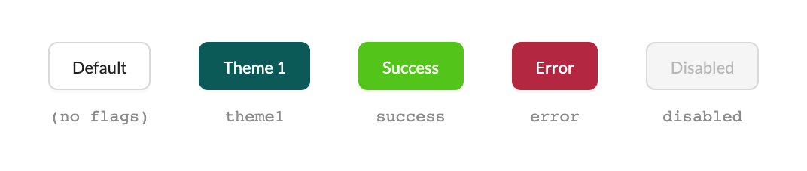
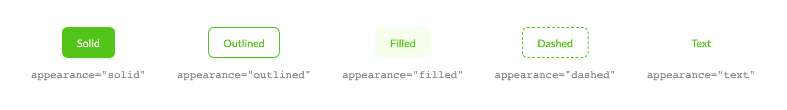
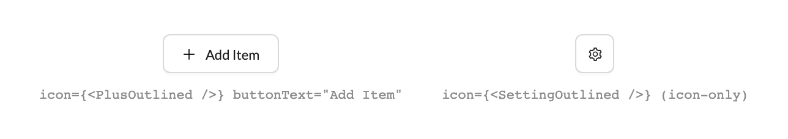
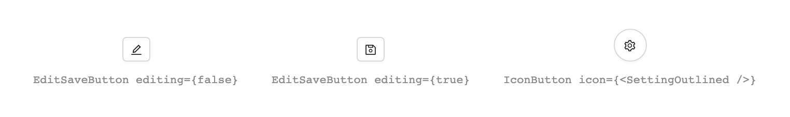

# Buttons

Buttons carry the action hierarchy of every Gravitate surface. GraviButton is the standard — boolean color flags plus an antd v5 appearance axis — with IconButton and EditSaveButton covering the icon-only and inline-edit niches.

> Part of the Excalibrr Design System — component reference. Index: `../CLAUDE.md`. Live page in the Excalibrr demo: `/DesignSystem/Buttons` (demo runs at http://localhost:3000).

`GraviButton` is the only button most surfaces need. It wraps antd's Button with Gravitate's color flags (`theme1`, `theme2`, `success`, `error`) and an `appearance` axis that maps to antd v5 variants — reach for it anywhere you'd reach for antd Button and let the flags carry hierarchy.

The supporting cast is narrow: `IconButton` is a circular, tooltip-wrapped icon button for toolbars and row actions; `EditSaveButton` is a two-state pencil/save toggle for inline-editable sections inside antd Forms. `BigButton` is legacy — its styles no longer ship in the package — keep it out of new prototypes.

### GraviButton color flags



*Resting states: no flags (quiet outlined default), theme1 (solid brand primary), success (solid green), error (solid red), and the disabled treatment.*

### GraviButton props

GraviButton extends antd ButtonProps — everything not listed here passes straight through (`loading`, `size`, `block`, `href`).

| Prop | Type | Default | Notes |
| --- | --- | --- | --- |
| `buttonText` | `ReactNode` | — | The label. GraviButton renders buttonText, not React children — always self-close the tag. |
| `theme1` | `boolean` | `false` | The primary CTA. Solid brand-primary button with token-driven hover and active states. One per surface. |
| `theme2` | `boolean` | `false` | antd primary color, solid. Secondary emphasis when theme1 is already taken. |
| `success` | `boolean` | `false` | Solid green. Affirmative commits — Apply, Confirm. |
| `error` | `boolean` | `false` | Solid red. Destructive actions — Delete, Remove. |
| `appearance` | `'solid' \| 'outlined' \| 'filled' \| 'dashed' \| 'text' \| 'link'` | `'solid' when flagged, 'outlined' bare` | Maps to antd's variant. Always write 'outlined' — the legacy 'outline' silently remaps to the tinted 'filled' variant. |
| `icon` | `ReactNode` | — | An antd icon element, e.g. icon={<PlusOutlined />}. Never a string — strings render as literal text. Omit buttonText for an icon-only button. |
| `color` | `antd preset color` | — | Direct antd color override; beats the boolean flags (except theme1). Reach for flags first. |
| `disabled` | `boolean` | `false` | Standard antd disabled treatment. |
| `onClick` | `(e: MouseEvent) => void` | — | Wrapped with a Google Analytics event before your handler runs. Submit forms here — htmlType='submit' passes through but is banned by house rule (EditSaveButton is the lone exception). |

### Color flags

One boolean flag per button. Flags are mutually exclusive in spirit — when several are set, error wins over success, which wins over theme2.

| Variant | When to use | Code |
| --- | --- | --- |
| `default` | Neutral and secondary actions — Cancel, Back, Reset. | `<GraviButton buttonText='Cancel' onClick={onClose} />` |
| `theme1` | The single primary action on a surface. | `<GraviButton buttonText='Publish' theme1 onClick={onPublish} />` |
| `theme2` | antd-primary emphasis when theme1 is already spent on this surface. | `<GraviButton buttonText='New View' theme2 onClick={onNew} />` |
| `success` | Affirmative commits that close a workflow — Apply, Confirm. | `<GraviButton buttonText='Apply Filters' success onClick={onApply} />` |
| `error` | Destructive commitments — Delete, Remove, Discard. | `<GraviButton buttonText='Delete Tier' error onClick={confirmDelete} />` |

### GraviButton appearance axis



*The appearance values on a success-flagged button: solid (default when flagged), outlined, filled (tinted), dashed, and text. Each maps directly to an antd v5 variant.*

### Icons in GraviButton



*icon takes an antd icon element: paired with buttonText (left), or icon-only when buttonText is omitted (right — antd applies square icon-only sizing automatically).*

### Canonical GraviButton usage

```tsx
import { GraviButton } from '@gravitate-js/excalibrr'
import { PlusOutlined } from '@ant-design/icons'

// Primary action — one per surface
<GraviButton buttonText='Publish Prices' theme1 onClick={handlePublish} />

// Neutral secondary
<GraviButton buttonText='Cancel' onClick={onClose} />

// Destructive, toned down with an outline
<GraviButton buttonText='Delete Tier' error appearance='outlined' onClick={confirmDelete} />

// Icon + label
<GraviButton buttonText='Add Quote Row' icon={<PlusOutlined />} onClick={addRow} />

// Submit an antd form — never htmlType='submit'
<GraviButton buttonText='Save' theme1 onClick={() => form.submit()} />
```

Every example self-closes: the label travels through buttonText, never children.

### Utility buttons — EditSaveButton and IconButton



*EditSaveButton's two states — pencil (editing={false}) and save (editing={true}) — beside IconButton's circular, tooltip-wrapped icon button.*

### EditSaveButton props

A small two-state toggle for inline-editable sections. It must live inside an antd <Form> — the save state submits the form.

| Prop | Type | Default | Notes |
| --- | --- | --- | --- |
| `editing` | `boolean` | `false` | false renders the pencil button that fires onEdit. true renders the save button, which submits the enclosing antd Form via an internal htmlType submit. |
| `onEdit` | `() => void` | — | Fires from the pencil state only. There is no onSave — handle persistence in the Form's onFinish. |
| `extraClasses` | `string` | `''` | Concatenated with no separator — include a leading space (' my-class') or it fuses with the base class. |

### IconButton props

A circular antd button inside a Tooltip. The wrapper div bakes in right padding (pr-3) — account for it when spacing toolbar neighbors.

| Prop | Type | Default | Notes |
| --- | --- | --- | --- |
| `hoverTitle` | `string` | — | Tooltip text — bottom placement, 0.5 s enter delay. Required in practice: an unlabeled icon button is a usability hole. |
| `icon` | `ReactNode` | `<PaperClipOutlined />` | An antd icon element. |
| `onClick` | `(...args) => void` | — | Click handler. |

### Button hierarchy

1. **One theme1 button per surface.** — It marks the single primary action — two primaries cancel each other out.
2. **Default (no flags) is the workhorse for everything secondary.** — The quiet outlined treatment keeps dense control bars readable.
3. **Reserve error for destructive commitments and success for affirmative commits — never decoratively.** — Color is the warning; dilute it and users stop reading it.
4. **Demote buttons inside dense chrome with appearance='text' or 'filled' rather than shrinking labels.** — Variant changes preserve hit targets and legibility; tiny type does not.
5. **Icon-only buttons always get a tooltip — use IconButton or pass hover text.** — An unlabeled glyph forces users to click to find out what it does.

### Do's & Don'ts

- **Do:** <GraviButton buttonText='Save' theme1 />
  **Don't:** <GraviButton theme1>Save</GraviButton>
  **Why:** GraviButton renders the buttonText prop. Children are not the contract and render nothing in older releases.
- **Do:** Boolean flags: theme1, success, error
  **Don't:** type='primary' or theme='success'
  **Why:** theme is not a prop, and GraviButton always sets antd's color/variant pair, which overrides type — both silently do nothing.
- **Do:** appearance='outlined'
  **Don't:** appearance='outline'
  **Why:** 'outline' is a legacy alias that remaps to the tinted 'filled' variant — you get a different button than you asked for.
- **Do:** onClick={() => form.submit()}
  **Don't:** htmlType='submit'
  **Why:** Explicit submits keep form wiring visible and survive the analytics-wrapped click path. EditSaveButton is the lone sanctioned exception.
- **Do:** icon={<PlusOutlined />}
  **Don't:** icon='add'
  **Why:** icon is an antd ReactNode slot — a string renders as literal text inside the button.

### Gotchas

- **buttonText, not children** — GraviButton renders the buttonText prop and self-closes. Current releases fall back to children, but earlier ones drop them silently — and every library-internal caller uses buttonText. Treat children as off-limits.
- **warning, theme3, and theme4 are inert** — ThemeVariants declares them, but the current package never maps them to a style — they render identical to a bare outlined default. Use theme1, theme2, success, or error.
- **Every click reports to Google Analytics** — onClick is wrapped with a ReactGA event built from the first route segment and the button's text content. Button labels become analytics labels — keep them clean and free of sensitive data.
- **EditSaveButton needs an antd Form around it** — The save state is an internal htmlType submit with no onSave callback. Outside a Form, saving does nothing — wire persistence in the Form's onFinish.
- **BigButton ships unstyled in 5.x** — The .big-button CSS was dropped from the package stylesheet, so it renders as a bare div. Legacy — build promotional tiles with CheckCard or a styled card instead.
- **IconButton bakes in spacing and delay** — The wrapper div carries pr-3 right padding and the tooltip waits 0.5 s at bottom placement. Don't add extra margin to its right; don't expect instant hover labels.
