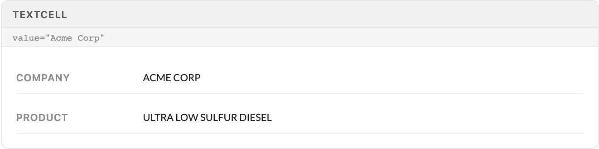
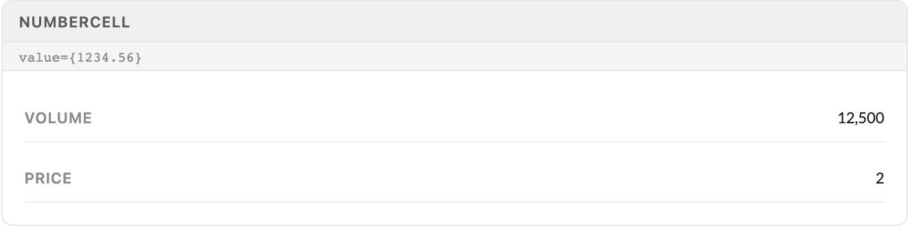
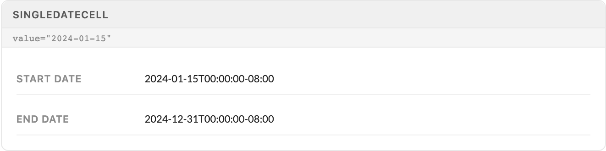
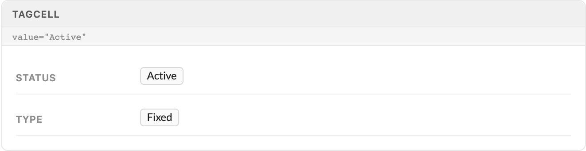

# Cell Renderers & Editors

GraviGrid ships seven default cell renderers and five pre-registered cell editors so column definitions stay declarative — tags, deltas, money, dates, and in-cell editing without bespoke components. Reach for a renderer only when a cell needs real markup; plain formatting belongs in valueFormatter.

> Part of the Excalibrr Design System — component reference. Index: `../CLAUDE.md`. Live page in the Excalibrr demo: `/DesignSystem/CellRenderers` (demo runs at http://localhost:3000).

These are the building blocks for GraviGrid columns: renderers (`TextCell`, `NumberCell`, `SingleDateCell`, `TagCell`, `DifferenceCell`, `NetValueCell`, `PriceDifferenceCell`) draw cell content, editors (`GraviSelectEditor`, `GraviDatePicker`, `GraviNumberEditor`, `GraviSwitchEditor`, `GraviCustValSelectEditor`) handle in-cell input, and validators (`validateNotEmptyString`, `validateInt`, `validateFloat`) guard `valueSetter`.

The decision rule: a `cellRenderer` mounts a React component in every cell — that is a real scroll-performance cost at grid scale. Use a renderer only when the cell needs markup (a tag, an icon, conditional color). Simple text, number, and date formatting goes in `valueFormatter`, which returns a string and mounts nothing.

Renderers import from `@gravitate-js/excalibrr` and are passed as component references in `cellRenderer`. Editors are already registered inside GraviGrid under string keys — reference them by name in `cellEditor`, no import needed.

### TextCell



*TextCell wrapping string values in Texto — note both rows render uppercase regardless of input casing; the transform is always on.*

### NumberCell



*NumberCell right-aligned with comma grouping. Default toFixed={0} rounds 2.4567 to 2 — the Price row shows why you always pass toFixed on prices.*

### SingleDateCell



*SingleDateCell with no dateFormat prop — moment falls back to full ISO output (2024-01-15T00:00:00-08:00). Always pass dateFormat.*

### TagCell



*TagCell rendering neutral BBDTags for Status and Type. tagTheme props (success, error) recolor the tag; tipTitle adds a hover Tooltip.*

### The seven default renderers

All export from @gravitate-js/excalibrr and read AG Grid cell params (value, data).

| Variant | When to use | Code |
| --- | --- | --- |
| `TextCell` | Plain string display with Texto typography control (category, appearance, weight pass through). Returns null on empty value. Always uppercases — see gotchas. | `cellRenderer: TextCell` |
| `NumberCell` | Right-aligned numbers with comma grouping via addCommasToNumber. Pass toFixed for decimals, showNA to print N/A on empty. | `cellRenderer: NumberCell, cellRendererParams: { toFixed: 4 }` |
| `SingleDateCell` | Single date formatted through moment. dateFormat is required in practice — omit it and you get raw ISO. | `cellRenderer: SingleDateCell, cellRendererParams: { dateFormat: 'MM/DD/YYYY' }` |
| `TagCell` | Status-style values as a BBDTag with optional icon and Tooltip. tagTheme spreads onto BBDTag, so { success: true } renders the green theme. | `cellRenderer: TagCell, cellRendererParams: { tagTheme: { success: true }, tipTitle: 'Status' }` |
| `DifferenceCell` | A value plus a signed delta read from data[comparisonKey], rendered with caret up/down and success/error color. showCheck swaps a zero delta for a green check; upIsError forces the delta to error red regardless of sign; isPercent formats the main value as a percentage. | `cellRenderer: DifferenceCell, cellRendererParams: { comparisonKey: 'volume_delta', showCheck: true }` |
| `NetValueCell` | Dollar amounts colored by sign — green positive, red negative, N/A when zero or empty. Renders a leading $ with addCommasToNumber(value, precision). | `cellRenderer: NetValueCell, cellRendererParams: { precision: 2 }` |
| `PriceDifferenceCell` | Competitive price comparison: BBDTag is green when data.is_best, red otherwise, with the gap shown as (data.price_difference to 4 decimals) or (Lowest). | `cellRenderer: PriceDifferenceCell, cellRendererParams: { precision: 4 }` |

### Renderer props that matter

Verified against DefaultCellRenderers.tsx. TextCell, NumberCell, SingleDateCell, NetValueCell, and PriceDifferenceCell spread remaining props onto their underlying Texto or BBDTag; TagCell and DifferenceCell accept only their named props.

| Prop | Type | Default | Notes |
| --- | --- | --- | --- |
| `NumberCell.toFixed` | `number` | `0` | Decimal places via toLocaleString (min and max fraction digits) — values round, they do not truncate. Pass 4 for per-gallon prices, 2 for dollar totals. |
| `NumberCell.showNA` | `boolean` | `false` | Prints N/A when the value is empty. Beware zero: the renderer appends rather than replaces, so showNA on a 0 value renders 0N/A. Without it, empty cells render blank. |
| `SingleDateCell.dateFormat` | `string` | — | moment format string. Required in practice — undefined yields full ISO output. |
| `TagCell.tagTheme` | `object` | — | Spread onto BBDTag — boolean theme props like { success: true } or { error: true }. Omit for the neutral tag. |
| `TagCell.tipTitle` | `string` | — | Wraps the tag in an antd Tooltip. icon + iconClass render a leading icon inside the tag. |
| `DifferenceCell.comparisonKey` | `string` | — | Field name on row data holding the delta — the cell reads data[comparisonKey], not value, for the caret and color. |
| `DifferenceCell.upIsError` | `boolean` | `false` | Forces the delta to error red regardless of sign — the source returns 'error' before checking direction, so down-deltas go red too. Use when an increase is bad (cost, exceptions). |
| `NetValueCell.precision` | `number` | `0` | Decimal places on the $-prefixed amount. Zero and empty both render N/A. |
| `PriceDifferenceCell.precision` | `number` | `0` | Decimal places on the price. Row data must supply is_best (drives green/red); price_difference renders to a fixed 4 decimals, and a missing or zero price_difference renders (Lowest). |

### Pre-registered editors

GraviGrid registers these under string keys in its components map — set cellEditor to the string, no import. All commit through AG Grid's getValue contract; every editor opens as a popup except GraviDatePicker, which declares no isPopup and edits inline.

| Variant | When to use | Code |
| --- | --- | --- |
| `GraviSelectEditor` | Pick from a fixed list. Popup antd Select, opens immediately, supports multiple/tags modes. Not for booleans — see gotchas. | `cellEditor: 'GraviSelectEditor', cellEditorParams: { options: ['Rack', 'Contract'], mode: 'multiple' }` |
| `GraviDatePicker` | Single date edits. Commits the moment a date is picked (calls stopEditing) and returns an ISO string — your valueFormatter or renderer must handle ISO input. | `cellEditor: 'GraviDatePicker'` |
| `GraviNumberEditor` | Numeric edits with rails. antd InputNumber popup honoring min, max, precision, step. | `cellEditor: 'GraviNumberEditor', cellEditorParams: { min: 0, precision: 4, step: 0.0025 }` |
| `GraviSwitchEditor` | Boolean fields. Centered antd Switch popup seeded from the current value. | `cellEditor: 'GraviSwitchEditor'` |
| `GraviCustValSelectEditor` | Multi-select where users can append new values (built for counterparty email lists — validates new entries as emails before Add enables). | `cellEditor: 'GraviCustValSelectEditor'` |

### Validators (valueSetter guards)

Each writes params.data[field] itself on success and fires a NotificationMessage on failure — wire them directly as the column's valueSetter.

| Prop | Type | Default | Notes |
| --- | --- | --- | --- |
| `validateNotEmptyString` | `(params) => boolean` | — | Rejects empty string with a 'Field required' notification; any other value commits. |
| `validateInt` | `(params, min, max) => boolean` | — | parseInt with range checks — out-of-range and non-numeric input each get their own notification and the edit is rejected. |
| `validateFloat` | `(params, min, max) => boolean` | — | parseFloat with the same range/NaN guards. Use for prices and rates. |

### Canonical column definitions

```tsx
import { useMemo } from 'react'
import {
  GraviGrid,
  TagCell,
  validateInt,
  addCommasToNumber,
} from '@gravitate-js/excalibrr'

const columnDefs = useMemo(
  () => [
    // Simple formatting — valueFormatter, never a renderer
    {
      field: 'price',
      headerName: 'Price ($/gal)',
      valueFormatter: ({ value }) => `$${addCommasToNumber(value, 4)}`,
    },
    // Rich markup — default renderer
    {
      field: 'status',
      cellRenderer: TagCell,
      cellRendererParams: { tagTheme: { success: true }, tipTitle: 'Contract status' },
    },
    // Editing — pre-registered editor by string key + validator valueSetter
    {
      field: 'volume',
      editable: true,
      isBulkEditable: true,
      cellEditor: 'GraviNumberEditor',
      cellEditorParams: { min: 0, precision: 0, step: 500 },
      valueSetter: (params) => validateInt(params, 0, 100000),
    },
  ],
  []
)

return <GraviGrid columnDefs={columnDefs} rowData={rows} agPropOverrides={{}} />
```

columnDefs must be memoized — an unmemoized array recreates every render and resets grid state. Editors are referenced by registered string name; renderers and validators import from @gravitate-js/excalibrr.

### Do's & Don'ts

- **Do:** Format plain text, numbers, and dates with valueFormatter
  **Don't:** Mount a cellRenderer for simple formatting
  **Why:** Every cellRenderer is a React mount per cell — at thousands of cells that is real scroll jank for zero visual gain.
- **Do:** Write money as decimal dollars — $0.0100/gal, precision 4 for per-gallon
  **Don't:** Use cents symbols or cent units anywhere in grid copy
  **Why:** Gravitate's standard is decimal dollars; NetValueCell and PriceDifferenceCell already prefix $.
- **Do:** Pair every editable column with a validator valueSetter and isBulkEditable: true
  **Don't:** Ship editable: true alone
  **Why:** Without a valueSetter edits can silently fail, and bulk edit skips columns missing isBulkEditable.
- **Do:** Pass toFixed/precision explicitly on every numeric renderer
  **Don't:** Trust the defaults
  **Why:** All numeric renderers default to 0 decimal places — a $2.4567 rack price renders as $2.

### Gotchas

- **TextCell always uppercases** — The source ternary resolves to 'uppercase' in both branches, so the toUpperCase prop is dead — every TextCell renders uppercase. For mixed-case display use valueFormatter or a plain Texto renderer.
- **SingleDateCell without dateFormat dumps raw ISO** — moment(value).format(undefined) returns the full ISO string (2024-01-15T00:00:00-08:00). Always pass dateFormat, e.g. 'MM/DD/YYYY'.
- **GraviSelectEditor cannot commit yes/no options** — Its change handler maps 'yes'/'no' strings to booleans but skips the state update in those branches, so the picked value never persists. Booleans belong in GraviSwitchEditor.
- **GraviDatePicker commits instantly and returns ISO** — Picking a date calls api.stopEditing() immediately — there is no confirm step — and getValue returns moment(date).toISOString(). Format on display, not in the stored value.
- **DifferenceCell reads the delta from row data, not value** — The caret, sign, and color come from data[comparisonKey]; value is only the headline number. Forgetting to populate the comparison field renders a misleading bare value.
- **cellRenderer is a per-cell React mount** — This is the standing perf rule from the repo's mistakes table: simple text/number formatting must use valueFormatter. Reserve renderers for markup — tags, icons, conditional color.
