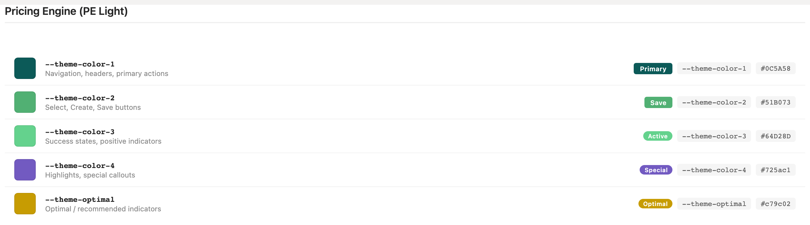
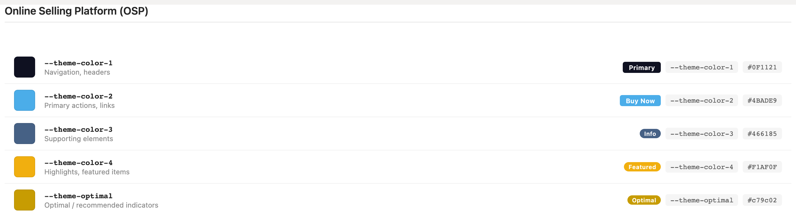
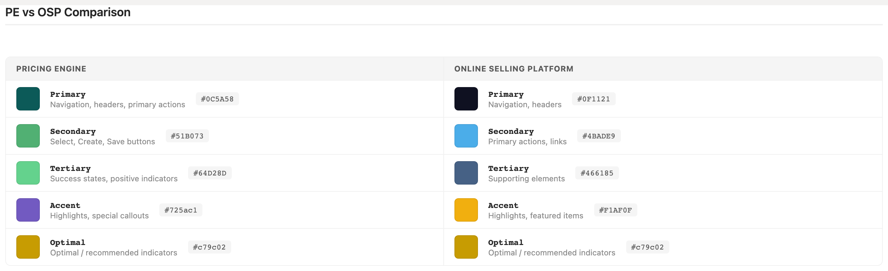
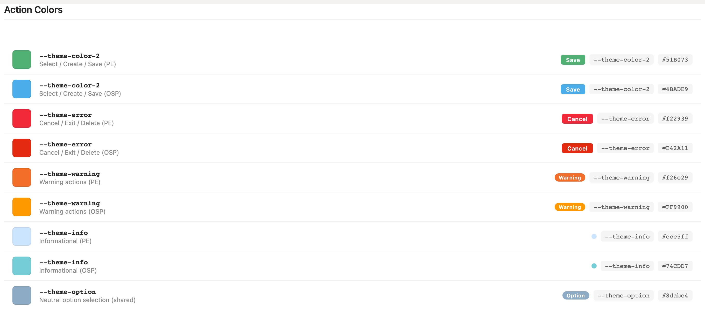
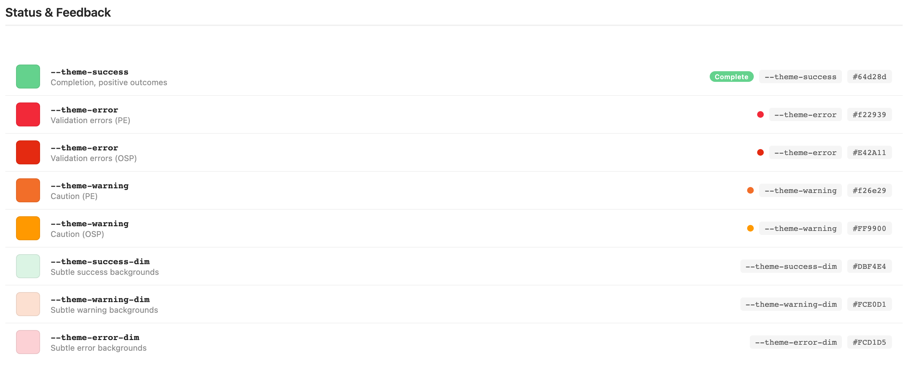
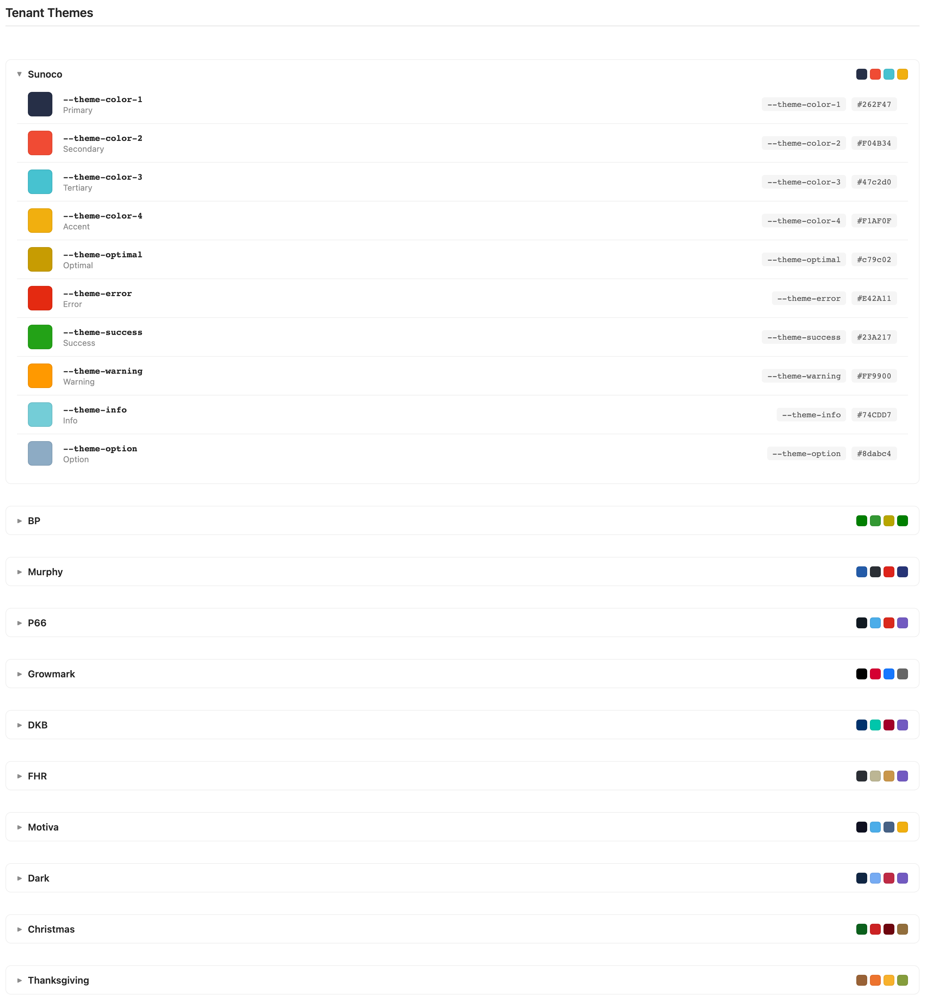

# Colors

Every Excalibrr color is a tenant-themed CSS variable. Each portal theme (PE, OSP, Sunoco, BP, …) defines the same semantic variable set in LESS, so one prototype reskins across all eleven tenants — provided it never hardcodes a hex.

> Part of the Excalibrr Design System — component reference. Index: `../CLAUDE.md`. Live page in the Excalibrr demo: `/DesignSystem/Colors` (demo runs at http://localhost:3000).

### How theming works

Each tenant theme is a LESS file that sets ten core variables — `@theme-color-1` through `@theme-color-4`, `@theme-optimal`, and five control colors (`@theme-error`, `@theme-success`, `@theme-warning`, `@theme-info`, `@theme-option`) — plus three surface backgrounds (`@bg-1`–`@bg-3`), then imports `ThemeBase/light.less` or `dark.less`, which compiles them into `:root` CSS custom properties and derives the rest: `-dim` tints, `-trans` 15%-alpha washes, gradients, the gray ramp, and the fixed `--site-bg` page canvas.

Prototypes consume only the CSS variables: `var(--theme-color-1)`, `var(--theme-success-dim)`, `var(--gray-500)`. A hardcoded hex looks right in one tenant and wrong in ten. Reach for this entry whenever you pick any color — brand, action, status, text, or surface.

### Pricing Engine (PE Light) palette



*The five theme slots in the default PE Light theme: --theme-color-1 teal (nav, headers, primary actions), --theme-color-2 green (Save/Create/Select), --theme-color-3 light green (positive indicators), --theme-color-4 purple (highlights), --theme-optimal gold (recommended indicators) — each with a live button/tag example.*

### Online Selling Platform (OSP) palette



*Same five slots, OSP values: near-black navy primary #0F1121, sky-blue actions #4BADE9, slate tertiary #466185, amber accent #F1AF0F. The roles are identical to PE; only the hues change.*

### PE vs OSP side by side



*The same role resolves to different hues per tenant. Secondary is the trap: green #51B073 in PE, blue #4BADE9 in OSP. Code that assumes --theme-color-2 'is green' breaks the moment the theme switches.*

### Brand & theme slots

Defined per tenant; values shown are PE Light / OSP. The four theme slots ship `-dim` (light tint) and `-trans` (15% alpha) derivatives; `--theme-optimal` ships `-dim` only.

| Token | Value | Use for |
| --- | --- | --- |
| `--theme-color-1` | `#0C5A58 (PE) · #0F1121 (OSP)` | Brand: navigation, headers, primary actions, grid selection accents. The only variable guaranteed to read as 'the brand' in every tenant. |
| `--theme-color-2` | `#51B073 (PE) · #4BADE9 (OSP)` | Affirmative actions — Save, Create, Select. Also antd @primary-color, so default antd focus/active states inherit it. |
| `--theme-color-3` | `#64D28D (PE) · #466185 (OSP)` | Tertiary/supporting accents; dark-theme nav highlight. |
| `--theme-color-4` | `#725ac1 (PE) · #F1AF0F (OSP)` | Highlights and special callouts. Its -trans wash marks dirty-edited grid cells. |
| `--theme-optimal` | `#c79c02 (most tenants)` | Optimal / recommended indicators only — never decoration. |
| `--theme-color-1-trans` | `fade(theme-color-1, 15%)` | Row hover, selected-row, and range-selection backgrounds in GraviGrid. |

### Action colors



*Action semantics across both portals: --theme-color-2 for Save/Create/Select, --theme-error for Cancel/Exit/Delete, --theme-warning for caution actions, --theme-info badges, and the shared neutral --theme-option #8dabc4.*

### Status & feedback



*Full-strength status tokens (success #64d28d, error #f22939 PE / #E42A11 OSP, warning #f26e29 PE / #FF9900 OSP) plus the fixed pastel -dim backgrounds: success-dim #DBF4E4, warning-dim #FCE0D1, error-dim #FCD1D5.*

### Status & semantic palette

Status communication uses these and nothing else. Light themes define `-dim` as fixed pastels; dark themes compute `-dim` as 15% alpha of the parent — pair, don't hardcode.

| Token | Value | Use for |
| --- | --- | --- |
| `--theme-success` | `#64d28d (PE/OSP)` | Completion, positive outcomes, Active tags, success text and borders. |
| `--theme-error` | `#f22939 (PE) · #E42A11 (OSP)` | Validation errors, destructive actions (Cancel/Delete), error text. |
| `--theme-warning` | `#f26e29 (PE) · #FF9900 (OSP)` | Caution states, at-risk indicators, warning actions. |
| `--theme-info` | `#cce5ff (PE) · #74CDD7 (OSP)` | Informational badges. Pale tint in PE, saturated teal in OSP — never rely on it carrying white text. |
| `--theme-option` | `#8dabc4 (all tenants)` | Neutral option-selection chips; the one status hue shared verbatim by every theme. |
| `--theme-success-dim` | `#DBF4E4 (light themes)` | Subtle success background; pair with --theme-success text or border. |
| `--theme-warning-dim` | `#FCE0D1 (light themes)` | Subtle warning background; pair with --theme-warning accents. |
| `--theme-error-dim` | `#FCD1D5 (light themes)` | Subtle error background; pair with --theme-error accents. |
| `--theme-success-trans / -warning-trans / -error-trans` | `fade(parent, 15%)` | Hover and selection washes where the surface underneath must show through. |

### Grays & surfaces

The gray ramp is generated from `--dark-gray: #303030` via LESS lighten(); resolved PE Light values below. The number tracks contrast against the page background, not absolute darkness — see gotchas for dark-theme behavior.

| Token | Value | Use for |
| --- | --- | --- |
| `--gray-100` | `≈#fcfcfc — near-WHITE` | Lightest neutral: hover fills on colored buttons, text on dark fills. Not a dark gray. |
| `--gray-200` | `≈#e8e8e8` | Hairline borders (.bordered, .border-bottom), default button fill, control hover. |
| `--gray-300` | `≈#dddddd` | antd @border-color-base, grid borders, checkbox outlines. |
| `--gray-400` | `≈#c4c4c4` | Hint/placeholder text (Texto appearance='hint'). |
| `--gray-500` | `≈#a3a3a3` | Secondary text (Texto appearance='medium'). |
| `--gray-600` | `≈#777777` | Toolbar links, muted icon buttons. |
| `--gray-700` | `≈#595959` | Default body text — antd @text-color and Texto appearance='default'. |
| `--gray-800` | `≈#3d3d3d` | Strong text (Texto appearance='primary'). Highest gray that exists in every theme. |
| `--gray-900` | `≈#353535 — light themes only` | Maximum-contrast text, grid foreground. Undefined in dark themes. |
| `--bg-1` | `#ffffff` | Card and component backgrounds (antd @component-background). |
| `--bg-2` | `#f8f9fa` | Panels, toolbars, default button background. |
| `--bg-3` | `#eef0f8` | Inset wells, hover on static range pickers. |
| `--site-bg` | `#f5f6fa` | Page canvas behind everything. |

### Tenant themes



*All eleven tenant palettes — Sunoco expanded to show the full ten-variable set (four theme slots, optimal, and five control colors). Every tenant fills the same slots; this is why prototypes must stay on var(--…).*

### Choosing a color

Work top-down: brand, action, status, text, surface.

1. **Brand chrome — nav, headers, primary buttons — uses --theme-color-1.** — It is the only slot that reads as 'the brand' in all eleven tenants; --theme-color-2 swings hue.
2. **Affirmative actions (Save, Create, Select) use --theme-color-2 via <GraviButton theme2>; destructive actions use --theme-error via <GraviButton error>.** — The role is stable across tenants even though the hue is not.
3. **Status surfaces pair the -dim tint as background with the full-strength token for text, icon, or border.** — Full-strength status colors as large fills overwhelm the grid-dense layouts these portals live in.
4. **Neutral text comes off the gray ramp: --gray-700 body, --gray-500 secondary, --gray-400 hints.** — These are the values antd and Texto already resolve to — matching them keeps custom markup indistinguishable from library output.
5. **Surfaces stack --bg-1 cards on --bg-2 panels on --bg-3 wells over --site-bg.** — The three-step background scale is how depth is communicated without shadows.
6. **Reserve --theme-optimal for optimal/recommended indicators and --theme-color-4 for highlights.** — Both lose meaning the moment they decorate anything else.
7. **Money copy is decimal dollars — $0.0100/gal, never cents symbols.** — Gravitate-wide convention; seed data, axes, and inputs all follow it.

### GraviButton color props

Color on GraviButton is boolean flags plus an appearance axis — never antd `type`. Verified against Controls/Buttons/GraviButton.tsx.

| Prop | Type | Default | Notes |
| --- | --- | --- | --- |
| `theme1` | `boolean` | — | Brand fill --theme-color-1. The replacement for antd type='primary'. |
| `theme2` | `boolean` | — | Action fill --theme-color-2 — Save, Create, Select. |
| `theme3` | `boolean` | — | Tertiary fill --theme-color-3. |
| `success / warning / error` | `boolean` | — | Status fills. Set exactly one color flag — when several are truthy the last assignment in source wins (success beats warning beats error beats theme3…). |
| `appearance` | `'filled' \| 'outlined'` | `'filled'` | Outlined renders the token's -dim background, 1px token border, and token-colored text. The value is 'outlined', not 'outline'. |
| `buttonText` | `string \| JSX.Element` | — | The label. GraviButton renders buttonText, not React children — self-close the tag. |
| `theme4` | `boolean` | — | Accepted by the type but never mapped to a class — renders the gray default. Do not use. |

### Texto appearance → color token

Text color goes through Texto's appearance prop, which maps to the gray ramp and status tokens.

| Variant | When to use | Code |
| --- | --- | --- |
| `default` | Body copy — resolves to --gray-700. | `<Texto category='p1'>…</Texto>` |
| `primary` | Strongest neutral emphasis — --gray-800. | `<Texto appearance='primary'>…</Texto>` |
| `medium` | Gray secondary text — --gray-500. This is the 'muted' you usually want. | `<Texto appearance='medium'>…</Texto>` |
| `hint` | Placeholders and de-emphasized hints — --gray-400. | `<Texto appearance='hint'>…</Texto>` |
| `secondary` | Theme accent text — --theme-color-2. NOT gray: green in PE, blue in OSP. | `<Texto appearance='secondary'>…</Texto>` |
| `success / warning / error` | Status text — the matching --theme-* token. | `<Texto appearance='success'>…</Texto>` |
| `optimal` | Optimal/recommended callout text — --theme-optimal. | `<Texto appearance='optimal'>…</Texto>` |
| `white` | Text on dark or colored fills — --gray-100. | — |

### Canonical status surface + actions

```tsx
// Status surface: -dim background, full-strength accent, gray-ramp text — all via vars
<Vertical gap={8} style={{ background: 'var(--theme-success-dim)', borderLeft: '3px solid var(--theme-success)', padding: 12 }}>
  <Texto category='label' appearance='success'>Published</Texto>
  <Texto category='p2' appearance='medium'>Margin moved $0.0250/gal since the last quote.</Texto>
</Vertical>

<Horizontal gap={12} justifyContent='flex-end'>
  <GraviButton error appearance='outlined' buttonText='Cancel' onClick={onCancel} />
  <GraviButton theme2 buttonText='Save Quote' onClick={onSave} />
</Horizontal>
```

Layout props on Vertical/Horizontal (gap, justifyContent), boolean color flags and buttonText on GraviButton, decimal-dollar money copy. No hex anywhere.

### Do / Don't

- **Do:** Reference var(--theme-success), var(--gray-500), var(--bg-2) in custom styles.
  **Don't:** Copy a hex out of one tenant's palette into a component.
  **Why:** Hardcoded hex survives exactly one theme; eleven tenants share these slots.
- **Do:** Use --theme-color-1 for brand chrome.
  **Don't:** Use --theme-color-2 to mean 'the brand color'.
  **Why:** --theme-color-2 swings green (PE) to blue (OSP) to red (Sunoco) across tenants.
- **Do:** <GraviButton theme1 buttonText='Publish' /> and <GraviButton theme2 buttonText='Save' />.
  **Don't:** <GraviButton type='primary'> or <GraviButton theme='success'>.
  **Why:** Color is boolean flags (theme1, theme2, success, error…), not antd type or a theme string.
- **Do:** <Texto appearance='medium'> for gray secondary text.
  **Don't:** <Texto appearance='secondary'> for gray.
  **Why:** secondary maps to --theme-color-2 — it is BLUE in OSP, green in PE, never gray.
- **Do:** Pair -dim backgrounds with the full-strength token for text and borders.
  **Don't:** Flood large surfaces with full-strength status color.
  **Why:** The -dim/-strong pairing keeps status legible inside dense grids without shouting.
- **Do:** appearance='outlined' for the outline button style.
  **Don't:** appearance='outline'.
  **Why:** The prop value is 'outlined'; 'outline' silently falls through to no appearance class.

### Gotchas

- **--gray-100 is near-WHITE** — The ramp runs light to dark: --gray-100 ≈ #fcfcfc, --gray-900 ≈ #353535 (PE Light). Sessions trained on inverted scales reach for gray-100 expecting near-black and ship invisible text. Strong text is --gray-700/800/900; light fills are --gray-100/200.
- **--theme-color-2 swings hue across themes** — Green #51B073 in PE, blue #4BADE9 in OSP, red #F04B34 in Sunoco. Use it for the Save/Create/Select role only; use --theme-color-1 whenever you mean 'brand color'.
- **Dark themes flip the gray ramp and drop --gray-900** — In dark.less the ramp inverts (--gray-100 ≈ #3d3d3d near-black, --gray-800 ≈ #fcfcfc near-white) and --gray-900 is not defined at all — var(--gray-900) resolves to nothing. Read the index as 'contrast against the page background' and cap theme-proof styles at --gray-800.
- **Texto appearance='theme3' is broken** — The component emits class text-theme-3 but the stylesheet defines .text-theme3 — the appearance silently renders default gray. Use an explicit style with var(--theme-color-3) if you need that hue.
- **GraviButton theme4 does nothing** — The prop exists in the type but is never mapped to a CSS class; the button renders the gray default. There is no button variant for --theme-color-4 — apply it via custom styles when needed.
- **-dim means different things in light and dark themes** — Light themes define --theme-success-dim etc. as fixed opaque pastels (#DBF4E4); dark themes compute them as 15% alpha of the parent. Never assume -dim is opaque — content behind it can show through in dark themes.
