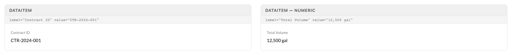
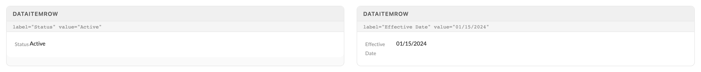
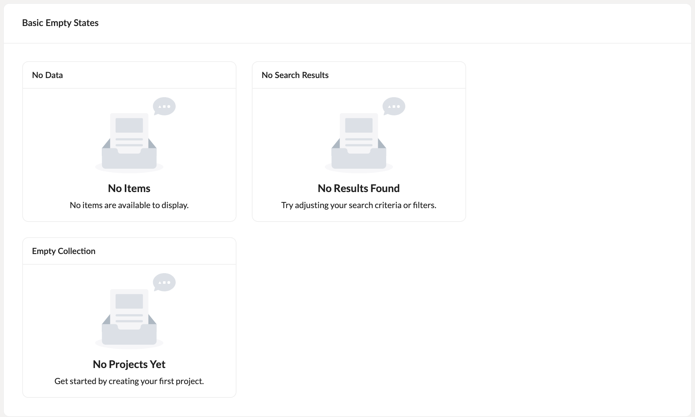
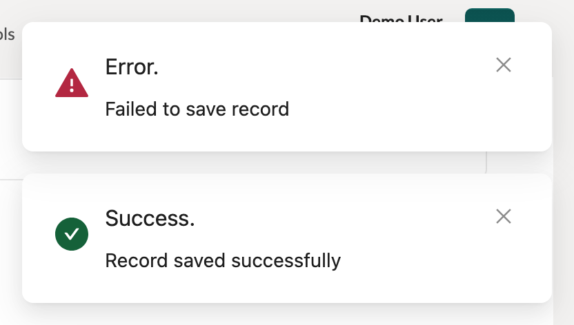

# Data Display

The read-only primitives: DataItem and DataItemRow render labeled facts in drawers, headers, and detail panels; NothingMessage owns the empty state and LoadingAnimation owns the fetch state. None of these take a `value` prop — the value is always children.

> Part of the Excalibrr Design System — component reference. Index: `../CLAUDE.md`. Live page in the Excalibrr demo: `/DesignSystem/DataDisplay` (demo runs at http://localhost:3000).

Reach for this family whenever a surface shows facts instead of collecting them. DataItem stacks a hint-gray label over a value for summary strips and drawer headers; DataItemRow puts label and value on one line for vertical field lists. NothingMessage is the one sanctioned empty state — every empty grid, list, and no-results surface uses it, never a hand-rolled centered div. LoadingAnimation covers full-area fetches with a Lottie animation.

The single most important fact about this family: the value slot is `children`. There is no `value` prop on DataItem or DataItemRow — passing one renders an empty value cell with no warning.

### DataItem — stacked label over value



*Text and numeric values: a 0.9em hint-gray label (Texto `label`/`hint`) over a 1.1em value (Texto `p2`). The value is passed as children — the `value=` prop strings printed on the demo cards are wrong; that prop does not exist.*

### DataItem props

The published component wraps both lines in Texto: label as `category='label' appearance='hint'` (class `detail-data-label pb-1`), value as `category='p2'` (class `detail-data-value`).

| Prop | Type | Default | Notes |
| --- | --- | --- | --- |
| `label` | `string` | — | The hint-gray caption line above the value. |
| `children` | `ReactNode` | — | The value. This is the value slot — there is no `value` prop. |
| `valueStyle` | `CSSProperties` | — | Inline style on the value line — weight or color emphasis without replacing the Texto wrapper. |
| `labelExtras` | `HTMLAttributes<HTMLDivElement>` | — | Spread onto the label element — tooltips, data attributes, click handlers. |
| `extraClass` | `string` | — | Class on the wrapper div. Use for spacing within a strip; prefer the parent's `gap`. |

### DataItemRow — single-line field rows



*Label and value share one line on a 12/12 antd column split. In narrow containers long labels wrap ("Effective Date", right) — tune labelSpan/valueSpan instead of letting labels break.*

### DataItemRow props

An antd Row with two Cols on the 24-column grid. Same Texto treatment as DataItem: hint label, p2 value.

| Prop | Type | Default | Notes |
| --- | --- | --- | --- |
| `label` | `ReactNode` | — | Required. Left column content — accepts nodes, so labels can carry an info icon. |
| `children` | `ReactNode` | — | Required. The value, in the right column. No `value` prop exists. |
| `labelSpan` | `number` | `12` | Label column width out of 24. Drop to 8-10 in wide panels so values get room. |
| `valueSpan` | `number` | `12` | Value column width out of 24. labelSpan + valueSpan should total 24. |
| `labelExtras` | `ColProps` | — | Spread onto the label Col — alignment, offset, responsive spans. |
| `extraClass` | `string` | — | Class on the outer Row. |

### Which component

| Variant | When to use | Code |
| --- | --- | --- |
| `DataItem` | Facts read left-to-right: summary strips, drawer headers, KPI clusters. Label stacks over value. | `<DataItem label='Contract ID'>CTR-2024-001</DataItem>` |
| `DataItemRow` | Facts read top-to-bottom: vertical field lists in detail panels and drawers. Label and value share a line. | `<DataItemRow label='Status'>Active</DataItemRow>` |
| `NothingMessage` | Every empty grid, list, or no-results state. The only sanctioned empty state — both title and message are required. | `<NothingMessage title='No Results' message='No contracts match your filters' />` |
| `LoadingAnimation` | Full-area data fetches that deserve a Lottie animation. For lightweight inline waits, wrap content in Overlay instead. | — |
| `NotificationMessage` | Never. Deprecated and flagged for removal — call the antd `notification` API directly. | — |

### Canonical usage

```tsx
import { DataItem, DataItemRow, NothingMessage, Horizontal, Vertical } from '@gravitate-js/excalibrr'

// Summary strip — the value is ALWAYS children, never a `value` prop
<Horizontal gap={24}>
  <DataItem label='Contract ID'>CTR-2024-001</DataItem>
  <DataItem label='Total Volume'>12,500 gal</DataItem>
  <DataItem label='Rack Avg'>$2.4500/gal</DataItem>
</Horizontal>

// Detail panel field list — widen the value column when labels are short
<Vertical gap={4}>
  <DataItemRow label='Status'>Active</DataItemRow>
  <DataItemRow label='Effective Date' labelSpan={8} valueSpan={16}>
    01/15/2024
  </DataItemRow>
</Vertical>

// Empty state — title AND message are required
{rows.length === 0 && (
  <NothingMessage title='No Results' message='No contracts match your filters' />
)}
```

Spacing comes from Horizontal/Vertical gap props, never style objects. Money copy is decimal dollars ($2.4500/gal), never cents symbols.

### NothingMessage — empty states



*Three correct uses — no data, no search results, and first-run — each with the fixed NoResultsIcon, a bold 1.4em title, and a supporting message. The icon is built in and cannot be swapped.*

### NothingMessage props

Exactly three props. The icon is the library's NoResultsIcon — there is no icon, action, or size prop.

| Prop | Type | Default | Notes |
| --- | --- | --- | --- |
| `title` | `string` | — | Required. Bold 1.4em headline in var(--gray-600). CSS capitalizes every word — write it short: "No Results", "No Items". |
| `message` | `string` | — | Required. Centered supporting line — say what would fill the space or how to fix the filter. |
| `className` | `string` | — | Appended to `nothing-container` for positioning overrides. |

### LoadingAnimation props

Lottie-driven full-area loading state, used for page and panel fetches. It has no built-in animation — you must supply the Lottie JSON, or it renders a blank 355x245 box. (The live showcase makes exactly that mistake, so there is no specimen here.)

| Prop | Type | Default | Notes |
| --- | --- | --- | --- |
| `animationData` | `Lottie JSON` | — | Required. The animation source — import a .json Lottie file. Without it the component renders empty. |
| `title` | `string` | — | Required. Bold headline under the animation — h5, or h1 when `large`. |
| `message` | `string` | — | Required. Supporting line — p1, or h5 when `large`. |
| `large` | `boolean` | `false` | Scales the text tier up (title h1, message h5) for full-page loads. |
| `loop` | `boolean` | `true` | Set false for one-shot animations like a success check. |
| `width` | `number` | `355` | Animation width in px. |
| `height` | `number` | `245` | Animation height in px. |

### NotificationMessage — deprecated toasts



*Error (WarningFilled in var(--theme-error)) and success (CheckCircleFilled in var(--theme-success)) toasts, top-right. Shown for recognition only — the source flags this function as deprecated; new code calls antd `notification` directly.*

### Type and color hooks

Values from library source. The class names are stable hooks for the rare targeted override.

| Token | Value | Use for |
| --- | --- | --- |
| `.detail-data-label` | `Texto label / hint — 0.9em, var(--gray-400)` | Label line of DataItem and DataItemRow. |
| `.detail-data-value` | `Texto p2 — 1.1em, var(--gray-700)` | Value line of DataItem and DataItemRow. |
| `.nothing-title` | `1.4em bold, var(--gray-600), text-transform: capitalize` | Empty-state headline. |
| `.nothing-message` | `1em, centered, margin-top 0.5em` | Empty-state supporting line. |
| `.nothing-container` | `flex column, centered, flex: 1, height: 100%` | Centers the empty state inside a height-constrained flex parent. |
| `.loading-container` | `padded column (p-5) wrapping Lottie + title + message` | LoadingAnimation wrapper. |

### Do's & Don'ts

- **Do:** Pass the value as children: <DataItem label='Status'>Active</DataItem>
  **Don't:** Pass a value prop: <DataItem label='Status' value='Active' />
  **Why:** No `value` prop exists on DataItem or DataItemRow — it is silently dropped and the value cell renders empty.
- **Do:** Use NothingMessage for every empty grid, list, and no-results state, with both title and message.
  **Don't:** Hand-roll centered divs with inline styles, or pass only a message.
  **Why:** One component keeps every empty state identical; a missing title renders a blank bold line above the message.
- **Do:** Put NothingMessage inside a height-constrained flex parent (Vertical flex='1' or height='100%') when it should center vertically.
  **Don't:** Drop it into an auto-height wrapper and expect centering.
  **Why:** The container relies on flex: 1 + height: 100% — in an auto-height parent it hugs its content at the top.
- **Do:** Gray emphasis on values via valueStyle or Texto appearance='medium'.
  **Don't:** Wrap values in Texto appearance='secondary' for gray.
  **Why:** secondary is BLUE (var(--theme-color-2)); medium is the gray (var(--gray-500)).

### Gotchas

- **The value slot is children — `value` does not exist** — Both DataItem and DataItemRow type the value as children. A `value` prop is silently ignored and the cell renders empty. The Data Display showcase itself makes this mistake — its printed prop strings (`value="CTR-2024-001"`) are wrong; trust this reference, not the demo card captions.
- **NothingMessage takes exactly title, message, className** — There is no `icon` or `actions` prop — the NoResultsIcon is hard-coded, and extra props are silently ignored (the welcome-page example passes both and gets neither). Need a call-to-action under an empty state? Render a GraviButton as a sibling below it.
- **nothing-title capitalizes every word** — `.nothing-title` carries `text-transform: capitalize`, so "no results found" renders as "No Results Found". Write short Title-Case titles and keep sentence-case prose in the message line.
- **LoadingAnimation renders blank without animationData** — There is no default animation. Omit `animationData` and you get an empty 355x245 box with no error — the live Feedback showcase demonstrates the failure. Import a Lottie .json and pass it explicitly, along with the required title and message.
- **NotificationMessage is deprecated** — Library source flags it 'unused, will be removed'. It is a plain function (message, description, showErrorMessage) wrapping antd's static notification.open — not a component. New code calls the antd `notification` API directly.
- **DataItemRow's 12/12 split wastes space in wide panels** — The default gives the label half the row. In drawers and panels wider than ~400px, set labelSpan={8} valueSpan={16} so values do not start at the midline and long labels do not wrap.
