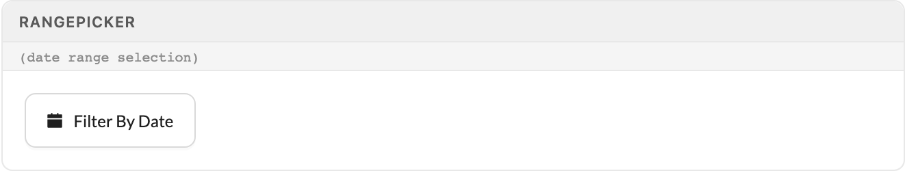
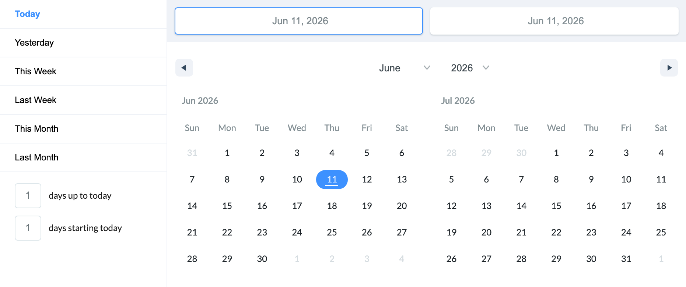

# Date & Time

Excalibrr's date controls are built for control bars, not forms: DateSkipper steps through trading days one click at a time, and RangePicker filters grids with a two-month calendar behind a single button. Both predate antd v5 and speak moment and native Date — never dayjs.

> Part of the Excalibrr Design System — component reference. Index: `../CLAUDE.md`. Live page in the Excalibrr demo: `/DesignSystem/DateTime` (demo runs at http://localhost:3000).

### When to reach for these

Two components carry this area. `DateSkipper` is a stepper for navigating dated data — chevron buttons flanking a date, used in control bars where users walk forward and back through trading days. `RangePicker` is a filter trigger: a calendar-icon `GraviButton` that opens a two-month `react-date-range` calendar with a preset sidebar (Today, Yesterday, This Week, Last Week, This Month, Last Month). Use it in grid control bars and drawer headers, never inside a `Form`.

For plain form fields, use antd's `DatePicker` — it speaks dayjs in antd v5. When you must bind a moment value to an antd-style picker, the library exports `MomentDatePicker` and `MomentTimePicker`, antd pickers regenerated with a moment config. These are the only safe bridge between the two date libraries.

`DayPickerControl`, `WeekPickerControl`, and `PayrollPickerControl` are deprecated in the legacy source and not exported from `@gravitate-js/excalibrr` v5. Do not resurrect them — `DateSkipper` covers day-stepping; antd `DatePicker picker='week'` covers week selection.

### DateSkipper


*DateSkipper in multi-day display mode: chevron steppers flanking a bold, non-editable date label. With daysToSkip={1} the label is replaced by an editable date input.*

### DateSkipper props

Verified against @gravitate-js/excalibrr v5.2.1. The component is controlled by `startDate` — every chevron click computes from the prop, not internal state.

| Prop | Type | Default | Notes |
| --- | --- | --- | --- |
| `startDate` | `string` | — | Required. The source of truth — a moment-parseable date string (use `YYYY-MM-DD`). Your `onChange` must write the new date back here or the stepper sticks. |
| `daysToSkip` | `number` | — | Required. Step size per chevron click. `1` renders an editable date input between the chevrons; anything else renders a static bold label. |
| `onChange` | `(date: Moment, dateString: string) => void` | — | Fires on chevron click and direct pick. Read the `Moment` — `dateString` is `YYYY-MM-DD` from chevrons but the display format from direct picks. |
| `format` | `(date: Moment) => string` | `MM/DD/YYYY` | Overrides the displayed date format in both modes. |
| `disabled` | `boolean` | `false` | Disables both chevrons and the date input. |

### DateSkipper modes

The mode is derived from `daysToSkip` — there is no separate variant prop.

| Variant | When to use | Code |
| --- | --- | --- |
| `Single-day stepper` | daysToSkip === 1 — renders an editable MomentDatePicker (125px wide, clear disabled) between the chevrons; users can step or jump to any date. | `<DateSkipper startDate={date} daysToSkip={1} onChange={(d) => setDate(d.format('YYYY-MM-DD'))} />` |
| `Multi-day stepper` | daysToSkip > 1 — renders a bold static label (120px); the date only moves via chevrons, in fixed jumps. Use for week or period navigation. | `<DateSkipper startDate={date} daysToSkip={7} onChange={(d) => setDate(d.format('YYYY-MM-DD'))} />` |

### RangePicker trigger



*RangePicker at rest: a calendar-icon GraviButton reading "Filter By Date". Once both ends of a range are set, the button switches to theme1 styling and shows the locale-formatted range.*

### RangePicker open



*RangePicker expanded: two-month react-date-range calendar with the preset sidebar (Today through Last Month) and day-count inputs. Opens from the trigger via an antd Dropdown, default placement bottomLeft.*

### RangePicker props

Verified against @gravitate-js/excalibrr v5.2.1. Selections come back as raw JS `Date` objects from react-date-range.

| Prop | Type | Default | Notes |
| --- | --- | --- | --- |
| `inputKey` | `string` | — | Required and load-bearing: react-date-range keys its change payload by this string, and onChange reads `payload[inputKey]`. Omit it and every selection silently returns undefined. |
| `dates` | `Moment[] \| (Date \| undefined)[]` | — | Current range. Moment values are normalized via `.toDate()`; dayjs values are NOT recognized — the trigger stays in its unset "Filter By Date" state. Convert dayjs with `.toDate()` before passing. |
| `onChange` | `(dates: [Date \| undefined, Date \| undefined]) => void` | — | Fires on every calendar click — the first click pins both ends to one day, the second completes the range. Values are native Dates; convert to dayjs at the edge if your grid or API needs it. |
| `placement` | `DropdownProps['placement']` | `bottomLeft` | Dropdown placement. Use `bottomRight` when the trigger sits at the right edge of a control bar. |
| `staticRanges` | `StaticRange[]` | `defaultStaticRanges` | Replaces the preset sidebar. Build custom presets with `createStaticRanges` imported from `react-date-range` directly (already a demo dependency) — `@gravitate-js/excalibrr` v5 does not re-export `defaultStaticRanges` or `createStaticRanges` from its root. |

### Canonical usage

```tsx
import { useState } from 'react'
import moment from 'moment'
import { DateSkipper, RangePicker, Horizontal } from '@gravitate-js/excalibrr'

export function TradingDayControls() {
  // DateSkipper is controlled by startDate — onChange writes back to it
  const [tradeDate, setTradeDate] = useState(moment().format('YYYY-MM-DD'))
  // RangePicker speaks native Date, never dayjs
  const [range, setRange] = useState<[Date | undefined, Date | undefined]>([undefined, undefined])

  return (
    <Horizontal gap={12} verticalCenter>
      <DateSkipper
        startDate={tradeDate}
        daysToSkip={1}
        onChange={(date) => setTradeDate(date.format('YYYY-MM-DD'))}
      />
      <RangePicker
        inputKey="effectiveDates"
        dates={range}
        onChange={setRange}
        placement="bottomRight"
      />
    </Horizontal>
  )
}
```

Keep range state as native Dates and convert at the edge (e.g. `dayjs(range[0])`) when a grid or API needs dayjs. Layout props go on Horizontal directly (`gap={12}`), never through `style`.

### Do's & Don'ts

- **Do:** Write DateSkipper's onChange result back into the startDate prop.
  **Don't:** Treat DateSkipper as uncontrolled and ignore onChange.
  **Why:** Chevrons compute from the prop, not internal state — without write-back the control sticks at startDate ± daysToSkip forever.
- **Do:** Pass native Dates (or moments) to RangePicker's dates prop.
  **Don't:** Pass dayjs objects.
  **Why:** Normalization only recognizes moment.isMoment and instanceof Date; dayjs fails both and the trigger silently shows "Filter By Date" with your selection invisible.
- **Do:** Use antd DatePicker (dayjs values) for form fields, RangePicker for grid filter bars.
  **Don't:** Put RangePicker inside a Form.Item.
  **Why:** RangePicker has no value/onChange contract a Form can bind — it is a filter trigger, not an input.
- **Do:** Use open / onOpenChange when wrapping pickers or dropdowns yourself.
  **Don't:** Use visible / onVisibleChange.
  **Why:** antd v5 renamed the API; the old names are dead props that silently do nothing.

### Gotchas

- **antd v5 date values are dayjs, not moment** — antd v5's DatePicker produces and expects dayjs objects. Excalibrr's date stack predates this and speaks moment: DateSkipper hands you a Moment, RangePicker hands you native Dates. Never pass a moment to antd's own DatePicker or a dayjs to MomentDatePicker — both blow up inside rc-picker at runtime. The exported MomentDatePicker / MomentTimePicker are the only sanctioned moment-flavored antd pickers.
- **RangePicker silently ignores dayjs in dates** — The isSet check is `moment.isMoment(d)` or `d instanceof Date`. A dayjs array fails both, so the button never leaves its unset state even though your state holds a valid range. Convert with `.toDate()` before passing — this exact bug shipped in demo pages that fed dayjs straight in.
- **inputKey is not optional in practice** — react-date-range keys its change payload by `ranges[].key`, and RangePicker's onChange reads `payload[inputKey]`. Without inputKey every selection resolves to `payload[undefined]` and onChange receives `[undefined, undefined]` — no error, no selection.
- **DateSkipper's dateString format is inconsistent** — Chevron clicks emit `YYYY-MM-DD`; picking a date directly emits the display format (default `MM/DD/YYYY`). Normalize off the Moment argument — `date.format('YYYY-MM-DD')` — and ignore dateString.
- **The deprecated picker trio is gone in v5** — DayPickerControl, WeekPickerControl, and PayrollPickerControl are flagged @deprecated in the legacy source and are not exported from @gravitate-js/excalibrr v5. Use DateSkipper for day-stepping and antd DatePicker with picker='week' for week selection.
