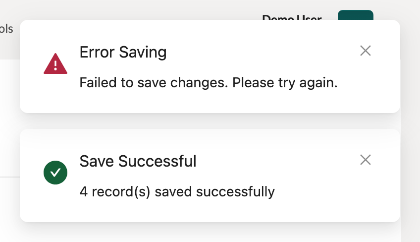
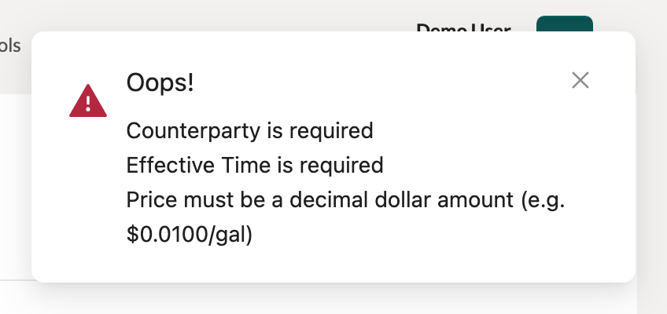
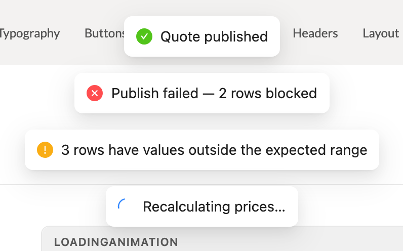
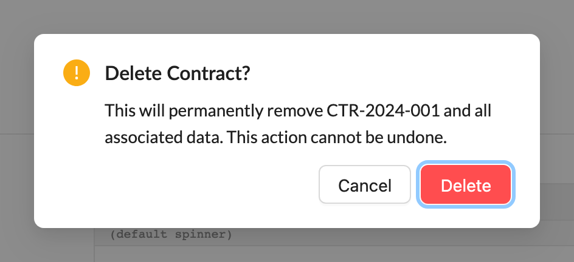
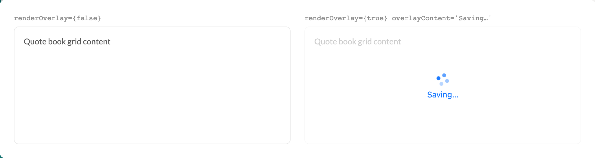
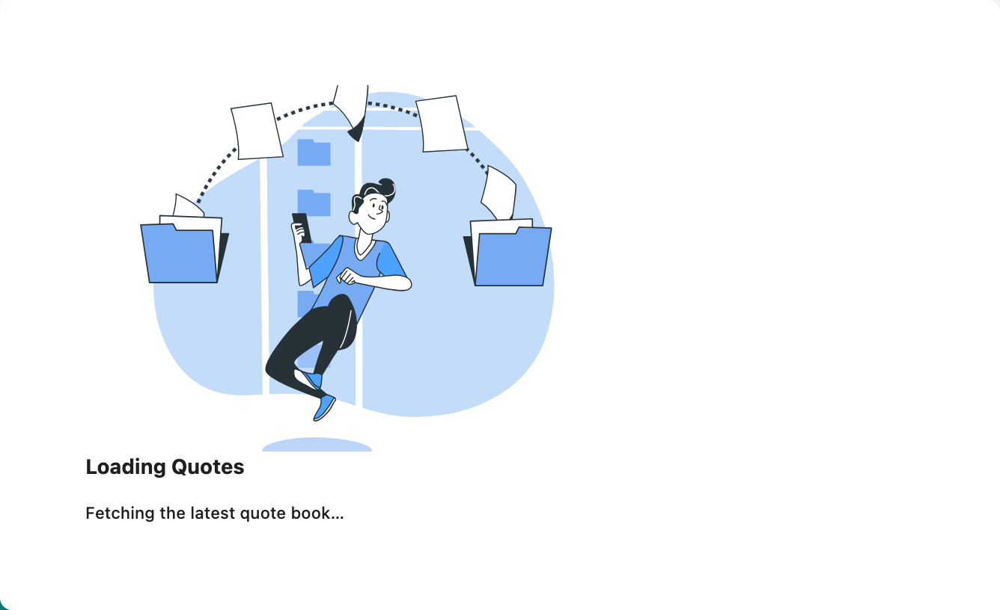

# Feedback & Notifications

Every async action answers back through one of five channels: NotificationMessage toasts for outcomes, antd message pills for split-second acknowledgements, Modal.confirm for consent, Overlay for in-place blocking, and LoadingAnimation for first loads. Pick the channel by consequence, not by taste.

> Part of the Excalibrr Design System — component reference. Index: `../CLAUDE.md`. Live page in the Excalibrr demo: `/DesignSystem/Feedback` (demo runs at http://localhost:3000).

Feedback is how the app answers the user after an action or while one is in flight. Excalibrr ships two thin wrappers over antd's notification API — `NotificationMessage` (titled success/error toasts) and `ErrorNotification` (form-validation toast) — and two loading primitives: `Overlay` (antd Spin around in-place content) and `LoadingAnimation` (Lottie illustration for first loads). Everything else comes straight from antd: `message` for pills, `Modal`/`Modal.confirm` for dialogs, `Alert` for persistent inline warnings.

Toasts confirm what already happened; modals gather consent before it happens; overlays and loading states cover the time in between. Never substitute one for another — a toast after a silent delete is not a confirmation flow.

### NotificationMessage — success and error toasts



*Top-right toast stack. Error state (showErrorMessage=true) renders WarningFilled in --theme-error; success state (false) renders CheckCircleFilled in --theme-success. Both auto-dismiss after antd's default 4.5s.*

### NotificationMessage(message, description, showErrorMessage)

A function call, not a component — invoke it from event handlers. It wraps `notification.open` and adds the themed status icon.

| Prop | Type | Default | Notes |
| --- | --- | --- | --- |
| `message` | `ReactNode` | — | Toast title. Short outcome statements: 'Save Successful', 'Error Saving'. |
| `description` | `ReactNode` | — | Body copy. Accepts strings or JSX — ErrorNotification passes a list of <li> elements. |
| `showErrorMessage` | `boolean` | `true` | true = red WarningFilled (--theme-error); false = green CheckCircleFilled (--theme-success). The default is the ERROR icon — always pass this argument explicitly. |

### Toast variants

One function, three intents. The third argument is the only axis — there is no warning or info toast; use an inline Alert for those.

| Variant | When to use | Code |
| --- | --- | --- |
| `Success` | An action completed: save, publish, upload, delete. | `NotificationMessage('Save Successful', '4 record(s) saved successfully', false)` |
| `Error` | An action failed and the user should retry or escalate. | `NotificationMessage('Error Saving', 'Failed to save changes. Please try again.', true)` |
| `Validation failure` | antd Form submit fails validation — wire ErrorNotification directly, it formats errorFields into one deduplicated 'Oops!' toast. | `<Form onFinishFailed={ErrorNotification} />` |

### ErrorNotification — form validation toast



*The 'Oops!' toast produced by passing antd's onFinishFailed payload to ErrorNotification: one line per distinct field error, duplicate messages dropped.*

### Canonical toast wiring

```tsx
import { ErrorNotification, GraviButton, NotificationMessage } from '@gravitate-js/excalibrr'
import { Form } from 'antd'

const [form] = Form.useForm()

const handleSave = async (values: QuoteFormValues) => {
  try {
    await saveQuotes(values)
    NotificationMessage('Save Successful', '4 record(s) saved successfully', false)
  } catch {
    NotificationMessage('Error Saving', 'Failed to save changes. Please try again.', true)
  }
}

<Form form={form} layout='vertical' onFinish={handleSave} onFinishFailed={ErrorNotification}>
  {/* fields */}
</Form>
<GraviButton theme1 buttonText='Save' onClick={() => form.submit()} />
```

ErrorNotification plugs straight into onFinishFailed — no wrapper needed. Submit via GraviButton onClick={() => form.submit()}; htmlType='submit' is on the repo's banned-mistakes list.

### antd message — pill states



*Top-center message pills: success, error, warning, and loading states. No title, no body — a single line that earns at most three seconds of attention.*

### Choose the channel

1. **Use a NotificationMessage toast for action outcomes — saves, publishes, uploads, deletes.** — Titled, top-right, auto-dismissing: visible without interrupting flow.
2. **Use a message pill only for split-second acknowledgements with no title and no consequence.** — If the user might need to act on it, it deserves a toast with a description.
3. **Use Modal.confirm before destructive or irreversible actions — never confirm after the fact.** — Toasts report outcomes; they cannot gather consent.
4. **Use Overlay to block an in-place region during async work; the content stays mounted and dims.** — Layout holds steady — no flash of empty space when the work finishes.
5. **Use LoadingAnimation for first loads where there is nothing to dim yet.** — An empty region with a bare spinner reads as broken; the illustration plus title reads as working.
6. **Use an inline antd Alert for warnings that must persist until resolved — validation summaries, range warnings, banner notices.** — Toasts vanish in 4.5 seconds; unresolved problems must not.

### Modal.confirm — destructive confirmation



*Confirmation dialog: title states the action as a question, body states the consequence, and the destructive button carries danger styling beside a plain Cancel escape. antd focuses the OK button by default.*

### Canonical controlled Modal

```tsx
const [open, setOpen] = useState(false)

<Modal
  open={open}            // antd v5 — `visible` silently does nothing
  destroyOnHidden        // antd v5 — `destroyOnClose` is deprecated
  title='Delete Contract?'
  okText='Delete'
  okButtonProps={{ danger: true }}
  onOk={handleDelete}
  onCancel={() => setOpen(false)}
>
  This will permanently remove CTR-2024-001 and all associated data. This action cannot be undone.
</Modal>
```

For one-shot confirmations with no local state, Modal.confirm({ title, content, okText, okButtonProps: { danger: true } }) renders the same dialog imperatively.

### Overlay — renderOverlay off and on



*renderOverlay={false} renders children untouched with zero wrapper DOM; renderOverlay={true} wraps them in antd Spin — content dims, the spinner and overlayContent tip center over it.*

### Overlay

A conditional antd Spin wrapper. The type accepts all SpinProps, but the implementation reads exactly four props — `spinning`, `size`, and `delay` are ignored.

| Prop | Type | Default | Notes |
| --- | --- | --- | --- |
| `children` | `ReactNode` | — | The region being blocked. Always rendered — dimmed when the overlay is on, bare when off. |
| `renderOverlay` | `boolean` | — | Required. true wraps children in <Spin>; false returns children in a Fragment with no extra DOM. Drive it from your loading/saving state. |
| `overlayContent` | `SpinProps['tip']` | — | Label under the spinner — 'Saving…', 'Loading…'. Keep it to one word plus ellipsis. |
| `overlayIndicator` | `SpinProps['indicator']` | — | Custom spinner element. Omit for the standard antd dot spinner. |

### LoadingAnimation — first-load state



*LoadingAnimation with required animationData, title, and message: Lottie illustration above a left-aligned bold h5 title and p1 message in the empty region.*

### LoadingAnimation

Lottie illustration plus Texto title and message. All three content props are required — a bare <LoadingAnimation /> renders nothing visible.

| Prop | Type | Default | Notes |
| --- | --- | --- | --- |
| `animationData` | `Options['animationData'] (react-lottie)` | — | Required. Imported Lottie JSON (e.g. from src/assets/Animation/). There is no built-in default animation. |
| `title` | `string` | — | Required. Bold headline under the animation — 'Loading Quotes'. |
| `message` | `string` | — | Required. Supporting line — 'Fetching the latest quote book…'. |
| `large` | `boolean` | — | Bumps the type scale to h1 title + h5 message for full-page loads. Default scale is h5 + p1. |
| `loop` | `boolean` | `true` | Loop the animation while waiting. |
| `width` | `number` | `355` | Animation width in px. |
| `height` | `number` | `245` | Animation height in px. |

### Status tokens

Values shown are the light-theme resolution (ThemeBase/light.less); each theme stylesheet redefines them. Always reference the variable, never the hex.

| Token | Value | Use for |
| --- | --- | --- |
| `--theme-error` | `#f22939` | Error toast icon (WarningFilled), destructive accents. |
| `--theme-success` | `#64d28d` | Success toast icon (CheckCircleFilled), positive confirmations. |
| `--theme-error-dim` | `#FCD1D5` | Error tint backgrounds for inline alert surfaces and tags. |
| `--theme-success-dim` | `#DBF4E4` | Success tint backgrounds for inline alert surfaces and tags. |

### Do's & Don'ts

- **Do:** Pass NotificationMessage's third argument explicitly: false for success, true for error.
  **Don't:** Omit it on a success toast.
  **Why:** showErrorMessage defaults to true — your success copy ships under a red warning icon.
- **Do:** Gate destructive actions behind Modal.confirm with okButtonProps={{ danger: true }}.
  **Don't:** Delete on click and announce it with a toast afterward.
  **Why:** A toast reports an outcome; it cannot collect consent for an irreversible one.
- **Do:** Wrap a saving or refreshing region in <Overlay renderOverlay={isSaving}>.
  **Don't:** Hand-roll absolutely-positioned spinner divs over content.
  **Why:** Spin handles dimming, centering, and pointer blocking consistently; custom overlays drift per page.

### Gotchas

- **antd v5: `open`, never `visible`** — A Modal or Drawer given visible={true} simply never appears — no error, no warning in some versions. Every open-state prop in v5 is `open`.
- **`destroyOnClose` is deprecated — use `destroyOnHidden`** — v5 logs a console deprecation warning per render (the demo app currently emits one). Same behavior, new name: unmount modal children when hidden.
- **`onVisibleChange` is gone — use `onOpenChange`** — Popover, Dropdown, and Tooltip all take onOpenChange in v5; the old callback silently never fires. Modal's equivalent is afterOpenChange.
- **NotificationMessage defaults to the error icon** — showErrorMessage defaults to true. NotificationMessage('Saved', '…') renders a red WarningFilled next to success copy. Always pass the third argument.
- **Do not copy props from the Feedback showcase page** — Both showcase specimens render empty: <LoadingAnimation /> is missing the required animationData/title/message, and <Overlay open={true} /> uses a prop that does not exist — the real prop is renderOverlay, with children required.
- **NotificationMessage's @deprecated tag is stale** — The library source flags it 'unused', yet it is the standard toast across the codebase — grid save flows, contract creation, file uploads all call it. Keep using it until a replacement actually ships.
