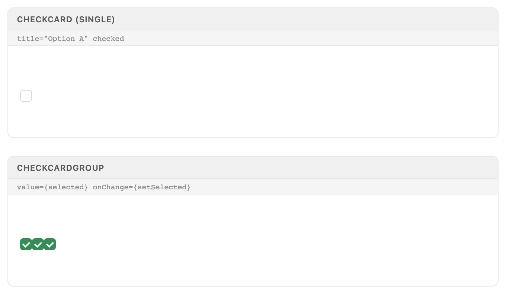
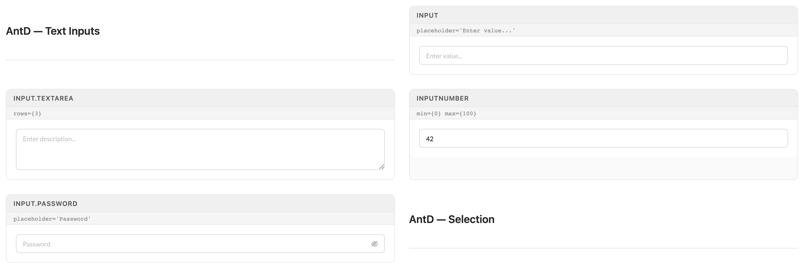
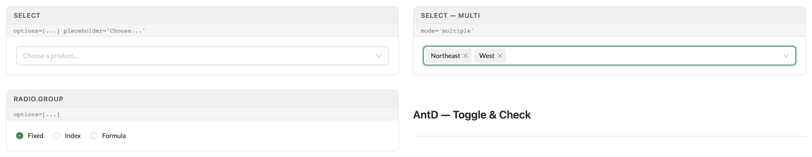
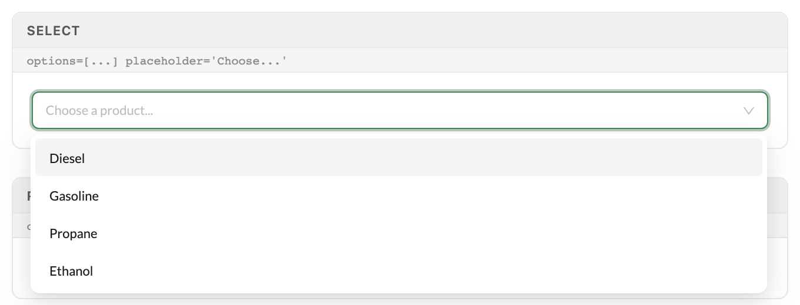
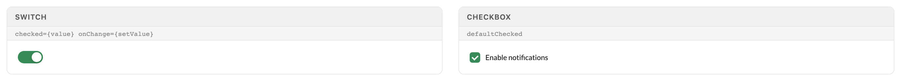
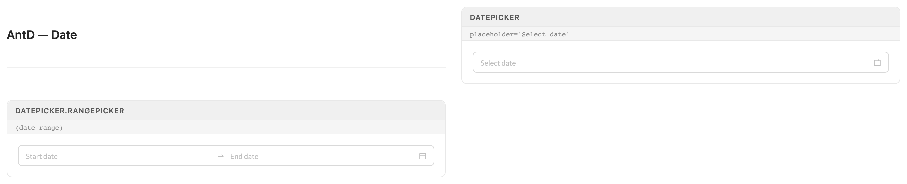
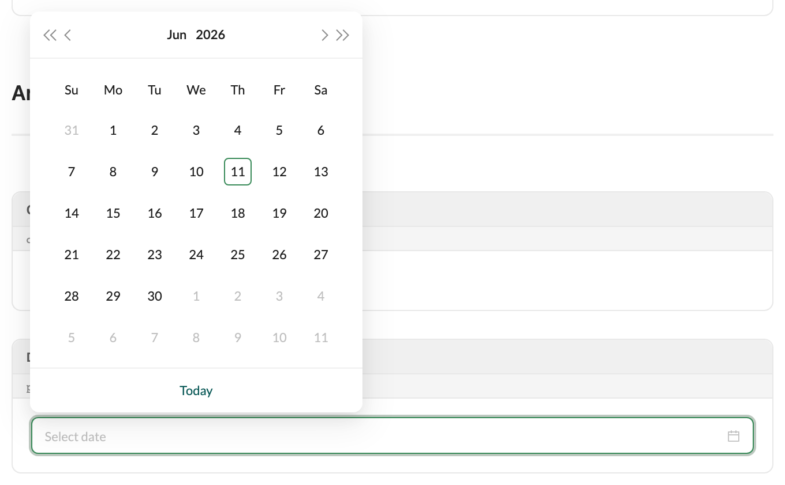

# Form Controls

Text entry, selection, toggles, and dates. Everything here is stock antd v5 except CheckCard and CheckCardGroup — Excalibrr's card-style option pick. Wire all of it through antd Form with vertical labels.

> Part of the Excalibrr Design System — component reference. Index: `../CLAUDE.md`. Live page in the Excalibrr demo: `/DesignSystem/FormControls` (demo runs at http://localhost:3000).

Reach for this entry whenever a prototype takes data in: filter bars, drawers, settings panels, create/edit forms. The control set is stock antd v5 — `Input`, `InputNumber`, `Select`, `Radio.Group`, `Switch`, `Checkbox`, `DatePicker` — plus Excalibrr's `CheckCard`/`CheckCardGroup` for large tap-target option picks inside option drawers.

Wrap controls in antd `Form` with `layout="vertical"` — labels sit above inputs; horizontal label columns break at drawer widths. Give every text-like control `style={{ width: '100%' }}` and let the grid column size it. Anything that must react to another field's value reads it with `Form.useWatch('field', form)`, never `form.getFieldValue` in render.

Dates: antd v5 pickers are dayjs-based. Excalibrr also exports `MomentDatePicker`, `MomentTimePicker`, and a moment-bound `RangePicker` for legacy moment code — pick one time library per page and stay with it.

### CheckCard & CheckCardGroup



*As the showcase currently renders them: one unchecked CheckCard, and a CheckCardGroup whose three cards collapse to bare checked checkboxes. Two causes: the demo passes the retired title/checked/onChange API so labels never render, and published 5.2.x ships no .option-check card CSS. The real API is label/value/onToggle (props and code below).*

### CheckCard props

Fully controlled. Verified against @gravitate-js/excalibrr 5.2.10.

| Prop | Type | Default | Notes |
| --- | --- | --- | --- |
| `label` | `React.ReactNode` | — | Card label, rendered bold and centered through Texto. Required. |
| `value` | `boolean` | — | Checked state. The card never manages its own state — you flip it. Required. |
| `onToggle` | `() => void` | — | Fires on card click and on the inner checkbox. Required. |
| `span` | `number` | `8` | antd Col span inside the group row — 8 yields three cards per row. |
| `boxHeight` | `number` | `80` | Height in px of the checkbox zone above the label. |
| `boxWidth` | `number \| string` | `'auto'` | Width of the clickable card surface. |
| `labelCategory` | `Texto category` | `'h5'` | Texto category for the label. Valid categories: p1, p2, label, heading, heading-small, h1–h5 — h6 does not exist. |

### CheckCardGroup props

Layout-only wrapper — it holds no selection state and exposes no value/onChange.

| Prop | Type | Default | Notes |
| --- | --- | --- | --- |
| `header` | `React.ReactNode` | — | Band above the options. Renders as plain text in published 5.2.x — the band treatment (--theme-color-2-dim wash, bold) exists only in legacy 4.x library CSS, scoped to an .option-drawer container — see gotchas. Required. |
| `children` | `React.ReactNode` | — | CheckCard elements. Each card carries its own value/onToggle; the group just arranges them in a Row. Required. |

### CheckCard — canonical usage

```tsx
const [billing, setBilling] = useState({ monthly: true, quarterly: false, annual: false })

<CheckCardGroup header="Billing cadence">
  {(['monthly', 'quarterly', 'annual'] as const).map((key) => (
    <CheckCard
      key={key}
      label={key[0].toUpperCase() + key.slice(1)}
      value={billing[key]}
      onToggle={() => setBilling((b) => ({ ...b, [key]: !b[key] }))}
    />
  ))}
</CheckCardGroup>
```

CheckCard is fully controlled: value in, onToggle out. Selection state lives in your component, not in the group.

### CheckCard surfaces

From the legacy 4.x Grid/index.css — published 5.2.x ships none of these .option-check rules, so CheckCard renders unstyled (specimen 01). Port the rules into your own CSS to get the card treatment. The variables themselves are defined by the app theme files and remain available.

| Token | Value | Use for |
| --- | --- | --- |
| `--gray-100` | `near-white surface (gray scale runs light→dark)` | Resting card background; also the checked label text color. |
| `--theme-color-2` | `secondary brand — green in some themes, blue in others` | Checked card fill. Use --theme-color-1 when you need stable brand color. |
| `--theme-option` | `theme option text color` | Card label at rest. |
| `--theme-color-2-dim` | `dim wash of --theme-color-2` | Group header band — the legacy rule is scoped to .option-drawer. |

### Text inputs



*Resting states: Input with placeholder, three-row Input.TextArea, InputNumber clamped 0–100 holding 42, and Input.Password with its visibility toggle. All stretched to width: '100%'.*

### Selection controls



*Single Select at placeholder; multiple-mode Select focused with Northeast and West chosen as removable tags; Radio.Group with Fixed selected.*

### Select — open options list



*Open single Select: the options list portals under the focused control with the active option highlighted.*

### Select modes

Mode is the one real variant axis on Select.

| Variant | When to use | Code |
| --- | --- | --- |
| `Single (default)` | One value from a closed list. Omit the mode prop. | `<Select options={opts} placeholder="Choose..." />` |
| `Multiple` | Several values from a closed list — selections render as removable tags (specimen above). | `<Select mode="multiple" options={opts} />` |
| `Tags` | Free text plus suggestions — users can mint values that are not in options. | `<Select mode="tags" options={opts} />` |

### Toggle & check



*Switch in the on state; Checkbox checked with inline label — the label text is part of the click target.*

### Date pickers — resting



*DatePicker and DatePicker.RangePicker placeholder states with calendar suffix icons; the range picker shows its start → end slots.*

### DatePicker — open calendar



*Open DatePicker: dayjs calendar with today outlined and the Today shortcut in the footer. The panel flips above the input when viewport space below runs out.*

### Form wiring — canonical pattern

```tsx
const [form] = Form.useForm()
// Reactive dependency: useWatch subscribes; getFieldValue in render does NOT re-render.
const priceType = Form.useWatch('priceType', form)

<Form form={form} layout="vertical" onFinish={handleSave}>
  <Form.Item name="priceType" label="Price Type" rules={[{ required: true }]}>
    <Radio.Group
      options={[
        { value: 'fixed', label: 'Fixed' },
        { value: 'index', label: 'Index' },
      ]}
    />
  </Form.Item>
  {priceType === 'fixed' && (
    <Form.Item name="markup" label="Markup ($/gal)">
      <InputNumber min={0} step={0.0025} precision={4} prefix="$" style={{ width: '100%' }} />
    </Form.Item>
  )}
  <GraviButton theme1 buttonText="Save" onClick={() => form.submit()} />
</Form>
```

Folds in the house rules: vertical labels, useWatch for conditional fields, decimal-dollar money at four decimals, and GraviButton submitting via form.submit() with buttonText (it does not render children).

### Do's & Don'ts

- **Do:** Use Form layout="vertical" — labels above inputs
  **Don't:** Horizontal label columns
  **Why:** Side labels break at drawer and panel widths and misalign mixed control heights.
- **Do:** Give controls style={{ width: '100%' }} and let the grid column size them
  **Don't:** Fixed pixel widths on Input/Select/DatePicker
  **Why:** Fixed widths fight the two-column form grids used across the demos.
- **Do:** Read dependent fields with Form.useWatch('x', form)
  **Don't:** Call form.getFieldValue('x') during render
  **Why:** getFieldValue does not subscribe — conditional fields and previews go stale.
- **Do:** Write money as decimal dollars: $0.0100/gal, InputNumber precision={4}
  **Don't:** Cents copy or two-decimal fuel prices
  **Why:** Gravitate money is decimal dollars everywhere; fuel margins live at the fourth decimal.
- **Do:** Submit with GraviButton onClick={() => form.submit()}
  **Don't:** htmlType="submit" on GraviButton
  **Why:** Footer buttons usually sit outside the form element, so the native submit never reaches it. form.submit() always works.
- **Do:** Build CheckCard with label/value/onToggle
  **Don't:** Copy title/checked/onChange from the showcase
  **Why:** Those props were retired — the published component drops them and renders empty cards.

### Gotchas

- **Reactive form deps need Form.useWatch** — form.getFieldValue('x') read during render returns the value but never subscribes — the component will not re-render when the field changes. Use const x = Form.useWatch('x', form) for anything driving conditional rendering, disabled states, or live previews.
- **antd v5 renamed the overlay props your forms live in** — Modal and Drawer take open, not visible, and destroyOnHidden, not destroyOnClose. Popups (Tooltip, Popover, Dropdown) take onOpenChange, not onVisibleChange. The old names are ignored silently — the overlay just never opens and the form inside never mounts.
- **The showcase CheckCard demo uses a retired API** — FormControlsShowcase passes title/description/checked/onChange and a value/onChange pair on the group. The published component (5.2.10) accepts label/value/onToggle, and CheckCardGroup accepts header/children only — the demo's props are dropped, which is why specimen 01 shows empty cards. Build with the real API.
- **CheckCard's card styling is doubly broken in 5.2.x** — Two failures stack. Published 5.2.x dist/index.css ships no .option-check rules at all, so the card surface renders unstyled. And the component emits className vertical-flex-centerchecked — a missing space joins the state class to the layout class — so even a port of the legacy 4.x CSS never matches the .option-check.checked rule (checked fill --theme-color-2, label flip to --gray-100). Only the inner checkbox tick reflects state. Do not design around the colored-card checked treatment.
- **CheckCardGroup's header band has no published styling** — Published 5.2.x CSS ships no .option-header rule — the header renders as plain text everywhere. The band treatment exists only in legacy 4.x Grid/index.css, scoped as .option-drawer .option-header, so even a ported rule activates only inside a container carrying the option-drawer class.
- **antd v5 DatePicker speaks dayjs, not Date or Moment** — value/defaultValue must be dayjs objects — passing a JS Date or a moment throws at render. For moment-based code use Excalibrr's MomentDatePicker / MomentTimePicker / RangePicker exports instead of mixing libraries.
