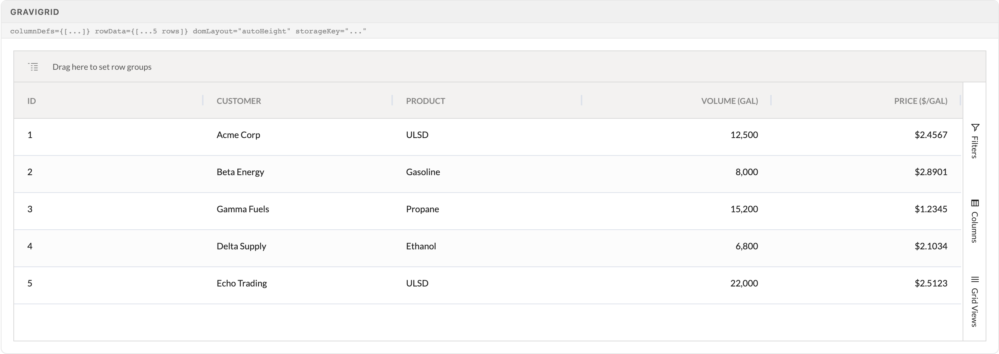
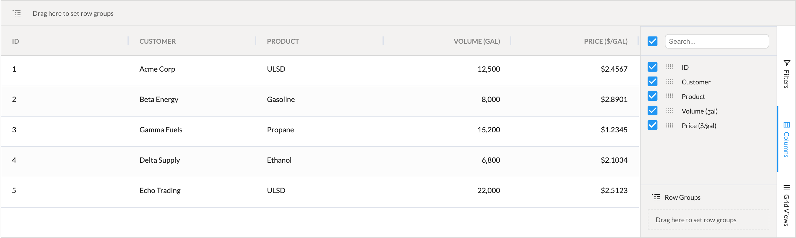
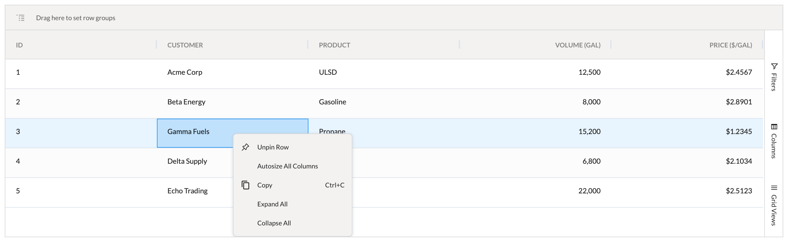
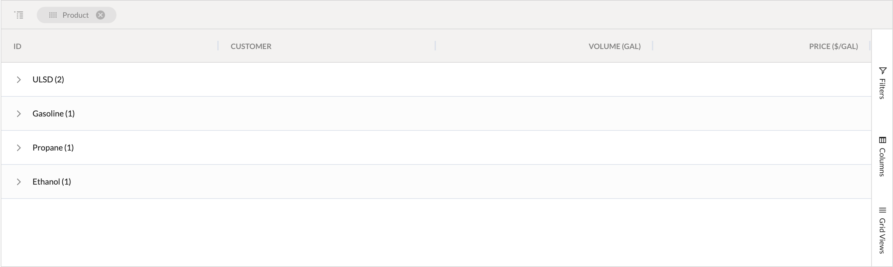

# Grid (GraviGrid)

GraviGrid is the only sanctioned way to put AG Grid Enterprise on a page. It wraps AgGridReact with Gravitate defaults — theme sync, layout persistence, a sidebar, editing pipelines, row pinning — so a working grid is four props, and a wrong one is usually a missing agPropOverrides.

> Part of the Excalibrr Design System — component reference. Index: `../CLAUDE.md`. Live page in the Excalibrr demo: `/DesignSystem/Grid` (demo runs at http://localhost:3000).

Reach for GraviGrid for any tabular data — quote books, admin lists, pricing sheets. Never render `AgGridReact` directly: GraviGrid supplies the alpine theme synced to light/dark via `ThemeContext`, 50px rows, range selection, 25-step undo/redo on cell edits, a custom context menu, and a right-edge sidebar (Filters, Columns, Grid Views). Every column is sortable, filterable, resizable, and groupable by default.

Column order, widths, sorts, filters, and groupings persist to localStorage under `gridConfig::<storageKey>` and are reapplied on mount — users keep their layout across sessions without any code. For fetched data, `useGridFetch(fetcher)` returns `{ rowData, refresh, isLoading }` and expects the response shape `{ data: { rows: T[] } }`; wire `isLoading` straight into the `loading` prop.

### GraviGrid — default



*Read-only grid with domLayout="autoHeight": row-group drop zone (rowGroupPanelShow defaults to 'always'), sortable/filterable columns, numeric right-aligned columns, and the right-edge sidebar tabs — Filters, Columns, Grid Views. Price formatted as decimal dollars ($2.4567/gal).*

### GraviGrid props

The props that matter in practice, verified against GraviGrid.tsx and index.types.ts. T is the row type.

| Prop | Type | Default | Notes |
| --- | --- | --- | --- |
| `agPropOverrides` | `Partial<AgGridReactProps<T>>` | — | REQUIRED even when empty ({}) — GraviGrid dereferences it unconditionally and throws without it. Escape hatch to raw AG Grid props (domLayout, rowHeight, getRowId, getRowClass…). Handlers for onGridReady, onCellValueChanged, onSortChanged, onColumnMoved/Pinned/Resized, onColumnRowGroupChanged, onColumnGroupOpened, and onSelectionChanged are silently clobbered — see gotchas. |
| `columnDefs` | `ColDef<T>[]` | — | Always memoize with useMemo. defaultColDef gives every column initialFlex 1, minWidth 100, sortable, filter, resizable, enableRowGroup. |
| `rowData` | `T[]` | — | Rows must carry an `id` field — the default getRowId reads data.id. Different key? Pass getRowId in agPropOverrides. |
| `storageKey` | `string` | — | Namespace for persisted layout state (localStorage key gridConfig::<storageKey>). Unique per grid — shared keys bleed layouts between grids. |
| `loading` | `boolean` | — | Drives the built-in spinner overlay; empty rowData shows the no-rows overlay automatically. Never hand-roll a spinner over the grid. |
| `controlBarProps` | `ControlBarProps<F>` | — | Renders GridControlBar above the grid: title + live result count, quick search wired to setQuickFilter, filter drawer + filter tags, and an actionButtons slot. See the controlBarProps table below. |
| `updateEP` | `(row: T \| T[], meta?) => Promise<any>` | — | Called on every committed cell edit. Setting it flips defaultColDef.editable to true for ALL columns — opt out per column with editable: false. Must merge the updated row back into React state. |
| `createEP` | `(row: T \| T[], meta?) => Promise<any>` | — | Adds a success-green Create button and a CreateModal. Pair with createConfig + createSelectOptions; shouldInsertCreated inserts the response at row 0. |
| `externalRef` | `MutableRefObject<GridApi>` | — | Handle to the grid API, extended with applyGridView(view) and resetGridToDefault(). |
| `columnDefaultOverrides` | `AgGridReactProps<T>['defaultColDef']` | — | Merged over the built-in defaultColDef — the right place to turn off enableRowGroup or filter globally. |
| `onSelectionChanged` | `AgGridReactProps['onSelectionChanged']` | — | Proxied safely — the one selection hook that is NOT clobbered. Use this prop, not agPropOverrides.onSelectionChanged. |
| `isDirtyEdit / dirtyChangesRef` | `boolean / MutableRefObject<dirtyGridApi>` | `false` | Batch-edit mode: edits accumulate against a structuredClone of rowData, dirty cells get the dirty-grid-edited class, and a DirtyEditBar appears with Save/Discard (onDirtyChangeSave / onDirtyChangeDiscard). The bar renders inside the control bar block — set controlBarProps or it never appears. |
| `isBulkChangeVisible / setIsBulkChangeVisible` | `boolean / Dispatch<SetStateAction<boolean>>` | — | Passing the setter adds a Bulk Change button; toggling on prepends a checkbox-selection column and opens the BulkChangeDrawer for selected rows. Columns must opt in with isBulkEditable: true. |
| `enableRowPinning / pinnedRowPosition` | `boolean / 'top' \| 'bottom'` | `false / 'top'` | Adds Pin Row to the context menu; pinned rows move to pinnedTopRowData/pinnedBottomRowData with accent styling and a Clear Pinned button in the control bar. Programmatic access via rowPinningRef. |
| `hideSaveDisplay` | `boolean` | `false` | Hides the SaveDisplay ('Changes Saved: h:mm A') indicator that appears once updateEP grids save. |

### Columns tool panel



*Sidebar Columns panel open: per-column visibility checkboxes, column search, drag handles, and a Row Groups drop zone. Everything the user changes here persists under the grid's storageKey.*

### Grid modes

One component, layered modes — each enabled by a prop cluster, all freely combinable.

| Variant | When to use | Code |
| --- | --- | --- |
| `Read-only` | Default. Display, sort, filter, group, export — no editing. | `<GraviGrid agPropOverrides={{}} columnDefs={cols} rowData={rows} storageKey="MyGrid" />` |
| `Inline edit` | Each cell commit saves immediately and SaveDisplay shows the save time. Use for low-stakes admin data. | `updateEP={saveRow}` |
| `Dirty edit` | Edits accumulate with visual dirty-cell marking and an explicit Save/Discard bar. Use when users review a batch before committing — pricing, publish workflows. | `isDirtyEdit dirtyChangesRef={ref} onDirtyChangeSave={...}` |
| `Bulk change` | Apply one change to many selected rows via the BulkChangeDrawer. Columns need isBulkEditable: true. | `isBulkChangeVisible={open} setIsBulkChangeVisible={setOpen}` |
| `Create` | Green Create button + modal form for new rows. | `createEP={createRow} createConfig={...} createSelectOptions={...}` |
| `Row pinning` | Users pin reference rows to the top while scrolling — comparisons, benchmarks. | `enableRowPinning` |
| `Control bar` | Title, live result count, quick search, server-side filter drawer, and action buttons in one bar above the grid. Use on every full-page grid. | `controlBarProps={{ title: 'Quotes', actionButtons: <…/> }}` |

### controlBarProps (GridControlBar)

Shape of the controlBarProps object, from GridControlBar.tsx.

| Prop | Type | Default | Notes |
| --- | --- | --- | --- |
| `title` | `string` | — | Grid title (Texto h4) with a live '<n> Results' count that tracks filters and row updates. |
| `showSelectedCount` | `boolean` | — | Switches the count to '<n> Selected \| <m> Results' when rows are selected. |
| `actionButtons` | `ReactNode` | — | Right-aligned slot. GraviGrid composes its own buttons into the same slot when those modes are on — SaveDisplay and Bulk Change before yours, Create after. |
| `serverParams / filters / setFilters` | `BaseFieldProps<F>[] / F / (f: F) => void` | — | Declarative filter fields rendered in a collapsible filter drawer, with applied filters shown as removable FilterTags under the bar. |
| `customSearchBar / customFilterDrawer` | `ReactNode / JSX.Element` | — | Replace the built-in quick-search input or the generated filter drawer wholesale. |
| `warning` | `string` | — | Shows a warning icon with tooltip next to the search input. |
| `filterDrawerDefaultExpanded` | `boolean` | `false` | Open the filter drawer on first render. |
| `hideActiveFilters` | `boolean` | — | Suppresses the FilterTags row; maxFilterTagsArrayLength truncates long array values. |

### Custom context menu



*Right-click anywhere in the grid: GraviGrid replaces AG Grid's default menu with a row-pin item (Unpin Row here), Autosize All Columns, Copy, Expand All, and Collapse All. Extend it per-column with agPropOverrides.getAdditionContextMenuItems(colId, rowData).*

### Row grouping



*Product dragged into the group drop zone: groupDisplayType defaults to 'groupRows', so groups render as full-width collapsible rows with counts. The group chip is removable; the grouping persists under storageKey.*

### Canonical editable grid

```tsx
import { useCallback, useMemo, useState } from 'react'
import { GraviGrid } from '@gravitate-js/excalibrr'
import type { ColDef } from 'ag-grid-community'

interface QuoteRow {
  id: number
  customer: string
  product: string
  price: number
}

const [rowData, setRowData] = useState<QuoteRow[]>(seedRows)

// Memoize — unmemoized defs rebuild the grid's columns every render
const columnDefs = useMemo<ColDef<QuoteRow>[]>(
  () => [
    // updateEP makes columns editable by default — opt read-only columns out
    { field: 'customer', headerName: 'Customer', flex: 1, editable: false },
    { field: 'product', headerName: 'Product', width: 140, editable: false },
    {
      field: 'price',
      headerName: 'Price ($/gal)',
      type: 'numericColumn',
      valueFormatter: (p) => (p.value != null ? `$${p.value.toFixed(4)}` : ''),
      editable: true,
      isBulkEditable: true, // required for the bulk change drawer
    },
  ],
  []
)

// Called on every committed cell edit — MUST merge the row back into state
const updateEP = useCallback(async (updated: QuoteRow | QuoteRow[]) => {
  const rows = Array.isArray(updated) ? updated : [updated]
  setRowData((prev) => prev.map((r) => rows.find((u) => u.id === r.id) ?? r))
}, [])

<GraviGrid
  agPropOverrides={{
    domLayout: 'autoHeight',
    // GraviGrid clobbers onGridReady etc. — attach AG Grid listeners here
    onFirstDataRendered: ({ api }) =>
      api.addEventListener('columnRowGroupChanged', handleGroupChange),
  }}
  columnDefs={columnDefs}
  rowData={rowData}
  storageKey="QuoteBookGrid"
  updateEP={updateEP}
/>
```

Every row carries an id (the default getRowId reads data.id). Quick search, sidebar, grouping, the context menu, and layout persistence all come free — do not rebuild them.

### Grid constants & pinning styles

Source-exact values from GraviGrid.tsx and its co-located styles.css.

| Token | Value | Use for |
| --- | --- | --- |
| `rowHeight` | `50px` | Default row height unless agPropOverrides.rowHeight is set |
| `ag-theme-alpine / ag-theme-alpine-dark` | `set automatically from ThemeContext` | Never set the AG theme class yourself |
| `.gravi-grid-row-pinned` | `background: var(--theme-color-2-dim); border-top: 1px solid var(--gray-200)` | Every pinned row |
| `.gravi-grid-column-pinned` | `border-left: 4px solid var(--theme-color-2)` | First displayed cell of a pinned row — the accent edge marker |

### Do's & Don'ts

- **Do:** Memoize columnDefs (and anything inside agPropOverrides) with useMemo
  **Don't:** Build the defs array inline in JSX
  **Why:** GraviGrid calls api.setColumnDefs whenever the reference changes — inline arrays rebuild columns every render and thrash persisted column state.
- **Do:** Format display values with valueFormatter — money as decimal dollars ($2.4567/gal)
  **Don't:** Use cellRenderer for plain text or number formatting
  **Why:** cellRenderer mounts a React component per cell; valueFormatter is a string transform with no mount cost.
- **Do:** Give every grid a unique storageKey
  **Don't:** Copy-paste a storageKey between grids or omit it
  **Why:** Layout state persists under gridConfig::<storageKey> — collisions bleed one grid's column layout into another.
- **Do:** Drive overlays with the loading prop
  **Don't:** Hand-roll a spinner stacked over the grid
  **Why:** GraviGrid already orchestrates the loading and no-rows overlays from loading + rowData.length.
- **Do:** Add page-level chrome through controlBarProps.actionButtons
  **Don't:** Float your own button row above the grid
  **Why:** The control bar slots actions next to the built-in Bulk Change / Create buttons with correct spacing and alignment.

### Gotchas

- **agPropOverrides={{}} is mandatory** — GraviGrid dereferences agPropOverrides unconditionally (agPropOverrides.columnDefs, .rowHeight, .getRowClass…). Omitting the prop throws on first render. Pass an empty object when there is nothing to override.
- **AG Grid event handlers in agPropOverrides are silently clobbered** — GraviGrid spreads agPropOverrides first, then pins its own onGridReady, onCellValueChanged (the edit pipeline), onSortChanged, onColumnMoved, onColumnPinned, onColumnResized, onColumnRowGroupChanged, onColumnGroupOpened, and onSelectionChanged. Your handler for any of those keys never fires and nothing warns. Register listeners via agPropOverrides.onFirstDataRendered: ({ api }) => api.addEventListener('eventName', fn). Only onFilterChanged and onRowDataUpdated are proxied; for selection use the top-level onSelectionChanged prop.
- **Unmemoized columnDefs rebuild the grid every render** — An internal effect re-applies column defs whenever the array reference changes. Inline defs reset column state, flicker headers, and cancel in-flight edits. Always useMemo.
- **cellClass/cellStyle never re-run on external React state changes** — AG Grid evaluates these callbacks on its own schedule, not on React re-renders — reading component state inside them shows stale styling. Keep the live value in a ref and call gridApi.refreshCells({ force: true }) when it changes.
- **editable: true alone does not enable bulk editing** — The BulkChangeDrawer only offers columns flagged isBulkEditable: true. Without it the column edits inline but is missing from bulk change.
- **valueGetter on an editable column silently swallows edits** — Without a matching valueSetter the commit has nowhere to write — the cell reverts with no error. Pair them, or edit the raw field instead.
- **updateEP must merge updated rows back into state** — GraviGrid calls updateEP on every cell commit and flashes SaveDisplay regardless of what it does. A no-op Promise.resolve() looks saved while edits evaporate on the next render. Merge the row into React state via setRowData, keyed by id.
- **updateEP makes every column editable** — defaultColDef.editable is literally !!updateEP. The moment you add an update endpoint, all columns become editable — set editable: false explicitly on read-only columns.
- **Rows need an id field** — The default getRowId returns data.id. Rows without it break selection, pinning, and row transactions. Use a different key by passing getRowId in agPropOverrides.
