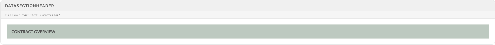
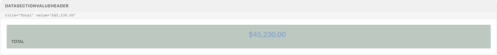
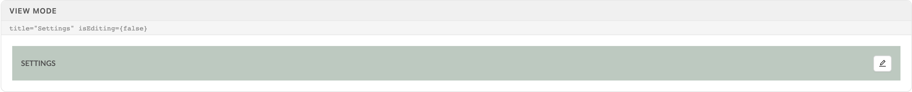
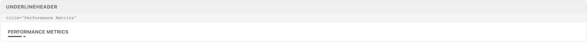

# Headers

Section headers carve detail panels, drawers, and widgets into scannable bands. Three live on a tinted full-width band (DataSectionHeader, DataSectionValueHeader, EditSectionHeader); two are lightweight widget titles with an underline flair (UnderlineHeader, WidgetHeader). Pick by job, not by looks.

> Part of the Excalibrr Design System — component reference. Index: `../CLAUDE.md`. Live page in the Excalibrr demo: `/DesignSystem/Headers` (demo runs at http://localhost:3000).

Reach for a header component whenever a panel or drawer holds more than one cluster of fields — the tinted band is the visual contract that says "new section starts here." `DataSectionHeader` is the plain label band; `DataSectionValueHeader` adds a headline metric to the band; `EditSectionHeader` adds an edit/save toggle that drives a view↔edit mode for the fields below it. `UnderlineHeader` and `WidgetHeader` are a different species: no band, just an uppercase title with a short SVG underline, meant for dashboard widgets and cards — `WidgetHeader` is `UnderlineHeader` plus a right column for controls and a bottom border.

All five render their title uppercase at 600 weight in `--gray-600`. Never hand-roll an uppercase `<div>` to fake a section break — the band components keep spacing, casing, and theme tint consistent across every detail surface.

### Which header

One decision: what does the section need beyond a label?

| Variant | When to use | Code |
| --- | --- | --- |
| `DataSectionHeader` | Plain labeled band — read-only section, no metric, no actions. | `<DataSectionHeader title='Contract Overview' />` |
| `DataSectionValueHeader` | Band that leads with a headline number (totals, averages). Value renders 1.8em bold in `--theme-option`. | `<DataSectionValueHeader title='Total' value='$45,230.00' />` |
| `EditSectionHeader` | Section whose fields toggle between read-only and editable. The header owns the pencil/save toggle. | `<EditSectionHeader title='Terms' editing={editing} onEdit={() => setEditing(true)} />` |
| `UnderlineHeader` | Widget or card title with the underline flair, nothing else. | `<UnderlineHeader title='Performance Metrics' />` |
| `WidgetHeader` | Widget title plus right-aligned controls, with a bottom border separating header from widget body. | `<WidgetHeader title='Volume' controls={<DateSkipper startDate={date} daysToSkip={1} onChange={onDateChange} />} alignControls='right' />` |
| `SearchGridHeader` | Never. Deprecated and flagged for removal — it still uses antd `visible` APIs. Use `GridControlBar` and GraviGrid's own header slots for grid pages. | — |

### DataSectionHeader



*The plain band: full-width tint from --theme-color-2-dim, 1.2em padding, title forced uppercase at 600 weight in --gray-600.*

### DataSectionValueHeader



*Same band, two halves: title in the left antd Col (span 12), headline value in the right — 1.8em bold in --theme-option. The value column starts at the 50% mark; it is not right-aligned.*

### DataSectionHeader / DataSectionValueHeader

| Prop | Type | Default | Notes |
| --- | --- | --- | --- |
| `title` | `string \| ReactNode` | — | Section label. `DataSectionHeader` types it as `string`; `DataSectionValueHeader` accepts any node. CSS uppercases it either way — write it in normal case. |
| `value` | `ReactNode` | — | DataSectionValueHeader only. The headline metric. Money is decimal dollars — `$0.0100/gal`, never cents. The title beside it carries an inline `marginTop: '4%'` to sit on the value's baseline. |
| `className` | `string` | — | Appended to `detail-section-header` on the outer antd Col. Both components span 24 — the band always fills its container. |

### EditSectionHeader — view state



*View state: title band with the EditSaveButton pencil right-aligned (title Col span 18, button Col span 6). With editing={true} the pencil swaps to a save icon that submits the enclosing antd Form.*

### EditSectionHeader

Verified against source — the props are `editing` and `onEdit`. There is no `isEditing`, `onSave`, or `onCancel`; passing them does nothing and the header stays in view state.

| Prop | Type | Default | Notes |
| --- | --- | --- | --- |
| `title` | `string` | — | Section label, uppercased by CSS. |
| `editing` | `boolean` | — | Drives the EditSaveButton: false renders a pencil that fires `onEdit`; true renders a save icon with `htmlType='submit'` — it submits the nearest enclosing antd Form. |
| `onEdit` | `() => void` | — | Fires on pencil click. Flip your `editing` state here. Exiting edit mode happens in the Form's `onFinish` — there is no `onSave` prop. |
| `success` | `boolean` | `false` | Adds the `.success` class: band turns `--gray-300` with white bold text. Used as a saved/confirmed flash on the section. |
| `leftAlignToggle` | `boolean` | `false` | Moves the toggle button next to the title instead of the far right, and renders `children` in the remaining Row space — the slot for extra header controls. |
| `titleSpan` | `number` | `12` | Title Col width, only honored when `leftAlignToggle` is true. Default layout is fixed at 18/6. |

### UnderlineHeader



*Uppercase widget title with the WidgetUnderline SVG flair (#002140 navy, 41×2) anchored under the first characters. Captured with the title in a positioned wrapper — required, see gotchas.*

### WidgetHeader / UnderlineHeader

| Prop | Type | Default | Notes |
| --- | --- | --- | --- |
| `title` | `string` | — | Widget title, uppercased at 600 weight in `--gray-600`. |
| `useWhiteIcon` | `boolean` | `false` | Renders the underline in white instead of #002140 — for titles sitting on dark fills. |
| `controls` | `ReactNode` | — | WidgetHeader only. Right-column slot for pickers, buttons, toggles. |
| `titleSpan / controlSpan` | `number` | `12 / 12` | WidgetHeader only. antd Col spans for the two halves — must sum to 24. |
| `alignControls` | `string` | `''` | WidgetHeader only. Passed to the controls Col as `align`; set `'right'` to push controls to the edge. |

### Canonical section with an editable header

```tsx
import { useState } from 'react'
import { Form } from 'antd'
import {
  DataSectionValueHeader,
  EditSectionHeader,
  Vertical,
} from '@gravitate-js/excalibrr'

export function ContractTermsSection({ contract, onSave }) {
  const [form] = Form.useForm()
  const [editing, setEditing] = useState(false)

  return (
    <Vertical gap={12}>
      <DataSectionValueHeader title='Avg Margin' value='$0.0425/gal' />

      <Form
        form={form}
        initialValues={contract}
        onFinish={(values) => {
          onSave(values)
          setEditing(false) // exit edit mode here — there is no onSave prop
        }}
      >
        {/* save icon is htmlType='submit'; it fires this Form's onFinish */}
        <EditSectionHeader
          title='Contract Terms'
          editing={editing}
          onEdit={() => setEditing(true)}
        />
        {/* section fields: inputs when editing, read-only values otherwise */}
      </Form>
    </Vertical>
  )
}
```

The header must sit inside the Form it saves — the save button is a plain HTML submit, not a callback.

### Source CSS values

From `DataDisplay/Headers/index.css` and `Layout/Widgets/index.css` in the library source.

| Token | Value | Use for |
| --- | --- | --- |
| `--theme-color-2-dim` | `theme-dependent tint` | Band background for all `.detail-section-header` components. Swings green↔blue with the active theme — never assume a fixed hue. |
| `.detail-section-header padding` | `1.2em` | Band inset on all four sides. |
| `.detail-section-text` | `600 / uppercase / --gray-600` | Title styling shared by every band header. |
| `.detail-section-value` | `1.8em / bold / --theme-option` | Headline value in DataSectionValueHeader. |
| `.detail-section-header.success` | `--gray-300 bg, white bold text` | EditSectionHeader `success` state. |
| `.widget-header` | `0.75em padding, 1px bottom border --gray-300` | WidgetHeader row; the border separates header from widget body. |
| `WidgetUnderline` | `#002140, 41×2 SVG, stroke 2` | Underline flair; absolutely positioned at left 0 / top 1.5em of the nearest positioned ancestor. |

### Do's & Don'ts

- **Do:** Drive EditSectionHeader with `editing` and `onEdit`.
  **Don't:** Pass `isEditing`, `onSave`, or `onCancel`.
  **Why:** Those props don't exist — React drops them silently and the header never leaves view state. The save path is the enclosing Form's onFinish.
- **Do:** Wrap EditSectionHeader and its fields in one antd `<Form onFinish={...}>`.
  **Don't:** Wire saving through a click handler on the header.
  **Why:** The save icon is `htmlType='submit'` — outside a Form it submits nothing and the click is a no-op.
- **Do:** Use DataSectionHeader for every section break in a panel or drawer.
  **Don't:** Hand-roll uppercase `<div>` labels with custom backgrounds.
  **Why:** The band carries the theme tint and consistent 1.2em rhythm; ad-hoc labels drift on both.
- **Do:** Write money values in decimal dollars — `$0.0100/gal`.
  **Don't:** Use cents (¢) anywhere in a value header.
  **Why:** Gravitate copy standard: decimal dollars across all surfaces.
- **Do:** Build grid pages with `GridControlBar` and GraviGrid's header slots.
  **Don't:** Reach for SearchGridHeader.
  **Why:** It's deprecated, flagged for removal, and built on antd APIs (`visible`, `dropdownClassName`) that are themselves deprecated.

### Gotchas

- **The published package ships without header CSS** — excalibrr 5.2.1's `dist/index.css` contains none of the `.detail-section-*` or `.widget-*` rules — the components mount unstyled (no band, no uppercase, inline underline). The specimens above were captured with the library-source CSS applied. Before building on these components, verify the styles exist in your build; if not, port `DataDisplay/Headers/index.css` and `Layout/Widgets/index.css` into the app until the package build is fixed.
- **`editing`, not `isEditing`** — EditSectionHeader's mode prop is `editing`. The demo showcase itself passes `isEditing`/`onSave`/`onCancel` — which is why both of its specimens render the pencil. Wrong prop names fail silently; the header just never shows the save state.
- **Save is a form submit, not a callback** — In edit state the EditSaveButton renders with `htmlType='submit'`. It only works inside an antd Form; exit edit mode in `onFinish`. There is no cancel affordance — if the section needs one, render it via `leftAlignToggle` + `children`.
- **WidgetUnderline needs a positioned ancestor** — The underline SVG is `position: absolute; left: 0; top: 1.5em`. If no ancestor establishes a positioning context, it anchors to the page and escapes the header entirely. Give the title an `inline-block`/`relative` wrapper (production usage puts it inside a positioned Col).
- **DataSectionValueHeader's value is not right-aligned** — The value sits in the right half-Col and starts at the 50% mark, which reads as roughly centered on wide bands. Pass a styled node as `value` if the layout needs edge alignment.
