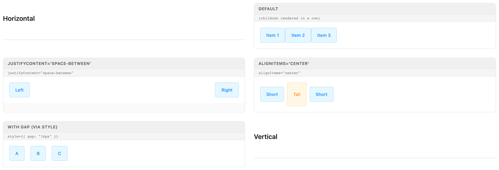
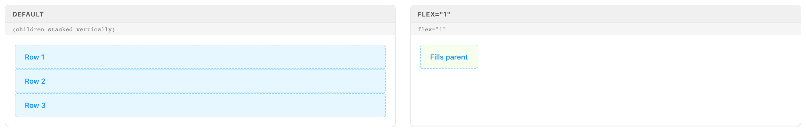
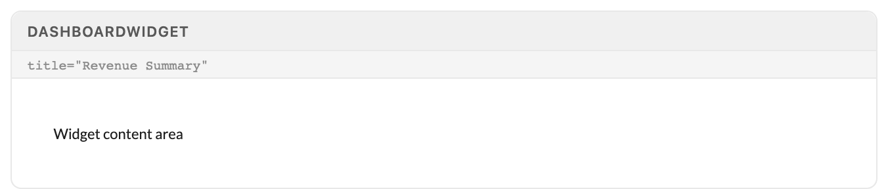
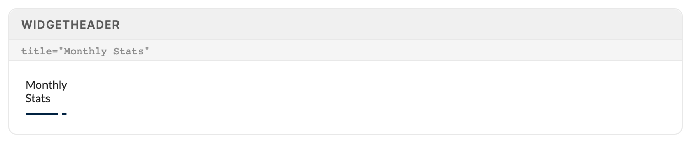

# Layout Primitives

Vertical and Horizontal are Excalibrr's flexbox primitives — every page scaffold, split pane, and toolbar is composed from them, with all geometry set through props. DashboardWidget and WidgetHeader frame content tiles; Overlay gates a region behind an antd Spin while it loads.

> Part of the Excalibrr Design System — component reference. Index: `../CLAUDE.md`. Live page in the Excalibrr demo: `/DesignSystem/Layout` (demo runs at http://localhost:3000).

### When to reach for these

Use `Vertical` and `Horizontal` anywhere you would otherwise write `<div style={{ display: 'flex' }}>` — page scaffolds, split panes, control bars, button rows, form footers. Each renders a single flex `div` whose geometry is set entirely by props (`flex`, `gap`, `width`, `height`, `justifyContent`, `alignItems`), which keeps layout declarative and reviewable. Passing the same values through `style` is the #1 reviewed-out mistake in generated code.

The two are not symmetric. `Vertical` is greedy: it defaults to `flex: '1 1 auto'` and `height: '100%'`, so it fills whatever its parent gives it. `Horizontal` hugs content: it defaults to `flex: '0 1 auto'` with no height. Both set `overflow: hidden` unless you pass `scroll` — pick the one pane that scrolls and mark it explicitly.

### Horizontal



*Horizontal states: default row hugging its children; justifyContent="space-between" splitting a full-width row; alignItems="center" cross-axis alignment with mixed-height children; gap={16} spacing. The "via style" card label is a showcase typo — the code behind it passes gap={16} as a prop.*

### Vertical



*Vertical states: "Default" stack (children stretch full-width) and flex="1" claiming all available space inside a fixed-height flex parent. The "Default" card is not pure default — the showcase overrides with style={{ height: 'auto' }} so the card hugs content; a true default Vertical fills its parent via height '100%'.*

### Vertical / Horizontal props

Both share one prop surface; defaults differ where noted. Every layout concern has a prop — `style` exists only as an escape hatch for properties with no prop equivalent.

| Prop | Type | Default | Notes |
| --- | --- | --- | --- |
| `flex` | `CSSProperties['flex']` | `Vertical '1 1 auto' · Horizontal '0 1 auto'` | Vertical grows to fill by default; Horizontal hugs content. Pass flex="1" to make a row claim remaining space. Never style={{ flex: 1 }}. |
| `gap` | `CSSProperties['gap']` | `0` | Spacing between children; a number is pixels (gap={12}). The sanctioned spacing mechanism — never style={{ gap: '12px' }} and never margin on children. |
| `height / width` | `CSSProperties values` | `Vertical height '100%' · Horizontal none` | Explicit sizing as props: height="100%", width={320}. Horizontal also has fullHeight (boolean) which adds the h-100 utility class. |
| `justifyContent / alignItems` | `standard flex values` | — | Main-axis and cross-axis alignment, passed as props: justifyContent="space-between", alignItems="center". |
| `verticalCenter / horizontalCenter` | `boolean` | `false` | Screen-axis centering shorthands. verticalCenter centers along the screen's vertical axis — justifyContent in Vertical, alignItems in Horizontal. horizontalCenter mirrors. They are not flex-axis aliases. |
| `scroll` | `boolean` | `false` | true → overflow: auto. false → overflow: hidden — overflowing content is clipped, not scrolled. Mark exactly one pane per region as the scroller. |
| `bg` | `'default' \| 'elevated' \| 'layout' \| 'primary' \| 'info' \| 'success' \| 'warning' \| 'error'` | — | Tonal background resolved from theme tokens — theme-safe in light and dark. Prefer this over background. See the bg tones table. |
| `background` | `string (CSS variable name)` | — | Renders var(--<value>): background="bg-2" → var(--bg-2). A raw color like "#fff" produces invalid CSS and silently fails. Legacy — prefer bg. |
| `border` | `'all' \| 'top' \| 'bottom' \| 'left' \| 'right'` | — | 1px solid on the named side(s). Color comes from the theme's colorBorder token — or the matching status border color when bg is a status tone. |
| `borderRadius` | `CSSProperties['borderRadius']` | — | Corner rounding, usually paired with bg + border to make a soft panel. |
| `style` | `React.CSSProperties` | — | Escape hatch, spread last so it wins. Use only for properties with no prop equivalent (e.g. position, minWidth) — never for flex, gap, height, or alignment. |

### bg tones

The bg prop is the real variant axis on both primitives — a fixed set of theme-resolved surface tones.

| Variant | When to use | Code |
| --- | --- | --- |
| `default` | Card-on-page content surface; resolves to the antd colorBgContainer token. | `<Vertical bg='default'>` |
| `elevated` | Raised panels, drawers, control bars; resolves to var(--bg-2). | `<Vertical bg='elevated' border='all' borderRadius={8}>` |
| `layout` | Page chrome and recessed wells behind cards; resolves to var(--bg-3). | `<Vertical bg='layout'>` |
| `primary / info / success / warning / error` | Status-tinted callout regions; resolves to the matching antd colorXxxBg token. Pair with border and the border color switches to the matching colorXxxBorder automatically. | `<Horizontal bg='warning' border='all' borderRadius={6} gap={8}>` |

### Canonical page scaffold

```tsx
// All layout via props — never style
<Vertical height='100%' gap={12}>
  {/* Header row: hugs its content height */}
  <Horizontal justifyContent='space-between' verticalCenter gap={8}>
    <Texto category='h4'>Quote Book</Texto>
    <GraviButton theme1 buttonText='Publish Prices' onClick={onPublish} />
  </Horizontal>

  {/* Body row: flex='1' claims remaining height */}
  <Horizontal flex='1' gap={12}>
    <Vertical flex='2' scroll>
      {/* main content / grid */}
    </Vertical>
    <Vertical flex='1' bg='elevated' border='left'>
      {/* side panel */}
    </Vertical>
  </Horizontal>
</Vertical>
```

Vertical fills by default, so the inner panes need no height. The body Horizontal needs flex='1' explicitly — rows hug content unless told to grow. The main pane gets scroll; everything else clips.

### DashboardWidget



*DashboardWidget with no widgetTitle — a bare wrapper around children, no header row. The showcase's title="Revenue Summary" annotation is wrong twice over: the prop is widgetTitle, and it was never passed here.*

### WidgetHeader



*WidgetHeader with title="Monthly Stats" and an empty controls slot. The flair is the WidgetUnderline SVG; the uppercase/gray title styling from the library source CSS does not ship in the current package, so the text renders plain.*

### DashboardWidget / WidgetHeader props

DashboardWidget is a `driver-widget` wrapper that optionally renders a WidgetHeader above its children. WidgetHeader is also exported standalone (as is UnderlineHeader, the title-plus-flair on its own). The header is an antd Row split into two Cols.

| Prop | Type | Default | Notes |
| --- | --- | --- | --- |
| `widgetTitle` | `string` | — | DashboardWidget. Renders a WidgetHeader above children; omit it and the wrapper renders headerless. The prop is widgetTitle — title is silently ignored. |
| `headerChildren` | `ReactNode` | — | DashboardWidget. Right-side header controls, forwarded to WidgetHeader's controls slot. |
| `title / controls` | `string / ReactNode` | — | WidgetHeader. title is required and gets the WidgetUnderline flair; controls fills the right Col. |
| `titleSpan / controlSpan` | `number` | `12 / 12` | antd 24-column split between title and controls — keep the sum at 24 or the header wraps. |
| `alignControls` | `string` | `''` | Col align passthrough; 'right' pushes controls to the header's right edge. |
| `useWhiteIcon` | `boolean` | `false` | White underline flair for headers on dark surfaces. |

### Overlay props

Overlay wraps a region in an antd `Spin` while it loads. When `renderOverlay` is true the children render dimmed behind the spinner; when false they render bare inside a Fragment. Toggling `renderOverlay` swaps the root element between `Spin` and `Fragment`, so React remounts the children subtree — component state and scroll position do NOT survive the flip. Hoist any state that must outlive the loading flash above the Overlay. No demo specimen exists yet; the surface below is verified against package types.

| Prop | Type | Default | Notes |
| --- | --- | --- | --- |
| `renderOverlay` | `boolean` | — | Required. true wraps children in <Spin>; false renders them untouched. |
| `overlayContent` | `SpinProps['tip']` | — | Text under the spinner — Spin's tip, renamed. |
| `overlayIndicator` | `SpinProps['indicator']` | — | Custom spinner element — Spin's indicator, renamed. |
| `...SpinProps` | `antd SpinProps` | — | Declared in the type but only tip/indicator are forwarded in the current implementation — do not rely on size or delay reaching the Spin. |

### Do / Don't

- **Do:** <Vertical flex="1"> / <Vertical height="100%">
  **Don't:** <Vertical style={{ flex: 1 }}> / style={{ height: '100%' }}
  **Why:** Layout goes through props — this is the #1 reviewed-out mistake in generated Excalibrr code. style is the escape hatch, not the API.
- **Do:** <Horizontal gap={12}>
  **Don't:** <Horizontal style={{ gap: '12px' }}> or margins on children
  **Why:** gap is the sanctioned spacing mechanism; numbers are pixels.
- **Do:** Pass scroll on the one pane that scrolls
  **Don't:** Expect overflowing content to scroll on its own
  **Why:** Both primitives set overflow: hidden by default — unscrolled overflow is clipped silently.
- **Do:** <Horizontal flex="1"> when a row must fill remaining height
  **Don't:** Assume rows grow like columns do
  **Why:** Horizontal defaults to flex '0 1 auto' (hugs); Vertical defaults to '1 1 auto' (fills).
- **Do:** <DashboardWidget widgetTitle="Revenue Summary">
  **Don't:** <DashboardWidget title="Revenue Summary">
  **Why:** The prop is widgetTitle; title is silently dropped and the header never renders.

### Gotchas

- **Layout props, never style** — flex="1" not style={{ flex: 1 }}; height="100%" not style={{ height: '100%' }}; gap={12} not style={{ gap: '12px' }}; justifyContent="space-between" as a prop. style technically wins (it is spread last) which is exactly why it slips through review — hold the line.
- **Both primitives clip by default** — overflow is hidden unless scroll is passed. Content that outgrows its pane disappears with no scrollbar and no error — if something is missing at the bottom of a panel, check for a missing scroll first.
- **Vertical fills, Horizontal hugs** — Vertical defaults to flex '1 1 auto' + height '100%'; Horizontal defaults to flex '0 1 auto' with no height. Stacked Verticals split space evenly without any props; stacked Horizontals collapse to content height until one gets flex="1".
- **verticalCenter / horizontalCenter are screen-axis, not flex-axis** — verticalCenter means "center along the screen's vertical axis": it sets justifyContent in Vertical but alignItems in Horizontal. horizontalCenter mirrors. Read them as visual intent and they always do the right thing; read them as flex aliases and they look swapped.
- **background takes a CSS variable name, not a color** — background="bg-2" renders background: var(--bg-2). Passing "#fff" or "white" produces var(--#fff) — invalid CSS, silently no background. Prefer the bg tonal prop, which resolves real theme tokens in both light and dark.
- **DashboardWidget's flex prop is broken** — The class logic is inverted (flex ? '' : `flex-${flex}`): omitting flex emits a junk flex-undefined class, and passing it emits nothing. Size widgets with a parent Vertical/Horizontal and ignore this prop.
- **WidgetHeader spans are an antd 24-column split** — titleSpan and controlSpan default to 12/12 and must sum to 24 — a 16/12 split wraps the controls onto a second line.
