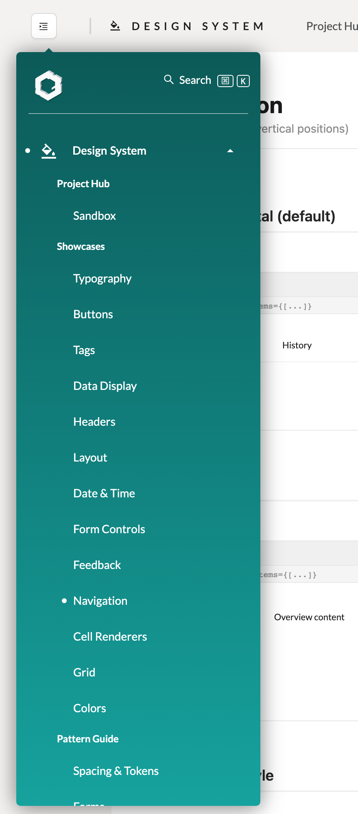
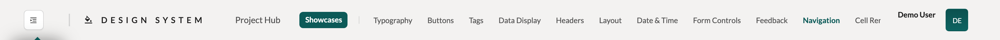
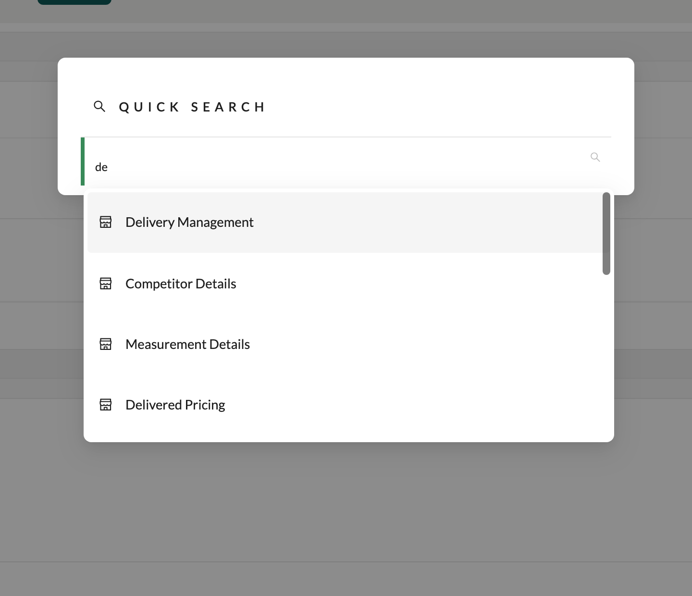
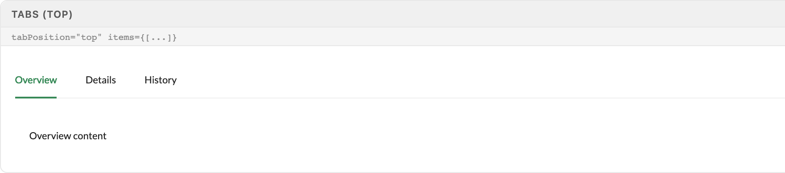
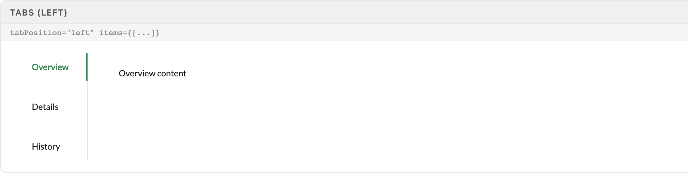
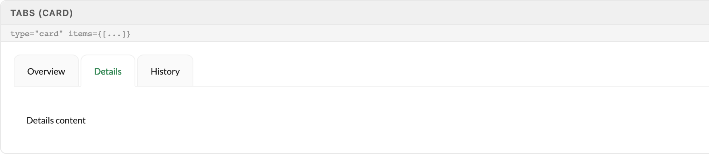

# Navigation

Navigation has two layers: the app chrome Excalibrr generates from a single pageConfig object — sidebar, toolbar, routes, quick search — and the in-page wayfinding you compose from antd Tabs. Declare sections, enable scopes, and let the provider build the rest; never hand-roll the chrome.

> Part of the Excalibrr Design System — component reference. Index: `../CLAUDE.md`. Live page in the Excalibrr demo: `/DesignSystem/DSNavigation` (demo runs at http://localhost:3000).

Excalibrr owns the application shell. `NavigationContextProvider` takes a `pageConfig` object and an async `getScopes()` and generates everything downstream: the React Router route tree, the hover-expanding sidebar (`VerticalNav`), the per-section toolbar with route links (`PageToolbar`), the Cmd+K quick-search command palette, the 404 page, and last-visited-page persistence. You declare sections and routes — the provider builds the chrome.

Inside a page, wayfinding is antd `Tabs`: parallel views of one entity (drawer sections, detail panes, settings groups). Build both `Tabs` and `Menu` from the antd v5 `items` array — `Tabs.TabPane` is removed outright, and Menu JSX children are deprecated for removal.

`useNavigationContext()` exposes `{ validPages }` — the permission-filtered page tree — anywhere under the provider, for breadcrumbs or custom page lists.

### Vertical nav sidebar



*The 80px rail expands to 260px on hover. The active section (Design System) is open: flat child routes, bold sub-group headings (Showcases, Pattern Guide) rendered by SubPageGroupings, and the white active-route dot on Navigation. The expanded child list collapses again when the pointer leaves.*

### Page toolbar



*PageToolbar renders per section: sidebar toggle, section icon + title, then one link per visible route — plain links for single pages, a filled tag for the active group (Showcases). Note the right edge: route links past the available width clip silently under the user pane — the 13-route ceiling in action.*

### Quick search



*Cmd+K (Ctrl+I on Windows) toggles the command palette. Every permissioned route in pageConfig is auto-registered as a command; typing filters by name, selecting navigates and closes. No extra wiring — registration happens inside getValidPages.*

### NavigationContextProvider

Mount once, above the router outlet. Everything else is derived.

| Prop | Type | Default | Notes |
| --- | --- | --- | --- |
| `pageConfig` | `Record<string, Page>` | — | The entire nav tree. Top-level key order defines section order in the sidebar. |
| `getScopes` | `() => Promise<Record<string, Scope>>` | — | Async permission fetch. Pages render only after it resolves, and only sections whose key appears in the result are kept — keys must match pageConfig keys exactly (case-sensitive). |
| `navStyle` | `'horizontal' \| 'vertical' \| 'inline'` | `'vertical'` | vertical = sidebar + PageToolbar (the Gravitate standard). horizontal = top Menu bar. 'inline' exists in the type but has no layout of its own — any value other than 'vertical' falls through to the horizontal layout. Do not use it. |
| `userControlPane` | `ReactNode` | — | Right-edge slot in the toolbar: user menu, theme switcher, notifications. |
| `handleLogout` | `() => void` | — | Required by the type; passed through to the page wrapper. |
| `updatePreferenceSetting` | `(key: string, value: string) => void` | `() => {}` | Mirrors last-visited persistence (last_page_section, last_<section>_page) to your backend alongside localStorage. |

### Page (pageConfig entry)

One shape for sections, groups, and leaf routes — nesting depth decides the role. Sections hold routes; routes can hold one more level of grouped pages.

| Prop | Type | Default | Notes |
| --- | --- | --- | --- |
| `key` | `string` | — | URL segment and scope key in one. Must equal the pageConfig object key for sections. |
| `title` | `string` | — | Label in sidebar, toolbar, and quick search. |
| `icon` | `ReactNode` | — | Antd icon. Sections only — child quick-search rows reuse the section icon. |
| `element` | `ReactNode` | — | Routed component for leaf pages. Sections can omit it — React Router renders an implicit <Outlet/>. |
| `routes` | `Page[]` | — | Child pages. One extra grouping level is supported (group with routes renders a bold heading in the sidebar, URLs stay flat at /<section>/<leafKey>). Keep visible routes at 13 or fewer per section. |
| `defaultRedirect` | `string` | — | Landing child for the bare section URL. Required whenever routes exist — the generated index redirect dereferences it unconditionally when no last-visited page is stored. |
| `hasPermission` | `boolean \| (scopes) => boolean` | — | Route-level gate. The permission filter invokes it (`!hasPermission \|\| hasPermission(scopes)`), so omit it or pass a function — a literal boolean breaks: false short-circuits to visible, true crashes the filter. Filtered routes also drop out of quick search. |
| `hideNav` | `boolean` | — | Unreliable — only consulted in two aggregate does-this-group-have-visible-children checks (sidebar group expand, toolbar links row). An individual route with hideNav still renders in the sidebar child list, the toolbar, and quick search. Use query_page to hide a single route. |
| `index / query_page` | `number / string` | — | Both exclude a first-level route from sidebar, toolbar, and quick search while its URL stays deep-linkable — the only reliable single-route hides. Grouped (second-level) children leak: the toolbar GroupDropdown ignores both flags and the sidebar group list ignores query_page. |

### Wiring a new section

Two files, every time. The provider does the rest — routes, sidebar entry, toolbar links, quick-search commands.

1. **Declare the section in pageConfig.tsx AND enable its key in the AuthenticatedRoute scopes object.** — getValidPages iterates the scope keys, not the pageConfig keys — a section missing from scopes is dropped without warning.
2. **Scope keys match pageConfig keys exactly, case-sensitive.** — scopes.bakery does nothing for config.Bakery; the menu item silently never appears.
3. **Set defaultRedirect on every section that has routes.** — The generated index route falls back to it when no last-visited page is stored — omit it and first-time visits to the bare section URL navigate to undefined.
4. **Cap each section at 13 visible routes.** — PageToolbar lays route links in one non-wrapping row; route 14 and beyond clip under the user pane with no overflow affordance and no error.
5. **Clear the last_page_section / last_<section>_page localStorage keys when you remove routes.** — The chrome replays last-visited paths on load — stale keys strand users on deleted pages.

### Canonical section wiring

```tsx
// 1. demo/src/pageConfig.tsx — declare the section
config.PricingEngine = {
  hasPermission: () => true,
  key: 'PricingEngine',          // URL segment AND scope key
  icon: <DollarOutlined />,
  title: 'Pricing Engine',
  defaultRedirect: 'QuoteBook',  // landing child for /PricingEngine
  routes: [
    { hasPermission: () => true, key: 'QuoteBook', title: 'Quote Book', element: <QuoteBook /> },
    { hasPermission: () => true, key: 'Markers', title: 'Markers', element: <Markers /> },
    // ...keep visible routes <= 13 per section
  ],
}

// 2. demo/src/_Main/AuthenticatedRoute.jsx — enable the scope
const scopes = {
  Welcome: true,
  PricingEngine: true, // must match the section key exactly (case-sensitive)
}
```

Both files or no menu item. Routes, sidebar entry, toolbar links, and quick-search commands are all generated from this one declaration.

### In-page wayfinding: Tabs

Tabs switch parallel views of one entity — they never replace section navigation. If a destination deserves a URL, it belongs in pageConfig, not in a tab. Three or more peer views of the same record (Overview / Details / History) is the Tabs sweet spot; two views are usually better as a Segmented toggle.

### Tabs — line, top (default)



*Default horizontal line tabs: active tab in theme green with ink-bar underline, inactive tabs in body color, content panel below. This is the workhorse for drawer and detail-pane sections.*

### Tabs — line, left



*tabPosition="left" rotates the ink bar to the divider edge and stacks labels vertically — for tall settings or profile surfaces where the tab list outgrows horizontal space.*

### Tabs — card



*type="card" with the middle tab selected: the active card (Details) fuses with the panel, inactive cards stay recessed. Use when each tab represents a container-like surface rather than a slice of one record.*

### Tabs variants

One component, two real axes: position and chrome.

| Variant | When to use | Code |
| --- | --- | --- |
| `Line, top (default)` | Parallel views of one record — drawers, detail panes, configuration sections. | `<Tabs defaultActiveKey="1" items={items} />` |
| `Line, left` | Tall surfaces with many tabs or long labels; the vertical list scales where a horizontal row would scroll. | `<Tabs tabPosition="left" items={items} />` |
| `Card` | Tabs that switch container-like surfaces; the selected card visually joins the panel below. | `<Tabs type="card" items={items} />` |

### Tabs and Menu — items API only

```tsx
import { Menu, Tabs } from 'antd'

// Tabs: items array — never <Tabs.TabPane>
<Tabs
  defaultActiveKey="overview"
  items={[
    { key: 'overview', label: 'Overview', children: <OverviewPane /> },
    { key: 'details', label: 'Details', children: <DetailsPane /> },
    { key: 'history', label: 'History', children: <HistoryPane /> },
  ]}
/>

// Menu: items array — never <Menu.Item> children
<Menu
  mode="horizontal"
  selectedKeys={[currentKey]}
  onClick={({ key }) => navigate(key)}
  items={pages.map((p) => ({ key: p.key, label: p.title }))}
/>
```

antd v5 removed Tabs.TabPane outright and deprecates Menu JSX children (dev console warning, removal planned). Submenus are nested via the children property of an item, not Menu.SubMenu.

### Nav chrome tokens

The chrome is themed through CSS variables — never hard-code the teal.

| Token | Value | Use for |
| --- | --- | --- |
| `--nav-background` | `var(--primary-gradient) — light: darken(theme-color-1, 10%) → theme-color-1; dark: theme-color-1 → lighten(theme-color-1, 15%)` | Sidebar and horizontal nav surface. |
| `--nav-highlight` | `light: var(--theme-color-2); dark: var(--theme-color-3)` | Logo pill in the sidebar rail. Theme-dependent — light and dark map it to different theme colors, and theme-color-2 itself swings green/blue across themes. |
| `--theme-color-3` | `theme accent 3` | Selected-item ink and underline in the horizontal Menu bar. |

### Do's & Don'ts

- **Do:** Declare navigation in pageConfig and enable the scope key — let the provider build the chrome.
  **Don't:** Hand-roll a sidebar or toolbar inside a page.
  **Why:** The chrome carries permissions, quick-search registration, and last-visited persistence; bespoke nav forks all three.
- **Do:** Build Menu from an items array.
  **Don't:** Nest <Menu.Item> children.
  **Why:** antd v5 deprecates Menu JSX children — they still render today but log a dev warning and are slated for removal; items is the only supported API.
- **Do:** Pass Tabs an items array.
  **Don't:** Use <Tabs.TabPane>.
  **Why:** TabPane is removed in antd v5; it renders nothing.
- **Do:** Split a growing section into sub-groups or a second section before it reaches 14 routes.
  **Don't:** Keep appending routes past 13.
  **Why:** Toolbar links clip silently under the user pane — no overflow menu, no warning.
- **Do:** Use Tabs for parallel views of one entity.
  **Don't:** Use Tabs as a substitute for routes.
  **Why:** Tab state has no URL — destinations that deserve deep links belong in pageConfig.

### Gotchas

- **Menu JSX children are deprecated in antd v5** — <Menu.Item>/<Menu.SubMenu> children still render in the installed antd (5.29) but log a deprecation warning and are slated for removal. Pass items={[{ key, label, children }]} — the only supported API.
- **Tabs.TabPane is gone** — Unlike Menu, this is a hard removal: antd v5 exports TabPane as () => null and Tabs strips the children prop entirely. <Tabs items={[...]} /> is the only path; TabPane children silently produce zero tabs.
- **13 routes per section, then silent overflow** — PageToolbar renders route links in one non-wrapping flex row. On a standard viewport roughly 13 fit; the rest clip under the user pane with no overflow affordance — visible in the toolbar specimen, where the last link is truncated mid-word.
- **Menu item missing? Check the scope key** — getValidPages iterates Object.keys(scopes), not pageConfig. A section absent from the AuthenticatedRoute scopes object — or cased differently — is dropped without warning. Update both files every time.
- **Sections with routes need defaultRedirect** — The generated index redirect resolves localStorage last_<section>_page first, then defaultRedirect — and dereferences it unconditionally (defaultRedirect!). First visit to a bare section URL without it navigates to undefined.
- **Sidebar group expansion only lives while hovered** — In mini mode the expanded child list collapses to height 0 the moment the pointer leaves the rail (.sidebar-mini .sidebar:not(:hover) sets height: 0 !important). That is the designed behavior, not a state bug — pin the sidebar open via the toolbar toggle for sustained drilling.
