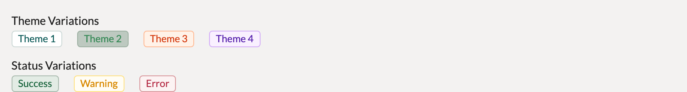
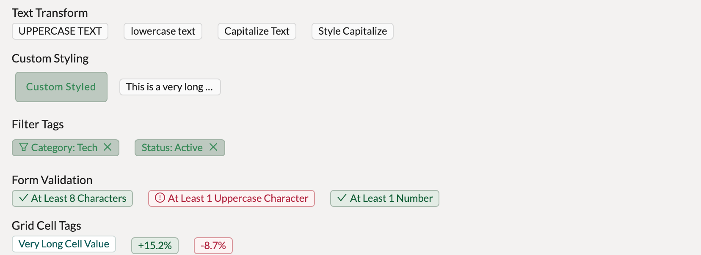
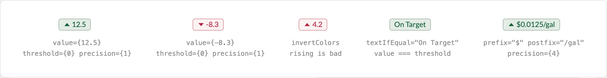
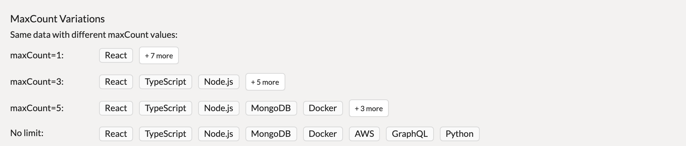

# Tags & Badges

BBDTag, DeltaTag, and ManyTag cover status, movement, and multiplicity — every short categorical label in a Gravitate portal is one of these three. All render antd Tags underneath, so portal theming carries straight through; BBDTag alone forwards extra antd Tag props — DeltaTag and ManyTag accept only their own.

> Part of the Excalibrr Design System — component reference. Index: `../CLAUDE.md`. Live page in the Excalibrr demo: `/DesignSystem/Tags` (demo runs at http://localhost:3000).

Three components split the tagging job. `BBDTag` is the workhorse status/category pill — an antd Tag with Excalibrr's boolean theme props — used in grids, drawers, and page headers. `DeltaTag` colors a numeric value's movement against a threshold: green above, red below, flippable for metrics where rising is bad. `ManyTag` lays out a string array as neutral tags and collapses overflow behind a "+ N more" tooltip button.

Reach for a tag when the value is short, categorical, and scannable. Sentence-length content belongs in `Texto`; anything the user clicks to act belongs in a button. Inside GraviGrid cells, prefer the `TagCell` renderer (see Cell Renderers) over mounting BBDTags by hand.

### BBDTag — brand and status variants



*The seven boolean color variants in the demo theme. Brand: theme1 (light info tint), theme2 (filled with the portal primary), theme3 (volcano), theme4 (purple). Status: success, warning, error. Omit every boolean to get the neutral default tag.*

### BBDTag props

Verified against @gravitate-js/excalibrr 5.2.x. Everything not listed falls through to the underlying antd Tag (icon, bordered, closable, onClose, onClick).

| Prop | Type | Default | Notes |
| --- | --- | --- | --- |
| `children` | `ReactNode` | — | The label — the ONLY way to set tag text. There is no text prop; a BBDTag without children renders an empty pill. |
| `theme1 … theme4` | `boolean` | — | Brand palette pills. theme2 fills with the portal primary color tokens; theme1 uses the lighter info/processing tint; theme3 and theme4 map to volcano and purple presets. Set at most one. |
| `success / warning / error` | `boolean` | — | Status presets. These imply state — reserve them for pass/fail, readiness, and severity, never for neutral metadata. |
| `color` | `string` | — | Escape hatch to any antd preset or hex; "primary" aliases theme2. An explicit color overrides every boolean except theme2. |
| `textTransform` | `CSSProperties['textTransform']` | — | Casing without a style object: "uppercase" \| "lowercase" \| "capitalize". |
| `className / style` | `string / CSSProperties` | — | Pass-through. Use className="text-ellipsis" with a maxWidth style for truncation. fontSize is pinned to 12px after your style spread — see gotchas. |

### BBDTag — choosing a color

The color is a claim about the content. Pick by meaning, not by what looks nice next to the grid.

| Variant | When to use | Code |
| --- | --- | --- |
| `default (neutral)` | Reporting attributes, groupings, counts — anything that is a fact, not a state. | `<BBDTag>Reporting Group A</BBDTag>` |
| `theme1 / theme2` | Brand-tinted category pills; theme2 is the filled, highest-emphasis tag, theme1 the lighter tint. | `<BBDTag theme2>Rack</BBDTag>` |
| `theme3 / theme4` | A second and third categorical axis when one brand tint isn't enough. | `<BBDTag theme3>Contract</BBDTag>` |
| `success / warning / error` | True state only: published/blocked, pass/fail validation, exception severity. | `<BBDTag success>Published</BBDTag>` |
| `color` | One-off antd preset or hex outside the seven booleans. Last resort — it bypasses the theme. | `<BBDTag color='geekblue'>Custom</BBDTag>` |

### BBDTag — composition patterns



*textTransform casing, text-ellipsis truncation on a neutral tag, removable filter tags (theme2 with a CloseOutlined in children), pass/fail validation tags with leading icons, and compact percent pills sized for grid cells.*

### DeltaTag — the five states



*Gain (green, caret-up), drop (red, caret-down), invertColors turning a rise red for rising-is-bad metrics, textIfEqual replacing the number when value === threshold, and prefix/postfix money formatting in decimal dollars.*

### DeltaTag props

DeltaTag wraps BBDTag and owns its own color — you never set success/error on it. Both value and threshold are required.

| Prop | Type | Default | Notes |
| --- | --- | --- | --- |
| `value` | `number` | — | The metric. Rendered via toFixed(precision) with a caret icon matching its direction. |
| `threshold` | `number` | — | Required — usually 0. Above is green, below is red. Omitting it compares against undefined, which is always false, so every value renders red. |
| `precision` | `number` | `0` | Decimal places. Gravitate money is decimal dollars — precision={4} for $0.0100/gal copy. |
| `prefix / postfix` | `ReactNode` | — | Rendered tight around the number: prefix="$" postfix="/gal" gives $0.0125/gal. |
| `textIfEqual` | `string` | — | When value === threshold, renders a success tag with this text instead of the number — "On Target" beats a green 0. |
| `invertColors` | `boolean` | `false` | Flips the mapping for metrics where rising is bad (cost, exceptions, churn). |

### ManyTag — overflow behavior



*The same eight items at maxCount 1, 3, 5, and unbounded. Visible items render as neutral BBDTags; the remainder collapses into a "+ N more" button whose hover tooltip lists the hidden items.*

### ManyTag props

Two props, both required. Items are plain strings — map object arrays before passing.

| Prop | Type | Default | Notes |
| --- | --- | --- | --- |
| `tagItems` | `string[]` | — | The full list. If undefined the component returns null and the cell is silently blank — the prop is tagItems, not items. |
| `maxCount` | `number` | — | Visible tags before overflow collapses into "+ N more". 2–4 fits most grid cells and cards; the prop is maxCount, not limit. |

### Canonical usage

```tsx
import { BBDTag, DeltaTag, ManyTag, Horizontal } from '@gravitate-js/excalibrr'

<Horizontal gap={8} verticalCenter>
  {/* Status pill — boolean theme prop, label as children */}
  <BBDTag success>Published</BBDTag>

  {/* Neutral reporting attribute — no theme prop, never a status color */}
  <BBDTag>Reporting Group A</BBDTag>

  {/* Movement vs threshold — green above, red below, decimal dollars */}
  <DeltaTag value={0.0125} threshold={0} precision={4} prefix='$' postfix='/gal' />

  {/* Collection — collapses to "+ N more" with a hover tooltip */}
  <ManyTag tagItems={['Marathon', 'Shell', 'Valero', 'Phillips 66']} maxCount={3} />
</Horizontal>
```

Layout via Horizontal gap={8} — never style={{ gap }}. Money copy is decimal dollars ($0.0125/gal), never cents symbols.

### Do's & Don'ts

- **Do:** Pass the label as children: <BBDTag success>Published</BBDTag>
  **Don't:** Pass text="…" or theme="success" string props
  **Why:** Neither prop exists. Unknown props fall through to the DOM and the tag renders as an empty pill with no warning.
- **Do:** Use the default neutral BBDTag for reporting attributes and metadata
  **Don't:** Reuse success/warning/error because the color matches the page
  **Why:** Status colors imply state — a green "Region: West" reads as a passing check.
- **Do:** Always pass threshold to DeltaTag, usually threshold={0}
  **Don't:** Omit threshold or invent positive/inverted props
  **Why:** The comparison against undefined is always false, so every value renders red regardless of sign.
- **Do:** Call ManyTag with tagItems and maxCount
  **Don't:** Call it with items and limit
  **Why:** tagItems is undefined, the component returns null, and the cell is silently blank.

### Gotchas

- **Neutral attributes get neutral tags** — For reporting attributes and other stateless metadata, use the default BBDTag with no boolean prop. Status colors imply state: a success-green attribute tag reads as "passing" and an error-red one as "broken". This is the established rule for reporting attributes (e.g. ManageQuoteRows).
- **Wrong prop names fail silently** — BBDTag with text=/theme=, DeltaTag without threshold, and ManyTag with items/limit all render empty or all-red with zero console output. The /DesignSystem/Tags showcase page itself shipped with these exact bugs — trust this reference and the .d.ts, not that page's prop strings.
- **BBDTag pins font-size to 12px** — The component applies fontSize: 12 after spreading your style object, so style={{ fontSize: 14 }} is silently discarded. To size content differently, wrap it in a span with its own inline size: <BBDTag><span style={{ fontSize: 14 }}>+15.2%</span></BBDTag> — a child's own font-size overrides the inherited pin. Don't use className='text-xs'; that utility class exists nowhere in this stack and silently does nothing.
- **Color booleans have a precedence order** — Set exactly one. If several are set: theme2 wins outright, an explicit color prop beats the rest, then theme1 > theme3 > theme4 > success > warning > error. Conditional tags should compute one boolean, e.g. success={ok} error={!ok}.
- **ManyTag overflow is hover-only** — "+ N more" is a small antd Button inside a Tooltip — the hidden items appear only on hover and the button has no click handler. Don't use it as a disclosure control or on touch-first surfaces; if users must act on hidden items, show them another way.
