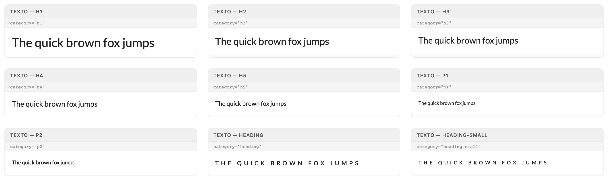
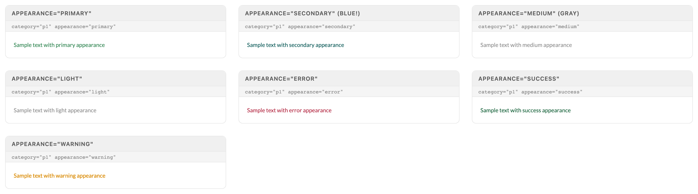
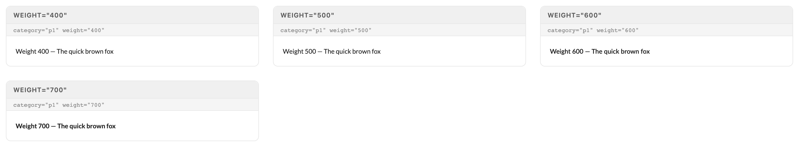
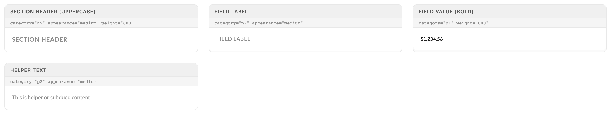

# Typography

Texto is the single text primitive — every piece of UI text in a Gravitate screen goes through it. One component, three axes: category sets the scale step and rendered element, appearance sets the color role, weight overrides the default 500. Never reach for raw <p>/<h*> tags or antd Typography directly.

> Part of the Excalibrr Design System — component reference. Index: `../CLAUDE.md`. Live page in the Excalibrr demo: `/DesignSystem/Typography` (demo runs at http://localhost:3000).

Texto wraps antd Typography: `h1`–`h5` render semantic `<h*>` elements via antd `Title`, `p1`/`p2`/`label` render antd `Paragraph` (a block-level div), and `heading`/`heading-small` render antd `Text` (an inline span) with built-in uppercase and 5px letterspacing. Pick the category for the role, not the size you want — the scale is em-based, so every step inherits and multiplies the container's font size.

Three axes cover everything: `category` (scale step), `appearance` (color role), `weight` (font weight, defaults to 500). Anything beyond that — alignment, transforms — has a dedicated prop (`align`, `textTransform`). If you find yourself passing `style` for type styling, you are working around the component instead of with it.

### Categories



*Nine of the ten categories at default appearance and weight: h1 (2.5em) down to h5 (1.25em), body p1 and the slightly larger p2, and the uppercase letterspaced heading / heading-small eyebrows. Not shown: label (0.9em fine print).*

### Category scale

Exactly ten valid categories. p3 and h6 do not exist — they silently fall through to an unstyled text branch.

| Variant | When to use | Code |
| --- | --- | --- |
| `h1 — 2.5em` | Hero numbers and page-level display text. Rare; one per screen at most. | `<Texto category="h1">$0.0425</Texto>` |
| `h2 — 2em` | Large stat callouts and dashboard KPIs. | `<Texto category="h2">42 terminals</Texto>` |
| `h3 — 1.75em` | Page titles. | `<Texto category="h3">Quote Book</Texto>` |
| `h4 — 1.5em` | Card, drawer, and modal titles. | `<Texto category="h4">Exception Profile</Texto>` |
| `h5 — 1.25em` | Section titles inside cards and panels; pairs with appearance="medium" weight="600" textTransform="uppercase" for section headers — h5 is not uppercase on its own. | `<Texto category="h5">Thresholds</Texto>` |
| `p1 — 1em` | Default body text. The category you get when you pass none. | `<Texto>Body copy</Texto>` |
| `p2 — 1.1em` | Emphasized body text — p2 is LARGER than p1, not fine print. Also the standard category for field labels and helper text with appearance="medium". | `<Texto category="p2">Lead paragraph</Texto>` |
| `label — 0.9em` | The smallest step: captions, table-adjacent metadata, true fine print. | `<Texto category="label">Updated 6:00 AM CT</Texto>` |
| `heading — 1.2em` | Uppercase letterspaced eyebrow above a content block. Renders an inline span, always bold and uppercase — no extra styling needed. | `<Texto category="heading">Pricing Engine</Texto>` |
| `heading-small — 1em` | Compact eyebrow for dense panels and drawer section breaks. | `<Texto category="heading-small">Quote Detail</Texto>` |

### Appearances



*Seven appearances on p1: primary (brand green), secondary (the theme's INFO accent — teal here, never gray), medium and light (identical subdued gray), error, success, warning.*

### Appearance → color mapping

Appearance names are color roles resolved through antd theme tokens. Hex values sampled from the default light theme.

| Token | Value | Use for |
| --- | --- | --- |
| `default` | `theme text color (rgba(0,0,0,0.88))` | Body copy. The default — omit the prop. |
| `medium` | `antd type="secondary" gray (rgba(0,0,0,0.45))` | THE gray for subdued text: field labels, helper text, section headers. |
| `light` | `same gray as medium` | Alias of medium in the current package — prefer medium for consistency. |
| `hint` | `same gray as medium` | Placeholder-grade text. Also resolves to the medium gray today. |
| `primary` | `colorPrimaryText (#388A58 brand green)` | Brand-emphasis text tied to the primary action color. |
| `secondary` | `colorInfoText (#0C5A58 — the info accent)` | Info-accent text ONLY. This is never gray — it is blue/teal depending on theme. |
| `success` | `antd success (#156139)` | Positive states: published, passing, in range. |
| `warning` | `antd warning (#D98900)` | Caution states: stale data, soft thresholds. |
| `error` | `antd danger (#B32741)` | Failures and blocking exceptions. |
| `optimal` | `colorWarningHover (gold)` | "Optimal" metric highlights in pricing views. |
| `white` | `literal white` | Text on dark or color-filled surfaces. |

### Weights



*Weights 400–700 on p1. Omitting weight renders 500 — pass weight="400" explicitly when you need true regular.*

### Texto props

Verified against @gravitate-js/excalibrr 5.2.1 (the version installed in the demo). Unrecognized extra props spread onto the root element.

| Prop | Type | Default | Notes |
| --- | --- | --- | --- |
| `category` | `'p1' \| 'p2' \| 'label' \| 'heading' \| 'heading-small' \| 'h1'–'h5'` | `'p1'` | The only ten valid values. p3 and h6 are not in the type union and silently break at runtime. |
| `appearance` | `'default' \| 'medium' \| 'light' \| 'hint' \| 'primary' \| 'secondary' \| 'success' \| 'warning' \| 'error' \| 'optimal' \| 'white'` | `'default'` | Color role. Use medium for gray; secondary is the blue/teal info accent. |
| `weight` | `CSSProperties['fontWeight']` | `renders 500` | Internally `weight \|\| 500` — omitting the prop renders 500, never the browser-default 400. |
| `align` | `CSSProperties['textAlign']` | `'left'` | Right-align numerics in stat layouts with align="right". |
| `textTransform` | `CSSProperties['textTransform']` | `—` | First-class prop — never pass textTransform through style. heading/heading-small are already uppercase. |
| `children` | `ReactNode` | `—` | Required. |
| `className / style` | `string / CSSProperties` | `—` | Escape hatches. style merges last and wins — keep it for spacing only, never for type styling. |

### Common patterns



*The four workhorse recipes: uppercase section header (h5 + medium + 600 + explicit uppercase transform), field label (p2 + medium, uppercase), bold field value (p1 + 600), and helper text (p2 + medium).*

### Canonical usage — a labeled stat block

```tsx
import { Texto, Vertical } from '@gravitate-js/excalibrr'

<Vertical gap={4}>
  <Texto category="heading-small" appearance="medium">
    Rack Margin
  </Texto>
  <Texto category="h2" weight="600">
    $0.0425/gal
  </Texto>
  <Texto category="p2" appearance="medium">
    Trailing 7-day average vs. OPIS low
  </Texto>
</Vertical>
```

Eyebrow in heading-small (uppercase comes free), value in h2, helper in p2 + medium. Money is decimal dollars — $0.0425/gal, never cents symbols.

### Do's & Don'ts

- **Do:** Use appearance="medium" for gray, subdued text.
  **Don't:** Use appearance="secondary" expecting gray.
  **Why:** secondary maps to the theme's colorInfoText — a blue/teal accent. medium is the antd secondary gray.
- **Do:** Stay inside the ten categories: p1, p2, label, heading, heading-small, h1–h5.
  **Don't:** Write category="p3" or category="h6".
  **Why:** Invalid categories fall through to a plain antd Text branch with an undefined font size — no error, just wrong text.
- **Do:** Pass weight="400" when a spec calls for regular weight.
  **Don't:** Omit weight and assume browser-default 400.
  **Why:** Texto renders `weight || 500` — unweighted text is always medium-weight.
- **Do:** Use the textTransform and align props.
  **Don't:** Reach for style={{ textTransform: 'uppercase' }}.
  **Why:** The props exist for exactly this; style is reserved for spacing escape hatches.
- **Do:** Set all UI text with Texto.
  **Don't:** Drop raw <p>/<h3> tags or import antd Typography directly.
  **Why:** Raw tags skip the scale, the 500 default weight, and the appearance color roles — screens drift off-system one tag at a time.

### Gotchas

- **appearance="secondary" is BLUE, not gray** — secondary resolves to antd colorInfoText — the info accent (teal in the default theme, blue in others). Every "why is my label blue" bug traces here. Gray text is appearance="medium".
- **p3 and h6 silently break** — Valid categories are only p1, p2, label, heading, heading-small, h1–h5. Anything else misses every render branch and falls to antd Text with fontSize: undefined — it renders, looks almost right, and is wrong.
- **p2 is larger than p1** — p2 is 1.1em, p1 is 1em. p2 is the emphasized body step, not fine print. The smallest category is label (0.9em).
- **medium, light, and hint are currently the same gray** — All three map to antd type="secondary" (rgba(0,0,0,0.45) in light theme). Standardize on medium so intent stays legible in code.
- **Default weight is 500, not 400** — Texto applies `fontWeight: weight || 500`. Designs that assume regular-weight body text need an explicit weight="400".
- **The scale is em-based and inherits container font size** — h1 is 2.5em of whatever the parent sets, not a fixed pixel size. Inside a container that shrinks its font-size (dense grids, compact drawers), every Texto shrinks with it.
- **Categories change the rendered element** — h1–h5 render real heading tags, p1/p2/label render a block-level div (antd Paragraph), heading/heading-small render an inline span. Inline vs. block matters in flex rows — eyebrows sit inline; body steps take the full line.
