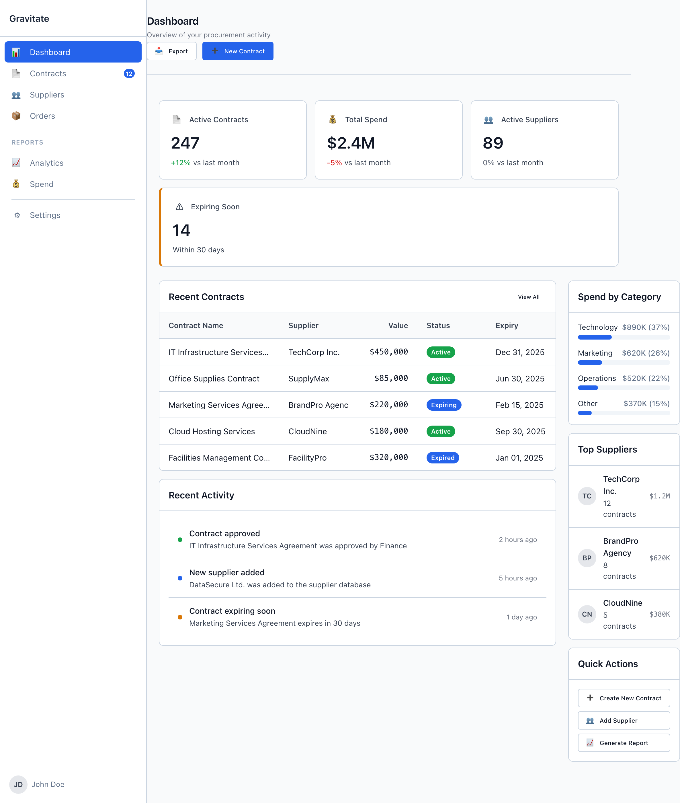
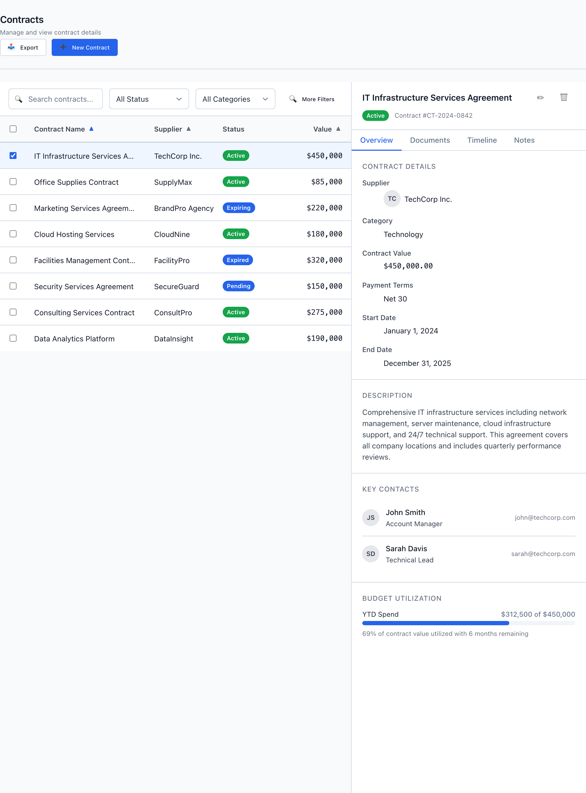

# The Wireframe Aesthetic

A pure HTML/CSS lo-fi system for Gravitate wireframes, built so AI agents and humans produce the same screen. The look is neutral gray with one blue accent, grid-first for data, and compact by default — because the users are analysts moving through dense screens dozens of times a week. Reuse a pattern before inventing one, and reach for a `--wf-` token before a hex.

> Part of the Gravitate Wireframe Design System — lo-fi component reference. Index: `../CLAUDE.md`.

This is a low-fidelity prototyping system: pure HTML and CSS, no JavaScript dependency, every interactive piece a real button or input. The point is not to look finished — it's to communicate layout, hierarchy, and interaction so clearly that the wireframe maps one-to-one onto the production Excalibrr components (`wf-button` becomes `<GraviButton>`, `wf-datagrid` becomes `<GraviGrid>`).

The aesthetic is downstream of the user. Gravitate is an enterprise data platform for the energy sector — analysts, traders, and operators working contracts, volumes, and reconciliations under time pressure. They would rather see one more row than one more breath of margin. So the system optimizes for scannability over delight: neutral gray canvas, one reserved accent, compact density, and patterns that look the same every session.

Every page starts from a named scaffold in `patterns/` — `DashboardLayout.html`, `MasterDetailLayout.html`, `FormWizard.html`, `SettingsPage.html`, `DataTablePage.html`, or `ComparisonMatrix.html`. If what you're building doesn't fit one of the six, that's a signal to pause and check whether the requirement is a genuinely new pattern or a variant of an existing one. It's almost always the latter.

### DashboardLayout — the system's look



*The hero of the aesthetic: neutral-gray canvas (--wf-color-background, #f9fafb) with a single blue accent (--wf-color-primary, #2563eb) reserved for the primary CTA and the active nav item. A persistent wf-sidebar on the left, a row of wf-metric-card KPIs, a grid-first wf-datagrid with wf-badge status pills, and a right rail. This is patterns-over-novelty made visible — start here, don't invent.*

### The seven principles

From DESIGN.md §2. Apply in order — earlier principles win when they conflict with later ones.

1. **Patterns over novelty. Reuse before inventing — start from a pattern scaffold or an existing component.** — Every novel component is a future inconsistency; inventing is the last resort, not the first move.
2. **Grid-first for data, narrative-first for forms. Tables, dashboards, and comparisons align columns and share row rhythm; forms and settings read top-down in a single column.** — The two postures serve different eyes — vertical scanning versus reading order. Don't mix them inside one page section.
3. **Muted palette; reserve color for status and interactive intent. The page reads as neutral gray with one accent.** — Color is a signal, not decoration. Status colors appear only when there's actual status; primary blue appears only on interactive surfaces or to mark the user's current location.
4. **Keyboard-first interaction model. Every interactive element is reachable, operable, and visibly focused via keyboard alone.** — Mouse is the fallback for these users, not the primary input. A flow that requires a mouse is a broken wireframe.
5. **Density is a feature, not a bug. Default to compact — 14px body (--wf-text-base), tight stacking (--wf-space-stack-sm), token-driven page padding.** — Users return to the same dense screens dozens of times a week. Comfortable mode (16px body, looser spacing) is an explicit opt-in, never the default.
6. **Consistency trumps cleverness. When two solutions are roughly equivalent and one matches an established pattern, pick the established one.** — The marginal benefit of a clever variation is almost always outweighed by the cost of users having to learn a new pattern.
7. **The token is the source of truth. Never write a hex value, a pixel literal, or a numeric font weight in component code.** — Tokens encode intent; literals don't. If the token you need doesn't exist, the design isn't ready — ask, don't invent. This rule transfers verbatim to production.

### MasterDetailLayout — the second archetype



*List on the left, detail panel on the right. The current selection is marked with interactive-intent color only (wf-datagrid-row-selected) — never a decorative highlight. Same token-is-truth, muted-neutral discipline as the dashboard: gray everywhere, blue only where the user is or can act.*

### The palette that carries the look

The aesthetic is mostly the neutral scale plus a single accent. These are the semantic aliases you reach for — never the raw `--wf-color-neutral-*` values when an alias says the same thing more clearly. Values are the real defaults from tokens/colors.css.

| Token | Value | Use for |
| --- | --- | --- |
| `--wf-color-background` | `#f9fafb` | Page canvas. The neutral-gray field everything sits on (aliases --wf-color-neutral-50). |
| `--wf-color-surface` | `#ffffff` | Default surface — cards, modals, inputs. The white that lifts content off the gray canvas. |
| `--wf-color-text-primary` | `#111827` | Main content and headings (aliases --wf-color-neutral-900). |
| `--wf-color-text-secondary` | `#374151` | Supporting text and labels (aliases --wf-color-neutral-700). |
| `--wf-color-text-tertiary` | `#6b7280` | Hints, placeholders, timestamps (aliases --wf-color-neutral-500). |
| `--wf-color-border` | `#d1d5db` | Default border and divider — borders carry elevation here, not shadows (aliases --wf-color-neutral-300). |
| `--wf-color-primary` | `#2563eb` | The one accent. Interactive intent only: primary CTA, links, focus ring, selected state, current location. |
| `--wf-color-success` | `#16a34a` | Status only — confirmation of a completed positive action, 'healthy'/'passing' status. Never decorative. |
| `--wf-color-warning` | `#d97706` | Status only — pending state, attention required, soft-fail. Never a 'tip' highlight. |
| `--wf-color-error` | `#dc2626` | Status only — validation failure, destructive affordance, hard-fail. Never decorative red. |

### Density tokens

Compact is the default. From tokens/typography.css and tokens/spacing.css — these set the rhythm that makes the screens dense without feeling cramped.

| Token | Value | Use for |
| --- | --- | --- |
| `--wf-text-base` | `0.875rem (14px)` | Body text and the default size. This is the compact default — not 16px. |
| `--wf-text-md` | `1rem (16px)` | The comfortable opt-in body size. Only when explicitly requested or onboarding-shaped. |
| `--wf-space-stack-sm` | `0.5rem (8px)` | Tight stacking between related rows — the default vertical rhythm within a section. |
| `--wf-space-page-x` | `1.5rem (24px)` | Page horizontal padding. Use this, not an arbitrary value. |
| `--wf-space-page-y` | `2rem (32px)` | Page vertical padding. |
| `--wf-space-card` | `1rem (16px)` | Default card padding (comfortable opt-in is --wf-space-card-lg, 24px). |

### Composing a page

The aesthetic is assembled from a small set of structural classes. These are the real classes used in patterns/DashboardLayout.html and patterns/MasterDetailLayout.html — copy the markup verbatim, don't invent class names.

| Variant | When to use | Code |
| --- | --- | --- |
| `wf-page wf-page-with-sidebar` | Top-level wrapper for any screen with persistent left nav — the dashboard archetype. | `<div class="wf-page wf-page-with-sidebar">   <aside class="wf-sidebar">...</aside>   <main class="wf-main">...</main> </div>` |
| `wf-sidebar-item-active` | Marks the user's current location in the sidebar — interactive-intent color, the only blue in the nav. | `<a href="#" class="wf-sidebar-item wf-sidebar-item-active">   <span class="wf-sidebar-icon">&#x1F4CA;</span>   <span class="wf-sidebar-label">Dashboard</span> </a>` |
| `wf-metric-card` | A single KPI — one big number, one label, optional trend. The dashboard's stat row. Never more than one metric per card. | `<div class="wf-metric-card">   <div class="wf-metric-header">     <span class="wf-metric-icon">&#x1F4C4;</span>     <span class="wf-metric-title">Active Contracts</span>   </div> </div>` |
| `wf-datagrid` | Grid-first data display — the table that does the scanning work. Use wf-badge cells for status. | `<div class="wf-datagrid">   <div class="wf-datagrid-header">     <div class="wf-datagrid-cell">Status</div>   </div>   <div class="wf-datagrid-body">     <div class="wf-datagrid-row">       <div class="wf-datagrid-cell">         <span class="wf-badge wf-badge-success">Active</span>       </div>     </div>   </div> </div>` |
| `wf-datagrid-row-selected` | The chosen row in a master/detail list — selection shown with interactive-intent color only. | `<div class="wf-datagrid-row wf-datagrid-row-selected">   <div class="wf-datagrid-cell">IT Infrastructure Services Agreement</div> </div>` |

### A page skeleton

```html
<div class="wf-page wf-page-with-sidebar">
  <aside class="wf-sidebar">
    <div class="wf-sidebar-header">
      <span class="wf-sidebar-logo">Gravitate</span>
    </div>
    <nav class="wf-sidebar-nav">
      <a href="#" class="wf-sidebar-item wf-sidebar-item-active">
        <span class="wf-sidebar-label">Dashboard</span>
      </a>
    </nav>
  </aside>
  <main class="wf-main">
    <header class="wf-page-header">
      <div class="wf-page-title">
        <h1 class="wf-text-h2">Dashboard</h1>
        <p class="wf-text-helper">Overview of your procurement activity</p>
      </div>
      <div class="wf-page-actions">
        <button class="wf-button wf-button-secondary">Export</button>
        <button class="wf-button wf-button-primary">New Contract</button>
      </div>
    </header>
    <div class="wf-page-content">
      <!-- wf-metric-card row, then wf-datagrid -->
    </div>
  </main>
</div>
```

The starting shape every wireframe shares: gray wf-page canvas, wf-sidebar on the left with one active item, wf-main holding a wf-page-header and wf-page-content. Pull the full version from patterns/DashboardLayout.html rather than rebuilding it.

### Anti-patterns

- **Do:** Pick one container — usually the outer wf-card.
  **Don't:** Nest a wf-card inside another wf-card.
  **Why:** Two card layers fighting for the same job. One container, every time.
- **Do:** Use the wf-card padding for grouping; wf-container only for max-width.
  **Don't:** Use wf-container as a styled box.
  **Why:** wf-container is structural — no border, padding, or background by design.
- **Do:** Use weight (--wf-font-semibold), size, or hierarchy for emphasis.
  **Don't:** Use --wf-color-primary for non-interactive emphasis.
  **Why:** Primary blue is for interactive intent only. Color emphasis trains users to stop reading the color.
- **Do:** Use status colors only when there's real status to report.
  **Don't:** Use success green or warning orange decoratively.
  **Why:** Success green is not an 'approval' accent for static labels; warning orange is not a 'notable' highlight. Dilute the signal and users stop trusting it.
- **Do:** Reach for the semantic alias — --wf-color-text-secondary.
  **Don't:** Reach for --wf-color-neutral-700 directly.
  **Why:** The alias is more meaningful even though the value is identical. Names encode intent.
- **Do:** Default body text to 14px (--wf-text-base).
  **Don't:** Default body text to 16px.
  **Why:** 16px (--wf-text-md) is the explicit comfortable opt-in, not the default. Compact density is the point.
- **Do:** Reach for a --wf-space-* token; if the size you want isn't on the scale, go one step up or down.
  **Don't:** Write a pixel literal like a 10px padding or 18px margin.
  **Why:** The 8px grid is non-negotiable. No 7px gaps, no custom values — if the right token doesn't exist, ask.
- **Do:** Keep a keyboard path to every action and a visible focus ring.
  **Don't:** Ship a flow that needs a mouse, or set outline:none without a replacement.
  **Why:** Keyboard parity is a floor requirement. A flow that requires a mouse is the wireframe being wrong, not the keyboard.

### Gotchas

- **Elevation is borders, not shadows** — This is a wireframe system — depth comes from border weight, not blur. --wf-elevation-1 is `1px solid var(--wf-color-border)`, --wf-elevation-3 (modals, focus) is `2px solid var(--wf-color-primary)`. Don't add box-shadows to fake polish; the flat, bordered look is intentional.
- **The focus ring is layered for contrast on any background** — --wf-focus-ring is two stacked rings: `0 0 0 2px var(--wf-color-surface)` then `0 0 0 4px var(--wf-color-primary)`. The inner surface ring is what keeps the blue visible against busy or colored backgrounds — don't simplify it to a single ring.
- **Color is never the only signal** — A red border alone is not an error. Validation pairs --wf-border-input-error with an inline message and an icon — two of three is not enough. This sits at the keyboard/AT/visual intersection and is non-negotiable.
- **Six scaffolds, not a blank canvas** — If the page doesn't fit DashboardLayout, MasterDetailLayout, FormWizard, SettingsPage, DataTablePage, or ComparisonMatrix, pause. Most 'new' layouts are variants of an existing one — building from a blank page is how drift starts.
