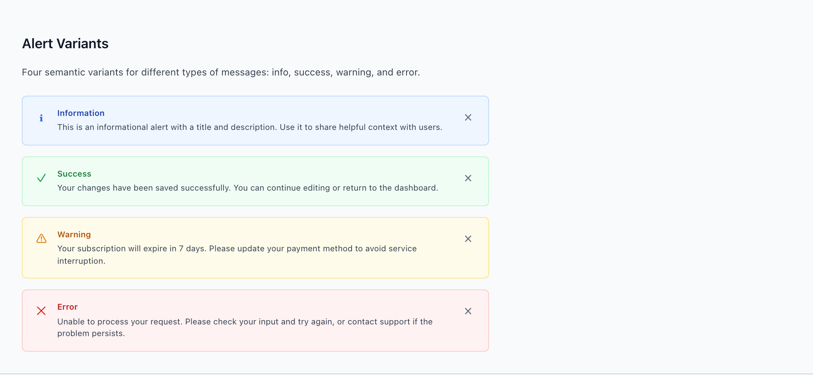
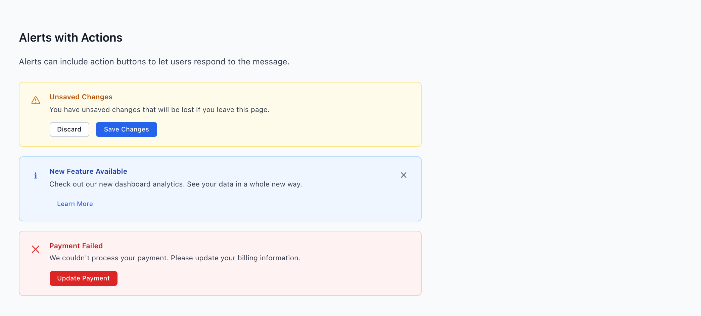
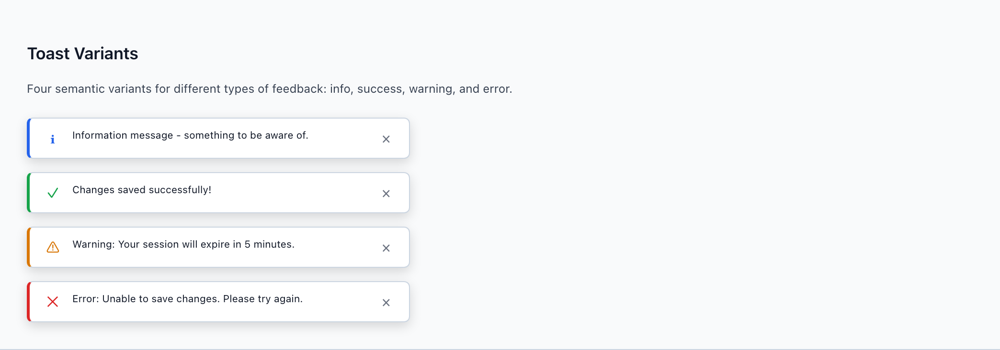
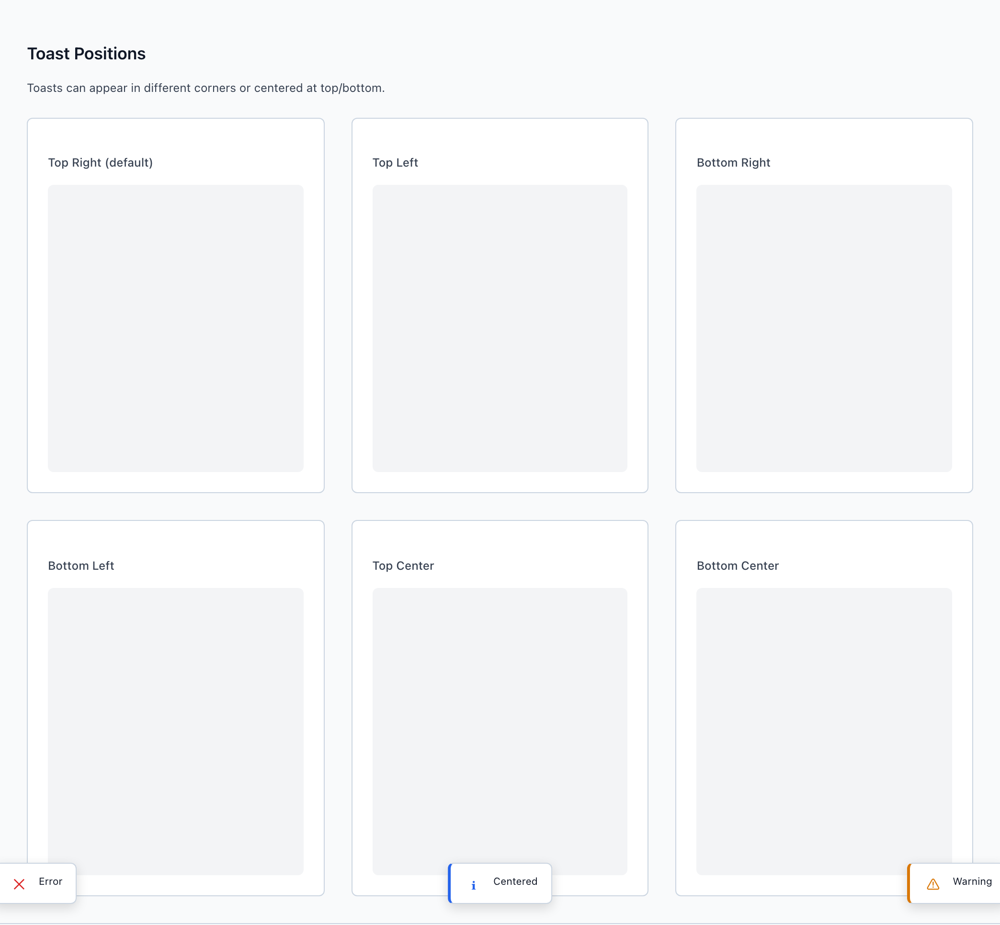

# Alert & Toast

Two messages, two lifespans. `wf-alert` is inline and persistent — it lives on the page next to the content it describes until the state changes. `wf-toast` is transient — it slides in, confirms something that already happened, and leaves. Picking the wrong one is the most frequent feedback drift in wireframes, so the choice has its own decision tree.

> Part of the Gravitate Wireframe Design System — lo-fi component reference. Index: `../CLAUDE.md`.

Reach for `wf-alert` when the user **should be aware** of state that persists — "This contract is past its expiry date," "3 rows have validation errors." It renders inline, near the affected content, and stays until the underlying state changes or the user dismisses it. Never float it globally.

Reach for `wf-toast` when the user **should be informed** of something that already happened and doesn't need to act — "Saved." "Export queued." It auto-dismisses, never blocks, and lives in a fixed-position container that floats over the page.

The DESIGN.md tiebreaker (4.5): if you can't decide, ask "Will the user ever come back to this page and need to see this message?" Yes is an Alert; no is a Toast. And if the user *needs to act before continuing*, neither one is right — that's a `wf-modal` or `wf-confirm-dialog`.

### Alert variants



*The four semantic variants — info, success, warning, error — each pairing a tinted background, a status-colored icon, a colored title, and a dismiss control. The icon and title color carry the status; the muted body text stays neutral.*

### Alert classes

Compose `wf-alert` with one status variant and optional modifiers. Every alert is built from the same parts: a `wf-alert-icon` glyph, a `wf-alert-content` block (`wf-alert-title` + `wf-alert-description`), and an optional `wf-alert-close` button.

| Variant | When to use | Code |
| --- | --- | --- |
| `wf-alert-info` | Neutral context the user should keep in mind. Tinted #eff6ff with a #1e40af title and primary-blue icon. | `<div class="wf-alert wf-alert-info">   <span class="wf-alert-icon">&#8505;</span>   <div class="wf-alert-content">     <h4 class="wf-alert-title">Information</h4>     <p class="wf-alert-description">Helpful context for the user.</p>   </div>   <button class="wf-alert-close">&times;</button> </div>` |
| `wf-alert-success` | Confirmation of a persistent good state. Tinted #f0fdf4, #15803d title, success-green icon. | `<div class="wf-alert wf-alert-success">   <span class="wf-alert-icon">&#10003;</span>   <div class="wf-alert-content">     <h4 class="wf-alert-title">Success</h4>     <p class="wf-alert-description">Your changes have been saved.</p>   </div>   <button class="wf-alert-close">&times;</button> </div>` |
| `wf-alert-warning` | A condition the user should resolve before it bites — expiring trial, fields to review. Tinted #fffbeb, #b45309 title, warning-orange icon. | `<div class="wf-alert wf-alert-warning">   <span class="wf-alert-icon">&#9888;</span>   <div class="wf-alert-content">     <h4 class="wf-alert-title">Warning</h4>     <p class="wf-alert-description">Your subscription expires in 7 days.</p>   </div>   <button class="wf-alert-close">&times;</button> </div>` |
| `wf-alert-error` | A failure or blocked state that persists on the page. Tinted #fef2f2, #b91c1c title, error-red icon. | `<div class="wf-alert wf-alert-error">   <span class="wf-alert-icon">&#10005;</span>   <div class="wf-alert-content">     <h4 class="wf-alert-title">Error</h4>     <p class="wf-alert-description">Unable to process your request.</p>   </div>   <button class="wf-alert-close">&times;</button> </div>` |
| `wf-alert-simple` | Message-only alert — no title. The modifier promotes the description to primary text color for a compact one-liner. | `<div class="wf-alert wf-alert-success wf-alert-simple">   <span class="wf-alert-icon">&#10003;</span>   <div class="wf-alert-content">     <p class="wf-alert-description">Email sent successfully.</p>   </div> </div>` |
| `wf-alert-banner` | Full-width page-level notification at the top of the content area. The modifier squares the corners and drops the left/right borders to edge-bleed. | `<div class="wf-alert wf-alert-info wf-alert-banner">   <span class="wf-alert-icon">&#8505;</span>   <div class="wf-alert-content">     <p class="wf-alert-description">Scheduled maintenance Sunday 2:00&ndash;4:00 AM EST.</p>   </div>   <button class="wf-alert-close">&times;</button> </div>` |

### Alerts with actions



*Because an Alert is persistent, it can carry response buttons in a `wf-alert-actions` row — Discard/Save Changes, Learn More, Update Payment. Use small `wf-button-sm` buttons so the action row reads as secondary to the message.*

### Alert with an action row

```html
<div class="wf-alert wf-alert-warning">
  <span class="wf-alert-icon">&#9888;</span>
  <div class="wf-alert-content">
    <h4 class="wf-alert-title">Unsaved Changes</h4>
    <p class="wf-alert-description">You have unsaved changes that will be lost if you leave this page.</p>
    <div class="wf-alert-actions">
      <button class="wf-button wf-button-secondary wf-button-sm">Discard</button>
      <button class="wf-button wf-button-primary wf-button-sm">Save Changes</button>
    </div>
  </div>
</div>
```

wf-alert-actions adds a 0.75rem top margin and a 0.75rem gap between buttons. Drop wf-alert-close on non-dismissible alerts (account suspended, blocking validation) so the message can't be hidden.

### Toast variants



*Transient `wf-toast` cards in the four semantic states. Each pairs a 3px left status accent, a status-colored icon, and the message — the color + icon + message pairing required by rule 6.4 so the status is never carried by color alone.*

### Toast classes

A toast is `wf-toast` plus one status variant, living inside a `wf-toast-container`. The variant sets a 3px colored `border-left` and tints the `wf-toast-icon`. An omitted `wf-toast-close` button signals an auto-dismiss toast.

| Variant | When to use | Code |
| --- | --- | --- |
| `wf-toast-info` | Transient status the user just needs to see go by — "Syncing in progress…". Left border --wf-color-primary (#2563eb). | `<div class="wf-toast wf-toast-info">   <span class="wf-toast-icon">&#8505;</span>   <span class="wf-toast-message">Information message.</span>   <button class="wf-toast-close">&times;</button> </div>` |
| `wf-toast-success` | The most common toast — confirming a completed action. "Changes saved successfully!" Left border --wf-color-success (#16a34a). | `<div class="wf-toast wf-toast-success">   <span class="wf-toast-icon">&#10003;</span>   <span class="wf-toast-message">Changes saved successfully!</span>   <button class="wf-toast-close">&times;</button> </div>` |
| `wf-toast-warning` | A transient heads-up — "Your session will expire in 5 minutes." Left border --wf-color-warning (#d97706). | `<div class="wf-toast wf-toast-warning">   <span class="wf-toast-icon">&#9888;</span>   <span class="wf-toast-message">Your session will expire in 5 minutes.</span>   <button class="wf-toast-close">&times;</button> </div>` |
| `wf-toast-error` | A transient failure the user can dismiss — "Unable to save changes. Please try again." Left border --wf-color-error (#dc2626). | `<div class="wf-toast wf-toast-error">   <span class="wf-toast-icon">&#10005;</span>   <span class="wf-toast-message">Unable to save changes. Please try again.</span>   <button class="wf-toast-close">&times;</button> </div>` |

### Toast positions



*The container places the toast stack in one of six viewport zones. Bottom-right is the default; the rest are opt-in modifier classes on the container, not on the toast.*

### Toast container positions

Position lives on `wf-toast-container`, never on the toast itself. The bare container is fixed bottom-right; each modifier overrides the corner. The container also stacks toasts vertically with a 0.75rem gap.

| Variant | When to use | Code |
| --- | --- | --- |
| `wf-toast-container` | Default placement — fixed bottom-right, 1.5rem inset, z-index 2000, max-width 400px. | `<div class="wf-toast-container">   <!-- toasts --> </div>` |
| `wf-toast-container-top-right` | Top-right corner. Common for app-level confirmations near the header. | `<div class="wf-toast-container wf-toast-container-top-right">...</div>` |
| `wf-toast-container-top-left` | Top-left corner. | `<div class="wf-toast-container wf-toast-container-top-left">...</div>` |
| `wf-toast-container-bottom-left` | Bottom-left corner. | `<div class="wf-toast-container wf-toast-container-bottom-left">...</div>` |
| `wf-toast-container-top-center` | Centered at the top edge — high-visibility, page-spanning confirmations. | `<div class="wf-toast-container wf-toast-container-top-center">...</div>` |
| `wf-toast-container-bottom-center` | Centered at the bottom edge. | `<div class="wf-toast-container wf-toast-container-bottom-center">...</div>` |

### Toast container with stacked toasts

```html
<!-- Position the container once; default is bottom-right -->
<div class="wf-toast-container">

  <!-- Dismissible success toast -->
  <div class="wf-toast wf-toast-success">
    <span class="wf-toast-icon">&#10003;</span>
    <span class="wf-toast-message">Changes saved successfully</span>
    <button class="wf-toast-close">&times;</button>
  </div>

  <!-- Auto-dismiss toast: omit the close button -->
  <div class="wf-toast wf-toast-info">
    <span class="wf-toast-icon">&#8505;</span>
    <span class="wf-toast-message">Syncing in progress...</span>
  </div>

</div>
```

Each toast animates in via the wf-toast-slide-in keyframe (slides from translateX(100%)); add wf-toast-exiting to play the reverse slide-out. Stack at most two at a time (rule 7.3).

### Status colors & key values

Toast accents use the semantic status tokens directly. Alert tints are hard-coded lightened versions of the same hues, paired with darkened title colors for contrast against the tint.

| Token | Value | Use for |
| --- | --- | --- |
| `--wf-color-primary` | `#2563eb` | info accent — toast left border, info icon |
| `--wf-color-success` | `#16a34a` | success accent — toast left border, success icon |
| `--wf-color-warning` | `#d97706` | warning accent — toast left border, warning icon |
| `--wf-color-error` | `#dc2626` | error accent — toast left border, error icon |
| `--wf-color-text-secondary` | `#374151` | default wf-alert-description body text (muted) |
| `--wf-radius-md` | `0.5rem` | corner radius on both wf-alert and wf-toast (banners square to 0) |
| `--wf-space-6` | `1.5rem` | toast container viewport inset on every edge |

### Feedback choice (DESIGN.md 4.5)

Match the message to its lifespan, not its visual prominence.

1. **User must act before continuing? Use a Modal or ConfirmDialog — not a Toast or Alert.** — Toast never blocks and Alert is passive; neither halts the flow, so a required action gets ignored.
2. **State that persists and the user should be aware of? Use an inline Alert, placed near the affected content.** — A floated or global Alert loses the connection to what it describes; inline placement keeps cause and message together.
3. **Something already happened and needs no action? Use a Toast.** — Transient confirmation shouldn't occupy permanent page real estate.
4. **Stuck between Toast and Alert? Ask: will the user return to this page and need to see this message again? Yes = Alert, no = Toast.** — The single question that resolves nearly every Toast-vs-Alert dispute.
5. **Error states pair color + icon + message — two of three is not enough (6.4).** — Color alone is invisible to many users; the status-colored icon and the message text are what actually communicate the error.

### Do's & Don'ts

- **Do:** Put response buttons (Save, Update Payment) inside a persistent wf-alert.
  **Don't:** Put an action the user must take inside a wf-toast.
  **Why:** A toast auto-dismisses; an action that disappears on its own is an action the user will miss.
- **Do:** Render the wf-alert inline, next to the rows or field it describes.
  **Don't:** Float a global Alert at the top of the app for row-specific state.
  **Why:** DESIGN.md 4.2 — an Alert detached from its content forces the user to hunt for what it refers to.
- **Do:** Batch three simultaneous results into one toast, or escalate to an Alert.
  **Don't:** Stack more than two toasts at once.
  **Why:** Rule 7.3 — a tower of toasts is unreadable and buries the one that matters.
- **Do:** Keep both the status icon and the message text on every error.
  **Don't:** Communicate an error with the red border or red title alone.
  **Why:** Rule 6.4 — color is never the only signal; pair it with icon and message.
- **Do:** Set position with a wf-toast-container modifier.
  **Don't:** Position individual wf-toast elements with custom CSS.
  **Why:** Placement is a container concern; per-toast positioning breaks the vertical stack and the slide-in animation.

### Gotchas

- **Alert tints are literal hex, not tokens** — Unlike toasts, the alert backgrounds (#eff6ff / #f0fdf4 / #fffbeb / #fef2f2), borders, and darkened title colors (#1e40af / #15803d / #b45309 / #b91c1c) are hard-coded in feedback.css. Only the icon color references a --wf-color-* status token. Don't expect theme overrides to recolor an alert's tint.
- **wf-alert-banner drops side borders and corners** — The banner modifier sets border-radius:0 and removes the left and right borders so it can edge-bleed full-width. It keeps top/bottom borders. Use it only at the top of the content area, not as a standalone card.
- **Toast position is on the container, not the toast** — All five position classes (wf-toast-container-top-right, -top-left, -bottom-left, -top-center, -bottom-center) attach to wf-toast-container. The bare container is already fixed bottom-right. Putting a position class on a wf-toast does nothing.
- **Omitting wf-toast-close is the auto-dismiss signal** — The source treats a toast without a close button as auto-dismissing after a timeout. There's no timer in the CSS itself — the convention is structural: include the button for manually-dismissed toasts, drop it for transient ones.
- **Toasts animate by default; demos override it** — wf-toast carries the wf-toast-slide-in animation out of the box. The component demo pages neutralize it with animation:none for static screenshots — don't copy that override into a live wireframe or your toasts won't slide in.
- **On mobile the toast container goes edge-to-edge** — Under 640px every container variant snaps to left/right 1rem insets, max-width:none, and centered variants drop their translateX. A carefully chosen corner on desktop collapses to a full-width strip on small screens.
