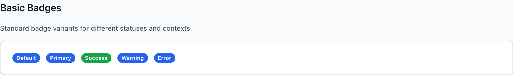
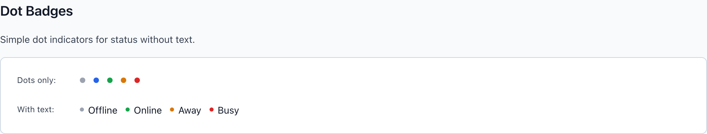
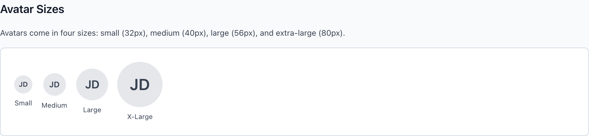
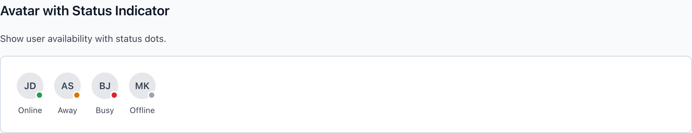

# Badge & Avatar

Two small identity primitives. `wf-badge` is a pill-shaped status label whose color variant must map to a real semantic intent — never decoration. `wf-avatar` is a circular initials-or-image chip with four sizes, a stacked group, and a corner presence dot.

> Part of the Gravitate Wireframe Design System — lo-fi component reference. Index: `../CLAUDE.md`.

### Badge

`wf-badge` is a fully-rounded (`border-radius: 9999px`) inline pill at 12px / weight 500. Bare, it's the neutral default — gray fill, gray text — for categories, tags, and inactive states. Four color modifiers layer on a tinted background plus a darker text color: `wf-badge-primary` (blue, informational / in-progress), `wf-badge-success` (green, healthy / active / completed), `wf-badge-warning` (amber, pending / attention-needed), and `wf-badge-error` (red, failed / expired / cancelled).

Each color is a status signal, not a paint job — the same rule the rest of the system lives by (`DESIGN.md §3.1`): status colors are reserved for status, no exceptions. Sizes are `wf-badge-sm` and `wf-badge-lg` around the default; the badge also happily holds a count (`12`, `99+`) instead of a word.

### Status color variants



*The five intents: bare default (neutral gray), primary (blue/informational), success (green), warning (amber), error (red). The fill is a light tint, the text a darker shade of the same hue.*

### Badge variants

One color modifier per badge, layered on the base `wf-badge` class. Size modifiers (`wf-badge-sm`, `wf-badge-lg`) compose with any color.

| Variant | When to use | Code |
| --- | --- | --- |
| `wf-badge` | Neutral default — categories, tags, inactive or draft states. Gray fill, gray text. | `<span class="wf-badge">Draft</span>` |
| `wf-badge-primary` | Informational / in-progress states — In Review, In Progress, Medium priority. | `<span class="wf-badge wf-badge-primary">In Review</span>` |
| `wf-badge-success` | Healthy / completed / positive status — Active, Executed, Approved, Online. | `<span class="wf-badge wf-badge-success">Active</span>` |
| `wf-badge-warning` | Pending / attention-needed status — Pending, Pending Signature, High priority. | `<span class="wf-badge wf-badge-warning">Pending</span>` |
| `wf-badge-error` | Hard-fail / negative status — Expired, Cancelled, Failed, Critical. | `<span class="wf-badge wf-badge-error">Expired</span>` |
| `wf-badge-sm` | Compact contexts — inside dense list rows, card meta, profile chips. | `<span class="wf-badge wf-badge-success wf-badge-sm">Admin</span>` |
| `wf-badge-lg` | Standalone emphasis where the badge is the headline, not a footnote. | `<span class="wf-badge wf-badge-warning wf-badge-lg">Pending</span>` |

### Dot variants



*`wf-badge-dot` indicators across the same intents, shown bare (top) and paired with a text label via `wf-badge-with-dot` (bottom). Inside a labelled wrapper the dot shrinks from 8px to 6px.*

### Dot badge variants

A `wf-badge-dot` is a tiny round status indicator (8px) for presence and at-a-glance status without a pill. Wrap it in `wf-badge-with-dot` to attach a text label — which you almost always should, since the dot alone is color-only.

| Variant | When to use | Code |
| --- | --- | --- |
| `wf-badge-dot` | Bare neutral dot — gray (`--wf-color-neutral-400`), used for offline / unset. | `<span class="wf-badge-dot"></span>` |
| `wf-badge-dot-success` | Green dot for online / healthy presence. | `<span class="wf-badge-dot wf-badge-dot-success"></span>` |
| `wf-badge-dot-warning` | Amber dot for away / attention. | `<span class="wf-badge-dot wf-badge-dot-warning"></span>` |
| `wf-badge-dot-error` | Red dot for busy / error. | `<span class="wf-badge-dot wf-badge-dot-error"></span>` |
| `wf-badge-dot-primary` | Blue dot for an informational / active marker. | `<span class="wf-badge-dot wf-badge-dot-primary"></span>` |
| `wf-badge-with-dot` | The accessible pairing — dot + readable label so color isn't the only signal. | `<span class="wf-badge-with-dot"><span class="wf-badge-dot wf-badge-dot-success"></span> Online</span>` |

### Badge color tokens

Each color variant is a fill/text pair defined at `:root` in `data-display.css`. The default pair references the neutral scale; the four status pairs are literal tinted backgrounds with a darker same-hue text.

| Token | Value | Use for |
| --- | --- | --- |
| `--wf-badge-default-bg / -text` | `#f3f4f6 / #374151` | Bare `wf-badge` — neutral gray pill (via `--wf-color-neutral-100` / `-700`). |
| `--wf-badge-primary-bg / -text` | `#dbeafe / #1e40af` | `wf-badge-primary` — informational blue. |
| `--wf-badge-success-bg / -text` | `#dcfce7 / #166534` | `wf-badge-success` — healthy / positive green. |
| `--wf-badge-warning-bg / -text` | `#fef3c7 / #92400e` | `wf-badge-warning` — pending amber. |
| `--wf-badge-error-bg / -text` | `#fee2e2 / #991b1b` | `wf-badge-error` — hard-fail red. |

### Avatar

`wf-avatar` is a 40px circle that holds either `wf-avatar-initials` (uppercase, weight 600, neutral-gray text on a neutral-gray fill) or an image via `wf-avatar-image` (object-fit: cover). Initials are the fallback when no photo exists — the markup is designed so the same circle works either way.

Four sizes: `wf-avatar-sm` (32px), default (40px), `wf-avatar-lg` (56px), `wf-avatar-xl` (80px) — and the initials font scales with each. Stack several with `wf-avatar-group` (each child gets a 2px white ring and a -12px overlap; the first child resets its margin), and cap the stack with a `wf-avatar-count` chip (`+5`). For presence, wrap the avatar in `wf-avatar-wrapper` and drop a `wf-avatar-status` dot in the bottom-right corner.

### Avatar sizes



*Small (32px), Medium (40px / default), Large (56px), X-Large (80px). The `wf-avatar-initials` font scales 12 / 14 / 20 / 28px to match.*

### Avatar variants

The base `wf-avatar` is the medium (40px) circle. Size, group, count, and status classes compose onto it.

| Variant | When to use | Code |
| --- | --- | --- |
| `wf-avatar` | Default 40px circle with initials fallback. | `<div class="wf-avatar"><span class="wf-avatar-initials">JD</span></div>` |
| `wf-avatar-image` | Photo avatar — image fills and crops to the circle (object-fit: cover). | `<div class="wf-avatar"></div>` |
| `wf-avatar-sm` | 32px — list rows, activity feeds, inline name chips. | `<div class="wf-avatar wf-avatar-sm"><span class="wf-avatar-initials">JD</span></div>` |
| `wf-avatar-lg` | 56px — section headers, prominent assignees. | `<div class="wf-avatar wf-avatar-lg"><span class="wf-avatar-initials">JD</span></div>` |
| `wf-avatar-xl` | 80px — profile cards and hero identity blocks. | `<div class="wf-avatar wf-avatar-xl"><span class="wf-avatar-initials">JD</span></div>` |
| `wf-avatar-group` | Stack of overlapping avatars (-12px overlap, 2px white ring) for shared assignment. | `<div class="wf-avatar-group"><div class="wf-avatar"><span class="wf-avatar-initials">JD</span></div><div class="wf-avatar"><span class="wf-avatar-initials">AS</span></div></div>` |
| `wf-avatar-count` | Overflow chip closing a group — gray fill, `+N` instead of initials. | `<div class="wf-avatar wf-avatar-count"><span class="wf-avatar-initials">+5</span></div>` |

### Status indicator



*`wf-avatar-wrapper` positions a `wf-avatar-status` dot in the corner: online (green), away (amber), busy (red), offline (gray). The 2px white border keeps the dot legible against any avatar fill.*

### Presence (status dot)

Presence is a separate concern from the avatar: wrap the avatar in `wf-avatar-wrapper` (position: relative) so the absolutely-positioned `wf-avatar-status` dot anchors to its bottom-right corner.

| Variant | When to use | Code |
| --- | --- | --- |
| `wf-avatar-status-online` | Green — user is active. Maps to `--wf-color-success`. | `<span class="wf-avatar-status wf-avatar-status-online"></span>` |
| `wf-avatar-status-away` | Amber — idle / away. Maps to `--wf-color-warning`. | `<span class="wf-avatar-status wf-avatar-status-away"></span>` |
| `wf-avatar-status-busy` | Red — do-not-disturb / busy. Maps to `--wf-color-error`. | `<span class="wf-avatar-status wf-avatar-status-busy"></span>` |
| `wf-avatar-status-offline` | Gray — offline / unknown. Maps to `--wf-color-neutral-400`. | `<span class="wf-avatar-status wf-avatar-status-offline"></span>` |

### Avatar & dot tokens

Avatar fills come from the neutral scale; status dots reuse the same semantic status colors as the badge so presence reads consistently with the rest of the system.

| Token | Value | Use for |
| --- | --- | --- |
| `--wf-avatar-bg` | `#e5e7eb` | Default avatar fill — `--wf-color-neutral-200`. |
| `--wf-avatar-text` | `#374151` | Initials color — `--wf-color-neutral-700`. |
| `--wf-color-success` | `#16a34a` | online dot / success dot. |
| `--wf-color-warning` | `#d97706` | away dot / warning dot. |
| `--wf-color-error` | `#dc2626` | busy dot / error dot. |
| `--wf-color-neutral-400` | `#9ca3af` | offline dot / bare default dot. |

### Canonical usage

```html
<!-- Status badge — color carries intent, text carries the meaning -->
<span class="wf-badge wf-badge-success">Active</span>
<span class="wf-badge wf-badge-warning">Pending Signature</span>
<span class="wf-badge wf-badge-error">Expired</span>

<!-- Dot + label so the signal survives without color -->
<span class="wf-badge-with-dot">
  <span class="wf-badge-dot wf-badge-dot-success"></span>
  Online
</span>

<!-- Avatar with initials fallback -->
<div class="wf-avatar">
  <span class="wf-avatar-initials">JD</span>
</div>

<!-- Avatar with presence dot -->
<div class="wf-avatar-wrapper">
  <div class="wf-avatar wf-avatar-sm">
    <span class="wf-avatar-initials">JD</span>
  </div>
  <span class="wf-avatar-status wf-avatar-status-online"></span>
</div>

<!-- Stacked group with overflow count -->
<div class="wf-avatar-group">
  <div class="wf-avatar"><span class="wf-avatar-initials">JD</span></div>
  <div class="wf-avatar"><span class="wf-avatar-initials">AS</span></div>
  <div class="wf-avatar wf-avatar-count"><span class="wf-avatar-initials">+5</span></div>
</div>
```

The status dot lives in `wf-avatar-wrapper`, not inside `wf-avatar` — the avatar circle has `overflow: hidden`, so a dot placed inside would be clipped.

### Color is a signal, not decoration

These are the system's hard rules (`DESIGN.md §3.1`, §3.3) applied to badges and dots.

1. **A status color only appears when there is real status to report.** — Success green means healthy/done; warning amber means pending; error red means failed. Painting a category tag green to make it 'pop' is a §3.1 violation.
2. **Categories, tags, and counts stay on the bare neutral `wf-badge`.** — If a tag isn't reporting status, it has no business borrowing a status color — reserve the palette so the colored badges still mean something.
3. **Color is never the only signal — pair every status color with its label.** — DESIGN.md §3.3 / §6.3: red alone isn't an error. The badge text or the `wf-badge-with-dot` label is the non-color signal that carries to colorblind and AT users.
4. **Don't recolor presence dots for emphasis.** — online/away/busy/offline map 1:1 to success/warning/error/neutral. Reusing those hues for a 'new' or 'featured' marker collides with their reserved meaning.

### Badge color do's and don'ts

- **Do:** <span class="wf-badge wf-badge-error">Expired</span>
  **Don't:** <span class="wf-badge wf-badge-error">Premium</span>
  **Why:** Error red is reserved for hard-fail status (DESIGN.md §3.1). A premium/marketing label borrowing red trains users to ignore the color where it actually warns.
- **Do:** <span class="wf-badge">Natural Gas</span>
  **Don't:** <span class="wf-badge wf-badge-success">Natural Gas</span>
  **Why:** A product category is neutral, not status — it stays on the bare gray badge. Green here dilutes the meaning of 'healthy/active' everywhere else.
- **Do:** <span class="wf-badge-with-dot"><span class="wf-badge-dot wf-badge-dot-error"></span> Busy</span>
  **Don't:** <span class="wf-badge-dot wf-badge-dot-error"></span>
  **Why:** A lone red dot communicates nothing to a colorblind user. §3.3: pair the dot with a text label so the signal isn't color-only.
- **Do:** wf-badge-warning for Pending
  **Don't:** wf-badge-warning as a 'tip'/highlight accent
  **Why:** Warning amber is reserved for attention-needed status (§3.1 'Never used for: highlighting, tip callouts'). Use weight or hierarchy for emphasis, not the status palette.

### Gotchas

- **Default badge has no modifier class** — The neutral pill is just `wf-badge` — there is no `wf-badge-default`. The color modifiers (`-primary`, `-success`, `-warning`, `-error`) override the default fill/text pair that ships on the base class.
- **Status dot must live outside the avatar circle** — `wf-avatar` sets `overflow: hidden` so images crop cleanly — a `wf-avatar-status` dot placed inside the circle gets clipped. Put the dot as a sibling inside `wf-avatar-wrapper` (which is `position: relative`); the dot is absolutely positioned to the corner.
- **Group children need the group as parent to overlap** — The -12px overlap, 2px white ring, and first-child margin reset are all scoped to `.wf-avatar-group .wf-avatar`. A bare `wf-avatar` outside the group won't overlap — and `wf-avatar-count` only gets its gray fill inside the group context.
- **Dot shrinks inside a labelled wrapper** — A standalone `wf-badge-dot` is 8px, but `.wf-badge-with-dot .wf-badge-dot` narrows it to 6px so it sits proportionally beside text. Same class, two sizes depending on context.
- **Badge color tokens are literal hex, not aliases** — The four status fills (`#dbeafe`, `#dcfce7`, `#fef3c7`, `#fee2e2`) and their text colors are defined directly in `data-display.css`, not pulled from `tokens.css`. The badge tints are intentionally lighter than the solid `--wf-color-success`/`-warning`/`-error` used for dots — don't expect a colored badge and a status dot of the 'same' intent to be the identical hue.
