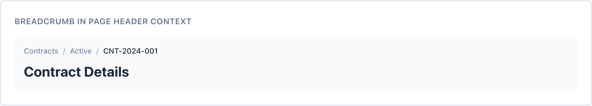
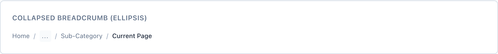
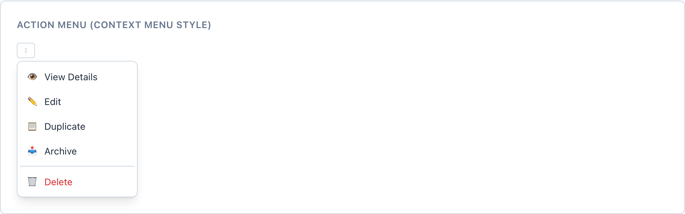

# Breadcrumb, Sidebar & Menu

Three navigation surfaces that answer 'where am I' and 'what can I do here'. `wf-breadcrumb` shows hierarchical position in a deep tree, `wf-sidebar` is the persistent top-level app rail that always marks your current location, and `wf-menu` is the floating dropdown / context menu for grouped actions. Each leans on the neutral scale and reserves `--wf-color-primary` for the one element that says 'you are here'.

> Part of the Gravitate Wireframe Design System — lo-fi component reference. Index: `../CLAUDE.md`.

Pick the surface by the question the user is asking. `wf-breadcrumb` answers 'where am I in the hierarchy' — it shows your position *and* the parents, so reach for it only inside a deep tree (Contracts / Active / CNT-2024-001). Per the DESIGN.md navigation rule, a one-level breadcrumb is just a heading — don't render it.

`wf-sidebar` is the persistent top-level rail. It's the user's primary mental model for 'where am I in the app', it survives across screens, and exactly one `wf-sidebar-item` carries `wf-sidebar-item-active` to mark the current location. `wf-menu` is the opposite of persistent — a floating dropdown anchored to a trigger inside `wf-menu-container`, holding grouped actions (Edit, Duplicate, Delete) or a context menu off a `⋮` button.

All three are pure HTML/CSS. There are no props — you compose state by adding modifier classes (`wf-breadcrumb-current`, `wf-sidebar-item-active`, `wf-menu-item-danger`) to the canonical markup. Copy the markup verbatim; don't invent class names.

### Breadcrumb in a page header



*The trail sits above the page title. Parent links (Contracts, Active) render muted in `--wf-color-text-muted`; the leaf gets `wf-breadcrumb-current` — darker `--wf-color-text` at 500 weight, and it is a plain span, not a link.*

### Breadcrumb parts

A `wf-breadcrumb` is a flat row of items and separators inside a <nav>. Links are <a>; the current leaf is a non-link <span>. The separator glyph is literal text — swap '/' for '›' or '→' as you like.

| Variant | When to use | Code |
| --- | --- | --- |
| `wf-breadcrumb-item` | A parent crumb. As an <a>, it's a muted link that turns `--wf-color-primary` and underlines on hover. | `<a href="#" class="wf-breadcrumb-item">Contracts</a>` |
| `wf-breadcrumb-current` | The active leaf — your current location. Pair on a <span>, never an <a>: it's where you already are. | `<span class="wf-breadcrumb-item wf-breadcrumb-current">CNT-2024-001</span>` |
| `wf-breadcrumb-separator` | The divider between crumbs. Holds the literal glyph and is `user-select: none` so it won't copy. | `<span class="wf-breadcrumb-separator">/</span>` |
| `wf-breadcrumb-icon` | Add to an item to inline a leading glyph with the label, with a 4px gap. | `<a href="#" class="wf-breadcrumb-item wf-breadcrumb-icon"><span>🏠</span><span>Home</span></a>` |
| `wf-breadcrumb-ellipsis` | Collapse a deep middle. A 24x24 clickable token standing in for hidden ancestors between the root and the leaf. | `<span class="wf-breadcrumb-ellipsis" title="Click to expand">...</span>` |

### Collapsed breadcrumb (ellipsis)



*For deep paths, the middle ancestors collapse to a single `wf-breadcrumb-ellipsis` token between the root and the active leaf — keeping the trail one line without losing the start/end anchors.*

### Breadcrumb trail

```html
<nav class="wf-breadcrumb">
  <a href="#" class="wf-breadcrumb-item">Home</a>
  <span class="wf-breadcrumb-separator">/</span>
  <a href="#" class="wf-breadcrumb-item">Contracts</a>
  <span class="wf-breadcrumb-separator">/</span>
  <span class="wf-breadcrumb-item wf-breadcrumb-current">CNT-2024-001</span>
</nav>
```

The separator carries the glyph as text — change '/' to '›' or '→' to restyle the whole trail without touching CSS.

### Sidebar with nested navigation


*The nav rail: Contracts carries `wf-sidebar-item-active` (solid `--wf-color-primary` fill, inverse text), its children sit in a `wf-sidebar-nested` block with a left border, and Pending Review carries a `wf-badge wf-badge-sm` count.*

### Sidebar parts

A `wf-sidebar` is an <aside> stacking a header, a scrollable `wf-sidebar-nav`, and a footer. Items are <a>; one — and only one — gets the active modifier.

| Variant | When to use | Code |
| --- | --- | --- |
| `wf-sidebar-item` | A nav link. Muted resting; on hover it lifts to `--wf-color-bg-hover` with `--wf-color-text`. | `<a href="#" class="wf-sidebar-item"><span class="wf-sidebar-icon">📋</span><span class="wf-sidebar-label">Contracts</span></a>` |
| `wf-sidebar-item-active` | The current location — exactly one per rail. Solid `--wf-color-primary` fill with inverse text; hover deepens to `--wf-color-primary-hover`. | `<a href="#" class="wf-sidebar-item wf-sidebar-item-active"><span class="wf-sidebar-icon">📊</span><span class="wf-sidebar-label">Dashboard</span></a>` |
| `wf-sidebar-nested` | Second-level children under a parent item. Indents and draws a left border to show the tree relationship. | `<div class="wf-sidebar-nested">   <a href="#" class="wf-sidebar-item"><span class="wf-sidebar-label">All Contracts</span></a>   <a href="#" class="wf-sidebar-item"><span class="wf-sidebar-label">Pending Review</span><span class="wf-badge wf-badge-sm">3</span></a> </div>` |
| `wf-sidebar-group + wf-sidebar-group-label` | Cluster related items under an uppercased section header (e.g. Settings). | `<div class="wf-sidebar-group">   <span class="wf-sidebar-group-label">Settings</span>   <a href="#" class="wf-sidebar-item">Profile</a> </div>` |
| `wf-sidebar-divider` | A 1px rule separating clusters within the nav. | `<div class="wf-sidebar-divider"></div>` |
| `wf-sidebar-collapsed` | Icons-only rail. Add to the root <aside>: width drops to 64px and labels, group labels, and badges hide. Add a `title` to each item so the icon stays labelled. | `<aside class="wf-sidebar wf-sidebar-collapsed">   <a href="#" class="wf-sidebar-item" title="Contracts">...</a> </aside>` |
| `wf-sidebar-dark` | Dark theme. Add to the root <aside>: gray-900 background, items in gray-400 text. The active item keeps the same `--wf-color-primary` fill. | `<aside class="wf-sidebar wf-sidebar-dark">...</aside>` |

### Sidebar rail

```html
<aside class="wf-sidebar">
  <div class="wf-sidebar-header">
    <span class="wf-sidebar-logo">Gravitate</span>
  </div>
  <nav class="wf-sidebar-nav">
    <a href="#" class="wf-sidebar-item wf-sidebar-item-active">
      <span class="wf-sidebar-icon">📊</span>
      <span class="wf-sidebar-label">Dashboard</span>
    </a>
    <a href="#" class="wf-sidebar-item">
      <span class="wf-sidebar-icon">📋</span>
      <span class="wf-sidebar-label">Contracts</span>
      <span class="wf-badge wf-badge-sm">5</span>
    </a>
    <div class="wf-sidebar-divider"></div>
    <div class="wf-sidebar-group">
      <span class="wf-sidebar-group-label">Settings</span>
      <a href="#" class="wf-sidebar-item">Profile</a>
    </div>
  </nav>
  <div class="wf-sidebar-footer">User info / logout</div>
</aside>
```

`wf-sidebar-label` is the flex-growing text that gets truncated and hidden when collapsed; badges follow it and also hide when collapsed.

### Action / context menu



*A `wf-menu` dropdown in context-menu style off a `⋮` trigger: grouped actions with hover affordance, a `wf-menu-divider` before the destructive item, and Delete styled with `wf-menu-item-danger` in `--wf-color-danger`.*

### Menu parts

A `wf-menu` is an absolutely-positioned dropdown anchored inside a relative `wf-menu-container`. Items are <button>s for keyboard operability. It opens below-left by default.

| Variant | When to use | Code |
| --- | --- | --- |
| `wf-menu-container` | The relative anchor wrapping the trigger and the menu. The menu positions against it. | `<div class="wf-menu-container">   <button class="wf-button wf-button-secondary">Options ▼</button>   <div class="wf-menu">...</div> </div>` |
| `wf-menu-item` | A standard action row. A full-width left-aligned <button> that highlights to `--wf-color-bg-hover` on hover and focus. | `<button class="wf-menu-item"><span class="wf-menu-icon">✏️</span>Edit</button>` |
| `wf-menu-item-danger` | A destructive action. Renders in `--wf-color-danger` with a tinted `--wf-color-error-bg` hover. | `<button class="wf-menu-item wf-menu-item-danger"><span class="wf-menu-icon">🗑️</span>Delete</button>` |
| `disabled (attribute)` | An unavailable action. The native disabled attribute mutes the text to `--wf-color-text-disabled` and sets not-allowed. | `<button class="wf-menu-item" disabled>Paste</button>` |
| `wf-menu-divider` | A 1px rule separating action clusters — typically before a destructive item. | `<div class="wf-menu-divider"></div>` |
| `wf-menu-label` | An uppercased section header inside the menu (Display, Sort By). | `<div class="wf-menu-label">Display</div>` |
| `wf-menu-shortcut` | A keyboard hint pushed to the right edge of an item via margin-left:auto. | `<button class="wf-menu-item">Save<span class="wf-menu-shortcut">⌘S</span></button>` |
| `wf-menu-item-check / -checked` | A toggleable item. -check reserves a left checkmark slot; add -checked to show the ✓ in `--wf-color-primary`. | `<button class="wf-menu-item wf-menu-item-check wf-menu-item-checked">Show Sidebar</button>` |
| `wf-menu-right` | Right-align the dropdown to its trigger (account/profile menus near the right edge). | `<div class="wf-menu wf-menu-right">...</div>` |

### Context menu with a destructive action

```html
<div class="wf-menu-container">
  <button class="wf-button wf-button-secondary wf-button-sm">⋮</button>
  <div class="wf-menu">
    <button class="wf-menu-item"><span class="wf-menu-icon">👁️</span>View Details</button>
    <button class="wf-menu-item"><span class="wf-menu-icon">✏️</span>Edit</button>
    <button class="wf-menu-item"><span class="wf-menu-icon">📥</span>Archive</button>
    <div class="wf-menu-divider"></div>
    <button class="wf-menu-item wf-menu-item-danger"><span class="wf-menu-icon">🗑️</span>Delete</button>
  </div>
</div>
```

Items are real <button>s, so they're tab-reachable and show the same `--wf-color-bg-hover` highlight on focus as on hover.

### Tokens these components lean on

Every value here comes from a token. The fallbacks shown are the literals baked into navigation.css.

| Token | Value | Use for |
| --- | --- | --- |
| `--wf-color-primary` | `#2563eb` | The single 'you are here' signal: active sidebar item fill, breadcrumb link hover, menu checkmark. |
| `--wf-color-primary-hover` | `#1d4ed8` | Deepened fill when hovering the active sidebar item. |
| `--wf-color-text-muted` | `#64748b` | Resting breadcrumb links and resting sidebar items. |
| `--wf-color-text` | `#1e293b` | Breadcrumb current leaf and standard menu item text. |
| `--wf-color-text-inverse` | `#ffffff` | Label on the active (primary-filled) sidebar item. |
| `--wf-color-text-disabled` | `#94a3b8` | Breadcrumb separators, disabled menu items, menu shortcuts. |
| `--wf-color-bg-hover` | `#f8fafc` | Hover/focus surface on sidebar items and menu items. |
| `--wf-color-danger` | `#dc2626` | Destructive menu item text (wf-menu-item-danger). |
| `--wf-color-error-bg` | `#fef2f2` | Hover surface behind a destructive menu item. |
| `--wf-color-border` | `#cbd5e1` | Sidebar right border, dividers, menu border, nested left rule. |
| `--wf-sidebar-width` | `256px` | Expanded rail width. |
| `--wf-sidebar-width-collapsed` | `64px` | Icons-only rail width (wf-sidebar-collapsed). |
| `--wf-z-dropdown` | `100` | Stacking layer for the open menu. |
| `--wf-shadow-lg` | `0 10px 15px -3px rgba(0,0,0,0.1)` | Elevation under the floating menu. |

### When to use which

From the DESIGN.md navigation decision tree (§4.4): peer views → Tabs; ordered path → Stepper; top-level location → Sidebar; hierarchy crumbs → Breadcrumb.

1. **Use the breadcrumb only inside a deep hierarchy where the parents matter.** — Its job is to show position AND ancestors in a tree like Contracts / 2026 / ACME / Schedule.
2. **Exactly one wf-sidebar-item-active per rail.** — The sidebar is the user's mental model for 'where am I in the app' — two active items means two answers to one question.
3. **Reserve the primary fill for the active item only; everything else is neutral.** — Per the color-intent rules, primary marks the current location and interactive intent — not decoration.
4. **Reach for a Menu for actions, not for navigation between views.** — Switching peer views is Tabs; an ordered flow is a Stepper. A dropdown is for verbs (Edit, Export, Delete).
5. **Put a wf-menu-divider before any destructive item, and style it wf-menu-item-danger.** — Color plus separation plus the trash glyph is the safety signal — color alone is never enough.

### Do's & Don'ts

- **Do:** <span class="wf-breadcrumb-item wf-breadcrumb-current">CNT-2024-001</span>
  **Don't:** <a href="#" class="wf-breadcrumb-item wf-breadcrumb-current">CNT-2024-001</a>
  **Why:** The current leaf is where you already are. Only the hover (link) treatment lives on a.wf-breadcrumb-item, so a current <a> invites a click to nowhere.
- **Do:** A multi-level trail (Home / Contracts / CNT-2024-001)
  **Don't:** A single-level breadcrumb (just 'Analytics')
  **Why:** DESIGN.md §7.5: a single-level breadcrumb is just a heading — render a heading (the page-header demo pairs the trail with an <h2>) instead.
- **Do:** Mark one wf-sidebar-item-active
  **Don't:** Highlight several items or none
  **Why:** The active fill is the location signal; multiple lit items destroy the 'where am I' answer.
- **Do:** Add a title to each item when wf-sidebar-collapsed
  **Don't:** Collapse the rail and let bare icons stand alone
  **Why:** Collapsed hides wf-sidebar-label, so the title attribute is the only thing left labelling the glyph for hover and screen readers.
- **Do:** Build menu items as <button> elements
  **Don't:** Use non-focusable <div>s for menu items
  **Why:** The wf-menu-item focus style and keyboard reachability depend on a real button; a div is invisible to Tab.

### Gotchas

- **The breadcrumb hover only applies to links** — The hover rule is scoped to `a.wf-breadcrumb-item` — color shift to primary plus underline. A current <span> correctly gets no hover, which is why the leaf must be a span, not a styled link.
- **Collapsing the sidebar hides labels, group labels, and badges** — wf-sidebar-collapsed sets `display:none` on wf-sidebar-label, wf-sidebar-group-label, and any .wf-badge inside an item. The icon and the title attribute are all that remain — so a badge count you were relying on disappears.
- **Nested items drop their icon by convention** — In the source, wf-sidebar-nested children carry only a wf-sidebar-label (no wf-sidebar-icon). The left border and indent of wf-sidebar-nested carry the hierarchy instead of a per-item glyph.
- **The menu is hidden by positioning, not by a state class** — wf-menu is absolutely positioned at top:100% under its trigger inside wf-menu-container; it has no built-in open/closed class. The demo forces it visible with a static-position override — wiring the open/close toggle is on you.
- **wf-menu-item-check reserves space whether or not it's checked** — The -check modifier adds left padding and a 16px ::before slot so checked and unchecked items align. The ✓ only appears when you also add wf-menu-item-checked; -check alone is an empty (unchecked) slot.
