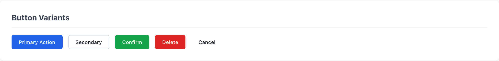
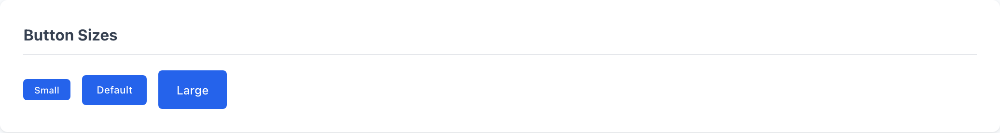
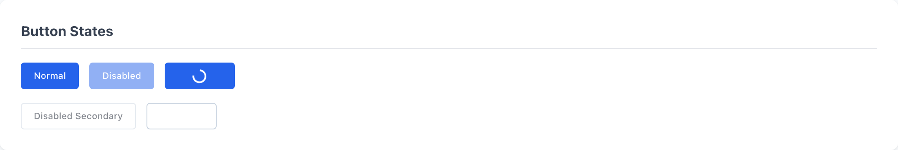
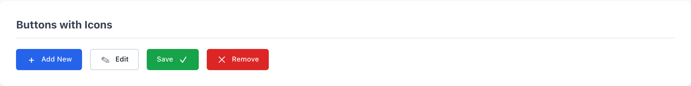

# Buttons

`.wf-button` is the only button in the wireframe kit. A base class sets the inline-flex shape, padding, and 6px radius; a single variant modifier carries the color and intent. Stack a size modifier when you need it, and let the `disabled` attribute and `.wf-button-loading` cover the two in-flight states.

> Part of the Gravitate Wireframe Design System — lo-fi component reference. Index: `../CLAUDE.md`.

Always pair the base `.wf-button` with exactly one variant modifier — the base alone is a transparent-bordered button with no fill. The variant supplies background, border, and text color, so it is also what signals intent: `.wf-button-primary` for the one primary CTA, `.wf-button-secondary` for neutral actions, `.wf-button-success` to confirm, `.wf-button-danger` to destroy, `.wf-button-ghost` for the quietest tertiary action like Cancel.

Size and state are independent, stackable modifiers. Add `.wf-button-sm` or `.wf-button-lg` to shift padding and font size; add the `disabled` attribute or `.wf-button-loading` for the two waiting states. The button lays out with `inline-flex` and a `--wf-space-sm` gap, so a `<span class="wf-icon">` child slots in on either side of the label with no extra markup.

### Button variants — the API



*Base .wf-button plus one variant modifier: primary (solid blue, white text), secondary (white fill, gray border), success (solid green), danger (solid red), ghost (transparent, no border). The variant is the intent signal — don't pick a color for decoration.*

### Variant modifiers

Pair the base `.wf-button` with exactly one of these. They are mutually exclusive — one variant per button.

| Variant | When to use | Code |
| --- | --- | --- |
| `wf-button-primary` | The single primary CTA on a surface. Solid `--wf-color-primary` blue with white text. | `<button class="wf-button wf-button-primary">Primary Action</button>` |
| `wf-button-secondary` | Neutral or secondary actions. White surface fill with a `--wf-color-border` outline and dark text. | `<button class="wf-button wf-button-secondary">Secondary</button>` |
| `wf-button-success` | Confirm a positive, completed action. Solid `--wf-color-success` green with white text. | `<button class="wf-button wf-button-success">Confirm</button>` |
| `wf-button-danger` | Destructive actions — Delete, Remove. Solid `--wf-color-danger` red with white text. | `<button class="wf-button wf-button-danger">Delete</button>` |
| `wf-button-ghost` | Low-emphasis tertiary actions like Cancel. Transparent background and border, dark text; only tints on hover. | `<button class="wf-button wf-button-ghost">Cancel</button>` |

### Button sizes



*Size modifiers stack on top of a variant. .wf-button-sm tightens padding to xs/md and drops to --wf-font-size-sm; the default carries no size class; .wf-button-lg opens padding to md/xl at --wf-font-size-lg.*

### Size modifiers

Optional, stacked on top of a variant. Default size (no class) covers most cases.

| Variant | When to use | Code |
| --- | --- | --- |
| `wf-button-sm` | Compact toolbars and inline placements. Padding `--wf-space-xs` / `--wf-space-md`, font `--wf-font-size-sm` (13px). | `<button class="wf-button wf-button-primary wf-button-sm">Small</button>` |
| `(default)` | The standard button. No size class — base padding `--wf-space-sm` / `--wf-space-lg`, font `--wf-font-size-md` (14px). | `<button class="wf-button wf-button-primary">Default</button>` |
| `wf-button-lg` | Prominent or hero actions. Padding `--wf-space-md` / `--wf-space-xl`, font `--wf-font-size-lg` (16px). | `<button class="wf-button wf-button-primary wf-button-lg">Large</button>` |

### Button states — disabled & loading



*The disabled attribute drops the button to 0.6 opacity with a not-allowed cursor on every variant. .wf-button-loading hides the label (color: transparent), kills pointer events, and spins a ::after ring — use it while an action is in flight.*

### State modifiers

Both states apply to any variant.

| Variant | When to use | Code |
| --- | --- | --- |
| `disabled (attribute)` | The action is unavailable. Sets `cursor: not-allowed` and `opacity: 0.6`; hover and active styling are suppressed via `:not(:disabled)`. | `<button class="wf-button wf-button-primary" disabled>Disabled</button>` |
| `wf-button-loading` | An action is in flight. Label goes `color: transparent`, `pointer-events` are off, and a 16px spinner animates via `::after`. | `<button class="wf-button wf-button-primary wf-button-loading">Loading...</button>` |

### Buttons with icons



*Drop a <span class="wf-icon"> child before or after the label. The button's inline-flex layout and --wf-space-sm gap handle alignment; the icon is a fixed 16x16 box.*

### Canonical usage

```html
<!-- Primary CTA — one per surface -->
<button class="wf-button wf-button-primary">Primary Action</button>

<!-- Neutral secondary -->
<button class="wf-button wf-button-secondary">Secondary</button>

<!-- Destructive -->
<button class="wf-button wf-button-danger">Delete</button>

<!-- Low-emphasis tertiary -->
<button class="wf-button wf-button-ghost">Cancel</button>

<!-- Size modifier stacked on a variant -->
<button class="wf-button wf-button-primary wf-button-sm">Small</button>

<!-- Icon + label -->
<button class="wf-button wf-button-primary"><span class="wf-icon">+</span> Add New</button>

<!-- In-flight states -->
<button class="wf-button wf-button-primary" disabled>Disabled</button>
<button class="wf-button wf-button-primary wf-button-loading">Loading...</button>
```

Every button is base .wf-button + one variant. Size and state modifiers stack on top.

### Tokens the button reads

These are defined in this stylesheet's `:root` and drive the button's resting appearance.

| Token | Value | Use for |
| --- | --- | --- |
| `--wf-color-primary` | `#2563eb` | Primary fill and border. |
| `--wf-color-bg` | `#ffffff` | Secondary button surface fill. |
| `--wf-color-success` | `#16a34a` | Success fill and border. |
| `--wf-color-danger` | `#dc2626` | Danger fill and border. |
| `--wf-color-text-inverse` | `#ffffff` | White label on solid primary/success/danger fills. |
| `--wf-color-text` | `#1e293b` | Dark label on secondary and ghost. |
| `--wf-color-border` | `#cbd5e1` | Secondary button outline. |
| `--wf-radius-md` | `6px` | Button corner radius. |
| `--wf-font-size-md` | `14px` | Default label size. |

### Button rules

1. **Always combine `.wf-button` with exactly one variant modifier.** — The base class has a transparent border and no fill — without a variant the button is invisible chrome.
2. **Use color to signal intent, never decoration — success means confirm, danger means destroy.** — Variant color is the only semantic the modifier carries; pick green or red for looks and you mislead the user.
3. **One `.wf-button-primary` per surface.** — Two solid-blue CTAs compete and erase the action hierarchy.
4. **Keep a 44x44 tap target even with `.wf-button-sm`.** — Small visual padding still needs a finger-sized hit area on touch surfaces.
5. **Pair every icon with a text label or an `aria-label`.** — Color and glyph shape are never the only signal — an unlabeled `.wf-icon` button is a usability hole.

### Do's & Don'ts

- **Do:** <button class="wf-button wf-button-primary">Save</button>
  **Don't:** <button class="wf-button">Save</button>
  **Why:** The base class alone has a transparent border and no fill — you need a variant to get a visible, colored button.
- **Do:** <button class="wf-button wf-button-primary wf-button-sm">Small</button>
  **Don't:** <button class="wf-button wf-button-sm">Small</button>
  **Why:** Size modifiers are additive on top of a variant, not a substitute for one.
- **Do:** <button class="wf-button wf-button-danger">Delete</button> for a destructive action
  **Don't:** <button class="wf-button wf-button-danger">Download</button> because red looks bold
  **Why:** Variant color is the intent signal — danger red on a safe action teaches users to ignore the warning.
- **Do:** <button class="wf-button wf-button-primary"><span class="wf-icon">+</span> Add New</button>
  **Don't:** <button class="wf-button wf-button-primary"><span class="wf-icon">+</span></button>
  **Why:** An icon-only button with no label or aria-label leaves the action unreadable to anyone who can't decode the glyph.

### Gotchas

- **Hover, active, and focus styling silently no-op** — controls.css references `--wf-color-primary-hover`, `--wf-color-primary-active`, `--wf-shadow-focus`, and the `--wf-space-sm`/`--wf-space-lg` family. This component stylesheet defines those itself in its own `:root`, but the shared `tokens/*.css` exports the *-dim, `--wf-focus-ring`, and `--wf-space-2`/`--wf-space-6` names instead. Load only the token files and the hover/active/focus and padding variables resolve to nothing — interaction states quietly disappear. Don't rely on those visual states from the token sheet alone.
- **Loading hides your label** — `.wf-button-loading` sets `color: transparent !important` and `pointer-events: none`, then draws a spinner via `::after`. The button keeps its width but the text vanishes and clicks are dead — only use it while an action is genuinely in flight, and don't count on the visible label text.
- **Disabled hover is suppressed by design** — Every variant's hover and active rules are scoped with `:not(:disabled)`, so a `disabled` button stays at 0.6 opacity with `not-allowed` and never reacts to the pointer — expected, but it means you can't restyle a disabled button's hover from this sheet.
- **Spinner color flips on solid variants** — The default spinner ring uses `currentColor`, but `.wf-button-primary`, `.wf-button-success`, and `.wf-button-danger` override it to `--wf-color-text-inverse` (white). A loading secondary or ghost button spins in the dark text color instead — consistent with their labels, just worth knowing if you swap variants.
