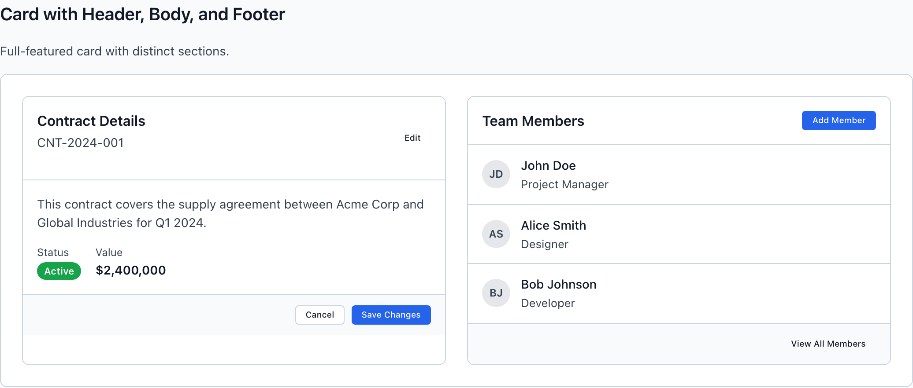
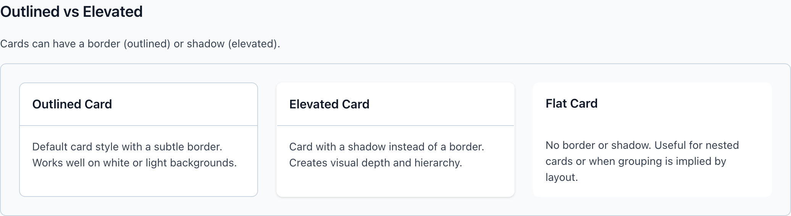
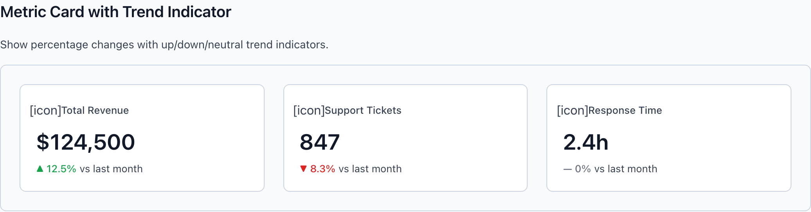
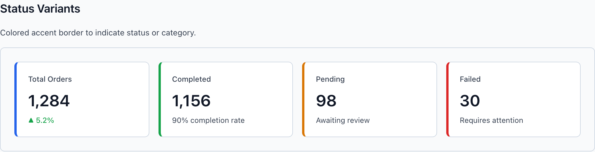

# Card & MetricCard

Two containers that look alike and do opposite jobs. `wf-card` is the default content chunk — a record, a panel, a list — with header/body/footer regions you compose freely. `wf-metric-card` is the dashboard specialist: one big number, one label, one optional trend. The whole entry is one decision — when each is the right reach (DESIGN.md §4.1).

> Part of the Gravitate Wireframe Design System — lo-fi component reference. Index: `../CLAUDE.md`.

`wf-card` is the default content container. Reach for it whenever you have a discrete chunk of related content — a record, a summary panel, a settings group, a list — that needs visual separation from its siblings. It ships with a `--wf-card-bg` surface, a `--wf-card-border`, an 8px corner radius, and three optional regions: `wf-card-header`, `wf-card-body`, `wf-card-footer`. Compose only the regions you need; a body-only card is valid.

`wf-metric-card` is *only* for dashboard metrics — a single headline `wf-metric-value`, a `wf-metric-title`, and an optional `wf-metric-subtitle` carrying a trend delta. It is not a generic "highlighted card." The container-choice rule is sharp: if your card holds more than one metric, or any prose, it is a `wf-card`, not a `wf-metric-card` (DESIGN.md §4.1, §7.4).

Quick lookup from the decision tree: highlighted single metric → `MetricCard`. Discrete content chunk → `Card`. Form fields → `FormSection` (not covered here). Width control only → `Container`.

### Card — Header / Body / Footer



*wf-card composed of header, body, and footer regions for richer container content. The header is a space-between flex row (title + action), the body holds free content, and the footer right-aligns its buttons on a tinted --wf-color-neutral-50 ground.*

### Card regions

The structural slots inside a wf-card. Each is optional — use only the regions the content needs. Header and footer each carry their own divider border; the footer gets a subtle tinted ground.

| Variant | When to use | Code |
| --- | --- | --- |
| `wf-card-header` | Title row at the top. Lays out as a space-between flex row, so a title block sits left and an action (Edit, Add) sits right. Carries a bottom border. | `<div class="wf-card-header">   <div>     <h3 class="wf-card-title">Contract Details</h3>     <p class="wf-card-subtitle">CNT-2024-001</p>   </div>   <button class="wf-button wf-button-ghost wf-button-sm">Edit</button> </div>` |
| `wf-card-body` | The main content region — 16px padding. Holds prose, fields, or a nested list. Set padding:0 inline when embedding a full-bleed wf-list. | `<div class="wf-card-body">   <p style="margin:0;">Supply agreement between Acme Corp and Global Industries for Q1 2024.</p> </div>` |
| `wf-card-footer` | Action row at the bottom. Right-aligned flex with an 8px gap, a top border, and a --wf-color-neutral-50 ground. Park commit/cancel buttons here. | `<div class="wf-card-footer">   <button class="wf-button wf-button-secondary wf-button-sm">Cancel</button>   <button class="wf-button wf-button-primary wf-button-sm">Save Changes</button> </div>` |

### Card — Outlined vs Elevated



*Side-by-side outlined (border) and elevated (shadow) wf-card surface variants. The elevated variant drops its border to transparent and lifts its shadow on hover; the flat variant strips both.*

### Card surface & state variants

Modifiers added alongside the base wf-card. Surface variants (default, elevated, flat) are mutually exclusive; clickable and selected stack for card-based selection UIs.

| Variant | When to use | Code |
| --- | --- | --- |
| `wf-card (default)` | Outlined — a 1px --wf-card-border on a white surface. The workhorse; works on white or light backgrounds. | `<div class="wf-card">   <div class="wf-card-body">…</div> </div>` |
| `wf-card-elevated` | Trades the border for a shadow (border-color goes transparent). Lifts to a deeper shadow on hover. Use for depth/hierarchy when the card floats above a tinted ground. | `<div class="wf-card wf-card-elevated">…</div>` |
| `wf-card-flat` | No border, no shadow. For nested cards or where layout already implies the grouping. Note: nesting cards is itself an anti-pattern (see Rules). | `<div class="wf-card wf-card-flat">…</div>` |
| `wf-card-compact` | Tightens padding across all three regions (12px header/body, 8px 12px footer). For sidebars, dense lists, and data-heavy surfaces — the density default. | `<div class="wf-card wf-card-compact">…</div>` |
| `wf-card-clickable` | Makes the whole card a target: cursor, 150ms transition, border turns --wf-color-primary on hover, scales to 0.99 on active. For selectable tiles and link cards. | `<div class="wf-card wf-card-clickable">…</div>` |
| `wf-card-selected` | The chosen state in a card-based selection. Primary border plus a #eff6ff tinted fill. Pairs with wf-card-clickable. | `<div class="wf-card wf-card-clickable wf-card-selected">…</div>` |

### MetricCard — Trend Indicator



*wf-metric-card showing a single headline value with up/down trend delta indicator. The trend pill lives inside wf-metric-subtitle; ▲ green for up, ▼ red for down, — gray for neutral.*

### MetricCard structure & trend

A metric card is header → value → subtitle. The subtitle is where the trend pill lives, alongside an optional comparison phrase like "vs last month." Trend direction maps to a dedicated semantic color token.

| Variant | When to use | Code |
| --- | --- | --- |
| `wf-metric-header` | The label row — an optional wf-metric-icon plus the wf-metric-title (13px, secondary text). Sits above the value. | `<div class="wf-metric-header">   <span class="wf-metric-icon">[icon]</span>   <span class="wf-metric-title">Total Revenue</span> </div>` |
| `wf-metric-value` | The headline number — 28px, 600 weight, primary text. The whole reason the card exists. Exactly one per card. | `<div class="wf-metric-value">$124,500</div>` |
| `wf-metric-trend-up` | Positive delta. Renders --wf-metric-trend-up (#16a34a) green. Pair the color with the ▲ glyph — never color alone (DESIGN.md §3.3). | `<div class="wf-metric-subtitle">   <span class="wf-metric-trend wf-metric-trend-up">&#9650; 12.5%</span>   vs last month </div>` |
| `wf-metric-trend-down` | Negative delta. Renders --wf-metric-trend-down (#dc2626) red, paired with the ▼ glyph. | `<span class="wf-metric-trend wf-metric-trend-down">&#9660; 8.3%</span>` |
| `wf-metric-trend-neutral` | No meaningful change. Renders --wf-metric-trend-neutral (#6b7280) gray, paired with the — em-dash glyph. | `<span class="wf-metric-trend wf-metric-trend-neutral">&#8212; 0%</span>` |

### MetricCard — Status Variants



*wf-metric-card status colorways (primary/success/warning/negative) tying the metric to a color intent via a 4px left accent border.*

### MetricCard status & size variants

Status variants add a 4px colored left border to tie the metric to a semantic intent. Honor §3.1: the accent color is a status signal, not decoration — use it only when the metric actually reports that status.

| Variant | When to use | Code |
| --- | --- | --- |
| `wf-metric-card-primary` | Marks the headline / current-focus metric. 4px --wf-color-primary (#2563eb) left border. | `<div class="wf-metric-card wf-metric-card-primary">…</div>` |
| `wf-metric-card-success` | A healthy / passing metric. 4px --wf-color-success (#16a34a) left border. Not a decorative "good" accent. | `<div class="wf-metric-card wf-metric-card-success">…</div>` |
| `wf-metric-card-warning` | Attention-required / pending metric. 4px --wf-color-warning (#d97706) left border. | `<div class="wf-metric-card wf-metric-card-warning">…</div>` |
| `wf-metric-card-error` | A failing / hard-fail metric. 4px --wf-color-error (#dc2626) left border. | `<div class="wf-metric-card wf-metric-card-error">…</div>` |
| `wf-metric-card-elevated` | Shadow instead of border (border-color transparent). For metric grids that float above a tinted ground. | `<div class="wf-metric-card wf-metric-card-elevated">…</div>` |
| `wf-metric-card-compact` | Tighter padding (16px) and a smaller 24px value. For secondary metrics or dense KPI strips. | `<div class="wf-metric-card wf-metric-card-compact">…</div>` |

### Card & metric tokens

The values both containers reach for. Surface and border tokens are shared; trend colors belong to the metric card.

| Token | Value | Use for |
| --- | --- | --- |
| `--wf-card-bg` | `#ffffff` | Surface fill for both wf-card and wf-metric-card. |
| `--wf-card-border` | `var(--wf-color-border, #d1d5db)` | 1px outline on the default (outlined) variant of both cards. |
| `--wf-card-shadow` | `0 1px 3px 0 rgba(0, 0, 0, 0.1), 0 1px 2px -1px rgba(0, 0, 0, 0.1)` | Resting shadow for the elevated variant. |
| `--wf-card-shadow-elevated` | `0 4px 6px -1px rgba(0, 0, 0, 0.1), 0 2px 4px -2px rgba(0, 0, 0, 0.1)` | Deeper shadow on hover of an elevated wf-card. |
| `--wf-metric-trend-up` | `#16a34a` | Green text for a positive trend pill (wf-metric-trend-up). |
| `--wf-metric-trend-down` | `#dc2626` | Red text for a negative trend pill (wf-metric-trend-down). |
| `--wf-metric-trend-neutral` | `#6b7280` | Gray text for a no-change trend pill (wf-metric-trend-neutral). |

### Card with header, body, and footer

```html
<div class="wf-card">
  <div class="wf-card-header">
    <div>
      <h3 class="wf-card-title">Contract Details</h3>
      <p class="wf-card-subtitle">CNT-2024-001</p>
    </div>
    <button class="wf-button wf-button-ghost wf-button-sm">Edit</button>
  </div>
  <div class="wf-card-body">
    <p style="margin: 0 0 12px 0;">Supply agreement between Acme Corp and Global Industries for Q1 2024.</p>
    <span class="wf-badge wf-badge-success">Active</span>
  </div>
  <div class="wf-card-footer">
    <button class="wf-button wf-button-secondary wf-button-sm">Cancel</button>
    <button class="wf-button wf-button-primary wf-button-sm">Save Changes</button>
  </div>
</div>
```

Every region is optional — drop the header or footer for a body-only card. To embed a full-bleed wf-list, set the body to padding:0.

### MetricCard with trend

```html
<div class="wf-metric-card">
  <div class="wf-metric-header">
    <span class="wf-metric-icon">[icon]</span>
    <span class="wf-metric-title">Total Revenue</span>
  </div>
  <div class="wf-metric-value">$124,500</div>
  <div class="wf-metric-subtitle">
    <span class="wf-metric-trend wf-metric-trend-up">&#9650; 12.5%</span>
    vs last month
  </div>
</div>
```

One value, one title, one optional trend. The moment you reach for a second metric or a paragraph of prose, switch to wf-card.

### Container choice (DESIGN.md §4.1)

The whole point of this entry: which container, and when. Get this right and the rest follows.

1. **Discrete content chunk → wf-card.** — A record, summary panel, settings group, or list that needs separation from its siblings is exactly what wf-card is for.
2. **A single highlighted metric → wf-metric-card.** — It is purpose-built for one big number, one label, one optional trend — and nothing else.
3. **More than one metric, or any prose, lives in a wf-card — never a wf-metric-card.** — The metric card has no room for it; cramming prose in breaks its scan-at-a-glance job (§7.4).
4. **Don't reach for wf-metric-card as a generic "highlighted card."** — Highlight is a job for wf-card with emphasis (a heading, a badge), not for the metric primitive.
5. **Status accent borders are status signals, not decoration.** — wf-metric-card-success/-warning/-error follow §3.1 — apply the colorway only when the metric reports that actual status.

### Do's & Don'ts

- **Do:** Two metrics → two separate wf-metric-cards in a grid
  **Don't:** Two values stuffed into one wf-metric-card
  **Why:** The metric card is one-number-only by contract (§7.4). Side-by-side cards stay scannable; a doubled-up card doesn't.
- **Do:** Prose + status + value → wf-card with body content
  **Don't:** Prose inside a wf-metric-card
  **Why:** Any prose disqualifies the metric card — that content belongs in wf-card-body (§4.1).
- **Do:** Group a list inside one wf-card
  **Don't:** A wf-card nested inside another wf-card
  **Why:** Nested cards are two layers fighting for one job — pick the outer one (§7.1).
- **Do:** Trend color + ▲/▼/— glyph together
  **Don't:** Trend communicated by color alone
  **Why:** Color is never the only signal (§3.3) — the arrow glyph carries the direction for color-blind and AT users.

### Gotchas

- **Elevated variants drop their border** — Both wf-card-elevated and wf-metric-card-elevated set border-color: transparent and lean entirely on the shadow. On a white page background the shadow can read faintly — elevated cards are designed to sit on a tinted ground (--wf-color-neutral-50 / -100), as the demos do.
- **wf-card-footer carries its own ground and divider** — The footer is a right-aligned flex row with a top border and a --wf-color-neutral-50 background baked in. Don't add your own divider or fill — you'll double it.
- **Full-bleed body content needs padding:0** — wf-card-body has 16px padding. To embed a wf-list edge-to-edge, set the body to padding:0 and strip the list's own border/radius — otherwise you get a border inside a border with a 16px gutter.
- **Trend glyphs are HTML entities, not icons** — The up/down/neutral indicators are literal characters — &#9650; (▲), &#9660; (▼), &#8212; (—) — inside the wf-metric-trend span. There's no icon component; the color class colors the whole pill including the glyph.
- **Status accent is a left border only** — wf-metric-card-success/-warning/-error/-primary add a 4px left border and nothing else — no fill, no text recolor. The metric value and title stay neutral, so the accent reads as a category stripe, not a full-card alarm.
