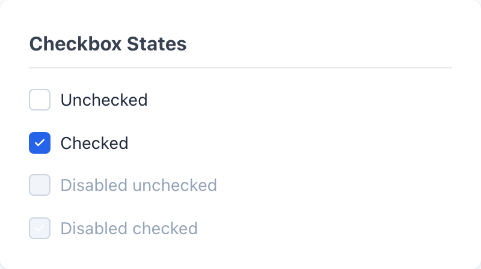
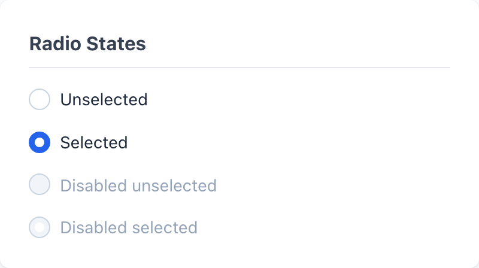
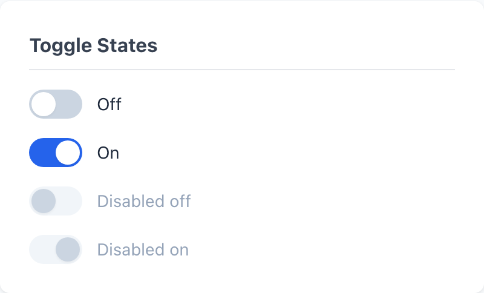

# Checkbox, Radio & Toggle

The three choice controls all use the same trick: a visually hidden native `<input>` carries the state, and a sibling span draws the box, circle, or track. That keeps them keyboard-accessible and form-submittable for free while every visual state is pure CSS off `:checked`, `:focus`, and `:disabled`.

> Part of the Gravitate Wireframe Design System — lo-fi component reference. Index: `../CLAUDE.md`.

Reach for `wf-checkbox` when each option is independent — any number can be on at once. Reach for `wf-radio` when the options are mutually exclusive and the user must land on exactly one; radios in a set share a `name` so the browser enforces the single-selection rule. Reach for `wf-toggle` when a single setting flips between two states (on/off, enabled/disabled) and the result takes effect immediately.

All three share one anatomy. A `<label>` wraps a hidden native input (`wf-checkbox-input`, `wf-radio-input`, or `wf-toggle-input`), a visual span (`wf-checkbox-box`, `wf-radio-circle`, or `wf-toggle-track`), and a text span (`*-label`). The input is hidden with `position: absolute; opacity: 0; width: 0; height: 0` — not `display: none` — so it stays focusable and keeps its native semantics. Wrapping the whole thing in a `<label>` means clicking the text toggles the control, and the box/circle/track is drawn by the sibling span reacting to the input's `:checked` state via the `+` combinator.

Stack checkboxes in a `wf-checkbox-group` and radios in a `wf-radio-group` — both are flex columns with a `--wf-space-sm` (8px) gap and an optional `wf-text wf-text-label` heading.

### Checkbox states

*wf-checkbox across unchecked, checked, and disabled states. Checked fills the 18×18 box with --wf-color-primary (#2563eb) and reveals the SVG checkmark; disabled drops to the --wf-color-bg-disabled (#f1f5f9) fill and mutes the label.*

### Radio states

*A wf-radio group showing selected, unselected, and disabled options in one choice set. Selected fills the circle with --wf-color-primary and pops the 8px inner dot; the shared name attribute keeps only one selected at a time.*

### Toggle states

*The wf-toggle switch in off, on, and disabled states. The 44×24 track turns --wf-color-primary when on and slides the 20px knob 20px to the right via translateX.*

### Checkbox markup

wf-checkbox state is driven entirely by attributes on the native input — add `checked`, add `disabled`, or pair them. There is no separate class per state.

| Variant | When to use | Code |
| --- | --- | --- |
| `wf-checkbox` | The label wrapper. Click anywhere inside it — box or text — to toggle. | `<label class="wf-checkbox">   <input type="checkbox" class="wf-checkbox-input">      Remember me </label>` |
| `checked (attribute)` | Pre-selected option. Adds the checked attribute; the box fills with --wf-color-primary and the SVG checkmark fades in. | `<input type="checkbox" class="wf-checkbox-input" checked>` |
| `disabled (attribute)` | Non-interactive option. Add disabled to the input — the box drops to the disabled fill and the sibling label greys to --wf-color-text-disabled. | `<input type="checkbox" class="wf-checkbox-input" checked disabled>` |
| `wf-checkbox-group` | Two or more related checkboxes. Flex column, 8px gap, with an optional wf-text wf-text-label heading. | `
   Select Products   <label class="wf-checkbox">     <input type="checkbox" class="wf-checkbox-input" checked>          Product A   </label> 
` |

### Radio markup

Radios only behave as a single-selection set when every input in the group shares the same name attribute. Forget the name and each radio becomes independently checkable — the most common radio bug.

| Variant | When to use | Code |
| --- | --- | --- |
| `wf-radio` | One option in a choice set. The circle is drawn by wf-radio-circle; the inner dot is its ::after. | `<label class="wf-radio">   <input type="radio" name="contract-type" class="wf-radio-input">      Buy </label>` |
| `shared name (attribute)` | Always. Every radio in the same set carries the identical name so the browser enforces one selection. | `<input type="radio" name="contract-type" class="wf-radio-input" checked>` |
| `disabled (attribute)` | An option that exists but can't be picked — e.g. an unavailable shipping speed shown for completeness. | `<input type="radio" name="shipping" class="wf-radio-input" disabled>` |
| `wf-radio-group` | The required wrapper for a choice set. Flex column, 8px gap, optional wf-text wf-text-label heading. | `
   Contract Type   <label class="wf-radio">     <input type="radio" name="contract-type" class="wf-radio-input" checked>          Sell   </label> 
` |

### Toggle markup

The toggle is a checkbox under the hood — the input is type="checkbox", and on/off maps to the checked attribute. The visual difference is entirely the track-and-knob span.

| Variant | When to use | Code |
| --- | --- | --- |
| `wf-toggle` | A single immediate-effect setting. The 44×24 track and sliding knob are both drawn by wf-toggle-track. | `<label class="wf-toggle">   <input type="checkbox" class="wf-toggle-input">      Enable notifications </label>` |
| `checked (attribute)` | On state. The track turns --wf-color-primary and the knob slides 20px right via translateX(20px). | `<input type="checkbox" class="wf-toggle-input" checked>` |
| `disabled (attribute)` | A setting that's locked — e.g. a feature flag gated behind an upgrade. Track drops to the disabled fill, knob recolors to the border grey. | `<input type="checkbox" class="wf-toggle-input" disabled>` |

### Shared state tokens

All three controls draw their selected, focus, and disabled treatments from the same handful of tokens, so a checked checkbox, a selected radio, and an on toggle all read as the same blue.

| Token | Value | Use for |
| --- | --- | --- |
| `--wf-color-primary` | `#2563eb` | The selected/on fill for all three — checkbox box, radio circle, toggle track. |
| `--wf-color-border` | `#cbd5e1` | Resting border on box and circle; the off-state toggle track fill. |
| `--wf-color-border-hover` | `#94a3b8` | Border on hover for box and circle; track fill on toggle hover. |
| `--wf-color-border-focus` | `#2563eb` | Border color when the hidden input is focused. |
| `--wf-shadow-focus` | `0 0 0 3px rgba(37, 99, 235, 0.2)` | The focus ring on all three controls, applied to the visual span via :focus + sibling. |
| `--wf-color-bg-disabled` | `#f1f5f9` | Fill for disabled box, circle, and track. |
| `--wf-color-text-disabled` | `#94a3b8` | Muted label color when the control is disabled. |
| `--wf-radius-sm` | `4px` | Checkbox box corner radius — the only square control. |
| `--wf-radius-full` | `9999px` | Radio circle, radio inner dot, toggle track, and toggle knob — everything round. |

### Sizing & accessibility floor

From DESIGN.md §5.3 and §6.6 — floor requirements, not suggestions. A wireframe that fails these is rejected even if it looks polished.

1. **Interactive tap targets stay at 44×44 minimum, even at enterprise density.** — DESIGN.md §5.3 / §6.6: compactness applies to spacing and text, never to hit boxes. The 18×18 box and circle and the 44×24 track are only the visual mark — the clickable target is the whole label, so keep the label height and padding at the 44×44 floor.
2. **Hide the native input with opacity/width/height, never display:none.** — display:none removes the input from the tab order and the accessibility tree. The CSS uses position:absolute; opacity:0; width:0; height:0 precisely so the control stays keyboard-focusable and form-submittable.
3. **Every radio in a set shares one name attribute.** — The name is what makes the browser enforce single-selection. Without it, each radio toggles independently and the choice set is broken.
4. **Keep the visible focus ring — don't strip it.** — DESIGN.md §6.2: the :focus + span rule paints --wf-shadow-focus on the box, circle, or track. That ring is the only signal a keyboard user gets that the control is focused.

### Do's & Don'ts

- **Do:** Wrap the input, visual span, and label inside one <label>.
  **Don't:** Put the <input> and a separate  as siblings outside a label.
  **Why:** The label association is what makes the text clickable and what the + combinator relies on to draw the checked state. Break the order and the box never fills.
- **Do:** Order the children input → visual span → label span.
  **Don't:** Place the label span before the box/circle/track.
  **Why:** Every state rule uses the adjacent-sibling (+) and general-sibling (~) selectors, which only reach forward. The visual span must follow the input, and the label must follow both.
- **Do:** Use wf-checkbox for independent options, wf-radio for one-of-many.
  **Don't:** Use a row of radios when more than one can be true.
  **Why:** Radios enforce exactly one selection. If two answers can be valid at once, the user gets stuck — that's a checkbox group.
- **Do:** Use wf-toggle for an immediate-effect on/off setting.
  **Don't:** Use a toggle for a choice that only applies after a Save.
  **Why:** A toggle signals the change is live. If the setting needs confirmation, a checkbox inside a form reads more honestly.

### Gotchas

- **No indeterminate state in CSS** — The checkbox stylesheet only handles :checked and :disabled — there is no rule for the indeterminate (mixed) state. Setting input.indeterminate = true in JS will not render a dash; the box stays visually unchecked. If you need a tri-state parent checkbox, you'll have to add the styling yourself.
- **The toggle track is 44px wide but only 24px tall** — wf-toggle-track is 44px × 24px, so the visual switch alone does NOT meet the 44×44 hit-target floor on the vertical axis. The 44px comes from the full label row — keep enough label height/padding around the track or the tap target falls short of DESIGN.md §6.6.
- **Toggle on-distance is hard-coded to 20px** — The knob is 20px and slides via transform: translateX(20px) when checked. The 20px slide is tuned to the 44px track and 2px inset — if you resize the track, the knob will stop short or overrun the edge unless you retune the translate value.
- **Disabled checkbox/radio keeps the resting border, not a darker one** — When disabled, the box and circle take --wf-color-bg-disabled fill but revert to the plain --wf-color-border (not border-hover). A disabled-and-checked control therefore loses its primary-blue fill entirely — it reads as a greyed empty box, so don't rely on color alone to show it was selected.
