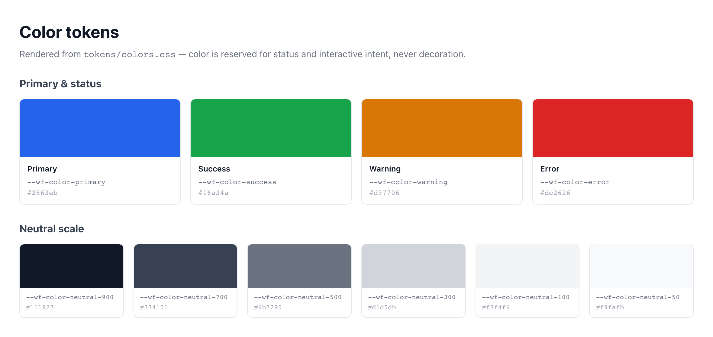

# Color & Status Intent

The page reads as neutral gray with one accent. Color is a signal, not decoration: `--wf-color-primary` carries interactive intent, three status colors carry status, and the neutral scale carries everything else. Every color decision in this system traces back to a `--wf-color-*` token in `tokens/colors.css`.

> Part of the Gravitate Wireframe Design System — lo-fi component reference. Index: `../CLAUDE.md`.

There are only three roles a color can play in a wireframe. **Interactive intent** is `--wf-color-primary` (#2563eb) — primary CTAs, links, the focus ring, selected state, and current location. **Status** is the three semantic colors — `--wf-color-success`, `--wf-color-warning`, `--wf-color-error` — and they appear only when there is real status to report. **Everything else is neutral**, drawn from the gray scale through its semantic aliases.

This split is the whole discipline. If a color isn't marking an interactive surface or reporting status, it should be neutral. The library reaches for the alias (`--wf-color-text-secondary`, `--wf-color-border`, `--wf-color-surface`), never the raw `--wf-color-neutral-*` value, even though they resolve to the same hex — the alias says *why*, the raw token only says *what*.

### The full --wf-color-* palette



*Primary plus its dim hover variant, the three status colors, and the neutral scale from neutral-900 (#111827, text-primary) down through surface (#ffffff). Primary is the only accent on an otherwise gray page; status colors sit out until there is status to report.*

### Primary — interactive intent

The single accent on the page. Reserved for interactive surfaces and current location; never for decorative emphasis.

| Token | Value | Use for |
| --- | --- | --- |
| `--wf-color-primary` | `#2563eb` | Buttons, links, focus states, selected tab, active row — interactive intent and current location. |
| `--wf-color-primary-dim` | `#1e40af` | Darker variant for hover and active states on primary surfaces. |

### Status — reserved for status only

Each token has a `-dim` darker partner for hover/active. These appear only when there is actual status to report — never as accents, highlights, or brand color (DESIGN.md §3.1).

| Token | Value | Use for |
| --- | --- | --- |
| `--wf-color-success` | `#16a34a` | Confirmation of a completed positive action; healthy / passing status. |
| `--wf-color-success-dim` | `#15803d` | Darker success variant for hover / active states. |
| `--wf-color-warning` | `#d97706` | Pending state, attention required, soft-fail. |
| `--wf-color-warning-dim` | `#b45309` | Darker warning variant for hover / active states. |
| `--wf-color-error` | `#dc2626` | Validation failure, destructive action affordance, hard-fail status. |
| `--wf-color-error-dim` | `#b91c1c` | Darker error variant for hover / active states. |

### Neutral scale — carries everything else

Higher numbers are darker. These are the raw values; in components reach for the semantic alias below, not these directly.

| Token | Value | Use for |
| --- | --- | --- |
| `--wf-color-neutral-900` | `#111827` | Darkest — primary text, headings. |
| `--wf-color-neutral-700` | `#374151` | Dark — secondary text, labels. |
| `--wf-color-neutral-500` | `#6b7280` | Medium — placeholder text, icons. |
| `--wf-color-neutral-300` | `#d1d5db` | Light — borders, dividers. |
| `--wf-color-neutral-100` | `#f3f4f6` | Lighter — subtle backgrounds, hover states. |
| `--wf-color-neutral-50` | `#f9fafb` | Lightest — page backgrounds, cards. |

### Semantic aliases — what to actually type

Purpose-driven names that resolve to the scale above. Use these in component code so the intent is legible. The aliases are designed to pair at WCAG 2.1 AA out of the box — `text-primary on surface` passes; `text-tertiary on surface-sunken` passes (DESIGN.md §3.2, §3.4).

| Token | Value | Use for |
| --- | --- | --- |
| `--wf-color-text-primary` | `var(--wf-color-neutral-900)` | Main content, headings. |
| `--wf-color-text-secondary` | `var(--wf-color-neutral-700)` | Supporting text, labels. |
| `--wf-color-text-tertiary` | `var(--wf-color-neutral-500)` | Hints, placeholders, timestamps. |
| `--wf-color-text-inverse` | `#ffffff` | Text on dark / colored backgrounds. |
| `--wf-color-surface` | `#ffffff` | Default surface — cards, modals, inputs. |
| `--wf-color-surface-raised` | `var(--wf-color-neutral-50)` | Elevated panels. |
| `--wf-color-surface-sunken` | `var(--wf-color-neutral-100)` | Inset surfaces, disabled states, code blocks. |
| `--wf-color-background` | `var(--wf-color-neutral-50)` | Page background. |
| `--wf-color-background-overlay` | `rgba(17, 24, 39, 0.5)` | Modal scrim. |
| `--wf-color-border` | `var(--wf-color-neutral-300)` | Default border / divider. |
| `--wf-color-border-light` | `var(--wf-color-neutral-100)` | Subtle border between related rows. |
| `--wf-color-border-focus` | `var(--wf-color-primary)` | Focus ring. |

### Applying color tokens

Color enters a wireframe only through these tokens, set on the CSS properties below. Always reference the variable by name — never a hex literal (DESIGN.md §2.7).

| Variant | When to use | Code |
| --- | --- | --- |
| `--wf-color-primary` | An interactive surface — primary CTA, link, or the user's current location. | `<button class="wf-button" style="background: var(--wf-color-primary); color: var(--wf-color-text-inverse);">Publish Prices</button>` |
| `--wf-color-error` | A hard-fail or destructive affordance — paired with an icon and a message, never color alone. | `<input class="wf-input" style="border-color: var(--wf-color-error);" aria-invalid="true"> <span class="wf-text wf-text-helper" style="color: var(--wf-color-error);">Volume must be greater than 0</span>` |
| `--wf-color-text-secondary` | Supporting text and labels — the alias, not --wf-color-neutral-700. | `<label class="wf-text wf-text-label" style="color: var(--wf-color-text-secondary);">Counterparty</label>` |
| `--wf-color-surface` | A card, modal, or input sitting on the page background. | `<div class="wf-card" style="background: var(--wf-color-surface); border: 1px solid var(--wf-color-border);">...</div>` |
| `--wf-color-border-focus` | The keyboard focus ring on any focusable element. | `<button class="wf-button" style="outline: 2px solid var(--wf-color-border-focus);">Save</button>` |

### The three roles in one block

```css
:root {
  /* Interactive intent — the one accent */
  --wf-color-primary: #2563eb;
  --wf-color-primary-dim: #1e40af;

  /* Status — reserved for status only */
  --wf-color-success: #16a34a;
  --wf-color-warning: #d97706;
  --wf-color-error: #dc2626;

  /* Neutral carries everything else — reach for the alias */
  --wf-color-text-primary: var(--wf-color-neutral-900);
  --wf-color-surface: #ffffff;
  --wf-color-border: var(--wf-color-neutral-300);
  --wf-color-border-focus: var(--wf-color-primary);
}
```

Source of truth is tokens/colors.css. Components reference these by name; a hex literal in component code means the design isn't ready.

### Semantic color intent (DESIGN.md §3)

These are hard rules, not preferences. There are no "but it looked nice" exceptions.

1. **Status colors are reserved for status. No exceptions.** — Success green is a completed positive action, warning orange is a pending / attention state, error red is a hard-fail or destructive affordance. Diluting them as accents teaches users to stop reading them.
2. **Primary is for interactive intent only — CTAs, links, focus ring, selected state, current location.** — Primary marks where the user can act or where they are. Used decoratively, it stops meaning either.
3. **The neutral scale carries everything that isn't status or interactive intent.** — The page should read as neutral gray with one accent; anything else competes with the signal colors.
4. **Color is never the only signal — pair it with an icon, label, or shape.** — A red border alone is invisible to many users and on many displays; the meaning must survive without the hue (DESIGN.md §3.3, §6.3).
5. **WCAG 2.1 AA is the contrast floor on every text/background pair.** — The aliases are tuned to pair correctly out of the box; if a pairing is ambiguous, run a contrast check before shipping (DESIGN.md §3.4).

### Do's & Don'ts

- **Do:** color: var(--wf-color-text-secondary)
  **Don't:** color: var(--wf-color-neutral-700)
  **Why:** The alias says why; the raw token only says what. They resolve to the same value, but the alias keeps intent legible (DESIGN.md §7.2).
- **Do:** Use weight or size for non-interactive emphasis
  **Don't:** Use --wf-color-primary to make a static heading stand out
  **Why:** Primary is interactive intent only. For emphasis reach for --wf-font-semibold, size, or hierarchy — not the accent color (DESIGN.md §7.2).
- **Do:** Reserve success / warning / error for actual status
  **Don't:** Use success green as an approval accent or warning orange as a "notable" highlight
  **Why:** Status colors stop working the moment they're decorative. A green static label trains the eye to ignore real green status.
- **Do:** border-color: var(--wf-color-error) + icon + message
  **Don't:** border-color: var(--wf-color-error) on its own
  **Why:** Color is never the only signal. An error needs the red border, an inline message, and an icon — two of three is not enough (DESIGN.md §6.4).
- **Do:** background: var(--wf-color-primary)
  **Don't:** background: #2563eb
  **Why:** The token is the source of truth. A hex literal in component code means the design isn't ready (DESIGN.md §2.7).

### Gotchas

- **Use the alias, not the raw neutral** — --wf-color-text-secondary and --wf-color-neutral-700 are the exact same value, so swapping them changes nothing visually — which is precisely why it's a trap. Reaching for the raw scale strips the intent out of the code and is called out as an anti-pattern in DESIGN.md §7.2.
- **Required-field markers are neutral, not error red** — Error red is reserved for validation failure and destructive affordances. A required-field asterisk is a neutral marker, not a status — using --wf-color-error for it dilutes the one color that means "something is wrong" (DESIGN.md §3.1).
- **The focus ring layers primary over surface** — --wf-color-border-focus resolves to --wf-color-primary, but a visible focus state pairs it with --wf-color-surface in a layered ring so focus stays visible against any background. Never outline: none without a replacement (DESIGN.md §6.2).
- **The reference-guide.html swatches drift from the token source** — The Colors section of reference-guide.html shows older hex values (success #22c55e, warning #f59e0b, error #ef4444) and the legacy names --wf-gray-* / --wf-white. The canonical values live in tokens/colors.css (success #16a34a, warning #d97706, error #dc2626, neutral scale via --wf-color-neutral-*). Trust the token file, not the guide swatches.
