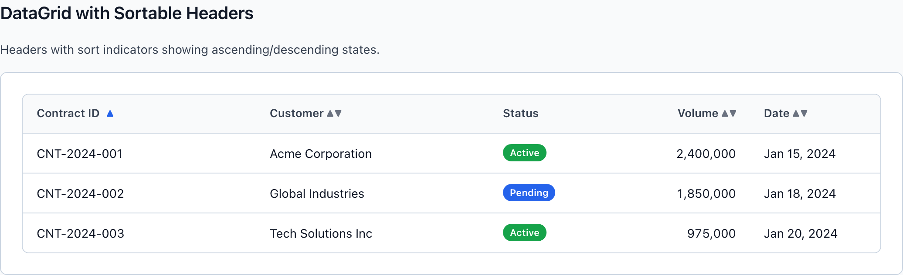
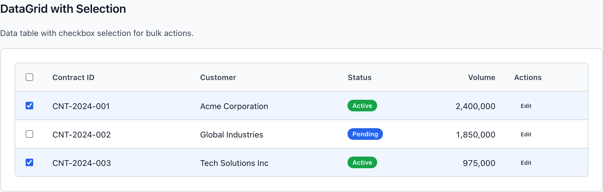
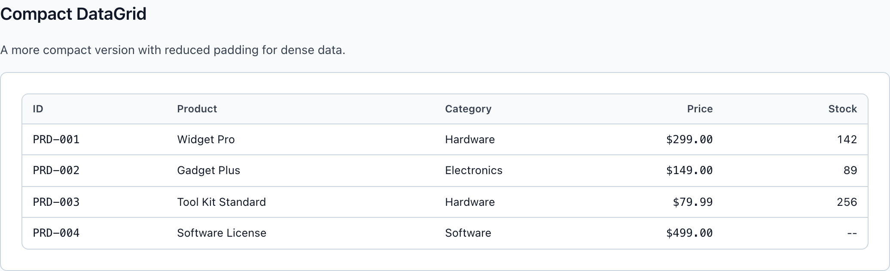
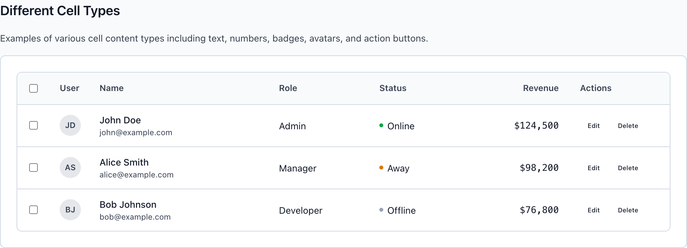

# DataGrid

`wf-datagrid` is the workhorse for dense tabular data — the wireframe stand-in for production's GraviGrid. It's a flexbox table, not an HTML `<table>`: a header row, a body of rows, and flex-weighted cells that carry the alignment, sort, selection, and density affordances analysts scan dozens of times a day.

> Part of the Gravitate Wireframe Design System — lo-fi component reference. Index: `../CLAUDE.md`.

A DataGrid is three nested pieces: `wf-datagrid` (the bordered, rounded container), a single `wf-datagrid-header`, and a `wf-datagrid-body` holding one `wf-datagrid-row` per record. Every column is a `wf-datagrid-cell` in both the header and each row — there is no `<th>`/`<td>`, so the header and row cells must use the **same `flex` weights in the same order** or the columns won't line up.

Column width comes from inline `flex` on each cell (`flex: 2` for wide text columns, `flex: 1` for narrow ones, `flex: 0 0 60px` for fixed widths). Cells truncate with an ellipsis by default (`overflow: hidden; text-overflow: ellipsis; white-space: nowrap`), so a grid stays one row tall per record no matter how long the content.

Reach for `wf-datagrid` when you have **three or more rows** of structured, columnar data. Fewer than that is a `wf-card` with a list inside (§7.4), and a contract record's worth of label/value pairs is a `wf-description-list`, not a grid.

### Sortable headers



*wf-datagrid-cell-sortable headers carry a wf-datagrid-sort-icon. The active column adds wf-sorted, which tints its icon primary blue; idle columns show both arrows in tertiary gray. Numerics stay right-aligned, statuses render as wf-badge pills.*

### Structural classes

The grid is composed entirely from these classes plus inline `flex` on cells. Match cell order and `flex` weights between the header and every row.

| Variant | When to use | Code |
| --- | --- | --- |
| `wf-datagrid` | The outer container. Carries the 1px border, 8px radius, white surface, and clips overflow so nested rows stay inside the rounded corners. | `<div class="wf-datagrid">…</div>` |
| `wf-datagrid-header` | The single header row. Neutral-50 background, bottom border, 13px / 600 secondary-text labels. | `<div class="wf-datagrid-header">…cells…</div>` |
| `wf-datagrid-body` | Wraps the data rows in a vertical flex column. | `<div class="wf-datagrid-body">…rows…</div>` |
| `wf-datagrid-row` | One per record. Has a hover background and a bottom border that drops off the last row automatically. | `<div class="wf-datagrid-row">…cells…</div>` |
| `wf-datagrid-cell` | The base cell. Default `flex: 1`; set inline `flex` to weight columns. Left-aligned, single-line, ellipsis-truncated. | `<div class="wf-datagrid-cell" style="flex: 2">Acme Corporation</div>` |

### Cell modifiers

Stack these on a `wf-datagrid-cell` to change alignment, fixed width, or affordance. Apply the same modifier to the header cell and its column's body cells so the column reads consistently.

| Variant | When to use | Code |
| --- | --- | --- |
| `wf-datagrid-cell-number` | Numeric, currency, or volume columns. Right-aligns the cell (`justify-content: flex-end`) and turns on `tabular-nums` so digits align in a column. | `<div class="wf-datagrid-cell wf-datagrid-cell-number" style="flex: 1">2,400,000</div>` |
| `wf-datagrid-cell-checkbox` | The leading selection column. Fixed `flex: 0 0 48px`, center-justified, holds a `wf-checkbox-input`. | `<div class="wf-datagrid-cell wf-datagrid-cell-checkbox"><input type="checkbox" class="wf-checkbox-input"></div>` |
| `wf-datagrid-cell-sortable` | A clickable header cell. Adds pointer cursor, disables text selection, and reserves a gap for the sort icon. Pair with a `wf-datagrid-sort-icon` span. | `<div class="wf-datagrid-cell wf-datagrid-cell-sortable" style="flex: 2">Customer <span class="wf-datagrid-sort-icon">&#9650;&#9660;</span></div>` |
| `wf-sorted` | Added alongside wf-datagrid-cell-sortable on the column currently driving the sort. Tints its sort icon primary blue. | `<div class="wf-datagrid-cell wf-datagrid-cell-sortable wf-sorted" style="flex: 2">Contract ID <span class="wf-datagrid-sort-icon">&#9650;</span></div>` |
| `wf-datagrid-cell-actions` | A row-action cell. `flex: 0 0 auto` with a 4px gap so inline ghost buttons sit snug at the row's end. | `<div class="wf-datagrid-cell wf-datagrid-cell-actions"><button class="wf-button wf-button-ghost wf-button-sm">Edit</button></div>` |
| `wf-mono` | A utility for codes, IDs, and currency — switches the cell to a monospace face with tabular figures so they align character-for-character. | `<div class="wf-datagrid-cell wf-mono" style="flex: 1">PRD-001</div>` |

### Row selection



*A leading wf-datagrid-cell-checkbox column drives bulk selection. Checked rows take wf-datagrid-row-selected, which paints a light-blue (#eff6ff) background that also persists on hover.*

### Compact density



*wf-datagrid-compact on the container drops cell padding from 12px/16px to 8px/12px and steps header and row text down a size — the high-volume default for analyst screens.*

### Cell types & alignment



*Mixed cell content: an avatar in a fixed-width column, a two-line name/email stack, a wf-badge-with-dot status, a right-aligned wf-mono currency figure, and a trailing wf-datagrid-cell-actions group.*

### DataGrid tokens

Surfaces and borders read from these data-display tokens, which themselves alias the neutral and primary scales. Reach for the alias, never the raw hex.

| Token | Value | Use for |
| --- | --- | --- |
| `--wf-datagrid-header-bg` | `var(--wf-color-neutral-50, #f9fafb)` | Header row background — a faint gray that separates labels from data. |
| `--wf-datagrid-row-hover` | `var(--wf-color-neutral-50, #f9fafb)` | Row hover background; signals which row the pointer is on. |
| `--wf-datagrid-row-selected` | `#eff6ff` | Selected-row background (wf-datagrid-row-selected) — a light primary tint, held even on hover. |
| `--wf-datagrid-border` | `var(--wf-color-border, #d1d5db)` | Container border plus every header/row divider. |

### Canonical DataGrid markup

```html
<div class="wf-datagrid">
  <div class="wf-datagrid-header">
    <div class="wf-datagrid-cell wf-datagrid-cell-sortable wf-sorted" style="flex: 2">
      Contract ID
      <span class="wf-datagrid-sort-icon">&#9650;</span>
    </div>
    <div class="wf-datagrid-cell" style="flex: 2">Customer</div>
    <div class="wf-datagrid-cell" style="flex: 1">Status</div>
    <div class="wf-datagrid-cell wf-datagrid-cell-number" style="flex: 1">Volume</div>
  </div>
  <div class="wf-datagrid-body">
    <div class="wf-datagrid-row">
      <div class="wf-datagrid-cell wf-mono" style="flex: 2">CNT-2024-001</div>
      <div class="wf-datagrid-cell" style="flex: 2">Acme Corporation</div>
      <div class="wf-datagrid-cell" style="flex: 1">
        <span class="wf-badge wf-badge-success">Active</span>
      </div>
      <div class="wf-datagrid-cell wf-datagrid-cell-number wf-mono" style="flex: 1">2,400,000</div>
    </div>
  </div>
</div>
```

Header and row cells share identical `flex` weights in identical order — that's what keeps the columns aligned, since these are flex divs, not a real table.

### Density and selection modifiers

```html
<!-- Compact: tighter padding, smaller text -->
<div class="wf-datagrid wf-datagrid-compact">…</div>

<!-- Striped rows for long, scan-heavy tables -->
<div class="wf-datagrid wf-datagrid-striped">…</div>

<!-- A selected row with a leading checkbox column -->
<div class="wf-datagrid-row wf-datagrid-row-selected">
  <div class="wf-datagrid-cell wf-datagrid-cell-checkbox">
    <input type="checkbox" class="wf-checkbox-input" checked>
  </div>
  <div class="wf-datagrid-cell" style="flex: 2">CNT-2024-001</div>
  …
</div>
```

wf-datagrid-compact and wf-datagrid-striped are container-level modifiers; wf-datagrid-row-selected is per-row.

### When to use a DataGrid

From DESIGN.md §4.1 (container choice) and §7.4 (data-display anti-patterns).

1. **Three or more rows of columnar data before you reach for wf-datagrid.** — Fewer than three rows is a wf-card with a list inside, not a grid — the grid chrome costs more than it earns at that scale (§7.4).
2. **A single record's label/value pairs belong in a wf-description-list, not a one-row grid.** — A grid is for comparing many records down columns; a lone record reads better as terms and details.
3. **Never render zero-data as a blank grid — swap the body for wf-datagrid-empty with a CTA.** — An empty grid is a dead end; the empty state tells the user what to do next (§7.4, §4.6).
4. **Don't push more than one number-and-label into a wf-metric-card to dodge a grid.** — MetricCard is one number, one label, one optional trend; multi-value comparison is the grid's job (§4.1, §7.4).

### Density, alignment, and color

Cross-cutting DESIGN.md rules that govern how the grid is filled in.

1. **Default to wf-datagrid-compact for analyst-facing tables.** — Density is a feature — a senior analyst would rather see one more row than one more breath of margin (§2.5, §5.1).
2. **Right-align every numeric column with wf-datagrid-cell-number, and apply it to the header cell too.** — Right alignment plus tabular-nums lines up magnitudes so the eye can compare figures vertically (§2.2 grid-first).
3. **Status cells carry a wf-badge or wf-badge-with-dot, never bare colored text.** — Color is never the only signal — pair it with a label or shape so the status survives for color-blind and AT users (§3.3, §6.3).
4. **Status colors only mark real status; a green badge is not a decorative accent.** — Status colors are reserved for status, no exceptions — dilute them and users stop reading them (§3.1, §7.2).
5. **Row actions are inline ghost buttons in a wf-datagrid-cell-actions cell; bulk verbs live in an ActionBar above the grid.** — Single-record actions are scoped inline; collection actions belong on a wf-action-bar, not crowded into rows (§4.3).

### Do's & Don'ts

- **Do:** Give the header cell and its column's body cells the same flex weight.
  **Don't:** style="flex: 2" header over style="flex: 1" rows
  **Why:** These are flexbox divs, not a `<table>` — mismatched weights drift the header out of line with its column.
- **Do:** <div class="wf-datagrid-cell wf-datagrid-cell-number">2,400,000</div>
  **Don't:** <div class="wf-datagrid-cell">2,400,000</div>
  **Why:** Without wf-datagrid-cell-number the figure left-aligns and loses tabular-nums, so magnitudes no longer line up.
- **Do:** <span class="wf-badge wf-badge-warning">Pending</span>
  **Don't:** <span style="color: orange">Pending</span>
  **Why:** Color alone fails §3.3 — the badge gives the status a shape and label, and warning is a reserved status token.
- **Do:** wf-datagrid-empty with a CTA when there are no rows
  **Don't:** an empty wf-datagrid-body
  **Why:** A blank grid is a dead end; the empty state names the next action (§7.4, §4.6).
- **Do:** wf-datagrid for 3+ rows of comparable records
  **Don't:** wf-datagrid for a single record's fields
  **Why:** Two rows of data is a card-with-list; a lone record is a description list. The grid earns its chrome only across many rows (§7.4).

### Gotchas

- **It's flexbox, not a table** — There is no `<table>`, `<th>`, or `<td>`. Columns line up only because header and row cells share inline `flex` weights in the same order. Add or reorder a column in one place and you must mirror it everywhere.
- **Cells truncate by default** — Every wf-datagrid-cell sets overflow:hidden, text-overflow:ellipsis, and white-space:nowrap. Long content clips to one line — to show two lines (name over email) nest a div inside the cell rather than relying on wrap.
- **Selected rows stay selected-blue on hover** — wf-datagrid-row-selected:hover keeps the #eff6ff selected tint instead of swapping to the neutral hover background, so a checked row reads as selected even under the pointer.
- **The checkbox column is a fixed 48px** — wf-datagrid-cell-checkbox is flex: 0 0 48px and center-justified — it doesn't grow with the table, so leave it out of your flex-weight budget for the data columns.
- **wf-sorted only tints the icon** — Adding wf-sorted recolors the wf-datagrid-sort-icon to primary blue but doesn't change the arrow glyph — you swap the glyph yourself (single ▲ / ▼ for the active direction vs. the ▲▼ idle pair).
