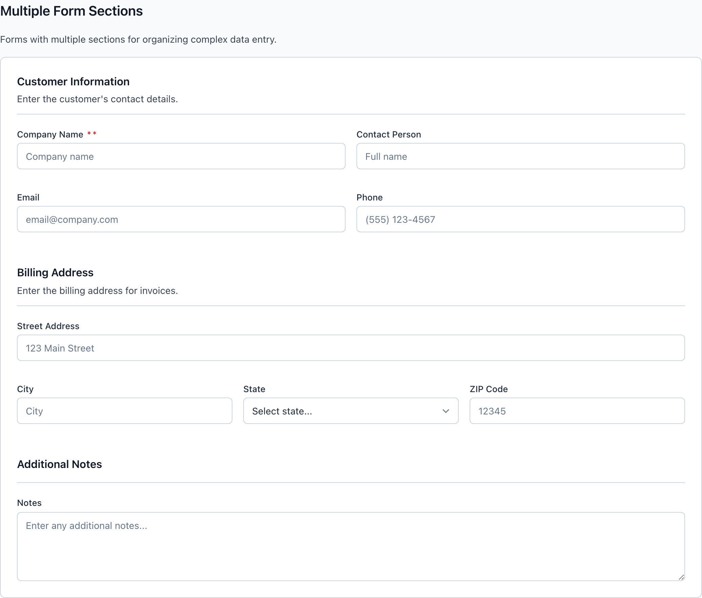
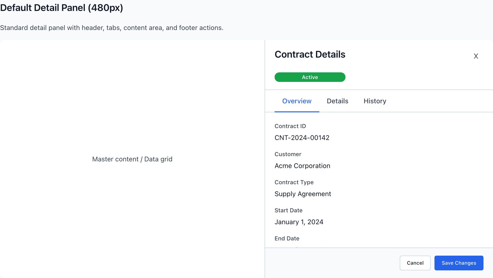
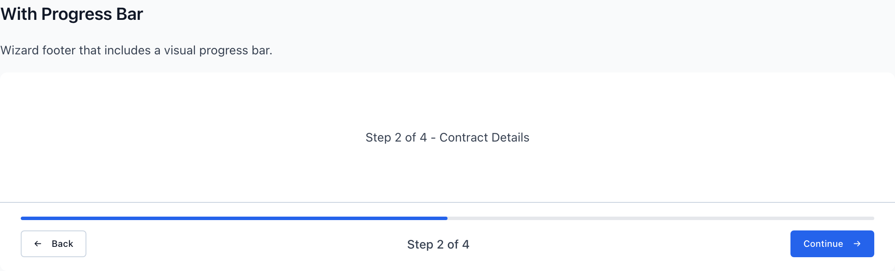

# FormSection, DetailPanel & WizardFooter

Three narrative-first surfaces for data entry and review. FormSection is the form-shaped grouping primitive that gives related fields a heading and shared rhythm; DetailPanel is the master-detail read view that slides in beside a grid; WizardFooter anchors a multi-step flow with Back/Next and progress. All three obey the same posture rule: forms read top-down in a single column, never crammed into a data-dense grid layout.

> Part of the Gravitate Wireframe Design System — lo-fi component reference. Index: `../CLAUDE.md`.

These three surfaces share a posture. DESIGN.md §2.2 splits the system into two layouts: data views are *grid-first* (align columns, share row rhythm, scan vertically) and forms are *narrative-first* (single column, top-down reading order, generous label-to-input proximity). FormSection, DetailPanel, and WizardFooter all live on the narrative-first side. Don't mix the two postures inside one page section.

`wf-form-section` is the form-shaped grouping primitive (DESIGN.md §4.1). Reach for it whenever you have form fields that belong together — "Customer Information," "Billing Address." Each section owns its own heading, optional `wf-form-section-description`, and consistent vertical rhythm. Forms compose `wf-form-section` blocks *vertically* — they should rarely sit inside a `wf-card`. Inside the body, `wf-form-grid` with a `wf-form-grid-2`/`-3`/`-4` modifier lays out fields, collapsing to one column under 768px.

`wf-detail-panel` is the master-detail read view: a 480px column with a header (title + status badge + close), optional `wf-detail-panel-tabs`, a scrolling `wf-detail-panel-body`, and a footer that pins the commit buttons. It starts off-screen (`transform: translateX(100%)`) and slides in when you add `wf-detail-panel-open`. Width is set by modifier, not inline style.

`wf-wizard-footer` is the navigation bar for a stepper flow: Back on the left, a `wf-wizard-progress` step counter in the middle, the forward action on the right. The progress-bar variant stacks a full-width fill above the action row. The footer carries the navigation — the step content lives above it.

### FormSection — grouped fields



*Multiple titled FormSections stacked vertically — each with its own header, description, and a wf-form-grid laying out related fields. This is the narrative-first form posture from DESIGN.md §4.1.*

### FormSection classes

A FormSection is a `wf-form-section` wrapping a `wf-form-section-header` (title + optional description) and a `wf-form-section-body`. Inside the body, `wf-form-grid` plus a column modifier arranges the fields.

| Variant | When to use | Code |
| --- | --- | --- |
| `wf-form-section` | Base grouping. Stacks fields under one heading with a 32px bottom margin between sections (zeroed on the last child). | `<div class="wf-form-section">   <div class="wf-form-section-header">     <h3 class="wf-form-section-title">Customer Information</h3>     <p class="wf-form-section-description">Enter the customer's contact details.</p>   </div>   <div class="wf-form-section-body">     <!-- fields -->   </div> </div>` |
| `wf-form-section-card` | A standalone settings group that needs visual separation — adds a white background, border, 8px radius, and 20px padding. Use for an isolated section, not as an outer wrapper around a whole multi-section form. | `<div class="wf-form-section wf-form-section-card">   <div class="wf-form-section-header">     <h3 class="wf-form-section-title">Account Settings</h3>   </div>   <div class="wf-form-section-body">...</div> </div>` |
| `wf-form-section-collapsible / wf-form-section-collapsed` | An expandable section. `-collapsible` turns the header into a clickable row with a chevron; adding `-collapsed` rotates the chevron and hides the body. | `<div class="wf-form-section wf-form-section-collapsible wf-form-section-collapsed">   <div class="wf-form-section-header">     <h3 class="wf-form-section-title">Advanced Options</h3>   </div>   <div class="wf-form-section-body">...</div> </div>` |
| `wf-form-grid-2 / -3 / -4` | Column layout inside the body. `wf-form-grid` alone is single-column; the modifier sets 2, 3, or 4 equal columns with a 16px gap. All collapse to one column at ≤768px. | `<div class="wf-form-grid wf-form-grid-2">   <div class="wf-field">     <label class="wf-field-label">City</label>     <input type="text" class="wf-input">   </div>   <!-- more wf-field --> </div>` |

### DetailPanel — read view



*The default 480px DetailPanel: header with title and an Active badge, a tab row (Overview / Details / History), a scrolling body of label/value detail rows, and a footer pinning Cancel + Save Changes.*

### DetailPanel classes

`wf-detail-panel` is a flex column that starts off-screen and slides in with `wf-detail-panel-open`. Compose a header, optional tabs, a body, and a footer. The tabs and footer are optional; the body always scrolls.

| Variant | When to use | Code |
| --- | --- | --- |
| `wf-detail-panel` | Base panel — default 480px wide, full height, left border, off-screen until opened. Always pair with an open/width modifier in practice. | `<div class="wf-detail-panel wf-detail-panel-open">   <div class="wf-detail-panel-header">     <div class="wf-detail-panel-title-group">       <h2 class="wf-detail-panel-title">Contract Details</h2>       <span class="wf-badge wf-badge-success">Active</span>     </div>     <button class="wf-detail-panel-close">x</button>   </div>   <div class="wf-detail-panel-body"><!-- detail rows --></div>   <div class="wf-detail-panel-footer">     <button class="wf-button wf-button-secondary">Cancel</button>     <button class="wf-button wf-button-primary">Save Changes</button>   </div> </div>` |
| `wf-detail-panel-open` | Visibility toggle. Without it the panel is translated 100% to the right (hidden); adding it slides the panel in over a 300ms ease transition. | `<div class="wf-detail-panel wf-detail-panel-open">...</div>` |
| `wf-detail-panel-narrow` | Compact 320px panel for a quick read — a few label/value rows, no tabs. | `<div class="wf-detail-panel wf-detail-panel-narrow wf-detail-panel-open">...</div>` |
| `wf-detail-panel-wide` | 640px panel for complex records — two-column body, more tabs, multiple footer actions. | `<div class="wf-detail-panel wf-detail-panel-wide wf-detail-panel-open">...</div>` |
| `wf-detail-panel-tabs` | Optional tab row between header and body. Holds `wf-tab` buttons; `wf-tab-active` carries the primary-color underline. Omit the whole row for a single-view panel. | `<div class="wf-detail-panel-tabs">   <button class="wf-tab wf-tab-active">Overview</button>   <button class="wf-tab">Details</button>   <button class="wf-tab">History</button> </div>` |
| `wf-detail-panel-elevated` | Drops the left border for a left-side drop shadow instead — use when the panel floats over content rather than sitting flush in a split view. | `<div class="wf-detail-panel wf-detail-panel-elevated wf-detail-panel-open">...</div>` |

### WizardFooter — with progress



*The progress-bar variant: a full-width fill above a Back / "Step 2 of 4" / Continue action row. The footer carries the navigation; the step content lives above it.*

### WizardFooter classes

`wf-wizard-footer` is a space-between flex row: a backward action, a `wf-wizard-progress` counter, and a forward action. Variants change layout or add a progress bar.

| Variant | When to use | Code |
| --- | --- | --- |
| `wf-wizard-footer` | Base footer. Back (secondary) left, step counter center, forward action (primary) right. Use a success button for the final "Submit" step; disable Back on step one. | `<div class="wf-wizard-footer">   <button class="wf-button wf-button-secondary">&#8592; Back</button>   <div class="wf-wizard-progress">Step 2 of 4</div>   <button class="wf-button wf-button-primary">Continue &#8594;</button> </div>` |
| `wf-wizard-footer-with-progress` | Adds a visual progress bar. Switches the footer to a column: a full-width `wf-wizard-progress-bar` on top, then a `wf-wizard-actions` row holding Back / counter / forward. Set the fill width inline to the percent complete. | `<div class="wf-wizard-footer wf-wizard-footer-with-progress">   <div class="wf-wizard-progress-bar">     <div class="wf-wizard-progress-fill" style="width: 50%;"></div>   </div>   <div class="wf-wizard-actions">     <button class="wf-button wf-button-secondary">&#8592; Back</button>     <div class="wf-wizard-progress">Step 2 of 4</div>     <button class="wf-button wf-button-primary">Continue &#8594;</button>   </div> </div>` |
| `wf-wizard-footer-centered` | No progress indicator — just two centered buttons with a 24px gap. For short flows where the step count adds nothing. | `<div class="wf-wizard-footer wf-wizard-footer-centered">   <button class="wf-button wf-button-secondary">&#8592; Previous</button>   <button class="wf-button wf-button-primary">Next &#8594;</button> </div>` |
| `wf-wizard-footer-compact` | Tighter 12px/16px padding for dense layouts; usually paired with `wf-button-sm` controls and a short "2 / 4" counter. | `<div class="wf-wizard-footer wf-wizard-footer-compact">   <button class="wf-button wf-button-secondary wf-button-sm">&#8592; Back</button>   <div class="wf-wizard-progress">2 / 4</div>   <button class="wf-button wf-button-primary wf-button-sm">Next &#8594;</button> </div>` |
| `wf-wizard-footer-sticky` | Pins the footer to the bottom of the viewport (position: sticky; bottom: 0) so navigation stays reachable in a long, scrolling step. | `<div class="wf-wizard-footer wf-wizard-footer-sticky">...</div>` |

### Tokens these surfaces consume

All three reach for the semantic `--wf-color-*` aliases rather than raw neutrals. Fallback hex values shown are the ones literally written in specialized.css.

| Token | Value | Use for |
| --- | --- | --- |
| `--wf-color-border` | `#d1d5db` | Section header underlines, panel borders/dividers, wizard-footer top border. |
| `--wf-color-text-primary` | `#111827` | Section titles, panel titles, detail values. |
| `--wf-color-text-secondary` | `#374151` | Section descriptions, field labels, wizard step counter, panel close glyph. |
| `--wf-color-primary` | `#2563eb` | Active tab underline in the panel; the wizard progress-bar fill. |
| `--wf-color-neutral-50` | `#f9fafb` | Detail-panel footer background. |
| `--wf-color-neutral-100` | `#f3f4f6` | Close-button hover background. |
| `--wf-color-neutral-200` | `#e5e7eb` | Unfilled track of the wizard progress bar. |

### A FormSection-driven form with a WizardFooter

```html
<!-- Forms compose FormSection blocks vertically — no outer wf-card -->
<div class="wf-form-section">
  <div class="wf-form-section-header">
    <h3 class="wf-form-section-title">Basic Information</h3>
    <p class="wf-form-section-description">Enter the contract details below.</p>
  </div>
  <div class="wf-form-section-body">
    <div class="wf-form-grid wf-form-grid-2">
      <div class="wf-field">
        <label class="wf-field-label">Contract Name <span class="wf-required">*</span></label>
        <input type="text" class="wf-input" placeholder="Enter contract name">
      </div>
      <div class="wf-field">
        <label class="wf-field-label">Contract Type <span class="wf-required">*</span></label>
        <select class="wf-select"><option value="">Select type...</option></select>
      </div>
    </div>
  </div>
</div>

<!-- Footer carries the navigation; step content lives above -->
<div class="wf-wizard-footer wf-wizard-footer-with-progress">
  <div class="wf-wizard-progress-bar">
    <div class="wf-wizard-progress-fill" style="width: 50%;"></div>
  </div>
  <div class="wf-wizard-actions">
    <button class="wf-button wf-button-secondary">&#8592; Back</button>
    <div class="wf-wizard-progress">Step 2 of 4</div>
    <button class="wf-button wf-button-primary">Continue &#8594;</button>
  </div>
</div>
```

The wizard pattern (patterns/FormWizard.html) is exactly this: a stepper plus form sections plus a wizard footer.

### Composition rules

1. **Compose forms as a vertical stack of wf-form-section blocks; don't wrap the stack in a wf-card.** — DESIGN.md §4.1 and §7.1 — forms are narrative-first and own their own rhythm; an outer card is a redundant second container layer.
2. **Pick FormSection for form fields, Card for discrete non-form content, MetricCard only for a single dashboard number.** — The container quick-lookup in §4.1: form fields → FormSection, discrete chunk → Card, highlighted metric → MetricCard.
3. **Set DetailPanel width with the modifier class (-narrow 320 / default 480 / -wide 640), not an inline width.** — The three widths are the sanctioned sizes; an arbitrary inline width breaks the slide transform and the master-detail rhythm.
4. **Toggle the panel with wf-detail-panel-open, not by mounting/unmounting it.** — The base class translates the panel 100% off-screen and the open class slides it back — the 300ms transition only fires if both states exist.
5. **Use the WizardFooter for an ordered flow; use Tabs only for peer views.** — DESIGN.md §7.5 — "Don't use Tabs for an ordered flow. That's a Stepper." The wizard footer is the stepper's navigation.
6. **Make the final wizard step's forward button a success button and disable Back on step one.** — Matches the component's own last-step (wf-button-success Submit) and first-step (disabled Back) treatments — the affordance signals where you are in the flow.

### Do's & Don'ts

- **Do:** <div class="wf-form-section">...</div>
<div class="wf-form-section">...</div>
  **Don't:** <div class="wf-card"><div class="wf-form-section">...</div></div>
  **Why:** DESIGN.md §7.1: don't put a wf-form-section inside a wf-card. FormSections compose vertically on their own.
- **Do:** <div class="wf-detail-panel wf-detail-panel-wide">
  **Don't:** <div class="wf-detail-panel" style="width: 600px;">
  **Why:** Width is a modifier (-narrow / default / -wide). An inline width is an off-grid size that won't read as one of the system's panel sizes.
- **Do:** Forms read top-down in a single narrative column.
  **Don't:** Lay form fields out grid-first like a data table.
  **Why:** DESIGN.md §2.2: data views are grid-first, forms are narrative-first — don't mix postures inside one section.
- **Do:** <div class="wf-wizard-progress">Step 2 of 4</div>
  **Don't:** Style the step counter with --wf-color-primary for emphasis.
  **Why:** DESIGN.md §7.2: primary color is for interactive intent only — the counter is static text and uses --wf-color-text-secondary.
- **Do:** Reach for --wf-color-text-secondary for labels and descriptions.
  **Don't:** Hard-code #374151 or reach for --wf-color-neutral-700.
  **Why:** DESIGN.md §7.2: use the semantic alias even when a neutral has the same value — it carries the meaning.

### Gotchas

- **DetailPanel is hidden until you add -open** — The base .wf-detail-panel carries transform: translateX(100%), so a bare panel renders fully off-screen. The demo page even adds a CSS override (position: relative; transform: none) just to show it inline. In a real layout, add wf-detail-panel-open to slide it in.
- **Progress bar lives in a different DOM shape** — wf-wizard-footer-with-progress switches the footer to flex-direction: column. The progress bar is a direct child on top, and Back / counter / forward must be wrapped in a wf-wizard-actions row — they are not direct children of the footer like in the basic variant.
- **Progress fill width is inline, not a token** — The fill is .wf-wizard-progress-fill with its width set inline (style="width: 50%;"). There's no data attribute or modifier for completion — you compute the percent and write it inline. This is the one sanctioned inline value here.
- **Tabs and footer are optional, the body always scrolls** — wf-detail-panel-tabs and wf-detail-panel-footer are drop-in regions you can omit. The body (.wf-detail-panel-body) is flex: 1 with overflow-y: auto, so the header/tabs/footer stay pinned while only the body scrolls — don't add your own scroll container inside it.
- **Form grids collapse to one column on mobile** — wf-form-grid-2/-3/-4 all become a single column at ≤768px via a media query. Don't fight this with inline grid-template-columns — the single-column fallback is the narrative-first posture asserting itself on small screens.
