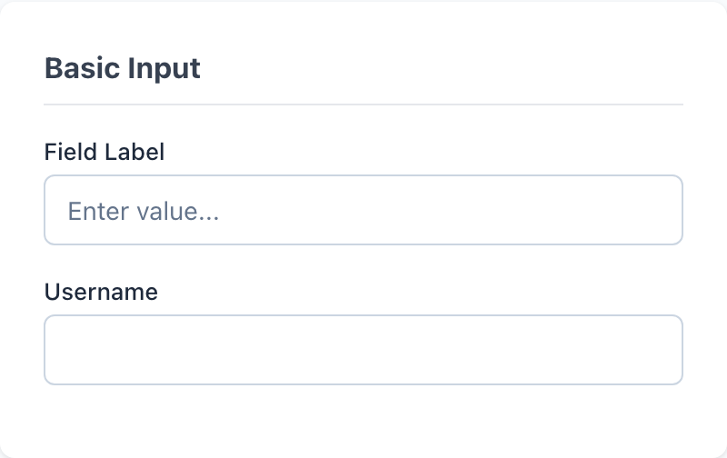
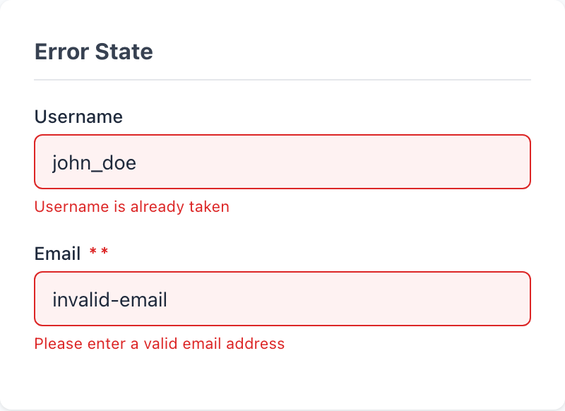
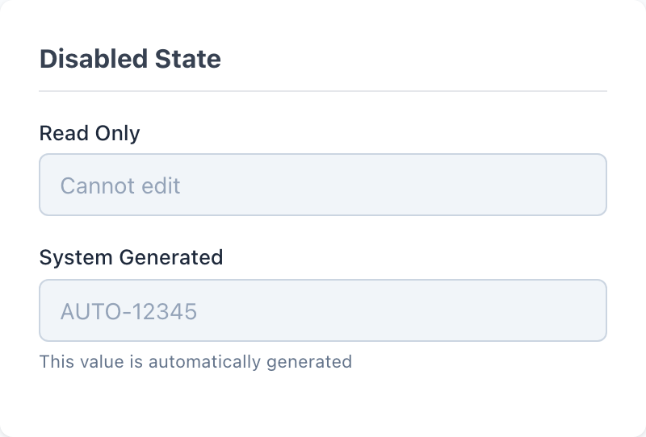
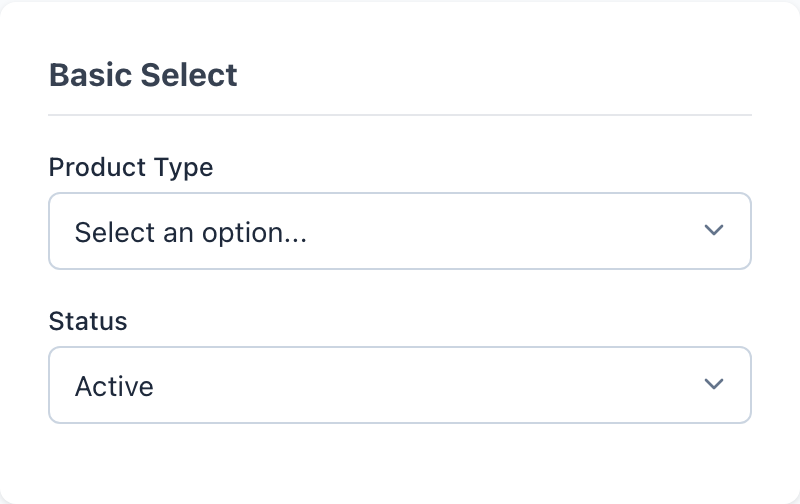

# Text Inputs & Select

`wf-input` and `wf-select` are the two text-entry primitives of the wireframe kit. Both lean on a shared `wf-field` wrapper for their label, helper, and error scaffolding, so a field's structure stays identical whether it holds a free-text input or a dropdown.

> Part of the Gravitate Wireframe Design System — lo-fi component reference. Index: `../CLAUDE.md`.

Reach for `wf-input` for any single-line text entry and `wf-select` for a fixed set of choices. Neither is meant to stand alone — wrap each in a `wf-field` div so the label, helper text, and error message stack in the right order with the right spacing.

`wf-input` is a bare `<input>` that fills its container (`width: 100%`) and accepts any HTML input `type` — `text`, `email`, `password`, `number`, `date`, `search` all inherit the same look. `wf-select` is a native `<select>` with its OS chevron suppressed (`appearance: none`) and replaced by an inline SVG caret, plus `36px` of right padding so option text never collides with it.

State is expressed three ways: native attributes (`disabled`), native pseudo-classes (`:focus`, `:hover`), and one wrapper modifier — `wf-field-error` on the parent `wf-field` — which restyles the control and is the only state that is a class rather than an attribute.

### Input — Basic with Label



*`wf-input` text fields in their default rest state, each paired with a `wf-field-label` — shown with a placeholder and without.*

### wf-input states

There is one base class — `wf-input` — and state comes from native attributes, native pseudo-classes, or the parent `wf-field-error` modifier. The wrapper structure never changes.

| Variant | When to use | Code |
| --- | --- | --- |
| `wf-input` | The resting default. White fill, 1px #cbd5e1 border, 6px radius. Always inside a wf-field. | `<div class="wf-field">   <label class="wf-field-label">Field Label</label>   <input type="text" class="wf-input" placeholder="Enter value..."> </div>` |
| `wf-field-helper` | Supporting guidance beneath the field — 11px muted grey, lives after the input inside the same wf-field. | `<div class="wf-field">   <label class="wf-field-label">Email <span class="wf-required">*</span></label>   <input type="email" class="wf-input" placeholder="you@example.com">   <span class="wf-field-helper">We'll never share your email</span> </div>` |
| `:focus` | Automatic on keyboard or click focus. Border turns to --wf-color-border-focus (#2563eb) with a 3px focus ring; never style this manually. | `<!-- native :focus — no extra class needed --> <input type="text" class="wf-input">` |
| `:disabled` | Set the native disabled attribute. Fill greys to #f1f5f9, text to #94a3b8, cursor becomes not-allowed. | `<input type="text" class="wf-input" disabled value="Cannot edit">` |
| `wf-field-error (on parent)` | Add to the wf-field wrapper to flag a validation error. Repaints the input red-bordered with a pink fill and pairs with wf-field-error-message. | `<div class="wf-field wf-field-error">   <label class="wf-field-label">Username</label>   <input type="text" class="wf-input" value="john_doe">   <span class="wf-field-error-message">Username is already taken</span> </div>` |

### Input — Error State



*The `wf-field-error` modifier on the wrapper: red border (#dc2626), pink fill (#fef2f2), and a `wf-field-error-message` line beneath the field.*

### Input — Disabled State



*Disabled `wf-input` fields with a greyed value (#94a3b8) on a #f1f5f9 fill, optionally followed by `wf-field-helper` text.*

### Select — Basic Dropdown



*`wf-select` dropdowns in both the placeholder/unselected state and a pre-selected value state, each with the custom SVG chevron affordance.*

### wf-select states

`wf-select` mirrors `wf-input` exactly — same border, radius, focus ring, disabled treatment, and the same `wf-field-error` wrapper modifier. It adds a native-chevron suppression and a custom caret.

| Variant | When to use | Code |
| --- | --- | --- |
| `wf-select` | The resting default. Use an empty-value first option as the placeholder prompt. | `<div class="wf-field">   <label class="wf-field-label">Product Type</label>   <select class="wf-select">     <option value="">Select an option...</option>     <option value="1">Unleaded 87</option>     <option value="2">Unleaded 93</option>   </select> </div>` |
| `selected option` | Mark a default-selected choice with the native selected attribute on its option. | `<select class="wf-select">   <option value="active" selected>Active</option>   <option value="pending">Pending</option>   <option value="inactive">Inactive</option> </select>` |
| `optgroup` | Group long option lists with native optgroup — the chevron and padding accommodate them unchanged. | `<select class="wf-select">   <option value="">Select a terminal...</option>   <optgroup label="East Coast">     <option value="nyc">New York</option>     <option value="bos">Boston</option>   </optgroup> </select>` |
| `:disabled` | Native disabled attribute — same #f1f5f9 fill, #94a3b8 text, not-allowed cursor as wf-input. | `<select class="wf-select" disabled>   <option value="1">Fixed Value</option> </select>` |
| `wf-field-error (on parent)` | Add to the wf-field wrapper to flag a missing/invalid selection; pairs with wf-field-error-message. | `<div class="wf-field wf-field-error">   <label class="wf-field-label">Region <span class="wf-required">*</span></label>   <select class="wf-select">     <option value="">Select a region...</option>     <option value="north">North</option>   </select>   <span class="wf-field-error-message">Please select a region</span> </div>` |

### Tokens these controls consume

Both controls are built entirely from `--wf-*` variables — restyle by overriding the token, not the control class.

| Token | Value | Use for |
| --- | --- | --- |
| `--wf-color-border` | `#cbd5e1` | Resting 1px border on both wf-input and wf-select. |
| `--wf-color-border-hover` | `#94a3b8` | Border on hover, only when not disabled and not focused. |
| `--wf-color-border-focus` | `#2563eb` | Border color on :focus for both controls. |
| `--wf-color-border-error` | `#dc2626` | Border color applied by the wf-field-error wrapper modifier. |
| `--wf-color-error-bg` | `#fef2f2` | Pink fill applied to the control inside wf-field-error. |
| `--wf-color-bg-disabled` | `#f1f5f9` | Fill of a disabled input or select. |
| `--wf-color-text-disabled` | `#94a3b8` | Text color of a disabled control. |
| `--wf-color-text-muted` | `#64748b` | Placeholder text and wf-field-helper text. |
| `--wf-shadow-focus` | `0 0 0 3px rgba(37, 99, 235, 0.2)` | Focus ring on a healthy control. |
| `--wf-shadow-focus-error` | `0 0 0 3px rgba(220, 38, 38, 0.2)` | Focus ring when the field is in error. |
| `--wf-radius-md` | `6px` | Corner radius shared by both controls. |

### Canonical field markup

```html
<!-- A required text field with helper text -->
<div class="wf-field">
  <label class="wf-field-label">Email <span class="wf-required">*</span></label>
  <input type="email" class="wf-input" placeholder="you@example.com">
  <span class="wf-field-helper">We'll never share your email</span>
</div>

<!-- The same field, failing validation -->
<div class="wf-field wf-field-error">
  <label class="wf-field-label">Email <span class="wf-required">*</span></label>
  <input type="email" class="wf-input" value="invalid-email">
  <span class="wf-field-error-message">Please enter a valid email address</span>
</div>

<!-- A select with a placeholder first option -->
<div class="wf-field">
  <label class="wf-field-label">Category <span class="wf-required">*</span></label>
  <select class="wf-select" required>
    <option value="">Choose a category...</option>
    <option value="fuel">Fuel</option>
    <option value="lubricant">Lubricant</option>
  </select>
  <span class="wf-field-helper">Required for inventory classification</span>
</div>
```

Order inside wf-field is fixed: label first, control second, then exactly one of wf-field-helper or wf-field-error-message.

### Field construction

1. **Always wrap a control in wf-field.** — wf-field supplies the 4px label-to-control gap and the 16px bottom margin; a bare wf-input has no label slot and collides with its neighbors.
2. **Error state lives on the wrapper, not the control.** — The repaint is keyed off `.wf-field-error .wf-input` / `.wf-field-error .wf-select` — adding a class to the input itself does nothing.
3. **Use a wf-field-error-message in error, a wf-field-helper otherwise — not both.** — Stacking both doubles the gap and competes for the user's eye; the error message replaces the helper while the field is invalid.
4. **Mark required fields with a wf-required asterisk in the label.** — It's the only required-state affordance the kit ships; the native required attribute alone is invisible until submit.
5. **Never restyle :focus by hand.** — Both controls already swap to the #2563eb border plus a 3px ring — a custom outline fights the token-driven one and breaks the error-focus ring.

### Error state

- **Do:** <div class="wf-field wf-field-error">...</div>
  **Don't:** <input class="wf-input wf-field-error">
  **Why:** The error styles target the control as a descendant of .wf-field-error — putting the modifier on the input itself selects nothing and the field stays neutral.
- **Do:** Pair wf-field-error with a wf-field-error-message
  **Don't:** Turn the field red with no message
  **Why:** The red border and pink fill say 'something is wrong' but not what — wf-field-error-message is the only place the reason gets stated.
- **Do:** Swap the helper out for the error message in the error state
  **Don't:** Keep wf-field-helper and add wf-field-error-message below it
  **Why:** Two stacked lines of micro-copy crowd the field; the error supersedes the helper until the value is valid again.
- **Do:** Let :focus paint the red focus ring while in error
  **Don't:** Override the focus box-shadow on errored fields
  **Why:** wf-field-error scopes its own --wf-shadow-focus-error ring; a manual override loses the red tint and the field looks healthy on focus.

### Gotchas

- **wf-select hides the native chevron** — appearance: none (with -webkit- and -moz- prefixes) suppresses the OS caret and an inline SVG polyline draws the replacement at right 10px center. The 36px of right padding reserves room for it — don't shrink the padding or option text overlaps the caret.
- **Hover is suppressed while focused or disabled** — Both hover rules are scoped :hover:not(:disabled):not(:focus). A focused or disabled control deliberately won't pick up the #94a3b8 hover border — that's intended, not a bug.
- **wf-input fills its container** — width: 100% with box-sizing: border-box means the field is exactly as wide as its parent. Control width by sizing the wf-field (or its container), not the input.
- **Placeholder and helper share one muted grey** — Both --wf-color-text-muted (#64748b). An empty input with placeholder text and its helper line read at the same weight — rely on position (inside vs. below) to tell them apart.
