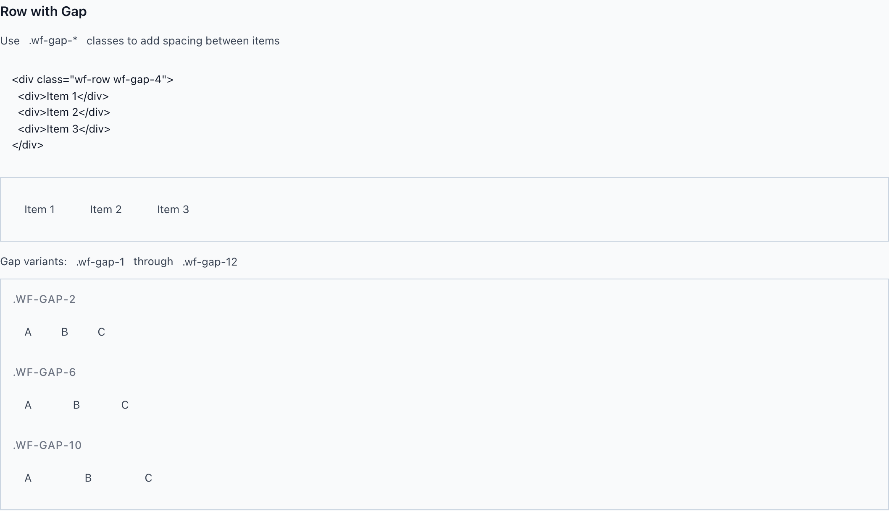
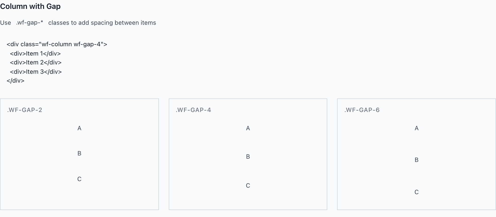

# Grid: Row, Column & Container

Three flex primitives carry every wireframe layout: `wf-row` lays children out horizontally, `wf-column` stacks them vertically, and `wf-container` constrains and centers a page's width. Spacing between children always comes from the `wf-gap-*` scale on the 8px grid — never an inline literal.

> Part of the Gravitate Wireframe Design System — lo-fi component reference. Index: `../CLAUDE.md`.

`wf-row` and `wf-column` are the same flexbox primitive with the axis swapped — `wf-row` sets `flex-direction: row`, `wf-column` sets `flex-direction: column`. Everything else (gaps, justify, align) is shared utility classes, so once you know one you know both. Reach for them anywhere you'd otherwise reach for a bare `display: flex` div; in production they map to Excalibrr's `<Horizontal>` and `<Vertical>`.

The one axis gotcha to internalize: `wf-justify-*` is the main axis and `wf-align-*` is the cross axis, so they flip meaning between the two. In a `wf-row`, `wf-justify-*` distributes horizontally and `wf-align-*` aligns vertically; in a `wf-column` it's the reverse. Same classes, swapped result.

`wf-container` is structural, not decorative — it's a `width: 100%` wrapper with auto side margins and horizontal padding whose only job is to cap and center content width on wide screens. It carries no border, background, or shadow on its own. When you want a card-like surface, that's `wf-container-elevated` (or `wf-card`), not a plain container.

### Row with gap



*`wf-row` arranges children horizontally; `wf-gap-*` adds the 8px-grid spacing between them. Shown: wf-gap-2, wf-gap-6, and wf-gap-10.*

### Row justify-content


*Main-axis distribution on a row: wf-justify-start (default), -center, -end, -between, and -around.*

### Row & column structure

The two direction primitives. Compose them freely — a column of rows is the backbone of most page layouts.

| Variant | When to use | Code |
| --- | --- | --- |
| `wf-row` | Lay children out horizontally (display: flex; flex-direction: row). Maps to Excalibrr <Horizontal>. | `<div class="wf-row wf-gap-4">   <div>Item 1</div>   <div>Item 2</div> </div>` |
| `wf-column` | Stack children vertically (display: flex; flex-direction: column). Maps to Excalibrr <Vertical>. | `<div class="wf-column wf-gap-4">   <div>Item 1</div>   <div>Item 2</div> </div>` |

### Gap scale

Spacing between children comes from `wf-gap-*` only — never an inline margin or padding literal. Each step resolves to a `--wf-space-*` token on the 8px grid. The base steps (wf-gap-1 through wf-gap-8) live in the token utilities; layout.css adds the two large steps below for page-level spacing.

| Variant | When to use | Code |
| --- | --- | --- |
| `wf-gap-2` | Tight spacing between closely related items — toolbar buttons, chips. | `<div class="wf-row wf-gap-2">…</div>` |
| `wf-gap-4` | The workhorse default for most rows and stacks (gap: var(--wf-space-4)). | `<div class="wf-column wf-gap-4">…</div>` |
| `wf-gap-6` | Looser separation between distinct groups in a row, e.g. nav links. | `<div class="wf-row wf-gap-6">…</div>` |
| `wf-gap-10` | Large layout spacing (gap: var(--wf-space-10)). Defined in layout.css, not the base utilities. | `<div class="wf-row wf-gap-10">…</div>` |
| `wf-gap-12` | Largest layout spacing (gap: var(--wf-space-12)). Defined in layout.css. | `<div class="wf-row wf-gap-12">…</div>` |

### Justify (main axis)

Distribution along the flex direction — horizontal in a row, vertical in a column. wf-justify-start is the implicit default.

| Variant | When to use | Code |
| --- | --- | --- |
| `wf-justify-start` | Pack children to the start (justify-content: flex-start). The default — usually omit it. | `<div class="wf-row wf-justify-start wf-gap-2">…</div>` |
| `wf-justify-center` | Center the group on the main axis (justify-content: center). | `<div class="wf-row wf-justify-center">…</div>` |
| `wf-justify-end` | Pack children to the end (justify-content: flex-end). Right-aligned actions. | `<div class="wf-row wf-justify-end wf-gap-2">…</div>` |
| `wf-justify-between` | First/last to the edges, equal space between (justify-content: space-between). The header pattern: logo left, actions right. | `<div class="wf-row wf-justify-between wf-align-center">…</div>` |
| `wf-justify-around` | Equal space around each child (justify-content: space-around). | `<div class="wf-row wf-justify-around">…</div>` |
| `wf-justify-evenly` | Equal space between and at the ends (justify-content: space-evenly). | `<div class="wf-row wf-justify-evenly">…</div>` |

### Column with gap



*`wf-column` stacks children vertically with the same `wf-gap-*` scale. Shown: wf-gap-2, wf-gap-4, wf-gap-6.*

### Align (cross axis)

Alignment across the flex direction — vertical in a row, horizontal in a column. `wf-align-baseline` is row-only (it's scoped to `.wf-row` in the CSS).

| Variant | When to use | Code |
| --- | --- | --- |
| `wf-align-start` | Align children to the cross-axis start (align-items: flex-start). | `<div class="wf-row wf-align-start wf-gap-4">…</div>` |
| `wf-align-center` | Center on the cross axis (align-items: center). The most common pairing with wf-justify-between in headers. | `<div class="wf-row wf-align-center wf-gap-4">…</div>` |
| `wf-align-end` | Align to the cross-axis end (align-items: flex-end). | `<div class="wf-row wf-align-end wf-gap-4">…</div>` |
| `wf-align-stretch` | Stretch children to fill the cross axis (align-items: stretch). Equal-width cards in a column, equal-height in a row. | `<div class="wf-column wf-align-stretch wf-gap-2">…</div>` |
| `wf-align-baseline` | Align children to their text baseline (align-items: baseline). Row only. | `<div class="wf-row wf-align-baseline">…</div>` |

### Wrap & flex-item utilities

Control overflow on a row and how individual children grow or shrink within either primitive.

| Variant | When to use | Code |
| --- | --- | --- |
| `wf-wrap` | Let row children wrap to the next line when they exceed the container (flex-wrap: wrap). Row only. | `<div class="wf-row wf-wrap wf-gap-4">…</div>` |
| `wf-nowrap` | Force a single line (flex-wrap: nowrap). Row only. | `<div class="wf-row wf-nowrap">…</div>` |
| `wf-flex-1` | Make a child take all remaining space (flex: 1 1 0%). The growing main region in a header/content/footer column. | `<div class="wf-column" style="height: 400px;">   <header>Header</header>   <main class="wf-flex-1">Content grows</main>   <footer>Footer</footer> </div>` |
| `wf-grow` | Grow to fill without zeroing the basis (flex-grow: 1). | `<main class="wf-grow">…</main>` |
| `wf-shrink-0` | Stop a child from shrinking — fixed-width sidebars, icons (flex-shrink: 0). | `<aside class="wf-column wf-shrink-0" style="width: 180px;">…</aside>` |

### Container size variants


*`wf-container` max-width modifiers center and cap page content: sm (640px), md (768px), lg (1024px), xl (1280px).*

### Container width & padding

`wf-container` alone is full-width with 16px side padding and auto margins. Add a size modifier to cap the width, or a padding modifier to change the side gutter.

| Variant | When to use | Code |
| --- | --- | --- |
| `wf-container` | Base wrapper: width 100%, auto side margins, 16px (--wf-space-4) horizontal padding. No border or background. | `<div class="wf-container">…</div>` |
| `wf-container-sm` | Cap content at max-width: 640px and center it. | `<div class="wf-container wf-container-sm">…</div>` |
| `wf-container-md` | Cap at max-width: 768px. Comfortable reading width for forms and prose. | `<div class="wf-container wf-container-md">…</div>` |
| `wf-container-lg` | Cap at max-width: 1024px. The default app content width. | `<div class="wf-container wf-container-lg">…</div>` |
| `wf-container-xl` | Cap at max-width: 1280px for wide dashboards. | `<div class="wf-container wf-container-xl">…</div>` |
| `wf-container-2xl` | Cap at max-width: 1536px — the widest constraint. | `<div class="wf-container wf-container-2xl">…</div>` |
| `wf-container-full` | max-width: 100% — explicitly opt out of any width cap. | `<div class="wf-container wf-container-full">…</div>` |
| `wf-container-tight` | Reduce side padding to 8px (--wf-space-2). | `<div class="wf-container wf-container-md wf-container-tight">…</div>` |
| `wf-container-relaxed` | Widen side padding to 24px (--wf-space-6). | `<div class="wf-container wf-container-relaxed">…</div>` |
| `wf-container-spacious` | Widen side padding to 32px (--wf-space-8). | `<div class="wf-container wf-container-spacious">…</div>` |
| `wf-container-elevated` | Card-like surface: surface background, border, radius, and shadow. Use when you want a container that also reads as a card. | `<div class="wf-container wf-container-md wf-container-elevated">…</div>` |

### Header layout — row composition

```html
<!-- Logo left, nav center, actions right -->
<div class="wf-row wf-justify-between wf-align-center wf-gap-4">
  <div class="logo">Logo</div>
  <div class="wf-row wf-gap-6">
    <a href="#">Home</a>
    <a href="#">About</a>
    <a href="#">Contact</a>
  </div>
  <div class="wf-row wf-gap-2">
    <button>Login</button>
    <button>Sign Up</button>
  </div>
</div>
```

wf-justify-between pushes the three groups to edges and center; wf-align-center vertically centers them. Nested rows carry their own gaps.

### App shell — container + sidebar + main

```html
<!-- Width-capped page with a fixed sidebar and a growing main column -->
<div class="wf-container wf-container-lg">
  <div class="wf-row wf-gap-6">
    <aside class="wf-column wf-gap-4 wf-shrink-0" style="width: 180px;">
      <!-- fixed-width nav -->
    </aside>
    <main class="wf-column wf-gap-4 wf-flex-1">
      <!-- grows to fill remaining width -->
    </main>
  </div>
</div>
```

Container caps and centers the page; wf-shrink-0 holds the sidebar width while wf-flex-1 lets main absorb the rest.

### The 8px grid

From DESIGN.md §5.2 — non-negotiable.

1. **All spacing between elements comes from the spacing scale via wf-gap-* — never a raw px gap.** — There are no 7px gaps, 10px paddings, or 18px margins. Every wf-gap-* resolves to a --wf-space-* token that sits on the 8px grid.
2. **When the gap you want isn't on the scale, step one up or one down — don't invent a custom value.** — If the scale doesn't have a token at the size you want, that's the signal to pick the nearest step, not to write a literal (DESIGN.md §5.2 + §7.6).
3. **Default vertical rhythm is tight: related rows stack at --wf-space-stack-sm (8px), groups at --wf-space-stack-lg.** — Gravitate is enterprise data-density. A region using 3+ different vertical rhythms is broken (DESIGN.md §5.4).
4. **wf-container is for width control only — never use it as a styled box.** — It has no border, padding-beyond-gutter, or background by design. Reach for wf-container-elevated or wf-card when you need a visible surface (DESIGN.md §7.1).

### Do's & Don'ts

- **Do:** <div class="wf-row wf-gap-4">
  **Don't:** <div class="wf-row" style="gap: 18px">
  **Why:** Spacing must come from the wf-gap-* scale on the 8px grid, not an inline literal (DESIGN.md §5.2).
- **Do:** wf-justify-between for main-axis distribution, wf-align-center for the cross axis
  **Don't:** wf-align-between or wf-justify-stretch
  **Why:** justify is the main axis and align is the cross axis — the modifiers are not interchangeable, and the wrong-axis class simply doesn't exist in the CSS.
- **Do:** <div class="wf-container wf-container-md">
  **Don't:** <div class="wf-container" style="max-width: 700px; border: 1px solid">
  **Why:** Use the size modifier for width and wf-container-elevated for a surface; a plain container is structural and carries no visual weight (DESIGN.md §7.1).
- **Do:** <div class="wf-column wf-gap-4">
  **Don't:** <div class="wf-col wf-gap-4">
  **Why:** The class is wf-column (mapping to Excalibrr <Vertical>). wf-col is not defined in layout.css and applies nothing.

### Gotchas

- **justify and align flip meaning between row and column** — Both primitives share the same wf-justify-* and wf-align-* classes. In a wf-row, justify is horizontal and align is vertical; in a wf-column it's the reverse. The class name never tells you which screen axis you're moving — the parent's direction does.
- **Gap classes are split across two files** — wf-gap-1 through wf-gap-8 live in the base token utilities; only wf-gap-10 and wf-gap-12 are defined in layout.css. If a wf-gap-* step renders no spacing, confirm the token utilities stylesheet is linked alongside layout.css — both are required.
- **Alignment modifiers are scoped to their primitive** — The CSS writes .wf-row.wf-align-center and .wf-column.wf-align-center as compound selectors, and wf-align-baseline + wf-wrap/wf-nowrap exist only under .wf-row. An align or wrap class on a plain div (no wf-row/wf-column) does nothing.
- **wf-container centers via auto margins, not flex** — It applies margin-left/right: auto with width: 100% — so it centers itself within its parent's width. It only visibly centers once a max-width modifier (wf-container-sm…2xl) caps the width; without one it's full-bleed and there's nothing to center.
