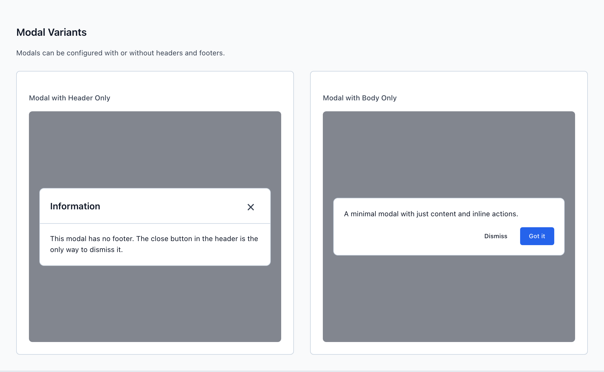
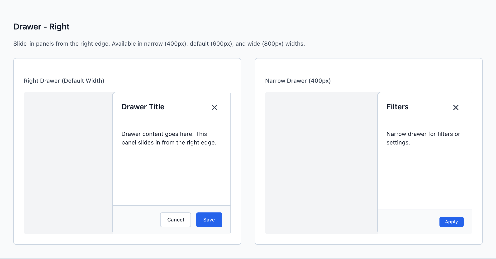
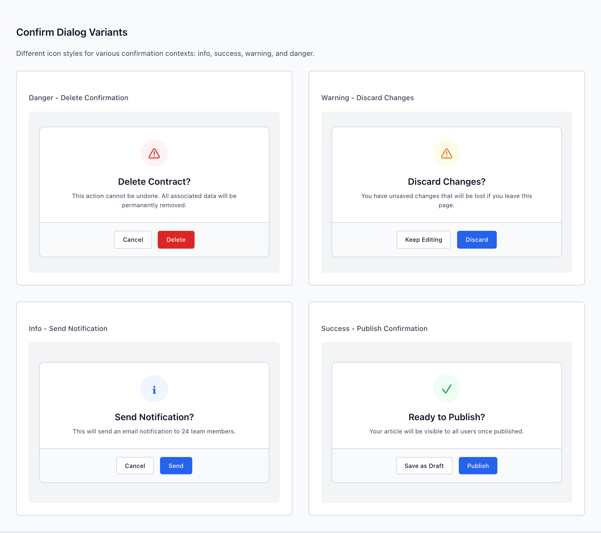
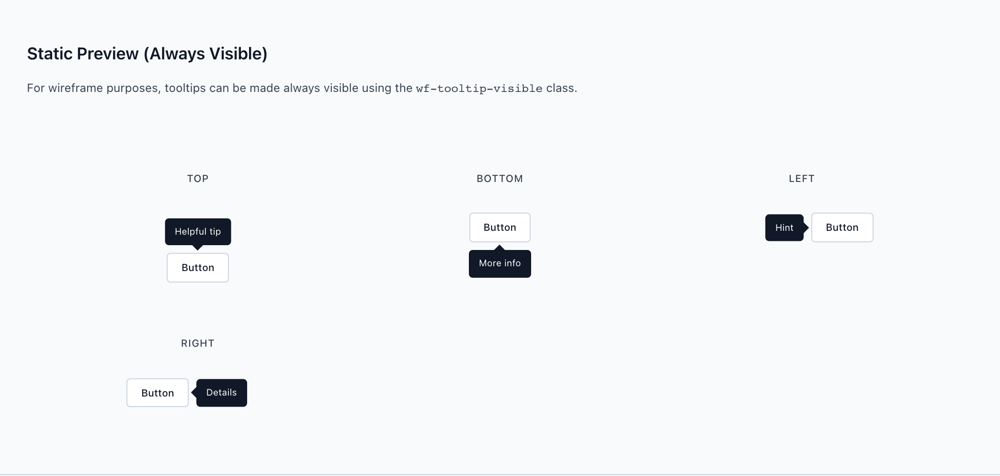

# Modal, Overlay & Confirm

Overlays interrupt the page — so the only real design question is how much they should interrupt it. `wf-overlay` is the shared scrim-plus-container scaffold; inside it you place a centered `wf-modal` for focused tasks, an edge-anchored `wf-drawer` for adjacent context, or a `wf-modal-confirm` for destructive yes/no decisions. `wf-tooltip` is the unobtrusive cousin: a hover-only hint that never blocks anything and never carries anything critical.

> Part of the Gravitate Wireframe Design System — lo-fi component reference. Index: `../CLAUDE.md`.

Every overlay starts from the same wrapper: a `wf-overlay` (fixed, full-viewport, `z-index: 1000`) holding a `wf-overlay-backdrop` scrim and one content surface. Adding `wf-overlay-visible` is what fades the scrim in (`opacity 200ms`) and animates the surface — a modal scales up from `0.95`, a drawer slides in from its edge. In a real prototype you toggle that class; in a static wireframe you simply ship it on.

The content surface is one of two shapes. `wf-modal` is a centered column (default `max-width: 500px`) with an optional `wf-modal-header`, a scrolling `wf-modal-body`, and a right-aligned `wf-modal-footer`. `wf-drawer` is the same header/body/footer column anchored to an edge — `wf-drawer-right` is the default and the one you'll reach for 90% of the time.

`wf-modal-confirm` is not a separate component — it's a modifier on `wf-modal wf-modal-sm` that center-stacks an icon, title, and message for destructive or irreversible decisions. Reach for it instead of hand-building a Modal whenever the answer is a simple yes/no with consequences. `wf-tooltip` lives entirely outside this overlay machinery: it's an absolutely-positioned bubble inside a `wf-tooltip-container`, shown on `:hover` or with the `wf-tooltip-visible` class for wireframes.

### Choosing the overlay — match cognitive load, not visual prominence

§4.2 of DESIGN.md calls this the spot where the most drift happens. The rule is to match the overlay to how much the interaction should cost the user, not how important it looks:

Destructive or irreversible confirm? → `wf-modal-confirm`. Focused task that should block the page? → `wf-modal`. Adjacent context that shouldn't block? → `wf-drawer`. One-line hover hint? → `wf-tooltip`. (Transient feedback is a `wf-toast`; persistent inline state is a `wf-alert` — both covered in their own entries.)

The distinction that matters most: a Modal blocks and traps; a Drawer is the default for "let me look at this without losing the page."

### Modal variants



*Centered modals over a dimmed scrim: header (title + close), scrolling body, and a right-aligned footer action row. This is the focus-trapped, center-stage branch of the overlay decision tree — use it sparingly, every modal is a context switch.*

### Modal sizes & structure

One size modifier per modal; default is 500px. Header and footer are both optional — compose only the regions you need.

| Variant | When to use | Code |
| --- | --- | --- |
| `wf-modal` | Default focused task, 500px wide. Edit a schedule, configure an alert. | `<div class="wf-overlay wf-overlay-visible">   <div class="wf-overlay-backdrop"></div>   <div class="wf-modal">     <div class="wf-modal-header">       <h2 class="wf-modal-title">Modal Title</h2>       <button class="wf-modal-close">&times;</button>     </div>     <div class="wf-modal-body">Modal content goes here.</div>     <div class="wf-modal-footer">       <button class="wf-button wf-button-secondary">Cancel</button>       <button class="wf-button wf-button-primary">Confirm</button>     </div>   </div> </div>` |
| `wf-modal-sm` | Compact 400px — simple confirmations and short forms. Also the base for confirm dialogs. | `<div class="wf-modal wf-modal-sm">…</div>` |
| `wf-modal-lg` | 700px — a task with more fields or a wider table. | `<div class="wf-modal wf-modal-lg">…</div>` |
| `wf-modal-xl` | 900px — dense multi-column editing. | `<div class="wf-modal wf-modal-xl">…</div>` |
| `wf-modal-full` | Near-fullscreen (viewport minus 48px) for immersive editors. | `<div class="wf-modal wf-modal-full">…</div>` |
| `header / body / footer optional` | Drop the footer for a header-only info modal, or drop the header for a body-only modal with inline actions. | `<div class="wf-modal wf-modal-sm">   <div class="wf-modal-body">     <p>A minimal modal with inline actions.</p>     <button class="wf-button wf-button-ghost">Dismiss</button>     <button class="wf-button wf-button-primary">Got it</button>   </div> </div>` |

### Drawer — right



*A right-edge slide-in drawer over a scrim, with the same header / scrolling body / footer column as a modal. This is the side-panel branch of the overlay decision tree — the default for adjacent context that shouldn't block the page.*

### Drawer directions & widths

A drawer combines a direction class (where it anchors) with an optional width class (left/right only). Default direction is right; default width is 600px. Each direction animates via a transform that `wf-overlay-visible` resets to zero.

| Variant | When to use | Code |
| --- | --- | --- |
| `wf-drawer-right` | Default. Slides in from the right edge — row details, filter panels, activity logs. | `<div class="wf-overlay wf-overlay-visible">   <div class="wf-overlay-backdrop"></div>   <div class="wf-drawer wf-drawer-right">     <div class="wf-drawer-header">       <h2 class="wf-drawer-title">Drawer Title</h2>       <button class="wf-drawer-close">&times;</button>     </div>     <div class="wf-drawer-body">Drawer content goes here.</div>     <div class="wf-drawer-footer">       <button class="wf-button wf-button-secondary">Cancel</button>       <button class="wf-button wf-button-primary">Save</button>     </div>   </div> </div>` |
| `wf-drawer-left` | Anchors to the left edge — secondary navigation or a tree. | `<div class="wf-drawer wf-drawer-left">…</div>` |
| `wf-drawer-bottom` | Slides up from the bottom (max-height 80vh) — action sheets, mobile-friendly pickers. | `<div class="wf-drawer wf-drawer-bottom">…</div>` |
| `wf-drawer-top` | Slides down from the top — global notices or a command palette. | `<div class="wf-drawer wf-drawer-top">…</div>` |
| `wf-drawer-full` | Full-screen takeover with no border or radius. | `<div class="wf-drawer wf-drawer-full">…</div>` |
| `wf-drawer-narrow` | 400px-wide left/right drawer — filters or settings. | `<div class="wf-drawer wf-drawer-right wf-drawer-narrow">…</div>` |
| `wf-drawer-wide` | 800px-wide left/right drawer — detail panels with more content. | `<div class="wf-drawer wf-drawer-right wf-drawer-wide">…</div>` |

### Confirm dialog variants



*Compact ConfirmDialogs built from wf-modal-sm + wf-modal-confirm: a colored circular icon, a title, a one-line message, and a centered Cancel + commit footer. Danger commits get wf-button-danger; the icon color (danger / warning / info / success) signals consequence.*

### Confirm dialog icon intent

`wf-modal-confirm` center-stacks the body and centers the footer. The `wf-confirm-icon` color carries the consequence — pair a danger icon with a `wf-button-danger` commit so color, shape, and label all agree.

| Variant | When to use | Code |
| --- | --- | --- |
| `wf-confirm-icon-danger` | Destructive, irreversible commits — Delete, Remove. Red. Pair with wf-button-danger. | `<div class="wf-modal wf-modal-sm wf-modal-confirm">   <div class="wf-modal-body">     <div class="wf-confirm-icon wf-confirm-icon-danger">&#9888;</div>     <h3 class="wf-confirm-title">Delete Contract?</h3>     <p class="wf-confirm-message">This action cannot be undone. All associated data will be permanently removed.</p>   </div>   <div class="wf-modal-footer">     <button class="wf-button wf-button-secondary">Cancel</button>     <button class="wf-button wf-button-danger">Delete</button>   </div> </div>` |
| `wf-confirm-icon-error` | Alias of danger — identical red treatment. Use whichever name reads clearer. | `<div class="wf-confirm-icon wf-confirm-icon-error">&#9888;</div>` |
| `wf-confirm-icon-warning` | Reversible-but-lossy decisions — Discard changes, Archive. Amber. | `<div class="wf-confirm-icon wf-confirm-icon-warning">&#9888;</div>` |
| `wf-confirm-icon-info` | Consequential but neutral — Send notification, Sign out. Blue. | `<div class="wf-confirm-icon wf-confirm-icon-info">&#8505;</div>` |
| `wf-confirm-icon-success` | Affirmative milestone — Ready to publish? Green. | `<div class="wf-confirm-icon wf-confirm-icon-success">&#10003;</div>` |

### Tooltip positions



*Always-visible tooltip previews in top / bottom / left / right placements — a dark neutral-900 bubble with a rotated-square arrow. A lightweight hover hint, never a place for critical information.*

### Tooltip placement & modifiers

A tooltip is a `wf-tooltip` plus a placement class, nested in a `wf-tooltip-container` next to its trigger. It shows on `:hover` of the container; add `wf-tooltip-visible` to pin it open for static wireframes.

| Variant | When to use | Code |
| --- | --- | --- |
| `wf-tooltip-top` | Above the trigger. The most common placement for buttons in a toolbar. | `<div class="wf-tooltip-container">   <button class="wf-button wf-button-secondary">Hover me</button>   <div class="wf-tooltip wf-tooltip-top">     This is a tooltip     <span class="wf-tooltip-arrow"></span>   </div> </div>` |
| `wf-tooltip-bottom` | Below the trigger — when there's content above it. | `<div class="wf-tooltip wf-tooltip-bottom">More info<span class="wf-tooltip-arrow"></span></div>` |
| `wf-tooltip-left / wf-tooltip-right` | Beside the trigger — for elements at the top or bottom edge. | `<div class="wf-tooltip wf-tooltip-right">Details<span class="wf-tooltip-arrow"></span></div>` |
| `wf-tooltip-visible` | Pins the tooltip open. For wireframe screenshots only — never simulates real hover behavior. | `<div class="wf-tooltip wf-tooltip-top wf-tooltip-visible">Always shown<span class="wf-tooltip-arrow"></span></div>` |
| `wf-tooltip-multiline` | Longer hints that need to wrap (max-width 200px, centered). Default tooltips are single-line nowrap. | `<div class="wf-tooltip wf-tooltip-top wf-tooltip-multiline">A longer description that wraps to multiple lines.<span class="wf-tooltip-arrow"></span></div>` |

### Overlay tokens

The values that define an overlay's scrim, surface, and stacking. All resolve through tokens/index.css.

| Token | Value | Use for |
| --- | --- | --- |
| `--wf-color-background-overlay` | `rgba(17, 24, 39, 0.5)` | The scrim color behind every modal and drawer — a 50% neutral-900 dim. |
| `--wf-color-surface` | `#ffffff` | Modal, drawer, and tooltip-free surface background. |
| `--wf-color-border` | `#d1d5db (neutral-300)` | Modal/drawer border and the header/footer divider lines. |
| `--wf-radius-lg` | `0.75rem (12px)` | Corner radius on modals and on the open corners of edge drawers. |
| `--wf-focus-ring` | `layered surface + primary ring` | The focus state on wf-modal-close and wf-drawer-close — never outline:none alone. |
| `--wf-color-neutral-900` | `#111827` | Tooltip bubble and arrow background. |
| `--wf-color-text-inverse` | `#ffffff` | Tooltip text on the dark bubble. |

### Confirm icon tokens

The 48px circular wf-confirm-icon uses a tinted background plus a saturated foreground per intent. The foregrounds are the standard status colors; the tints are baked literals in feedback.css.

| Token | Value | Use for |
| --- | --- | --- |
| `--wf-color-error` | `#dc2626` | Danger/error icon foreground on a #fef2f2 tint. |
| `--wf-color-warning` | `#d97706` | Warning icon foreground on a #fffbeb tint. |
| `--wf-color-primary` | `#2563eb` | Info icon foreground on a #eff6ff tint. |
| `--wf-color-success` | `#16a34a` | Success icon foreground on a #f0fdf4 tint. |
| `--wf-radius-full` | `9999px` | Makes the wf-confirm-icon a perfect circle. |

### Loading state inside an overlay

```html
<!-- Swap the confirm body for a spinner while the action runs -->
<div class="wf-modal wf-modal-sm wf-modal-confirm">
  <div class="wf-modal-body">
    <div class="wf-loading">
      <div class="wf-loading-spinner"></div>
      <span class="wf-loading-text">Deleting...</span>
    </div>
  </div>
</div>
```

wf-loading works inside any modal or drawer body — show it after the user commits, replacing the footer buttons so they can't double-fire the action.

### Overlay choice (DESIGN.md §4.2)

Match the overlay to the cognitive load of the interaction, not to how prominent it looks. These are the load-bearing distinctions.

1. **Destructive or irreversible confirm → wf-modal-confirm, always. Never a generic Modal.** — The center-stacked icon-title-message shape is part of the safety guarantee — it reads as a decision, not a form.
2. **Focused task that must block the page → wf-modal.** — A modal centers, scrims, and traps focus. Use it sparingly: every modal is a context switch.
3. **Adjacent context that doesn't need to block → wf-drawer.** — It's the default for 'look at this without losing the page' — the underlying page often stays scannable behind it.
4. **One-line, non-essential clarification → wf-tooltip.** — Tooltips are hover/focus-only hints; anything the user must act on belongs in an Alert or Modal.
5. **If the user must commit and cannot interact with the page behind, it's a Modal, not a Drawer.** — A Drawer implies the page is still live; using one for a blocking commit misleads the user about what's still clickable.

### Do's & Don'ts

- **Do:** <div class="wf-modal wf-modal-sm wf-modal-confirm"> for a delete
  **Don't:** <div class="wf-modal"> with a hand-built Cancel/Delete row
  **Why:** DESIGN.md §7.3: don't use a generic Modal for destructive confirmation. The confirm shape is the safety guarantee.
- **Do:** Danger icon + wf-button-danger commit together
  **Don't:** Danger icon paired with a plain wf-button-primary commit
  **Why:** Color is the warning. A red icon over a blue commit button sends two different signals about how risky the action is.
- **Do:** Put the decision in a ConfirmDialog or Modal
  **Don't:** Put 'You have unsaved changes' only in a wf-tooltip
  **Why:** §4.2 / §7.3: tooltips are invisible to many users and inaccessible on touch — never the home for critical info.
- **Do:** wf-drawer-right for an interactive side panel
  **Don't:** wf-drawer for a commit the user must make before doing anything else
  **Why:** §7.3: a Drawer implies the page behind it is still usable. A blocking commit is a Modal.
- **Do:** Add wf-overlay-visible to show the overlay
  **Don't:** Leave it off and wonder why nothing renders
  **Why:** wf-overlay is visibility:hidden / opacity:0 by default; wf-overlay-visible is what fades the scrim in and animates the surface into place.

### Gotchas

- **Modals trap focus; drawers don't have to** — DESIGN.md §6.5: a wf-modal traps focus — Tab cycles inside it, Esc closes it, and focus returns to the invoking element on close. A wf-drawer does not have to trap focus, because the page behind it is often still meant to be scannable. Wire your prototype's focus management to match the surface you chose.
- **The scrim is a sibling, not a parent** — wf-overlay-backdrop is an absolutely-positioned sibling of the modal/drawer inside wf-overlay (z-index 1000), not a wrapper around it. The surface sits at z-index 1001, above the backdrop. Forget the backdrop div and you get a floating panel with no dim behind it.
- **wf-overlay-visible drives every entrance animation** — The class doesn't just toggle visibility — descendant selectors like .wf-overlay-visible .wf-modal and .wf-overlay-visible .wf-drawer-right reset the surface's transform to zero. Without it the modal stays scaled-down and the drawer stays translated off-screen, even if you force the scrim visible some other way.
- **wf-modal-confirm is a modifier, not a component** — It only restyles wf-modal's body (center-stacked) and footer (centered). You still need wf-modal wf-modal-sm on the same element, and you still build it inside a wf-overlay with a backdrop. There is no standalone confirm element.
- **wf-confirm-icon-danger and -error are identical** — Both map to the same #fef2f2 tint and --wf-color-error foreground in feedback.css. Pick the name that reads clearest in context; they render the same.
- **Tooltips ride at z-index 3000 and ignore pointer events** — wf-tooltip sits above even toasts (2000) and overlays (1000), and is pointer-events:none so it never intercepts clicks meant for the trigger. wf-tooltip-visible is a wireframe-only crutch — it pins the tooltip open and does not represent real hover behavior.
- **Default tooltips don't wrap** — wf-tooltip is white-space:nowrap, so a long string blows out horizontally off-screen. Add wf-tooltip-multiline to cap it at 200px and allow wrapping the moment the hint runs past a few words.
