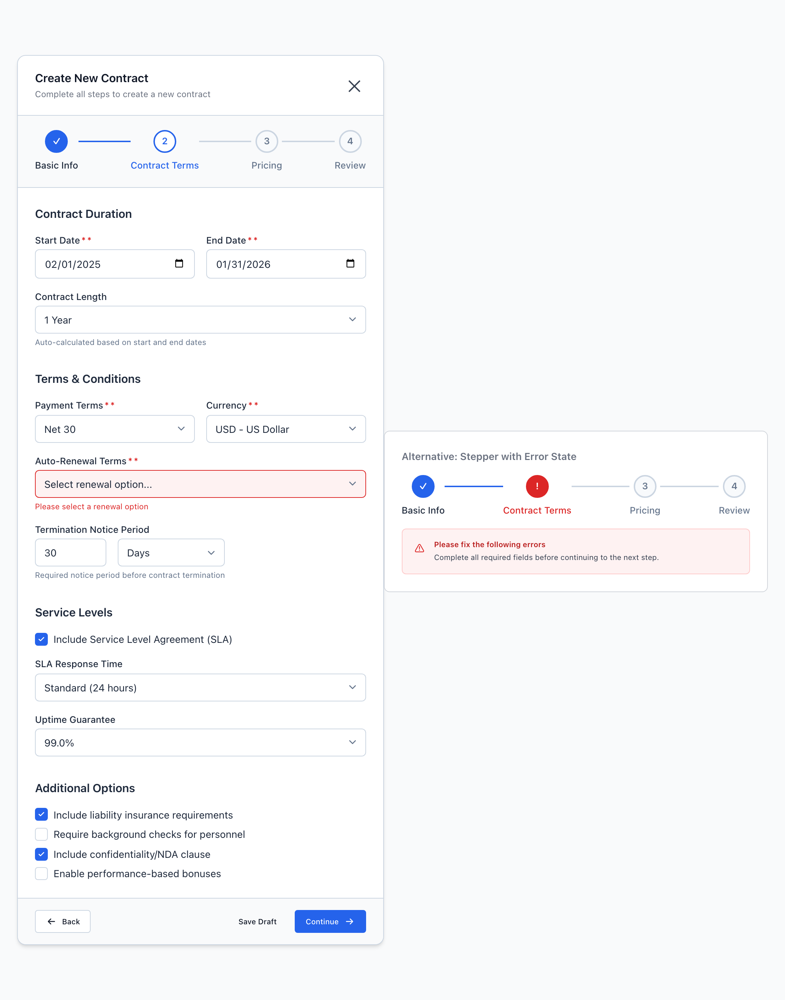
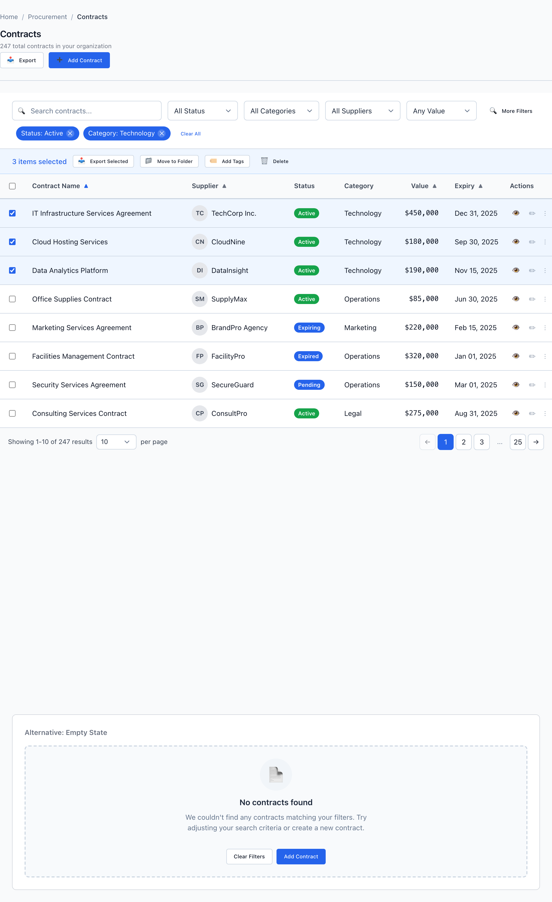
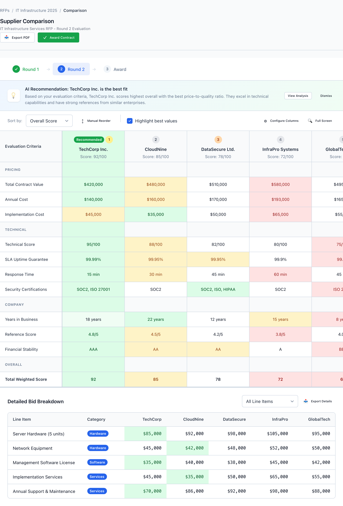

# Page Patterns

Six full-page compositions assemble the primitives into the page shapes Gravitate keeps rebuilding: Dashboard, Master-Detail, Form Wizard, Settings, Data Table, and Comparison Matrix. Every wireframe page starts by copying one of these — pause and check for a fit before inventing a seventh.

> Part of the Gravitate Wireframe Design System — lo-fi component reference. Index: `../CLAUDE.md`.

These are page-level scaffolds, not components. Each one is a saved arrangement of the same primitives — `wf-page`, `wf-page-header`, the grid, cards, the stepper — wired into a layout that solves a recurring problem. The rule from `DESIGN.md` §5.5 is blunt: every wireframe page starts from one of these six, and if the page you're building doesn't fit one, that's a signal to stop and ask whether it's a genuine new pattern or just a variant of an existing one. Most of the time it's the latter.

The six split along the system's two layout postures (§2.2). **Dashboard**, **Data Table**, and **Comparison Matrix** are grid-first — align columns, share row rhythm, scan vertically. **Form Wizard** and **Settings** are narrative-first — single column, top-down reading order, generous label-to-input proximity. **Master-Detail** straddles: a grid-first list on the left, a narrative-first record on the right. Don't mix postures inside one section.

Five of the six share the same skeleton: `wf-page` > `wf-page-header` > a body region. Only **Dashboard** adds `wf-page-with-sidebar` plus an `<aside class="wf-sidebar">` / `<main class="wf-main">` pair for top-level app navigation — that's the only place the global app sidebar appears. Master-Detail and Settings stay on plain `wf-page` and build their own in-page rails (`master-panel`, `settings-sidebar`) with pattern-local CSS. The patterns themselves layer small amounts of that pattern-local CSS (the wizard container, the comparison matrix's sticky first column) on top of the primitives — that local styling is part of the template, not a license to invent new global classes.

### The six shapes

**Dashboard** — metrics + grid + sidebar. A `wf-row` of `wf-metric-card`s across the top, then a two-thirds / one-third split (`wf-w-2\/3` and `wf-w-1\/3`) pairing a recent-records grid with summary cards. The home page for an app: KPIs first, drill-downs below.

**Master-Detail** — list on the left, detail panel on the right. A 60/40 split inside a `master-detail-container`: a `wf-datagrid` master with its own action bar, and a `detail-panel` that renders the selected record with `wf-tabs`, a `wf-description-list`, and `wf-progress`. For browsing a set where each item needs a full read without leaving the list.

**Form Wizard** — stepper + form sections + footer. A centered `wizard-container` (modal-shaped, max-width 800px) with a `wf-stepper` header, scrolling `form-section` body, and a footer carrying Back on the left, Save Draft and Continue on the right. For an ordered, multi-step entry flow where progress matters.

**Settings** — sidebar nav + grouped sections. A local `settings-sidebar` of labeled nav groups beside a scrolling `settings-body` of `settings-section` cards, each a titled group of `settings-row`s with a `wf-toggle` on the right (or a `wf-select` for scheduling fields), closed by a `settings-footer` carrying Cancel and Save Changes. For narrative-first configuration organized by category.

**Data Table** — filter bar + grid. `wf-page-header` over a `filter-bar` (search + `wf-select` predicates + active `filter-tag`s), an optional `bulk-actions` bar when rows are selected, and a full `wf-datagrid` with sortable headers, status badges, and `wf-datagrid-pagination`. The default CRUD list page.

**Comparison Matrix** — options across columns, attributes down rows. A sticky `metrics-column` of evaluation criteria beside scrolling `supplier-column`s, with `cell-best`/`cell-good`/`cell-neutral`/`cell-poor` coloring and rank badges. For side-by-side evaluation — pricing tiers, RFP bids, feature matrices.

### Form Wizard Page



*Full-page multi-step wizard composition: a wf-stepper header (Basic Info completed, Contract Terms active), a scrolling body of form-section blocks, and a footer with Back left, Save Draft and Continue right. The narrative-first posture — one column, top-down reading order.*

### Data Table Page



*Grid-first list page: a wf-page-header with breadcrumb and actions, a filter-bar of search plus wf-select predicates with active filter-tags, a contextual bulk-actions bar, and a full wf-datagrid with sortable headers, status wf-badges, and pagination.*

### Settings Page


*Sidebar-nav settings layout: a settings-sidebar of labeled nav groups (Account, Application, Organization) beside grouped settings-section cards, each pairing a settings-row label with a wf-toggle. Narrative-first editing, closed by a settings-footer with Cancel and Save Changes.*

### Comparison Matrix Page



*Side-by-side evaluation page: a sticky metrics-column of grouped criteria beside scrolling supplier-columns, with rank badges, a Recommended highlight, and cell-best / cell-good / cell-neutral / cell-poor value coloring so the strongest bid reads at a glance.*

### The six scaffolds

Each row is a template file under patterns/ — copy it whole and replace the content. The class shown is the distinguishing wrapper that sets the shape.

| Variant | When to use | Code |
| --- | --- | --- |
| `DashboardLayout.html` | Home/overview page — KPIs first, drill-downs below. Metrics row + 2/3 grid + 1/3 summary, inside a sidebar shell. | `<div class="wf-page wf-page-with-sidebar">   <aside class="wf-sidebar">...</aside>   <main class="wf-main">     <header class="wf-page-header">...</header>     <div class="wf-page-content">       <div class="wf-row wf-gap-4 wf-wrap">         <div class="wf-metric-card">...</div>       </div>       <div class="wf-row wf-gap-6">         <div class="wf-column wf-w-2\/3">...</div>         <div class="wf-column wf-w-1\/3">...</div>       </div>     </div>   </main> </div>` |
| `MasterDetailLayout.html` | Browse a set where each item needs a full read without leaving the list. 60/40 list + detail panel. | `<div class="master-detail-container">   <div class="master-panel">     <div class="action-bar">...search + filters...</div>     <div class="grid-container">       <div class="wf-datagrid wf-datagrid-borderless">...</div>     </div>   </div>   <div class="detail-panel">     <div class="detail-header">...</div>     <div class="wf-tabs">...</div>     <div class="detail-content">...</div>   </div> </div>` |
| `FormWizard.html` | Ordered, multi-step data entry where progress matters. Centered modal-shaped container, stepper header, footer nav. | `<div class="wizard-container">   <div class="wizard-header">...</div>   <div class="wizard-stepper">     <div class="wf-stepper">...</div>   </div>   <div class="wizard-body">     <div class="form-section">...</div>   </div>   <div class="wizard-footer">     <button class="wf-button wf-button-secondary">Back</button>     <div class="wf-row wf-gap-3">       <button class="wf-button wf-button-ghost">Save Draft</button>       <button class="wf-button wf-button-primary">Continue</button>     </div>   </div> </div>` |
| `SettingsPage.html` | Narrative-first configuration organized by category. Section-nav sidebar + grouped sections + sticky Save footer. | `<div class="settings-layout">   <nav class="settings-sidebar">     <div class="settings-nav-group">       <div class="settings-nav-label">Account</div>       <a class="settings-nav-item active">...</a>     </div>   </nav>   <div class="settings-content">     <div class="settings-header">...</div>     <div class="settings-body">       <div class="settings-section">...</div>     </div>     <div class="settings-footer">...</div>   </div> </div>` |
| `DataTablePage.html` | Default CRUD list — searchable, filterable, paginated. Filter bar + optional bulk-actions bar + full grid. | `<div class="wf-page">   <header class="wf-page-header">...</header>   <div class="filter-bar">     <div class="search-wrapper">...</div>     <select class="wf-select">...</select>     <span class="filter-tag">Status: Active <span class="filter-tag-remove">&#x2715;</span></span>   </div>   <div class="bulk-actions">...</div>   <div class="table-container">     <div class="wf-datagrid wf-datagrid-borderless">...</div>   </div> </div>` |
| `ComparisonMatrix.html` | Side-by-side evaluation — pricing tiers, RFP bids, feature matrices. Sticky criteria column + per-option columns. | `<div class="comparison-container">   <div class="comparison-matrix">     <div class="metrics-column">       <div class="metric-row metric-group">Pricing</div>       <div class="metric-row">Total Contract Value</div>     </div>     <div class="suppliers-container">       <div class="supplier-column recommended">         <div class="supplier-header">...</div>         <div class="supplier-cell cell-best">$420,000</div>       </div>     </div>   </div> </div>` |

### Shared scaffolding tokens

The page chrome reads as neutral gray with one accent. These are the tokens the six patterns lean on for surfaces, structure, and the lone primary highlight.

| Token | Value | Use for |
| --- | --- | --- |
| `--wf-color-background` | `#f9fafb` | Page background behind the chrome (resolves to --wf-color-neutral-50). The neutral the whole composition reads against. |
| `--wf-color-surface` | `#ffffff` | Raised surfaces — cards, sidebars, headers, the wizard container, settings sections. |
| `--wf-color-border` | `#d1d5db` | Every divider and region edge: header bottom-border, sidebar right-border, section borders, grid lines (resolves to --wf-color-neutral-300). |
| `--wf-color-primary` | `#2563eb` | The single accent. Active sidebar/nav item, selected row, sort indicator, primary button — interactive intent and current location only. |
| `--wf-color-success` | `#16a34a` | Status only — the Active badge, an affirmative commit button (Award Contract), a completed wizard/RFP step. |
| `--wf-space-page-x` | `24px` | Standard page horizontal padding (resolves to --wf-space-6). Use it, not arbitrary inline values. |
| `--wf-space-page-y` | `32px` | Standard page vertical padding (resolves to --wf-space-8). |

### The base skeleton — Data Table Page

```html
<div class="wf-page">
  <!-- Header: breadcrumb, title, page-level actions -->
  <header class="wf-page-header">
    <div class="wf-page-title">
      <nav class="wf-breadcrumb" style="margin-bottom: 8px;">
        <a href="#" class="wf-breadcrumb-item">Home</a>
        <span class="wf-breadcrumb-separator">/</span>
        <span class="wf-breadcrumb-current">Contracts</span>
      </nav>
      <h1 class="wf-text-h2">Contracts</h1>
      <p class="wf-text-helper">247 total contracts in your organization</p>
    </div>
    <div class="wf-page-actions">
      <button class="wf-button wf-button-secondary">Export</button>
      <button class="wf-button wf-button-primary">Add Contract</button>
    </div>
  </header>

  <!-- Filter bar: predicates only (search + selects + active tags) -->
  <div class="filter-bar">
    <div class="search-wrapper">
      <span class="search-icon">&#x1F50D;</span>
      <input type="text" class="wf-input" placeholder="Search contracts...">
    </div>
    <select class="wf-select"><option>All Status</option></select>
    <span class="filter-tag">Status: Active <span class="filter-tag-remove">&#x2715;</span></span>
  </div>

  <!-- Grid: the work surface -->
  <div class="table-container">
    <div class="wf-datagrid wf-datagrid-borderless">
      <div class="wf-datagrid-header">
        <div class="wf-datagrid-cell wf-datagrid-cell-sortable wf-sorted" style="flex: 2;">
          Contract Name <span class="wf-datagrid-sort-icon">&#x25B2;</span>
        </div>
        <div class="wf-datagrid-cell" style="flex: 0 0 100px;">Status</div>
      </div>
      <div class="wf-datagrid-body">
        <div class="wf-datagrid-row">
          <div class="wf-datagrid-cell" style="flex: 2;">
            <span class="wf-truncate">IT Infrastructure Services Agreement</span>
          </div>
          <div class="wf-datagrid-cell" style="flex: 0 0 100px;">
            <span class="wf-badge wf-badge-success">Active</span>
          </div>
        </div>
      </div>
      <div class="wf-datagrid-pagination">...</div>
    </div>
  </div>
</div>
```

The page header / body / pagination spine is shared across all the non-sidebar shapes — only the body region between header and pagination changes per pattern. For the one app-nav shell (Dashboard), add wf-page-with-sidebar to the wf-page and pair an <aside class="wf-sidebar"> with <main class="wf-main">. Settings and Master-Detail keep the plain wf-page and build their own in-page rail instead.

### Picking the page shape

Start from the data and the task, not the look. The shape follows from what the user is doing.

1. **Start from one of the six. Don't compose a page shape from scratch.** — DESIGN.md §5.5: every wireframe page begins from a pattern. If nothing fits, that's a signal to confirm the requirement is a real new pattern — usually it's a variant of an existing one (§2.1, patterns over novelty).
2. **Match the layout posture to the content. Grid-first for data (Dashboard, Data Table, Comparison Matrix); narrative-first for entry (Form Wizard, Settings).** — §2.2: data wants aligned columns and shared row rhythm; forms want one column and top-down reading order. Mixing postures in one section makes both read worse.
3. **One record at a time, kept in context → Master-Detail. A flat list you act on in bulk → Data Table.** — Master-Detail keeps the list visible while you read a record; Data Table optimizes for scanning, filtering, and selecting many rows. Don't use a grid for fewer than 3 rows (§7.4) — that's a card with a list.
4. **Ordered, multi-step entry → Form Wizard with a stepper. Free-roaming configuration by category → Settings with section nav.** — §4.4: a stepper means an ordered path the user commits to step by step; tabs/section-nav mean peer views reachable in any order. Don't use tabs for an ordered flow, or a stepper for free navigation.
5. **Use wf-page-with-sidebar only for top-level app navigation, not for in-page section switching.** — §4.4: the wf-sidebar is the app's primary 'where am I' model and persists across screens. Settings' own category nav and Master-Detail's list are in-page, not app-level — they use a local nav rail, not the global sidebar.
6. **Reach for Comparison Matrix only when options genuinely sit side by side across the same attributes.** — Its sticky criteria column and per-column value coloring exist to make one option's strength readable at a glance. For a single ranked list, a sorted Data Table is simpler and lighter.
7. **Keep the page neutral gray with one accent; let status and primary color earn their place.** — §2.3 / §7.2: primary blue marks interactive intent or current location only; status colors appear only when there's real status. The Comparison Matrix's cell coloring is doing evaluation work, not decoration.

### Do's & Don'ts

- **Do:** Filter bar (predicates) and action bar (verbs) as two separate bars
  **Don't:** One bar mixing Search/Status selects with Export/Add buttons
  **Why:** §7.5: verbs and predicates do different jobs. Page-level actions live in wf-page-actions in the header; filters live in the filter bar below. Stack them, don't combine them.
- **Do:** wf-metric-card for one number + label + trend (Dashboard)
  **Don't:** A wf-metric-card holding prose or several metrics
  **Why:** §7.4 / §4.1: a metric card is one number, one label, one optional trend. Anything more is a wf-card. The Dashboard's KPI row is the only place metric cards belong.
- **Do:** Render a zero-result grid as a wf-empty-state with a CTA
  **Don't:** Show an empty Data Table with just headers
  **Why:** §7.4: a blank grid leaves the user stranded. The DataTablePage template ships an empty-state alternative with Clear Filters and Add Contract actions for exactly this.
- **Do:** Drive wizard steps with wf-stepper; settings categories with section nav
  **Don't:** Use wf-tabs to fake an ordered wizard, or a stepper for free-roaming settings
  **Why:** §4.4 / §7.5: the navigation primitive signals whether order is required. Picking the wrong one lies to the user about how they can move.
- **Do:** Compose form sections directly in the wizard body
  **Don't:** Wrap each form-section in its own wf-card
  **Why:** §7.1: forms compose FormSection blocks vertically without an outer card wrapper. The wizard-container already provides the surface; a card per section is a redundant second layer.

### Gotchas

- **The patterns carry pattern-local CSS** — FormWizard's wizard-container/wizard-footer, SettingsPage's settings-sidebar/settings-row, ComparisonMatrix's metrics-column/cell-best, and DataTablePage's filter-bar/bulk-actions are defined in a <style> block inside each template, not in the global wireframe CSS. Copy the whole file — lifting just the markup drops the layout. These locals still pull their colors from --wf-color-* tokens, so they re-theme correctly.
- **Sidebar shells offset the viewport by the header height** — MasterDetailLayout's master-detail-container and SettingsPage's settings-layout size themselves with height/min-height: calc(100vh - 65px) to sit below the wf-page-header. If you change header height the magic 65px goes stale — keep it in sync or the inner panels overflow.
- **Fractional width classes carry a literal backslash** — Dashboard's two-column split uses wf-w-2\/3 and wf-w-1\/3 (defined in layout.css as the escaped selectors .wf-w-2\/3 { width: 66.666667%; } and .wf-w-1\/3 { width: 33.333333%; }). DashboardLayout.html writes the backslash straight into the attribute — class="wf-column wf-w-2\/3 wf-gap-4" — so copy it verbatim, backslash and all. Drop the class (or strip the backslash) and the columns collapse to their natural width.
- **Comparison Matrix rows align by position, not by key** — The sticky metrics-column lists criteria top to bottom, and each supplier-column repeats the same sequence of supplier-cells — including empty metric-group spacer cells — to stay row-aligned. Add a criterion to the metrics column and you must add a matching cell (and any group spacer) to every supplier column, or the columns drift out of register.
- **bulk-actions is a contextual bar, not always-on chrome** — The DataTablePage template renders the bulk-actions bar inline for illustration, but it's meant to appear only when rows are selected (paired with wf-datagrid-row-selected). In a real prototype, show it on selection and hide it otherwise — leaving it permanently visible reads as broken state.
