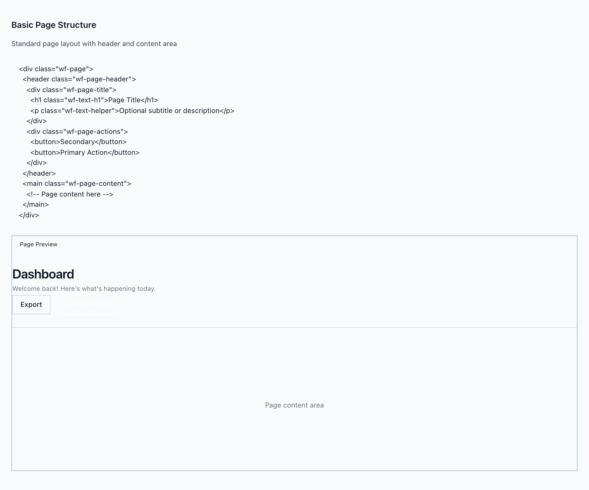
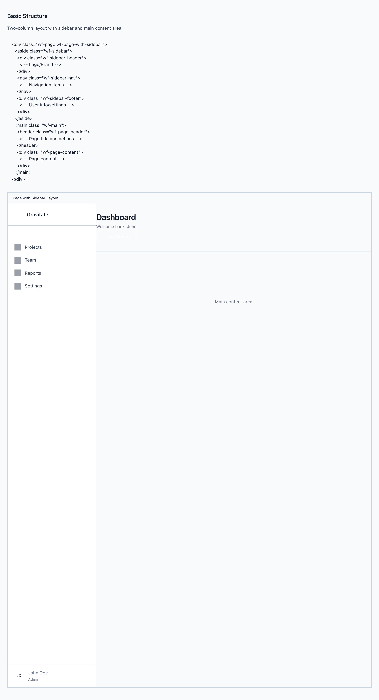

# Page & PageWithSidebar

`wf-page` is the outermost shell every wireframe starts from — a full-height flex column that stacks a `wf-page-header` (title block + actions) over a `wf-page-content` region. Add `wf-page-with-sidebar` and the column becomes a row: a persistent `wf-sidebar` beside a `wf-main` that holds the same header/content pair. These are the two scaffolds DESIGN.md 5.5 funnels every page pattern through.

> Part of the Gravitate Wireframe Design System — lo-fi component reference. Index: `../CLAUDE.md`.

Every wireframe page begins with `wf-page`: a `display: flex; flex-direction: column` container at `min-height: 100vh` that paints `--wf-color-background-subtle` and owns the page font and primary text color. Inside it, the three regions are fixed in role — a `wf-page-header` bar on top, a `wf-page-content` region that takes `flex: 1` and grows to fill the rest.

The header is a `space-between` row: a `wf-page-title` column on the left (h1 + optional `wf-text-helper` subtitle) and a `wf-page-actions` row on the right that pins its buttons with `flex-shrink: 0` so they never wrap under pressure. The header sits on its own `--wf-color-background` surface with a `--wf-color-border` bottom rule, so it reads as chrome above the content.

When the page needs top-level navigation, add `wf-page-with-sidebar` to the same `wf-page` element. That single modifier flips the flex direction to `row`, and you nest a `wf-sidebar` (brand header, scrollable nav, user footer) ahead of a `wf-main` wrapper that carries the header + content pair. `wf-main` is `flex: 1` with `min-width: 0` so a wide grid inside it can't blow out the layout.

### Basic Page Structure



*The canonical scaffold: a wf-page-header (wf-page-title with h1 + subtitle on the left, wf-page-actions on the right) above a wf-page-content region. The header sits on its own white surface with a bottom border; content grows to fill.*

### Page skeleton

```html
<div class="wf-page">
  <header class="wf-page-header">
    <div class="wf-page-title">
      <h1 class="wf-text-h1">Dashboard</h1>
      <p class="wf-text-helper">Welcome back! Here's what's happening today.</p>
    </div>
    <div class="wf-page-actions">
      <button class="wf-button">Export</button>
      <button class="wf-button wf-button-primary">+ New Report</button>
    </div>
  </header>
  <main class="wf-page-content">
    <!-- Page content here -->
  </main>
</div>
```

The title block is a column (h1 stacked on the helper subtitle); the actions block is a non-shrinking row. Omit wf-page-actions entirely for a title-only header.

### Page regions

The page scaffold is a fixed set of regions, not a prop API. Compose them in order — header, then content — and reach for the content padding modifiers when density calls for it.

| Variant | When to use | Code |
| --- | --- | --- |
| `wf-page` | The outermost shell. Full-height flex column on --wf-color-background-subtle. One per page. | `<div class="wf-page">...</div>` |
| `wf-page-header` | The title-and-actions bar. space-between row on its own --wf-color-background surface with a bottom border. | `<header class="wf-page-header">...</header>` |
| `wf-page-title` | The left side of the header: a column holding the h1 and an optional wf-text-helper subtitle (gap --wf-space-1). | `<div class="wf-page-title">   <h1 class="wf-text-h1">Settings</h1>   <p class="wf-text-helper">Manage team members</p> </div>` |
| `wf-page-actions` | The right side of the header: an aligned row of buttons that flex-shrinks to zero so it never wraps. | `<div class="wf-page-actions">   <button class="wf-button">Filter</button>   <button class="wf-button wf-button-primary">+ New Order</button> </div>` |
| `wf-page-content` | The main content region. flex: 1, --wf-space-6 (24px) padding. The default for almost every page. | `<main class="wf-page-content">...</main>` |
| `wf-page-content-tight` | Reduce content padding to --wf-space-4 (16px) for denser, grid-heavy pages. | `<main class="wf-page-content wf-page-content-tight">...</main>` |
| `wf-page-content-spacious` | Loosen content padding to --wf-space-8 (32px) for an onboarding-shaped or marketing surface. | `<main class="wf-page-content wf-page-content-spacious">...</main>` |
| `wf-page-content-none` | Drop content padding to 0 when a full-bleed grid or table owns its own edges. | `<main class="wf-page-content wf-page-content-none">...</main>` |

### Full Example: Dashboard Page


*The scaffold composed into a real page: a header with date-range and download actions over a wf-page-content holding a wf-row of stat cards and a Recent Orders table inside a wf-card.*

### Page with Sidebar Shell



*The two-column app shell: a 256px wf-sidebar (brand header, wf-sidebar-nav, user footer) beside a wf-main that carries the page header and wf-page-content. wf-page-with-sidebar on the wf-page element flips the flex direction to row.*

### Page with sidebar skeleton

```html
<div class="wf-page wf-page-with-sidebar">
  <aside class="wf-sidebar">
    <div class="wf-sidebar-header">
      <!-- Logo / brand -->
    </div>
    <nav class="wf-sidebar-nav">
      <!-- Navigation items -->
    </nav>
    <div class="wf-sidebar-footer">
      <!-- User info / settings -->
    </div>
  </aside>
  <main class="wf-main">
    <header class="wf-page-header">
      <!-- Page title and actions -->
    </header>
    <div class="wf-page-content">
      <!-- Page content -->
    </div>
  </main>
</div>
```

wf-page-with-sidebar lives on the same element as wf-page. The header/content pair moves inside wf-main — it does not sit directly under wf-page anymore.

### Sidebar shell parts

The sidebar is a three-zone column: a fixed-height brand header on top, a scrollable nav in the middle, and a footer pinned to the bottom. Beside it, wf-main wraps the page header and content.

| Variant | When to use | Code |
| --- | --- | --- |
| `wf-page-with-sidebar` | Modifier on wf-page that flips flex-direction to row, turning the page into a two-column shell. | `<div class="wf-page wf-page-with-sidebar">...</div>` |
| `wf-sidebar` | Fixed 256px-wide, full-height navigation column on --wf-color-background with a right border. flex-shrink: 0 so it holds its width. | `<aside class="wf-sidebar">...</aside>` |
| `wf-sidebar-collapsed` | Narrow the sidebar to 64px for an icon-only rail. Pair with wf-sidebar. | `<aside class="wf-sidebar wf-sidebar-collapsed">...</aside>` |
| `wf-sidebar-header` | Brand/logo zone at the top: a fixed 64px-tall row (centered, --wf-space-4 horizontal padding) with a bottom border. | `<div class="wf-sidebar-header">...</div>` |
| `wf-sidebar-nav` | The scrollable middle. flex: 1 with overflow-y: auto and --wf-space-4 padding — nav items and sections live here. | `<nav class="wf-sidebar-nav">...</nav>` |
| `wf-sidebar-footer` | Pinned bottom zone with a top border, for the signed-in user or settings shortcut. | `<div class="wf-sidebar-footer">...</div>` |
| `wf-main` | The right column wrapper. flex: 1, column layout, min-width: 0 to prevent a wide grid from overflowing the shell. Holds the header + content. | `<main class="wf-main">...</main>` |

### Structural tokens

The scaffold's fixed dimensions and surfaces. Padding and gaps come from the spacing scale; never write the literal alongside the token.

| Token | Value | Use for |
| --- | --- | --- |
| `--wf-color-background-subtle` | `page bg` | wf-page background — the muted base the chrome sits on. |
| `--wf-color-background` | `surface bg` | wf-page-header and wf-sidebar background — the chrome reads lighter than the page. |
| `--wf-color-border` | `1px border` | Header bottom rule, sidebar right border, sidebar header/footer dividers (with --wf-border-width). |
| `--wf-color-text-primary` | `primary text` | Default page text color, set on wf-page. |
| `--wf-space-6` | `24px` | wf-page-header padding and the default wf-page-content padding. |
| `--wf-space-4` | `16px` | Header gap, sidebar nav/footer padding, and wf-page-content-tight. |
| `--wf-space-3` | `12px` | Gap between buttons in wf-page-actions. |
| `--wf-space-1` | `4px` | Gap between the h1 and subtitle inside wf-page-title. |
| `(wf-sidebar width)` | `256px` | Fixed sidebar width; collapses to 64px with wf-sidebar-collapsed. |
| `(wf-sidebar-header height)` | `64px` | Fixed brand-zone height — the scaffold's only set-height region. |

### Scaffolding rules

From DESIGN.md 5.5 and the layout source. Start from a scaffold, don't reinvent one.

1. **Start every page from one of the six pattern scaffolds in 5.5 (DashboardLayout, MasterDetailLayout, FormWizard, SettingsPage, DataTablePage, ComparisonMatrix), each built on wf-page.** — If the page doesn't fit one, that's a signal to check whether it's a genuinely new pattern or a variant of an existing one — most of the time it's the latter.
2. **wf-page-with-sidebar is a modifier on wf-page, not a replacement for it.** — It only flips flex-direction to row; the page still needs the wf-page base for height, background, font, and text color.
3. **When you add a sidebar, the header and content move inside wf-main — they no longer sit directly under wf-page.** — wf-main is the flexing right column (min-width: 0) that absorbs a wide grid; putting the header under wf-page instead would stretch it across the sidebar.
4. **Keep wf-page-actions a non-wrapping row of buttons only — no filters or search.** — It carries flex-shrink: 0 so primary actions stay reachable; filtering belongs in a FilterBar inside the content, not the header (4.3).
5. **Reach for the wf-page-content padding modifiers instead of inline padding.** — Default 24px, tight 16px, spacious 32px, none 0 — all on the 8px grid (5.2). A custom value breaks the rhythm.
6. **One wf-page per page and one wf-page-header inside it.** — The scaffold defines a single primary location and title; a second header reads as a second page.

### Do's & Don'ts

- **Do:** <div class="wf-page wf-page-with-sidebar">
  **Don't:** <div class="wf-page-with-sidebar">
  **Why:** wf-page-with-sidebar only sets flex-direction: row. Without wf-page there's no min-height, background, font, or text color — the shell collapses.
- **Do:** Header + content inside wf-main
  **Don't:** Header + content directly under wf-page when a sidebar is present
  **Why:** wf-main is the flex: 1 / min-width: 0 column that sits beside the sidebar. Skip it and the header stretches across the whole row instead of just the content side.
- **Do:** <main class="wf-page-content wf-page-content-tight">
  **Don't:** <main class="wf-page-content" style="padding: 16px">
  **Why:** The modifier already maps to --wf-space-4 (16px) on the grid. The token is the source of truth (2.7); the literal isn't.
- **Do:** Subtitle as <p class="wf-text-helper"> inside wf-page-title
  **Don't:** Subtitle as a second <h1> or a sized <span>
  **Why:** wf-page-title is a column with a --wf-space-1 gap built for an h1 + helper pair; a second heading breaks the type hierarchy.

### Gotchas

- **The sidebar goes fixed-and-hidden on mobile** — At max-width 640px the layout.css moves wf-sidebar to position: fixed; left: -100% and reveals it with the wf-sidebar-open class (left: 0). Below that breakpoint you need a toggle to add wf-sidebar-open, or the nav is off-screen.
- **wf-page-header restacks under 640px** — The same media query flips wf-page-header to flex-direction: column; align-items: stretch and right-aligns wf-page-actions. The title-over-actions stack is automatic — don't fight it with inline flex overrides.
- **Component demos lean on demo-only classes** — Page.html and PageWithSidebar.html render buttons, placeholders, and nav items with page-local helpers (demo-btn, demo-placeholder, demo-nav-item) defined in their inline <style>. Those are scaffolding props for the demo, not part of layout.css — use the real wf- button/nav components in a build.
- **wf-main carries min-width: 0 on purpose** — Without it, a wide table or grid inside wf-page-content forces the flex item past the viewport and the sidebar gets squeezed. Keep min-width: 0 on wf-main when you swap in your own markup.
- **wf-sidebar-header height is locked to 64px** — It's a fixed 64px-tall row (the only fixed-height region in the scaffold; the page header is padding-driven, not a set height). A taller brand lockup will clip or push the divider — scale the logo down rather than growing the header.
