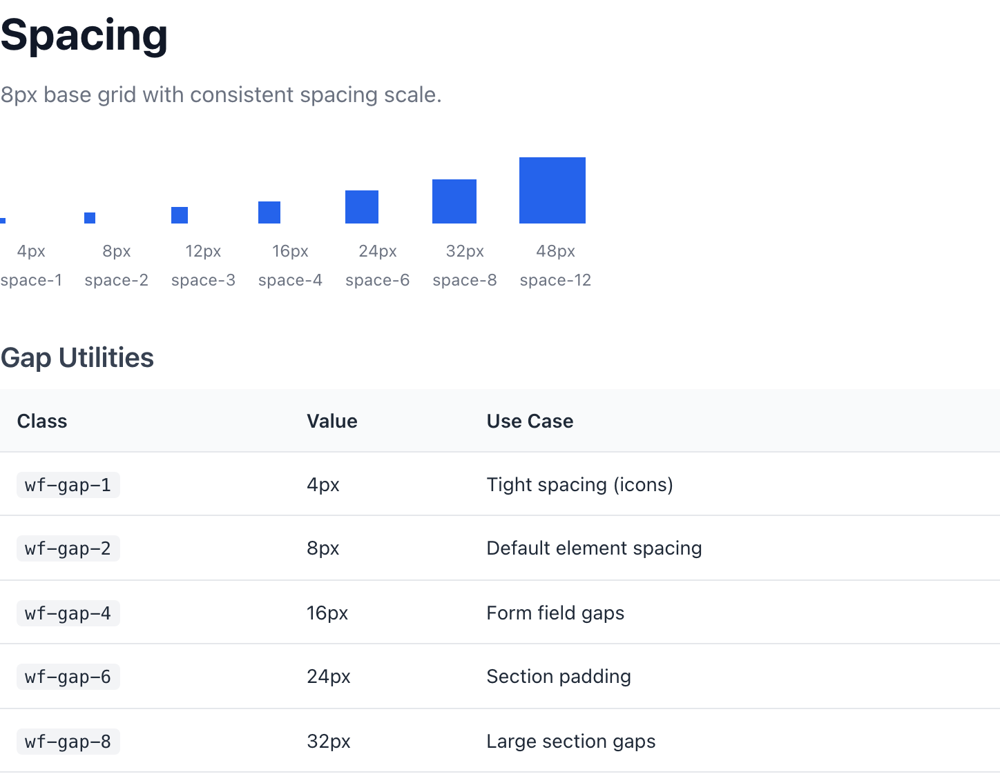
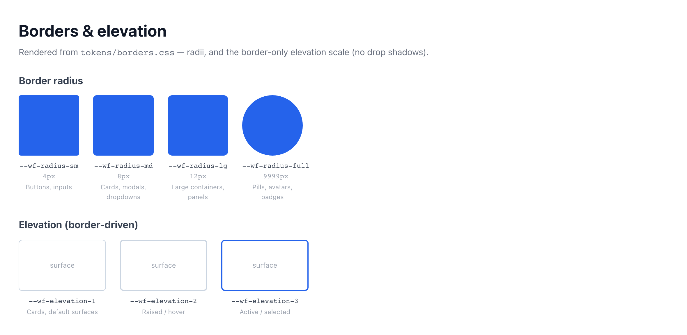

# Spacing, Density & Borders

Spacing in this system is a closed set, not a free dial. Every gap, pad, and margin resolves to one of eleven `--wf-space-*` tokens on an 8px grid, density defaults to compact because the users are analysts who want one more row over one more breath of margin, and visual hierarchy comes from border weight — not blur. There are no 7px gaps here.

> Part of the Gravitate Wireframe Design System — lo-fi component reference. Index: `../CLAUDE.md`.

The spacing scale lives in `tokens/spacing.css` and is built on an 8px base unit (`--wf-space-2`) with a single 4px half-step (`--wf-space-1`) for fine adjustments. Above the base it climbs 12 / 16 / 24 / 32 / 40 / 48 / 64 — every value a multiple of 4. Reach for tokens by name, never by pixel literal; if the number you want isn't in the scale, the answer is one step up or one step down, not a custom value (DESIGN.md §5.2).

Density is the system's posture, not a setting you tune per element. The default is compact: 14px body text, 8px (`--wf-space-stack-sm`) between related rows, 24px (`--wf-space-stack-lg`) between sections. "Comfortable" mode — 16px body, looser stacking — is an explicit opt-in for onboarding-shaped screens, never the default "because it looks cleaner" (DESIGN.md §5.1).

Borders carry hierarchy that a consumer UI would hand to drop shadows. `tokens/borders.css` defines radius, border width, and an elevation system built entirely from solid border weight: 1px for cards, 2px for popovers, 2px primary-colored for modals and focus. Combined with the radius scale and the layered focus ring, this keeps wireframes flat, fast, and legible against any background.

### The 8px grid



*The non-negotiable 8px grid (DESIGN.md §5.2) shown as growing blocks — 4 / 8 / 12 / 16 / 24 / 32 / 48px — beside the wf-gap utility table. 8px (--wf-space-2) is the base unit; 4px (--wf-space-1) is the only half-step.*

### Spacing scale

The full scale from `tokens/spacing.css`. Note the gap: there is no `--wf-space-7`, `-9`, or `-11` — the system jumps from 6 to 8 to 10 to 12 to 16. Component aliases (`--wf-space-card`, `--wf-space-stack-*`, `--wf-space-page-*`, `--wf-space-gutter`) all resolve back into this same scale.

| Token | Value | Use for |
| --- | --- | --- |
| `--wf-space-0` | `0` | No spacing — collapse a gap explicitly. |
| `--wf-space-1` | `4px (0.25rem)` | The only half-step. Tight spacing between inline elements and icon padding. |
| `--wf-space-2` | `8px (0.5rem)` | The base unit. Compact layouts and tight row stacking (--wf-space-stack-sm aliases this). |
| `--wf-space-3` | `12px (0.75rem)` | Small gaps; horizontal input padding (--wf-space-input-x). |
| `--wf-space-4` | `16px (1rem)` | Default padding and form-field gaps. Card padding (--wf-space-card) and default stacking (--wf-space-stack) alias this. |
| `--wf-space-5` | `20px (1.25rem)` | Medium spacing — the in-between step you rarely need. |
| `--wf-space-6` | `24px (1.5rem)` | Section padding and card gutters. Page horizontal padding, grid gutter, and loose stacking all alias this. |
| `--wf-space-8` | `32px (2rem)` | Large gaps and section breaks. Page vertical padding (--wf-space-page-y) aliases this. |
| `--wf-space-10` | `40px (2.5rem)` | Major section spacing. |
| `--wf-space-12` | `48px (3rem)` | Page sections. |
| `--wf-space-16` | `64px (4rem)` | Large section breaks and hero areas. |

### Spacing aliases — density & layout

Semantic spacing tokens that encode intent. Reach for these in component code rather than the raw scale when the meaning matters: `--wf-space-stack-sm` reads as "related rows," not "8px."

| Token | Value | Use for |
| --- | --- | --- |
| `--wf-space-stack-sm` | `8px (= --wf-space-2)` | Vertical rhythm between related rows inside a section (DESIGN.md §5.4). |
| `--wf-space-stack` | `16px (= --wf-space-4)` | Default stacking and form-field gap. |
| `--wf-space-stack-lg` | `24px (= --wf-space-6)` | Loose stacking — between sections. |
| `--wf-space-card` | `16px (= --wf-space-4)` | Default card padding. |
| `--wf-space-card-lg` | `24px (= --wf-space-6)` | Large card padding (comfortable opt-in). |
| `--wf-space-modal` | `24px (= --wf-space-6)` | Modal content padding. |
| `--wf-space-input-x` | `12px (= --wf-space-3)` | Horizontal input padding. |
| `--wf-space-input-y` | `8px (= --wf-space-2)` | Vertical input padding. |
| `--wf-space-page-x` | `24px (= --wf-space-6)` | Page horizontal padding. |
| `--wf-space-page-y` | `32px (= --wf-space-8)` | Page vertical padding. |
| `--wf-space-gutter` | `24px (= --wf-space-6)` | Grid gutter width. |

### Gap utilities

Apply spacing-scale gaps to any flex or grid container with the `wf-gap-*` family from `tokens/utilities.css`. Directional variants exist too — `wf-gap-x-*` for column-gap, `wf-gap-y-*` for row-gap — and the same scale drives `wf-p-*` padding and `wf-mb-*` / `wf-mt-*` margins.

| Variant | When to use | Code |
| --- | --- | --- |
| `wf-gap-1` | Tight spacing — icon-to-label, inline element clusters (4px). | `<div class="wf-flex wf-gap-1"><span class="icon"></span><span>Label</span></div>` |
| `wf-gap-2` | Default element spacing in compact layouts (8px, the base unit). | `<div class="wf-flex wf-gap-2"><button>One</button><button>Two</button></div>` |
| `wf-gap-4` | Form-field gaps and default content separation (16px). | `<div class="wf-flex wf-flex-col wf-gap-4"><input /><input /></div>` |
| `wf-gap-6` | Section padding and card gutters (24px). | `<div class="wf-grid wf-gap-6"><div class="wf-card"></div><div class="wf-card"></div></div>` |
| `wf-gap-8` | Large section gaps and major breaks (32px). | `<div class="wf-flex wf-flex-col wf-gap-8"><section></section><section></section></div>` |

### Borders & elevation



*Radius from 4px (sm) through 50%/--wf-radius-full, and the elevation system built from border weight — 1px for cards, 2px for popovers, 2px primary for modals — plus the layered focus ring.*

### Border radius

The radius scale from `tokens/borders.css`. Match the radius to the component class, not to taste — buttons and inputs are `-sm`, cards and modals are `-md`, panels are `-lg`.

| Token | Value | Use for |
| --- | --- | --- |
| `--wf-radius-none` | `0` | Sharp corners — full-bleed regions, grid cells. |
| `--wf-radius-sm` | `4px (0.25rem)` | Buttons, inputs, and small elements. |
| `--wf-radius-md` | `8px (0.5rem)` | Cards, modals, and dropdowns — the default container radius. |
| `--wf-radius-lg` | `12px (0.75rem)` | Large containers and panels. |
| `--wf-radius-full` | `9999px` | Pills, avatars, and badges — fully rounded. |

### Border width & elevation

Elevation here is border weight, not shadow (`tokens/borders.css`). Higher levels mean thicker — or primary-colored — borders, so hierarchy survives in flat wireframes and against any background. Each elevation value composes the width tokens with `--wf-color-border` / `--wf-color-primary`.

| Token | Value | Use for |
| --- | --- | --- |
| `--wf-border-width` | `1px` | Default border width. |
| `--wf-border-width-2` | `2px` | Emphasis and focus states. |
| `--wf-border-width-3` | `3px` | Strong emphasis. |
| `--wf-elevation-0` | `none` | Flat — inline elements, no separation. |
| `--wf-elevation-1` | `1px solid var(--wf-color-border, #d1d5db)` | Subtle elevation — cards and containers. |
| `--wf-elevation-2` | `2px solid var(--wf-color-border, #d1d5db)` | Medium elevation — dropdowns and popovers. |
| `--wf-elevation-3` | `2px solid var(--wf-color-primary, #2563eb)` | High elevation / focus state — modals and focus rings. |

### Focus ring, dividers & component border aliases

Pre-composed border styles for common patterns, plus the keyboard focus indicator. Use the alias (`--wf-border-card`) over re-deriving the rule — the alias keeps intent legible and updates in one place.

| Token | Value | Use for |
| --- | --- | --- |
| `--wf-focus-ring` | `0 0 0 2px surface, 0 0 0 4px primary (#2563eb)` | Accessible keyboard focus halo — a 2px surface gap then a 4px primary ring, so focus reads against any background (DESIGN.md §6.2). |
| `--wf-focus-ring-offset` | `2px` | Offset focus ring for elements that sit on a background. |
| `--wf-divider` | `1px solid var(--wf-color-border, #d1d5db)` | Horizontal and vertical separators. |
| `--wf-divider-light` | `1px solid var(--wf-color-border-light, #f3f4f6)` | Subtle divider between closely related rows. |
| `--wf-border-input` | `1px solid var(--wf-color-border, #d1d5db)` | Default input border. |
| `--wf-border-input-hover` | `1px solid var(--wf-color-neutral-500, #6b7280)` | Input border on hover. |
| `--wf-border-input-focus` | `2px solid var(--wf-color-primary, #2563eb)` | Input border on focus. |
| `--wf-border-input-error` | `1px solid var(--wf-color-error, #dc2626)` | Input border in a validation-error state (pair with icon + message). |
| `--wf-border-card` | `var(--wf-elevation-1)` | Default card border — 1px solid border. |
| `--wf-border-table` | `var(--wf-divider)` | Table cell and row borders — 1px solid border. |

### Spacing and borders in practice

```html
<!-- A card: --wf-radius-md corner, --wf-elevation-1 border, --wf-space-card padding -->
<div class="wf-card">
  <!-- Related rows stack at --wf-space-stack-sm (8px) -->
  <div class="wf-flex wf-flex-col wf-gap-2">
    <div class="wf-row">Contract 4471</div>
    <div class="wf-row">Contract 4472</div>
  </div>
</div>

<!-- Between sections: --wf-space-stack-lg (24px) -->
<div class="wf-flex wf-flex-col wf-gap-6">
  <section class="wf-card">Summary</section>
  <section class="wf-card">Detail</section>
</div>
```

Every gap, pad, and radius above resolves to a token on the 8px grid. No literal touches the markup.

### The grid & density laws

These are floor requirements, not preferences. A wireframe that breaks one is wrong even if it looks polished.

1. **Every gap, pad, and margin comes from `--wf-space-0` through `--wf-space-16`.** — There are no 7px gaps, no 10px paddings, no 18px margins (DESIGN.md §5.2). If the scale lacks your value, step up or down one — don't invent.
2. **Default to compact: 14px body, 8px between related rows, 24px between sections.** — The users are analysts under time pressure who'd rather see one more row than one more breath of margin (DESIGN.md §5.1, §5.4).
3. **"Comfortable" density is an explicit opt-in, never the default.** — 16px body and looser stacking are for onboarding-shaped screens only — not "because it looks cleaner" (DESIGN.md §5.1).
4. **Tap targets stay 44×44 even at high density.** — Compactness applies to spacing and text, not hit boxes. A button can have `--wf-space-2` visual padding and still meet 44×44 via min-height/min-width (DESIGN.md §5.3).
5. **One region uses one vertical rhythm.** — A page that mixes 3+ different vertical rhythms inside one region is broken (DESIGN.md §5.4).
6. **Reach for the semantic alias over the raw token when meaning matters.** — `--wf-space-stack-sm` reads as "related rows" and `--wf-border-card` as "card edge" — both update in one place and survive a scale change.
7. **Elevation is border weight, not shadow.** — Solid borders keep wireframes flat and fast, and read against any background — that's why focus uses a layered surface+primary ring rather than a blur (DESIGN.md §6.2).

### Do's & Don'ts

- **Do:** gap: var(--wf-space-3)  /* 12px */
  **Don't:** gap: 10px
  **Why:** 10px isn't on the grid. The scale jumps 8 → 12 → 16; pick the nearest token, never a custom literal (DESIGN.md §5.2, §7.6).
- **Do:** Default body at 14px (--wf-text-base)
  **Don't:** Default body at 16px
  **Why:** 16px is the comfortable opt-in. Compact is the house default (DESIGN.md §5.1, §7.6).
- **Do:** min-height: 44px on a compact button
  **Don't:** Shrinking the hit box to match tight padding
  **Why:** Density never touches tap targets — 44×44 is the floor at any density (DESIGN.md §5.3).
- **Do:** border: var(--wf-elevation-1)
  **Don't:** box-shadow: 0 1px 3px rgba(0,0,0,.1)
  **Why:** Hierarchy comes from border weight in this system, not blur. Use the elevation tokens.
- **Do:** var(--wf-border-card)
  **Don't:** 1px solid #d1d5db
  **Why:** The alias encodes intent and tracks the border color token; a hardcoded hex drifts the moment the palette changes (DESIGN.md §2.7).
- **Do:** border-radius: var(--wf-radius-md) on a card
  **Don't:** border-radius: var(--wf-radius-full) on a card
  **Why:** Radius is keyed to component type — `-full` (9999px) is for pills, avatars, and badges, not rectangular containers.

### Gotchas

- **The scale skips 7, 9, and 11** — There is no `--wf-space-7`, `-9`, or `-11`. After `--wf-space-6` (24px) the scale jumps to `-8` (32px), `-10` (40px), `-12` (48px), `-16` (64px). Don't assume an evenly-numbered token exists — check the scale.
- **Aliases are the same value, but not interchangeable in meaning** — `--wf-space-stack` and `--wf-space-card` both resolve to 16px (`--wf-space-4`), and `--wf-space-stack-lg`, `--wf-space-card-lg`, `--wf-space-modal`, `--wf-space-page-x`, and `--wf-space-gutter` all resolve to 24px (`--wf-space-6`). Pick the alias whose name matches the job — they may diverge in value later.
- **Elevation tokens are full border declarations, not just widths** — `--wf-elevation-1` is `1px solid var(--wf-color-border)`, ready to drop into `border:` or `outline:`. `--wf-elevation-3` swaps in `--wf-color-primary`, so it doubles as the focus/modal accent. Don't wrap them in another `Npx solid` — that double-declares.
- **The reference guide labels lg radius as 16px, the token is 12px** — reference-guide.html renders the "lg" radius swatch at 16px for visual contrast, but `--wf-radius-lg` in `tokens/borders.css` is 12px (0.75rem). Trust the token: panels get 12px.
- **Elevation hexes are fallbacks, not the source of truth** — The `#d1d5db` and `#2563eb` literals in the elevation/border tokens are CSS custom-property fallbacks (`var(--wf-color-border, #d1d5db)`). The live color comes from `tokens/colors.css`; the fallback only applies if that variable is missing.
