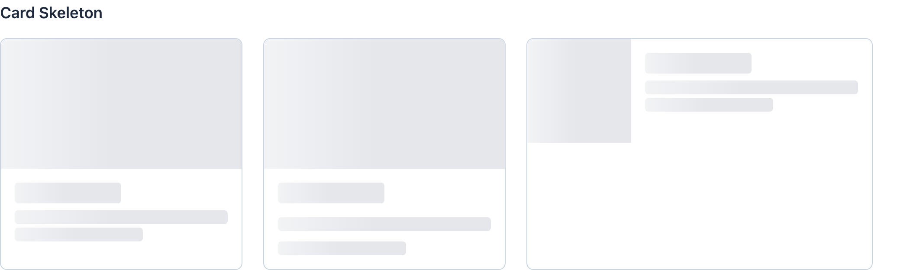
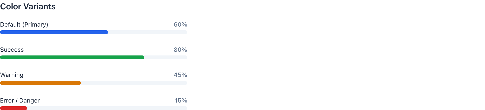
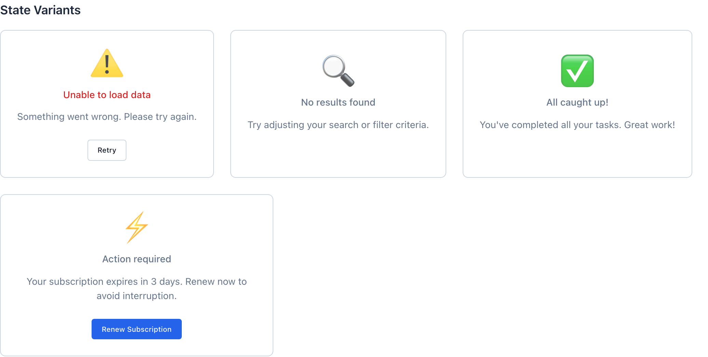

# Progress, Loader, Skeleton & Empty

Four ways to fill the gap when there's nothing real to show yet: `wf-skeleton` mimics the layout that's coming, `wf-loader` spins for short indeterminate waits, `wf-progress` reports a known percent, and `wf-empty-state` says "nothing here" with a way out. Pick by what you know — the shape, the duration, the percent, or the absence (DESIGN.md 4.6).

> Part of the Gravitate Wireframe Design System — lo-fi component reference. Index: `../CLAUDE.md`.

These four components answer the same question — "what do I render when the real content isn't here?" — but the right answer depends on what you know.

If you know the *shape* of what's loading (a table, a card grid, a profile header), use `wf-skeleton`: gray shimmer bars in the eventual layout, so the page doesn't reflow when data lands. If you know the *percent complete* (an upload, a batch import), use `wf-progress`. If you know neither but the wait is short, use `wf-loader` — a spinner. And if there is genuinely *no data*, use `wf-empty-state` with a CTA so the screen isn't a dead end.

All four live in `components/status/status.css` alongside `wf-status-dot` and `wf-status-indicator`. Skeleton, loader-overlay, and empty-state all respect or use the shared `wf-fade-in` / shimmer animations, and skeleton honors `prefers-reduced-motion`.

### 4.6 — which one to reach for

From DESIGN.md 4.6. The decision shortcut: known shape, loading? Skeleton. Unknown shape, short wait? Loader. Determinate progress? Progress. No data? EmptyState (with a CTA).

1. **Use wf-skeleton when content is loading and you can predict its shape.** — Gray bars matching the eventual table rows or card grid keep perceived performance high and prevent layout shift when real data arrives.
2. **Use wf-loader for indeterminate, short-duration waits where you don't know the shape of what's coming.** — A spinner says "working" without promising a layout. Don't spin for more than a few seconds — beyond that, switch to Progress.
3. **Use wf-progress for determinate operations where you can show percent complete — file upload, batch reconciliation, multi-step import.** — A bar that crawls from 0 to 100% sets expectations a spinner can't; long waits need a sense of how long.
4. **Use wf-empty-state for "there's no data here yet," and always pair it with a primary action.** — An "Add your first contract" button turns a dead end into a next step.

### Skeleton — card placeholder

*A card-shaped skeleton: image block over heading and text bars. Use when the layout is known and content is loading in place — the shimmer reserves the exact space the real card will occupy.*

### Skeleton shapes

Every skeleton starts with the base `wf-skeleton` class (the shimmering gradient) plus one shape modifier. Compose them inside a `wf-skeleton-card`, `wf-skeleton-table-row`, or `wf-skeleton-list-item` container to mirror the eventual layout.

| Variant | When to use | Code |
| --- | --- | --- |
| `wf-skeleton-text` | A single line of body copy (16px tall). Add wf-skeleton-text-short for 60% width or wf-skeleton-text-xs for 30%. | `

 

` |
| `wf-skeleton-heading` | A title bar — taller (24px) and half-width. wf-skeleton-heading-lg is 32px / 40%. | `

` |
| `wf-skeleton-rect` | An image or media block; set explicit width/height inline. | `

` |
| `wf-skeleton-avatar` | A round avatar. -sm is 32px, base is 40px, -lg is 56px; wf-skeleton-circle takes a custom size. | `

` |
| `wf-skeleton-card` | A pre-composed card shell — pairs with wf-skeleton-card-image (150px) and wf-skeleton-card-body. | `
   

   
     

     

   
 
` |
| `wf-skeleton-table-row` | A loading table row — flexed columns; first child auto-rounds into an avatar circle. | `
   

   

   

 
` |

### Loader — spinner with text

*An indeterminate spinner with a label. Use for blocking waits of unknown duration — but if it spins longer than a few seconds, you wanted Progress instead.*

### Loader modifiers

A `wf-loader` wraps a `wf-loader-spinner` and an optional `wf-loader-text`. Default layout is vertical (spinner over text); modifiers change size, color, direction, and placement.

| Variant | When to use | Code |
| --- | --- | --- |
| `wf-loader (base)` | Default medium (24px) spinner, primary blue, vertical stack. | `
      Loading... 
` |
| `wf-loader-horizontal` | Spinner and text side by side instead of stacked. | `
      Loading... 
` |
| `wf-loader-sm / wf-loader-lg` | 16px (sm) or 40px (lg) spinner; text scales to match. | `
      Loading data... 
` |
| `wf-loader-success / -warning / -error` | Recolors the spinner's top arc to the semantic color. Rare — most loaders stay primary. | `
    
` |
| `wf-loader-inverse` | White spinner for dark backgrounds and overlays. | `
    
` |
| `wf-loader-inline` | Drop a spinner mid-sentence; pairs with wf-loader-sm + wf-loader-horizontal. | `Saving changes     ` |
| `wf-loader-overlay` | Fullscreen blocking wait — fixed, dimmed scrim, centered loader card. | `
   
          Loading data...   
 
` |

### Progress — color variants

*Determinate bars in default, success, warning, and danger. Use only when percent-complete is genuinely known; drive the bar by setting wf-progress-fill's inline width.*

### Progress modifiers

A `wf-progress` holds an optional `wf-progress-label` (description + percent) and a `wf-progress-bar` with a `wf-progress-fill`. Percent is set by the fill's inline `width`. Modifiers go on the outer `wf-progress`.

| Variant | When to use | Code |
| --- | --- | --- |
| `wf-progress (base)` | Labeled medium (8px) primary bar; set width on the fill. | `
   
     Volume Fulfilled75%   
   
     

   
 
` |
| `wf-progress-success / -warning / -error` | Recolors the fill green / amber / red. error is aliased "Error / Danger". | `
   
     

   
 
` |
| `wf-progress-sm / wf-progress-lg` | Bar height 4px (sm) or 12px (lg); default is 8px. | `
 ... 
` |
| `wf-progress-bar-only` | Hides the label row entirely — just the bar (e.g. inside a file-upload card). | `
   
     

   
 
` |
| `wf-progress-indeterminate` | When the percent is genuinely unknown but you still want a bar — forces a 30% sliver that sweeps across. (Usually prefer a loader here.) | `
   
     

   
 
` |

### EmptyState — variants

*No-results, error, success, and warning treatments — each an icon, title, description, and action. Use when there is genuinely nothing to show (DESIGN.md 4.6), and pair with a CTA.*

### EmptyState anatomy & variants

A `wf-empty-state` centers a `wf-empty-state-icon` (emoji or `wf-empty-state-icon-container` for an SVG), a `wf-empty-state-title`, a `wf-empty-state-description`, and one or more actions. Semantic and sizing modifiers go on the outer element.

| Variant | When to use | Code |
| --- | --- | --- |
| `wf-empty-state (base)` | The default "no data yet" state — icon, title, description, primary CTA. | `
   
📋
   <h3 class="wf-empty-state-title">No contracts found</h3>   
Create your first contract to get started.
   <button class="wf-button wf-button-primary">Create Contract</button> 
` |
| `wf-empty-state-search` | No results from a search/filter — neutral icon, no CTA (the fix is changing the query). | `
   
🔍
   <h3 class="wf-empty-state-title">No results found</h3>   
Try adjusting your search or filter criteria.
 
` |
| `wf-empty-state-error` | A load failure — recolors the icon and title to danger; pair with a Retry. | `
   
⚠️
   <h3 class="wf-empty-state-title">Unable to load data</h3>   <button class="wf-button wf-button-secondary">Retry</button> 
` |
| `wf-empty-state-success / -warning` | "All caught up" (success, green icon) or "action required" (warning, amber icon). | `
   
✅
   <h3 class="wf-empty-state-title">All caught up!</h3> 
` |
| `wf-empty-state-actions` | Two or more buttons — wraps and centers them with consistent gap. | `
   <button class="wf-button wf-button-primary">Generate Report</button>   <button class="wf-button wf-button-secondary">Import Data</button> 
` |
| `wf-empty-state-compact / -inline` | Compact shrinks to 120px min-height for sidebars/cards; inline drops the min-height for tables. | `
   
🔔
   <h3 class="wf-empty-state-title">No notifications</h3> 
` |
| `wf-empty-state-bordered` | Drop zones — a dashed border and tinted background that read as "put something here." | `
   
📤
   <h3 class="wf-empty-state-title">Drop files here</h3>   <button class="wf-button wf-button-secondary">Browse Files</button> 
` |

### Status tokens

Status-specific tokens declared at the top of status.css, plus the shared color/radius tokens these components resolve against. Hex values shown are the in-file fallbacks.

| Token | Value | Use for |
| --- | --- | --- |
| `--wf-progress-height-sm / -md / -lg` | `4px / 8px / 12px` | Progress bar thickness; md is the default. |
| `--wf-loader-size-sm / -md / -lg` | `16px / 24px / 40px` | Spinner diameter; md is the default. |
| `--wf-skeleton-base` | `var(--wf-color-gray-200, #e5e7eb)` | The resting gray of a skeleton bar (and the still color under reduced-motion). |
| `--wf-skeleton-highlight` | `var(--wf-color-gray-100, #f3f4f6)` | The lighter band that sweeps across in the shimmer gradient. |
| `--wf-empty-state-icon-size` | `48px` | Default emoji icon size; compact drops it to 32px. |
| `--wf-color-primary` | `#2563eb` | Default progress fill and spinner top-arc color. |
| `--wf-color-success / -warning / -danger` | `#16a34a / #d97706 / #dc2626` | The success / warning / error variant colors across all four components. |

### Gotchas

- **Progress percent is inline width, not a class** — There's no wf-progress-75 modifier — you set width on the .wf-progress-fill element directly (style="width: 75%"). The fill animates from 0 via the wf-progress-fill keyframe and eases width changes over 200ms.
- **Indeterminate progress hard-locks the width** — .wf-progress-indeterminate .wf-progress-fill sets width: 30% !important and sweeps via translateX. Any inline width you set is ignored — that's intentional, but it means you can't half-convert a determinate bar.
- **The first cell of a skeleton table row auto-becomes a circle** — .wf-skeleton-table-row .wf-skeleton:first-child is forced to flex: 0 0 40px and full radius — it's treated as an avatar slot. If your first column isn't an avatar, restructure the row rather than fighting the selector.
- **Skeleton card image keeps square corners** — .wf-skeleton-card-image is border-radius: 0 so it sits flush against the rounded card top. If you build a card by hand with wf-skeleton-rect instead, add border-radius: 0 yourself or the corners won't line up.
- **Search empty state has no CTA on purpose** — DESIGN.md 4.6 says always pair EmptyState with an action — but wf-empty-state-search omits it because the user's action is editing the query, not clicking a button. Don't bolt a CTA onto a no-results state.
- **Reduced motion stops skeletons but not spinners** — @media (prefers-reduced-motion: reduce) flattens wf-skeleton to a static gray, but the loader spinner and progress sweep keep animating. If full motion-reduction matters for a prototype, disable those yourself.
