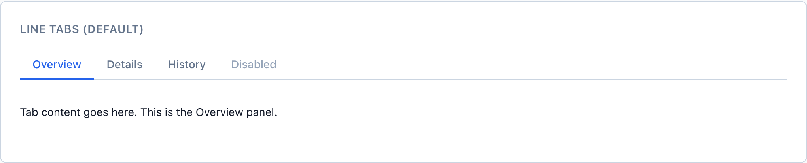
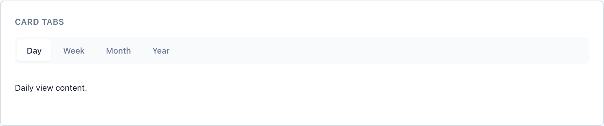
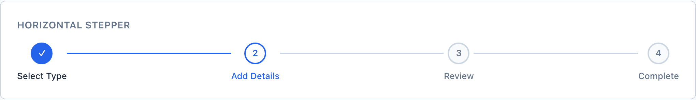
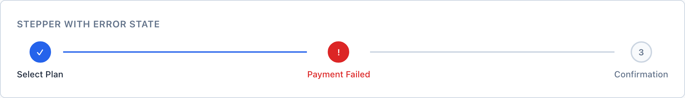

# Tabs & Stepper

Tabs and Stepper look alike — a row of labels with one highlighted — but they answer opposite questions. `wf-tabs` switches between peer views the user can visit in any order; `wf-stepper` tracks ordered, gated progress through a flow with one correct path. Picking the wrong one quietly lies to the user about whether the order matters.

> Part of the Gravitate Wireframe Design System — lo-fi component reference. Index: `../CLAUDE.md`.

Reach for `wf-tabs` when you're switching between *peer views of the same thing* — "Overview / Details / History" on a contract record. Every tab is equally valid and the user can move between them freely, in any order. No tab is a prerequisite for another.

Reach for `wf-stepper` when the user is moving through an *ordered, gated progression* — "Select Type → Add Details → Review → Complete." There is a single correct path, steps generally can't be skipped, and each step carries a completion state (pending, active, completed, error). Stepper is the navigation half of the `FormWizard` page pattern.

The test is order. If the sequence is meaningful and gated, it's a Stepper. If the user should be able to jump straight to the third item without touching the first two, it's Tabs. When you're tempted to use Tabs for an ordered flow, you want a Stepper; when you're tempted to use a Stepper for free navigation, you want Tabs.

### Line Tabs (default)



*The default `wf-tabs wf-tabs-line` style: peer views with a 2px primary underline marking the active tab. Muted resting labels, a darker hover, and a disabled tab that drops to text-disabled.*

### Card Tabs



*`wf-tabs-card` swaps the underline for a sunken tab strip where the active tab reads as a raised white card with a small shadow, joined to its panel.*

### Tabs variants

Style modifiers go on the `wf-tabs` wrapper; the active state is `wf-tab-active` on the button, and `disabled` is the native HTML attribute. The wrapper holds a `wf-tabs-list` of `wf-tab` buttons plus a `wf-tabs-content` panel.

| Variant | When to use | Code |
| --- | --- | --- |
| `wf-tabs-line` | Default. Peer views with a 2px underline on the active tab — the everyday choice for record sub-views. | `<div class="wf-tabs wf-tabs-line">   <div class="wf-tabs-list">     <button class="wf-tab wf-tab-active">Overview</button>     <button class="wf-tab">Details</button>     <button class="wf-tab">History</button>     <button class="wf-tab" disabled>Disabled</button>   </div>   <div class="wf-tabs-content">     <p>The Overview panel.</p>   </div> </div>` |
| `wf-tabs-card` | The active tab reads as a raised card on a sunken strip. Use when tabs sit directly atop the content they control, like a date-range switcher. | `<div class="wf-tabs wf-tabs-card">   <div class="wf-tabs-list">     <button class="wf-tab wf-tab-active">Day</button>     <button class="wf-tab">Week</button>     <button class="wf-tab">Month</button>   </div>   <div class="wf-tabs-content">...</div> </div>` |
| `wf-tabs-pill` | Rounded pills with a solid primary fill on the active tab. Best for compact in-content filters — "All / Active / Archived." | `<div class="wf-tabs wf-tabs-pill">   <div class="wf-tabs-list">     <button class="wf-tab wf-tab-active">All</button>     <button class="wf-tab">Active</button>   </div>   <div class="wf-tabs-content">...</div> </div>` |
| `wf-tabs-vertical` | Lays the tab list down the left with a right-edge active marker. Use for settings-style screens with many peer sections. | `<div class="wf-tabs wf-tabs-vertical">   <div class="wf-tabs-list">     <button class="wf-tab wf-tab-active">General</button>     <button class="wf-tab">Security</button>   </div>   <div class="wf-tabs-content">...</div> </div>` |
| `wf-badge in a tab` | Count indicator on a tab label. Drop a `wf-badge wf-badge-sm` (optionally `-secondary` / `-success`) inside the button after the label. | `<button class="wf-tab">   Pending <span class="wf-badge wf-badge-sm">12</span> </button>` |

### Horizontal Stepper



*`wf-stepper` showing sequential progress: a completed step (filled primary circle with a check), the active step (white circle, primary ring and number), and pending steps (muted outlined circles). Connectors turn primary once the step before them is complete.*

### Stepper with error state



*`wf-step-error` renders a failed step as a filled danger circle with a "!" indicator and a danger label, sitting between a completed step and the remaining pending steps.*

### Stepper step states

State classes go on each `wf-step`. A step holds a `wf-step-indicator` (number, check, or "!") and a `wf-step-label`, with `wf-step-connector` divs between steps. Mark the connector after a finished step `wf-step-connector-completed` so the progress line fills in.

| Variant | When to use | Code |
| --- | --- | --- |
| `wf-step (default)` | A pending step the user hasn't reached. Muted outlined circle with the step number. | `<div class="wf-step">   <span class="wf-step-indicator">3</span>   <span class="wf-step-label">Review</span> </div>` |
| `wf-step-active` | The step the user is on. White fill, primary border and number, primary label — the Stepper's equivalent of `wf-tab-active`. | `<div class="wf-step wf-step-active">   <span class="wf-step-indicator">2</span>   <span class="wf-step-label">Add Details</span> </div>` |
| `wf-step-completed` | A finished step. Solid primary circle with a check (✓). Pair with `wf-step-connector-completed` on the connector that follows it. | `<div class="wf-step wf-step-completed">   <span class="wf-step-indicator">✓</span>   <span class="wf-step-label">Select Type</span> </div>` |
| `wf-step-error` | A failed step that needs attention — "Payment Failed." Solid danger circle with a "!" and a danger label. | `<div class="wf-step wf-step-error">   <span class="wf-step-indicator">!</span>   <span class="wf-step-label">Payment Failed</span> </div>` |
| `wf-step-connector-completed` | The connector between two steps after the earlier one is done. Turns the line from border-gray to primary so progress reads at a glance. | `<div class="wf-step-connector wf-step-connector-completed"></div>` |

### Stepper layout modifiers

Layout modifiers go on the `wf-stepper` wrapper.

| Variant | When to use | Code |
| --- | --- | --- |
| `wf-stepper-vertical` | Stacks steps top-to-bottom with vertical connectors. Wrap label + description in a `wf-step-content` div. Good for order-tracking timelines. | `<div class="wf-stepper wf-stepper-vertical">   <div class="wf-step wf-step-completed">     <span class="wf-step-indicator">✓</span>     <div class="wf-step-content">       <span class="wf-step-label">Order Placed</span>       <span class="wf-step-description">Your order has been received</span>     </div>   </div>   <div class="wf-step-connector wf-step-connector-completed"></div>   ... </div>` |
| `wf-stepper-compact` | Shrinks indicators to 24px and labels to 11px for tight headers and breadcrumb-height progress bars. | `<div class="wf-stepper wf-stepper-compact">   ... </div>` |
| `wf-step-description` | Optional sub-label under a step's title — "Add payment method." Add as a third span (or inside `wf-step-content` when vertical). | `<div class="wf-step wf-step-active">   <span class="wf-step-indicator">3</span>   <span class="wf-step-label">Payment</span>   <span class="wf-step-description">Add payment method</span> </div>` |

### Tokens these components reach for

Both components draw their active/complete signal from the same primary token, and the Stepper error from danger — semantic intent, never decoration (see DESIGN §3.1). All values below are the fallbacks declared inline in `navigation.css`.

| Token | Value | Use for |
| --- | --- | --- |
| `--wf-color-primary` | `#2563eb` | Active tab underline/fill, completed and active step rings, the filled progress connector — the "you are here / done" signal across both components. |
| `--wf-color-danger` | `#dc2626` | `wf-step-error` indicator fill and label. The only non-primary status color either component uses. |
| `--wf-color-text-muted` | `#64748b` | Resting tab labels and pending step labels/indicators. |
| `--wf-color-text-disabled` | `#94a3b8` | Disabled tab text and step descriptions. |
| `--wf-color-border` | `#cbd5e1` | Tabs-list bottom border, pending step-indicator border, and the unfilled connector line. |
| `--wf-color-bg-hover` | `#f8fafc` | Sunken strip behind Card tabs and the pending step-indicator fill. |
| `--wf-radius-full` | `9999px` | Pill-tab corners and the round step indicators. |
| `--wf-transition-fast` | `150ms ease` | Tab color/state and step-indicator transitions. |

### Tabs — peer views

```html
<!-- Line tabs: equally-valid views, any order -->
<div class="wf-tabs wf-tabs-line">
  <div class="wf-tabs-list">
    <button class="wf-tab wf-tab-active">Overview</button>
    <button class="wf-tab">Details</button>
    <button class="wf-tab">History</button>
    <button class="wf-tab" disabled>Disabled</button>
  </div>
  <div class="wf-tabs-content">
    <!-- Active tab content -->
  </div>
</div>
```

The active button carries `wf-tab-active`; switching tabs swaps which button has it and which panel renders in `wf-tabs-content`.

### Stepper — gated progression

```html
<!-- Completed → active → pending, with a filled connector behind the done step -->
<div class="wf-stepper">
  <div class="wf-step wf-step-completed">
    <span class="wf-step-indicator">✓</span>
    <span class="wf-step-label">Select Type</span>
  </div>
  <div class="wf-step-connector wf-step-connector-completed"></div>
  <div class="wf-step wf-step-active">
    <span class="wf-step-indicator">2</span>
    <span class="wf-step-label">Add Details</span>
  </div>
  <div class="wf-step-connector"></div>
  <div class="wf-step">
    <span class="wf-step-indicator">3</span>
    <span class="wf-step-label">Review</span>
  </div>
</div>
```

Completed steps show ✓ and a filled connector; the active step shows its number in a primary ring; pending steps stay muted. This is the header of the FormWizard page pattern.

### Tabs vs. Stepper — the navigation choice (DESIGN §4.4)

From the component decision tree. Peer views? Tabs. Ordered path? Stepper.

1. **Use Tabs only for peer views of the same thing, freely navigable in any order.** — Tabs signal that every view is equally valid and order doesn't matter — that's the contract users read from the shape.
2. **Use Stepper only for ordered, gated progression with a single correct path and per-step completion state.** — A Stepper promises sequence and gating. Steps generally can't be skipped, and each one tracks pending / active / completed / error.
3. **If you're tempted to use Tabs for an ordered flow, you want a Stepper.** — Tabs let users jump ahead and skip prerequisites — exactly what a gated flow must prevent.
4. **If you're tempted to use a Stepper for free navigation, you want Tabs.** — A Stepper's completion states and gating imply rules that don't exist for peer views, confusing the user about what's required.
5. **Don't reach for Tabs or Stepper for top-level location — that's Sidebar — or for hierarchy crumbs — that's Breadcrumb.** — Tabs and Stepper are in-page navigation; Sidebar answers "where am I in the app" and Breadcrumb answers "where am I in the tree."

### Do's & Don'ts

- **Do:** Tabs for "Overview / History / Settings" on one record
  **Don't:** Tabs for "Configure → Review → Submit"
  **Why:** An ordered, gated flow is a Stepper (DESIGN §4.4 / §7.5). Tabs would let users skip straight to Submit.
- **Do:** Stepper for "Select Type → Add Details → Review → Complete"
  **Don't:** Stepper for free-to-browse settings panels
  **Why:** Completion states and gating imply a required sequence that doesn't exist for peer views — use `wf-tabs-vertical` instead.
- **Do:** `<button class="wf-tab wf-tab-active">` for the current tab
  **Don't:** Styling the active tab with primary color by hand
  **Why:** `wf-tab-active` already applies `--wf-color-primary` to text and the underline; hand-rolling it drifts from the token contract (DESIGN §2.7).
- **Do:** Mark finished connectors with `wf-step-connector-completed`
  **Don't:** Leaving every connector gray while steps complete
  **Why:** The filled connector is the at-a-glance progress signal; without it the Stepper looks stalled even as steps complete.
- **Do:** Reserve `wf-step-error` for an actual failed step
  **Don't:** Using the danger color to make a step "stand out"
  **Why:** Status color is reserved for status (DESIGN §3.1) — a decorative red step reads as a failure that isn't there.

### Gotchas

- **Tabs and Stepper are static markup, not stateful widgets** — Nothing in `navigation.css` wires click-to-switch. `wf-tab-active`, `wf-step-active`, and `wf-step-completed` are presentational classes you move by hand (or via prototype JS). The library renders the state; it doesn't manage it.
- **The completed connector is a separate element you must flip** — `wf-step-connector` defaults to the gray border color. It only turns primary when you also add `wf-step-connector-completed` — and that class lives on the connector div, not on the step before it. Forget it and progress won't read.
- **Vertical steppers need a wrapping wf-step-content** — In `wf-stepper-vertical`, the label and description sit in a `wf-step-content` div beside the indicator (the horizontal layout stacks them as bare sibling spans). Swapping layout means restructuring the step's children, not just the wrapper class.
- **The step indicator's glyph is content, not derived** — The ✓ for completed, the number for active/pending, and the "!" for error are literal text inside `wf-step-indicator` — the state class only colors the circle. Set the matching glyph yourself when you change a step's state.
- **Card and pill tabs drop the underline entirely** — `wf-tabs-line` is the only variant that uses the bottom border; `wf-tabs-card`, `wf-tabs-pill`, and `wf-tabs-vertical` each zero out `border-bottom` and signal the active tab a different way (raised card, solid pill, right-edge marker). Don't expect an underline outside the line variant.
