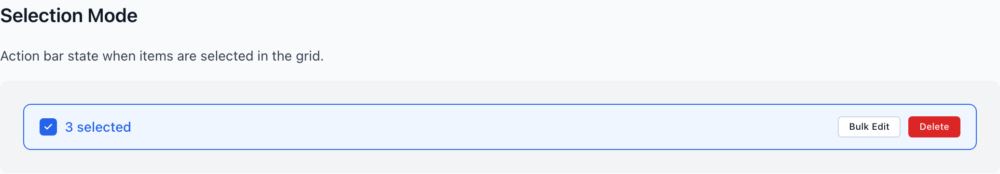
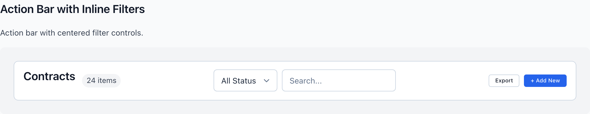
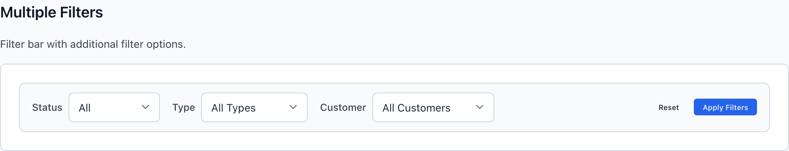
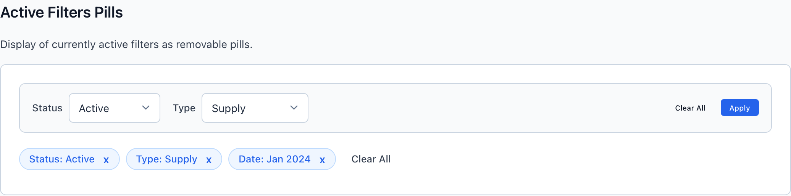

# ActionBar & FilterBar

Two horizontal bars sit above a grid and they do opposite jobs. `wf-action-bar` carries verbs — the actions that operate on the collection or a selection. `wf-filter-bar` carries predicates — the controls that narrow what's shown. When a single record needs a single action, neither bar is the answer: drop an inline button next to it.

> Part of the Gravitate Wireframe Design System — lo-fi component reference. Index: `../CLAUDE.md`.

The toolbar decision is a verb-vs-noun split (DESIGN.md 4.3). If the control changes *what the user can do* to the data, it belongs in an `wf-action-bar`. If it changes *what data is shown*, it belongs in a `wf-filter-bar`. If it touches exactly one record, it's an inline button living next to that record — not a bar at all.

`wf-action-bar` is a three-zone flexbox: `wf-action-bar-left` (title + count), an optional `wf-action-bar-center`, and `wf-action-bar-right` (the buttons). It space-betweens its zones, sits on a white surface with a `--wf-color-border` outline, and is where bulk verbs — Export, Bulk Edit, Delete — live. Add `wf-action-bar-selection` when rows are checked: the bar flips to a blue `#eff6ff` fill with a `--wf-color-primary` border so the selection context is unmistakable.

`wf-filter-bar` is the query surface. It groups `wf-filter-item` controls (a `wf-filter-label` + a `wf-select`/`wf-input`) on the left and keeps its own quiet actions — Clear All, Apply — pinned right in `wf-filter-bar-actions`. It reads on a muted `--wf-color-neutral-50` ground so it recedes behind the grid it governs. Applied filters echo below as dismissible `wf-active-filter` pills.

### ActionBar — Selection Mode



*wf-action-bar-selection flips the bar to a blue eff6ff fill with a primary border. The left zone swaps the title for a checkbox + '3 selected' count; the right zone surfaces contextual Bulk Edit and a danger-flagged Delete.*

### ActionBar — Title + Inline Filters



*The full three-zone layout: title and count on the left, a lightweight wf-action-bar-filters group centered, and Export + primary Add New pinned right.*

### ActionBar structure & variants

wf-action-bar is the wrapper; the three zone classes are the layout contract. Modifier classes stack on the wrapper.

| Variant | When to use | Code |
| --- | --- | --- |
| `wf-action-bar` | The default bar above a grid or list. Three zones, space-between, white surface with a 1px border and 8px radius. Holds verbs only. | `<div class="wf-action-bar">   <div class="wf-action-bar-left">     <h2 class="wf-action-bar-title">Contracts</h2>     <span class="wf-action-bar-count">24 items</span>   </div>   <div class="wf-action-bar-right">     <button class="wf-button wf-button-secondary wf-button-sm">Export</button>     <button class="wf-button wf-button-primary wf-button-sm">+ Add New</button>   </div> </div>` |
| `wf-action-bar-selection` | Rows are selected. Repaints the bar #eff6ff with a --wf-color-primary border; left zone shows a checkbox + selected count, right zone shows bulk verbs. | `<div class="wf-action-bar wf-action-bar-selection">   <div class="wf-action-bar-left">     <label class="wf-checkbox"><input type="checkbox" class="wf-checkbox-input" checked><span class="wf-checkbox-box"></span></label>     <span style="font-weight: 500; color: var(--wf-color-primary);">3 selected</span>   </div>   <div class="wf-action-bar-right">     <button class="wf-button wf-button-secondary wf-button-sm">Bulk Edit</button>     <button class="wf-button wf-button-danger wf-button-sm">Delete</button>   </div> </div>` |
| `wf-action-bar-center` | You need lightweight inline controls (a status select, a search box) between the title and the actions. Wrap them in wf-action-bar-filters. This is NOT a substitute for a real FilterBar. | `<div class="wf-action-bar-center">   <div class="wf-action-bar-filters">     <select class="wf-select wf-select-sm" style="width: auto;"><option>All Status</option></select>     <input type="search" class="wf-input wf-input-sm" placeholder="Search..." style="width: 200px;">   </div> </div>` |
| `wf-action-bar-compact` | Tighter layouts — drops padding from 12px 16px to 8px 12px. | `<div class="wf-action-bar wf-action-bar-compact">...</div>` |
| `wf-action-bar-borderless` | The bar sits flush above table content — drops the full border and radius, keeping only a 1px bottom divider. | `<div class="wf-action-bar wf-action-bar-borderless">...</div>` |
| `wf-action-bar-sticky` | The bar must stay visible while the grid scrolls. Adds position: sticky; top: 0; z-index: 10. | `<div class="wf-action-bar wf-action-bar-sticky">...</div>` |

### FilterBar — Multiple Filters



*wf-filter-bar on its muted neutral-50 ground. Each wf-filter-item pairs a wf-filter-label with a wf-select; Reset + Apply Filters stay pinned right in wf-filter-bar-actions.*

### FilterBar structure & variants

wf-filter-bar holds a wf-filter-bar-filters group (the predicates) and a wf-filter-bar-actions group (Clear All, Apply). Each predicate is a wf-filter-item.

| Variant | When to use | Code |
| --- | --- | --- |
| `wf-filter-bar` | The default query bar above a grid. Muted --wf-color-neutral-50 ground, 1px border, 8px radius; filters left, actions right. | `<div class="wf-filter-bar">   <div class="wf-filter-bar-filters">     <div class="wf-filter-item">       <label class="wf-filter-label">Status</label>       <select class="wf-select wf-select-sm" style="width: 140px;"><option>All</option></select>     </div>   </div>   <div class="wf-filter-bar-actions">     <button class="wf-button wf-button-ghost wf-button-sm">Clear All</button>     <button class="wf-button wf-button-primary wf-button-sm">Apply</button>   </div> </div>` |
| `wf-filter-item` | One predicate: a wf-filter-label paired with a control. A bare span inside it (e.g. 'to' between two dates) renders as tertiary-gray helper text. | `<div class="wf-filter-item">   <label class="wf-filter-label">Date Range</label>   <input type="date" class="wf-input wf-input-sm" style="width: 140px;">   <span>to</span>   <input type="date" class="wf-input wf-input-sm" style="width: 140px;"> </div>` |
| `wf-filter-bar-inline` | A minimal filter bar with no chrome — drops the background, border, and radius and tightens padding to 8px 12px. For 'Show / Sort by' style row controls. | `<div class="wf-filter-bar wf-filter-bar-inline">...</div>` |
| `wf-filter-bar-vertical` | Narrow columns or filter sidebars — stacks filters in a column and space-betweens each label/control pair. | `<div class="wf-filter-bar wf-filter-bar-vertical">...</div>` |

### FilterBar — Active Filter Pills



*Applied filters echo below the bar as wf-active-filter pills, each with a wf-active-filter-remove dismiss button, closed by a wf-clear-filters text button. Keeps the active query state visible (DESIGN.md 4.3 toolbar choice).*

### Active filter pills

wf-active-filters is a standalone wrapping row that surfaces the applied query. It can sit directly under a wf-filter-bar or live on its own.

| Variant | When to use | Code |
| --- | --- | --- |
| `wf-active-filters` | The wrapping container for applied-filter pills. Wraps to multiple lines; commonly closed by a wf-clear-filters button. | `<div class="wf-active-filters">   <span class="wf-active-filter">Status: Active <button class="wf-active-filter-remove">x</button></span>   <span class="wf-active-filter">Type: Supply <button class="wf-active-filter-remove">x</button></span>   <button class="wf-clear-filters">Clear All</button> </div>` |
| `wf-active-filter` | One applied filter as a rounded blue pill (#eff6ff fill, #bfdbfe border, primary text). Asymmetric padding leaves room for the remove button on the right. | `<span class="wf-active-filter">Customer: Acme Corp <button class="wf-active-filter-remove">x</button></span>` |
| `wf-active-filter-remove` | The dismiss control inside a pill. An 18px round button; on hover it inverts to a solid --wf-color-primary fill with white glyph. | `<button class="wf-active-filter-remove">x</button>` |
| `wf-clear-filters` | The 'reset everything' affordance at the end of the pill row. A borderless text button; often carries a count, e.g. 'Clear All (4)'. | `<button class="wf-clear-filters">Clear All (4)</button>` |

### Bar surfaces & accents

The two bars are differentiated by their ground color, and the selection/pill blues are literal hexes baked into the CSS rather than tokens — match them exactly.

| Token | Value | Use for |
| --- | --- | --- |
| `background-color` | `#ffffff` | wf-action-bar resting surface — white, so the verb bar reads as foreground. |
| `--wf-color-neutral-50` | `#f9fafb` | wf-filter-bar ground — muted, so the query bar recedes behind the grid. |
| `background-color` | `#eff6ff` | Selection-mode fill (wf-action-bar-selection) AND the wf-active-filter pill fill. |
| `--wf-color-primary` | `#2563eb` | Selection-mode border, selected-count text, active-filter pill text, and the remove-button glyph. |
| `border` | `#bfdbfe` | wf-active-filter pill border — a lighter blue than the primary. |
| `--wf-color-border` | `#d1d5db` | Default outline on both bars; also the 1px ActionBar divider span between button groups. |
| `--wf-color-text-tertiary` | `#6b7280` | Bare helper spans inside a wf-filter-item (e.g. the 'to' between date inputs). |
| `border-radius` | `9999px` | Pill rounding on wf-action-bar-count and wf-active-filter. |

### FilterBar above, ActionBar below

```html
<!-- Query controls on top: narrows what's shown -->
<div class="wf-filter-bar">
  <div class="wf-filter-bar-filters">
    <div class="wf-filter-item">
      <label class="wf-filter-label">Status</label>
      <select class="wf-select wf-select-sm" style="width: 140px;">
        <option>All</option>
        <option>Active</option>
      </select>
    </div>
  </div>
  <div class="wf-filter-bar-actions">
    <button class="wf-button wf-button-ghost wf-button-sm">Clear All</button>
    <button class="wf-button wf-button-primary wf-button-sm">Apply</button>
  </div>
</div>

<!-- Action controls below: operate on the collection -->
<div class="wf-action-bar">
  <div class="wf-action-bar-left">
    <h2 class="wf-action-bar-title">Contracts</h2>
    <span class="wf-action-bar-count">24 items</span>
  </div>
  <div class="wf-action-bar-right">
    <button class="wf-button wf-button-secondary wf-button-sm">Export</button>
    <button class="wf-button wf-button-primary wf-button-sm">+ Add New</button>
  </div>
</div>
```

When a screen needs both filtering and acting, stack the two bars — never merge them into one (DESIGN.md 4.3 / anti-pattern 7.5).

### Toolbar choice (DESIGN.md 4.3)

The split is verbs vs. nouns vs. single records. Get the job right and the right bar follows.

1. **Verbs that operate on a collection or selection go in wf-action-bar.** — Export, Bulk Edit, Delete Selected act on the whole list — the ActionBar's job is to verb.
2. **Predicates that narrow what's shown go in wf-filter-bar.** — Search, dropdown filters, date ranges, saved views are nouns and predicates — the FilterBar's job. It does not contain action buttons (Clear All / Apply only reset and commit the query, they don't act on the data).
3. **A single action on a single record is an inline button, not a bar.** — An 'Edit' in a row or 'Add member' next to a heading is scoped and non-bulk; a bar would imply it operates on the collection.
4. **Never crowd filtering and acting into one bar. Stack a FilterBar and an ActionBar instead.** — Mixing verbs and predicates means the user can no longer tell what each control does (anti-pattern 7.5).
5. **Show the active query as wf-active-filter pills below the bar.** — Dismissible pills keep the applied filters visible and individually removable; always pair with wf-clear-filters so there's a one-shot reset.

### Do's & Don'ts

- **Do:** FilterBar on top, ActionBar below (or vice versa).
  **Don't:** One bar with both dropdown filters and an Export button.
  **Why:** Verbs and predicates do different jobs; combining them makes every control ambiguous (DESIGN.md 4.3, anti-pattern 7.5).
- **Do:** <button class="wf-button wf-button-danger wf-button-sm">Delete</button> inside wf-action-bar-selection
  **Don't:** A red Delete sitting in a wf-filter-bar
  **Why:** Destructive bulk verbs belong to the ActionBar's selection state; the FilterBar carries no action buttons.
- **Do:** Inline 'Edit' button in the row it edits.
  **Don't:** An ActionBar above a list whose only button edits one specific record.
  **Why:** A bar reads as operating on the collection; a single-record action should sit next to its record.
- **Do:** wf-action-bar-selection (blue fill + primary border) when rows are checked.
  **Don't:** Leaving the default white bar and silently swapping the buttons.
  **Why:** The color shift is the signal that the bar's actions now target the selection, not the whole list.

### Gotchas

- **ActionBar-center is not a FilterBar** — wf-action-bar-center + wf-action-bar-filters lets you drop a lightweight select or search into the verb bar, but it's for one or two convenience controls only. Real filtering — multiple predicates, Clear/Apply, active pills — is a dedicated wf-filter-bar. Don't grow the center zone into a filter surface (DESIGN.md 4.3).
- **The selection blue is a literal hex, not a token** — wf-action-bar-selection and wf-active-filter both fill with #eff6ff hardcoded in specialized.css — there's no --wf token for it. The pill border #bfdbfe is likewise literal. Match these hexes exactly; don't substitute --wf-color-primary-dim.
- **FilterBar and ActionBar live on different grounds** — wf-action-bar is white (#ffffff); wf-filter-bar is --wf-color-neutral-50 (#f9fafb). The muted ground is deliberate — the query bar should recede behind the grid it governs while the verb bar reads as foreground. Don't repaint them to match.
- **wf-filter-bar-filters wraps; the actions don't** — The filters group has flex-wrap: wrap and will spill onto a second line as you add predicates, while wf-filter-bar-actions stays flex-shrink: 0 pinned right. Plan for the filter row growing taller, not the actions moving.
- **The ActionBar button divider is a bare span, not a class** — To separate button groups in wf-action-bar-right, the markup uses an inline-styled 1px-wide span (height 24px, --wf-color-border background) — there's no wf-action-bar-divider class. The wf-toolbar-divider class exists but belongs to the separate wf-toolbar component.
