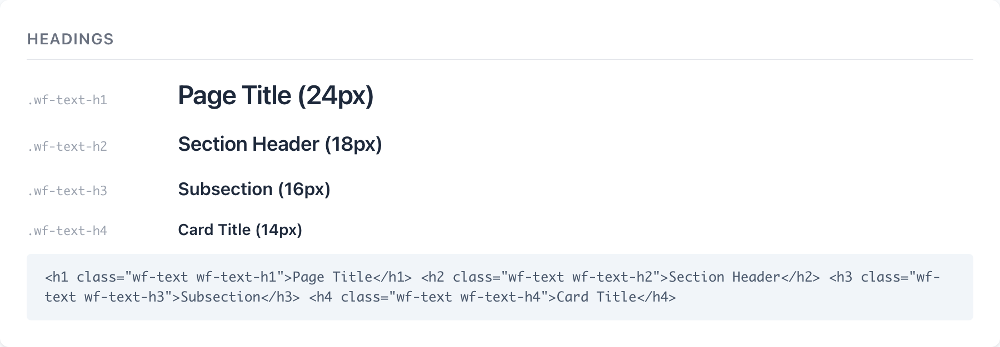
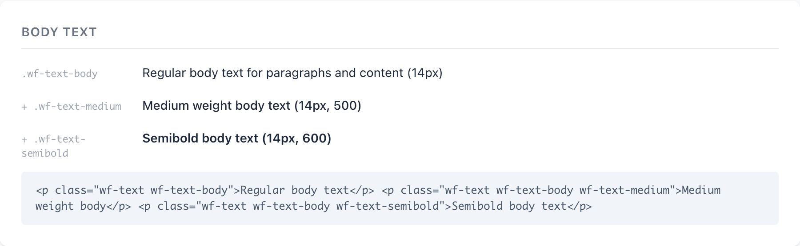
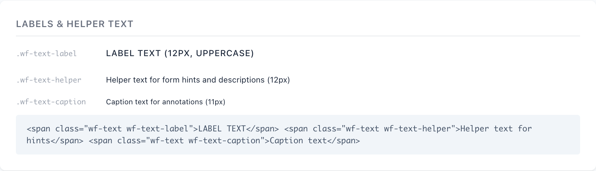
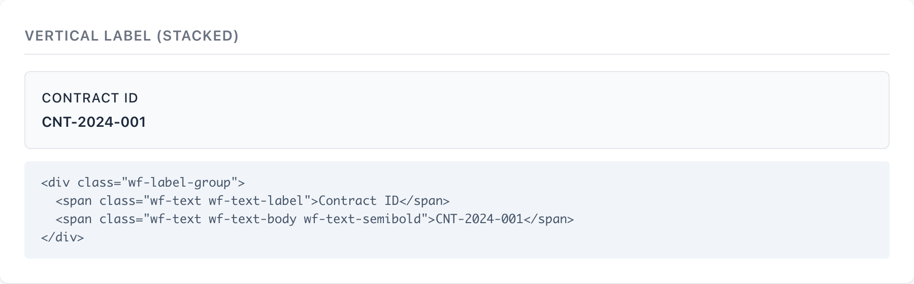

# Typography

Typography in the wireframe system is two layers: a token file that defines the type scale, weights, and line heights as `--wf-*` variables, and a flat set of `wf-text-*` classes you compose by hand. Every text element starts with the base `.wf-text` class and adds a size, then optional weight and color modifiers.

> Part of the Gravitate Wireframe Design System — lo-fi component reference. Index: `../CLAUDE.md`.

The contract is `.wf-text` first, then one size class. `.wf-text` sets the system font stack, `line-height: 1.5`, zeroes the margin, and paints `#1a1a2e` — so a bare `<p class="wf-text">` already reads correctly. Layer a size on top: `wf-text-h1` through `wf-text-h4` for headings, `wf-text-body` for paragraphs, `wf-text-label` / `wf-text-helper` / `wf-text-caption` for the small print.

Weight and color are separate modifier axes. Headings and labels carry their own weight, but body text starts at `400` and you promote it with `wf-text-medium`, `wf-text-semibold`, or `wf-text-bold`. Color modifiers (`wf-text-secondary`, `wf-text-error`, and friends) override the base `#1a1a2e` — they win because they come later in the stylesheet.

The `--wf-*` tokens in `tokens/typography.css` are the design source of truth: a 7-level scale from `--wf-text-xs` (11px) to `--wf-text-2xl` (32px), four weights, three line heights. The `wf-text-*` classes are a curated subset wired with literal px values rather than `var()` references — so the tokens document the system and the classes are what you actually type.

### Headings — the wf-text-h* scale



*.wf-text-h1 Page Title (24px), .wf-text-h2 Section Header (18px), .wf-text-h3 Subsection (16px), .wf-text-h4 Card Title (14px) — all semibold (600), all tightened by line-height and the h1/h2 negative letter-spacing.*

### Type scale tokens

The 7-level scale from tokens/typography.css. The wf-text-* classes lock in a subset of these as literal px — the tokens are the full vocabulary and the comment on each documents its intended home.

| Token | Value | Use for |
| --- | --- | --- |
| `--wf-text-xs` | `0.6875rem (11px)` | Fine print, badges, timestamps — the size behind .wf-text-caption. |
| `--wf-text-sm` | `0.75rem (12px)` | Captions, helper text, table cells — the size behind .wf-text-label and .wf-text-helper. |
| `--wf-text-base` | `0.875rem (14px)` | Body text, default size — the compact default behind .wf-text-body and .wf-text-h4. |
| `--wf-text-md` | `1rem (16px)` | Emphasized body, large inputs — the size behind .wf-text-h3. |
| `--wf-text-lg` | `1.125rem (18px)` | Section headings, card titles — the size behind .wf-text-h2. |
| `--wf-text-xl` | `1.5rem (24px)` | Page headings, modal titles — the size behind .wf-text-h1. |
| `--wf-text-2xl` | `2rem (32px)` | Hero text, major headings — defined for reach; no default class ships at this size. |

### Weight, line-height & letter-spacing tokens

The supporting axes. Weights map one-to-one onto the wf-text-{normal,medium,semibold,bold} modifiers; the line-height and tracking tokens are baked into the size classes.

| Token | Value | Use for |
| --- | --- | --- |
| `--wf-font-family` | `-apple-system, BlinkMacSystemFont, 'Segoe UI', Roboto, … sans-serif` | The system font stack — native look, zero web-font load. Mirrored literally in .wf-text. |
| `--wf-font-mono` | `ui-monospace, SFMono-Regular, 'SF Mono', Menlo, … monospace` | Monospace for code, data, and technical content. |
| `--wf-font-normal` | `400` | Regular body text — .wf-text-normal and the resting weight of .wf-text-body. |
| `--wf-font-medium` | `500` | Subtle emphasis, labels — .wf-text-medium and the weight inside .wf-text-label. |
| `--wf-font-semibold` | `600` | Strong emphasis, buttons, headings — .wf-text-semibold and the weight of every wf-text-h*. |
| `--wf-font-bold` | `700` | Maximum emphasis, critical text — .wf-text-bold. |
| `--wf-leading-tight` | `1.25` | Headings, single-line elements. |
| `--wf-leading-normal` | `1.5` | Body text default — the line-height baked into .wf-text and .wf-text-body. |
| `--wf-leading-relaxed` | `1.75` | Long-form content, improved readability. |
| `--wf-tracking-wide` | `0.025em` | All caps, labels — the spacing intent behind .wf-text-label's uppercase treatment. |

### Size classes

Pick exactly one and pair it with .wf-text. Headings carry their own 600 weight and tightened line-height; body and small-print sizes carry their own color where it differs from the base.

| Variant | When to use | Code |
| --- | --- | --- |
| `wf-text-h1` | Page titles and modal titles. 24px / 600 / line-height 1.3, letter-spacing -0.02em. | `<h1 class="wf-text wf-text-h1">Page Title</h1>` |
| `wf-text-h2` | Section headers. 18px / 600 / line-height 1.4, letter-spacing -0.01em. | `<h2 class="wf-text wf-text-h2">Section Header</h2>` |
| `wf-text-h3` | Subsections. 16px / 600 / line-height 1.4. | `<h3 class="wf-text wf-text-h3">Subsection</h3>` |
| `wf-text-h4` | Card titles and small headers. 14px / 600 / line-height 1.4. | `<h4 class="wf-text wf-text-h4">Card Title</h4>` |
| `wf-text-body` | Default paragraph and content text. 14px / 400 / line-height 1.5. | `<p class="wf-text wf-text-body">Regular body text for paragraphs and content.</p>` |
| `wf-text-label` | Form labels and data labels. 12px / 500 / uppercase, letter-spacing 0.05em, color #6b7280. | `<span class="wf-text wf-text-label">FIELD NAME</span>` |
| `wf-text-helper` | Form hints and descriptions under an input. 12px / 400 / color #6b7280. | `<span class="wf-text wf-text-helper">We'll never share your email.</span>` |
| `wf-text-caption` | Small annotations and timestamps. 11px / 400 / color #9ca3af. | `<span class="wf-text wf-text-caption">Last updated 2 hours ago</span>` |

### Body text and weight modifiers



*.wf-text-body resting at 14px / 400, then promoted with .wf-text-medium (500) and .wf-text-semibold (600). Weight is a separate axis layered on top of the size class.*

### Weight & color modifiers

Optional axes layered after the size class. Stack one weight and one color as needed — they override the base because they come later in the stylesheet.

| Variant | When to use | Code |
| --- | --- | --- |
| `wf-text-normal` | Force 400 — the resting weight, rarely needed explicitly. | `<span class="wf-text wf-text-body wf-text-normal">Normal weight</span>` |
| `wf-text-medium` | Promote body to 500 for subtle emphasis. | `<span class="wf-text wf-text-body wf-text-medium">Medium weight body</span>` |
| `wf-text-semibold` | Promote to 600 — emphasized values, inline strong text. | `<span class="wf-text wf-text-body wf-text-semibold">Semibold body text</span>` |
| `wf-text-bold` | Promote to 700 — maximum emphasis, critical text. | `<span class="wf-text wf-text-body wf-text-bold">Bold weight</span>` |
| `wf-text-secondary` | Muted gray (#6b7280) for supporting copy. | `<p class="wf-text wf-text-body wf-text-secondary">Manage and track all your active contracts</p>` |
| `wf-text-error` | Negative states (#dc2626) — validation messages, error copy. | `<span class="wf-text wf-text-helper wf-text-error">Please enter a valid email address</span>` |
| `wf-text-link` | Clickable text (#2563eb) — underlines and darkens to #1d4ed8 on hover. | `<a href="#" class="wf-text wf-text-body wf-text-link">Edit</a>` |
| `wf-text-inverse` | White (#ffffff) for text on dark backgrounds. | `<span class="wf-text wf-text-body wf-text-inverse">Inverse text on dark background</span>` |

### Labels and helper text



*.wf-text-label (12px uppercase, wide tracking, #6b7280) for form labels and .wf-text-helper (12px, muted #6b7280) for hints — the small print of a form field.*

### Label component — vertical (stacked)



*The .wf-label-group pairing: an uppercase .wf-text-label stacked above its value with a 4px gap. The default narrative-first form posture; horizontal and spread are the sibling layouts.*

### Label group layouts

Key-value pairs use .wf-label-group as the wrapper, then a layout modifier changes the axis. Stacked is the default; add a modifier for inline or justified.

| Variant | When to use | Code |
| --- | --- | --- |
| `wf-label-group` | Default stacked pairing — label above value, column flex, 4px gap. | `<div class="wf-label-group">   <span class="wf-text wf-text-label">Contract ID</span>   <span class="wf-text wf-text-body wf-text-semibold">CNT-2024-001</span> </div>` |
| `wf-label-horizontal` | Inline label + value on one row — switches to row flex, 8px gap, label gets a 100px min-width. | `<div class="wf-label-group wf-label-horizontal">   <span class="wf-text wf-text-label">Status:</span>   <span class="wf-text wf-text-body">Active</span> </div>` |
| `wf-label-spread` | Label left, value right — row flex with justify-content: space-between. Totals and summary rows. | `<div class="wf-label-group wf-label-spread">   <span class="wf-text wf-text-label">Total Amount</span>   <span class="wf-text wf-text-body wf-text-semibold">$12,500.00</span> </div>` |
| `wf-label-colon` | Appends a ':' to the label via ::after — for inline label styling without typing the colon. | `<div class="wf-label-group wf-label-horizontal wf-label-colon">   <span class="wf-text wf-text-label">Status</span>   <span class="wf-text wf-text-body">Active</span> </div>` |

### Composing a form field

```html
<!-- Stack a label, an input, and helper text -->
<label class="wf-text wf-text-label wf-required">Email Address</label>
<input type="email" placeholder="you@example.com">
<span class="wf-text wf-text-helper">We'll never share your email.</span>

<!-- Error state: same classes, error color on the helper -->
<label class="wf-text wf-text-label wf-required">Email Address</label>
<input type="email" value="invalid-email">
<span class="wf-text wf-text-helper wf-text-error">Please enter a valid email address</span>
```

Add .wf-required to a label and a red asterisk is appended via ::after — no markup change needed.

### A detail card header and value grid

```html
<div class="wf-section-header">
  <h3 class="wf-text wf-text-h3">Order Details</h3>
  <span class="wf-status-text wf-status-text-success">Confirmed</span>
</div>

<div class="wf-data-grid">
  <div class="wf-label-group">
    <span class="wf-text wf-text-label">Order Number</span>
    <span class="wf-text wf-text-body wf-text-semibold">ORD-2024-78542</span>
  </div>
  <div class="wf-label-group">
    <span class="wf-text wf-text-label">Customer</span>
    <span class="wf-text wf-text-body">John Smith</span>
  </div>
</div>
```

wf-section-header pairs a heading with a trailing action or status and draws a bottom border; add wf-section-header-simple to drop the border.

### Composition rules

1. **Always start with .wf-text, then add exactly one size class.** — .wf-text carries the font stack, line-height, margin reset, and base color — without it a size class inherits whatever the surrounding element happens to be.
2. **Body text is 14px (--wf-text-base), not 16px.** — The system defaults compact: .wf-text-body and .wf-text-h4 both sit at 14px. Reach for .wf-text-md (16px) deliberately when you want emphasized body, not by accident.
3. **Promote weight with a modifier; don't switch to a heading class for emphasis.** — A heading class also changes size and line-height. To bold a value inside a sentence, add .wf-text-semibold — the size stays put.
4. **Use .wf-text-label for form and data labels, .wf-text-helper for hints, .wf-text-caption for timestamps.** — They share the 12px/11px small-print band but encode different intent — label is uppercase 500, helper is muted 400, caption is the faintest 11px #9ca3af.
5. **Wrap key-value pairs in .wf-label-group and let a layout modifier set the axis.** — Stacked, horizontal, and spread all share the same wrapper — switching layout is a one-class change, not a markup rewrite.

### Do's & Don'ts

- **Do:** <p class="wf-text wf-text-body">
  **Don't:** <p class="wf-text-body">
  **Why:** The size classes set only size/weight/line-height — they rely on .wf-text for the font stack, margin reset, and color. Omit it and you inherit the page's defaults.
- **Do:** <span class="wf-text wf-text-body wf-text-semibold">
  **Don't:** <span class="wf-text wf-text-h4"> just to bold it
  **Why:** wf-text-h4 is 14px/600 too, but it's semantically a heading — using it for inline emphasis muddies the document outline and the wireframe's intent.
- **Do:** <span class="wf-text wf-text-label">FIELD NAME</span>
  **Don't:** <span class="wf-text wf-text-body wf-text-uppercase">field name</span>
  **Why:** wf-text-label already encodes the 12px size, 500 weight, muted color, and wide tracking that defines a label — rebuilding it from body + transform drifts off-spec.
- **Do:** <label class="wf-text wf-text-label wf-required">
  **Don't:** <label class="wf-text wf-text-label">Email *</label>
  **Why:** .wf-required appends the red asterisk via ::after — typing it manually loses the consistent #dc2626 color and 2px offset.

### Gotchas

- **The wf-text-* classes use literal px, not the tokens** — tokens/typography.css defines --wf-text-base etc., but components/typography/typography.css hardcodes font-size: 14px instead of var(--wf-text-base). Edit a token and the wf-text-* classes won't move — change both, or treat the tokens as documentation of the scale the classes already follow.
- **Headings ship their own weight and line-height** — All four wf-text-h* are 600 with line-height 1.3–1.4, and h1/h2 add negative letter-spacing. They override .wf-text's 1.5 line-height — so a heading is more than just a bigger size, and stacking a weight modifier on it is redundant.
- **.wf-text-label and .wf-text-helper carry color, not just size** — Both paint #6b7280 (gray) out of the box, and .wf-text-caption paints #9ca3af. If you need them dark, you'll fight the class — they're built for muted small print, which is usually what you want.
- **Headings shrink at the 640px breakpoint** — A max-width: 640px media query drops h1 to 20px, h2 to 16px, h3 to 14px, and collapses wf-label-horizontal into a stacked column. Wireframes captured wide will read smaller on narrow viewports — expected, but worth knowing before you screenshot.
- **wf-label-horizontal pins a 100px label column** — The label gets min-width: 100px and flex-shrink: 0, so short labels still reserve the full column. Below 640px that min-width is removed and the layout stacks — so inline labels are a desktop affordance.
